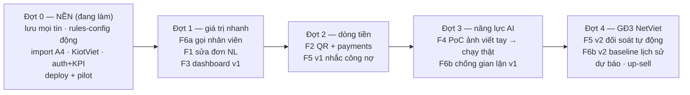

# KẾ HOẠCH DÀI HẠN — HỆ THỐNG AI U ULTTY (ĐỊNH HƯỚNG)

> **Vai trò tài liệu:** lộ trình **định hướng tương lai** cho 6 nhóm tính năng mới, xếp theo phụ thuộc kỹ thuật + giá trị nghiệp vụ. **Có thể bổ sung/bỏ bớt tùy quyết định của khách** — mỗi tính năng có "cổng vào" (điều kiện dữ liệu/quyết định) rõ ràng; chưa qua cổng thì chưa code phần chạm thật.
> **Phân biệt:** [tien-do-va-ke-hoach.md](tien-do-va-ke-hoach.md) = việc **đang dở, chắc chắn làm** (Phase 3→6). Tài liệu này = việc **mới, dài hạn** (Đợt 1→4), đứng TRÊN nền đó.
> Lập: 10/07/2026 · Nguồn ngữ cảnh: [nghiep-vu.md](nghiep-vu.md) · [thiet-ke-ky-thuat-hop-nhat.md](thiet-ke-ky-thuat-hop-nhat.md) · `Thiet_ke_AI_Agent_U_Ultty.md` (GĐ2-3 NetViet).

---

## 0. Nguyên tắc áp cho MỌI tính năng mới (không thương lượng)

1. **LLM không tính tiền, không quyết chính sách.** Tính năng mới nào đụng đến tiền (QR, công nợ, sửa đơn) đều đi qua rules engine tất định + nguồn sự thật trong DB.
2. **Người giữ nút duyệt.** Mọi thứ đi RA ngoài (tin nhắc công nợ, xác nhận sửa đơn, xác nhận đã nhận tiền) mặc định qua Sale duyệt; chỉ tự gửi khi có văn bản đồng ý của khách (`AUTO_SEND`, gated vai Giám sát).
3. **Nguồn sự thật động.** Dữ liệu mới (bảng phí COD, ngưỡng công nợ, tài khoản nhận tiền, danh sách Sale trực) là bảng trong Postgres, sửa qua `/admin` + MCP tool — không hardcode.
4. **Lưu vết đầy đủ.** Sửa đơn và thanh toán bắt buộc có audit trail (ai, lúc nào, từ giá trị nào sang giá trị nào).
5. **Đo trước khi hứa.** Tính năng có độ chính xác không chắc chắn (đọc ảnh viết tay) phải qua PoC eval trên dữ liệu thật trước khi cam kết phạm vi — đúng cách đã làm với PoC parser/PoC Bot.

---

## 1. Vị trí hiện tại & nền phải xong trước (Đợt 0)

**Đang có:** pipeline đọc Zalo (zca) → 6 vai agent (1 lần gọi LLM/tin) → rules engine → console Sale duyệt 1 chạm, chạy trên 19 SKU + bảng giá thật; Postgres/Prisma + panel `/admin` + MCP tool (nguồn sự thật động). Chi tiết: [tien-do-va-ke-hoach.md](tien-do-va-ke-hoach.md).

**Đợt 0 = kế hoạch hiện hữu, KHÔNG đổi** (là điều kiện nền cho mọi tính năng dưới đây):

| Nền | Vì sao tính năng mới cần nó |
|---|---|
| Lưu MỌI tin vào DB ngay khi nhận (Phase 3 còn lại) | Sửa đơn cần tra tin cũ; chống gian lận cần lịch sử; NĐ13 |
| Rules-config động + sửa VAT/COD theo nguồn gốc (Phase 3 còn lại) | QR/công nợ tính đúng số; hết "tạm tính" |
| Import Excel A4 (đại lý + map nhóm) | Công nợ/gian lận cần biết đơn thuộc đại lý nào |
| KiotViet Excel/API + map SKU↔mã hàng số (Phase 4) | Sửa đơn phải đồng bộ được bản sửa lên KiotViet |
| Auth theo vai BPKD/KSNB/kế toán + ghi `kpi_events` (Phase 5) | Dashboard cần số liệu; hàng đợi nghi vấn cần vai KSNB |
| Deploy 1 VM + pilot 1-2 nhóm (Phase 6) | Mọi thứ dưới đây chạy trên hệ đã sống |

---

## 2. Sáu tính năng mới — thiết kế định hướng

### F1 — Đổi/sửa đơn ĐÃ CHỐT bằng ngôn ngữ tự nhiên

**Nghiệp vụ:** số hóa đúng **bước 4 quy trình đặt hàng thật** ("khách đối chiếu & phản hồi: sai/đổi → báo lại lên nhóm"). Đại lý nhắn *"doi 10 ghe felix thanh 15 nhe"*, *"huy don sang nay"*, *"doi dia chi ve OCP"* — AI hiểu, tìm đúng đơn, dựng bản so sánh, Sale duyệt.

**Luồng:**
1. Mở rộng 7 → 9 intent: thêm `sua_don`, `huy_don`.
2. **Resolver tìm đơn tham chiếu** (tất định, không LLM): đơn gần nhất của đúng nhóm/đại lý trong N ngày, trạng thái còn sửa được; ≥2 ứng viên → bắt Sale chọn, không đoán.
3. LLM chỉ trích **delta** (đổi gì: SL/SKU/địa chỉ/thanh toán) → rules engine **tính lại toàn bộ** (giá, ship, COD, VAT).
4. Console hiện **bản so sánh CŨ ↔ MỚI** (diff từng dòng) → Sale duyệt 1 chạm → gửi xác nhận vào nhóm + cập nhật/hủy trên KiotViet + audit log.
5. State machine thêm `amended`, `cancelled`; **đơn đã giao (bước 7 trở đi) không sửa qua AI** → chuyển quy trình hoàn trả B2B (file `QT_Hoàn trả hàng B2B.pdf` — cần đọc trước).

**Cổng vào:** quy tắc "trạng thái nào còn được sửa/hủy" (khách chốt); KiotViet có cho sửa/hủy đơn đã đẩy không (Excel thì là đẩy bản mới + ghi chú). **Độ phức tạp: TRUNG BÌNH.**
**KPI:** % yêu cầu sửa mà AI tìm đúng đơn tham chiếu; thời gian xử lý 1 yêu cầu đổi.
**Rủi ro chính:** tham chiếu nhầm đơn (2 đơn giống nhau cùng ngày) → luôn hiện diff + Sale duyệt, không bao giờ auto.

### F2 — QR thanh toán & AI tự biết khách đã chuyển tiền

**Nghiệp vụ:** chính sách `thanh_toan_ngay` yêu cầu **CK trước khi gửi hàng** — hiện Sale tự kiểm tra tài khoản bằng mắt. Tính năng: khi duyệt đơn, hệ thống sinh **VietQR động** (đúng số tiền + nội dung CK = mã đơn) gửi kèm format xác nhận; tiền về → hệ thống tự khớp → đơn sang `paid` → Sale thấy ngay trên console, (tuỳ chọn) AI soạn tin "đã nhận tiền" chờ duyệt.

**Kỹ thuật:**
- **Sinh QR:** chuẩn EMVCo/Napas VietQR — `vietnam-qr-pay` (payload offline) + `qrcode` (render ảnh), xem §7.2 — offline, 0đ, không phụ thuộc bên ngoài.
- **Biết tiền về** (chọn 1, đây là quyết định của khách):
  | Phương án | Ưu | Nhược |
  |---|---|---|
  | (a) Dịch vụ đối soát Casso/SePay (webhook giao dịch) | Nhanh, phổ biến, ~100-200k/tháng | Thêm bên thứ 3 xử lý dữ liệu → cần bổ sung hợp đồng |
  | (b) Open API ngân hàng (MB/BIDV/VCB...) | Chính chủ | Cần tài khoản DN + thủ tục; mỗi bank một kiểu |
  | (c) Bán tự động: kế toán upload sao kê | Không bên thứ 3 | Không real-time |
- Bảng mới `payments` (orderId?, số tiền, nội dung, thời điểm, nguồn, trạng thái khớp); trạng thái đơn thêm nhánh `awaiting_payment → paid`.
- **Khớp tất định:** đúng mã đơn trong nội dung + đúng số tiền → auto; lệch (thiếu nội dung, CK gộp nhiều đơn, sai số tiền) → hàng đợi "chưa khớp" cho kế toán khớp tay. LLM không tham gia khớp tiền.

**Cổng vào:** STK nhận tiền (công ty/cá nhân — liên quan luồng VAT trong khảo sát); chọn phương án (a)/(b)/(c) + hợp đồng xử lý dữ liệu nếu (a). **Độ phức tạp: TRUNG BÌNH–LỚN.**
**KPI:** % giao dịch tự khớp đúng; thời gian từ lúc CK → hệ thống xác nhận.
**Lưu ý phạm vi:** COD/thu hộ KHÔNG đi qua QR (BPVH thu khi giao — đúng quy trình thật).

### F3 — Dashboard

**Nghiệp vụ:** NetViet GĐ1 đã cam kết "Dashboard cơ bản"; `design/` của khách có tab Tổng quan (4 counter + biểu đồ theo giờ + hoạt động gần đây). Đây là món **trả nợ thiết kế**, không phải tính năng mới hoàn toàn.

**Nội dung v1** (đúng 4 KPI đã chốt trong thiết kế + vận hành hằng ngày):
- 4 KPI lõi: tỷ lệ bóc tách đúng · thời gian chốt đơn TB · tỷ lệ cần sửa · tỷ lệ handoff.
- Tin nhắn/đơn theo ngày-giờ; phễu trạng thái đơn; doanh thu theo đại lý/chi nhánh; top SKU; hộp thư "nhóm chưa map".
- **v2 (sau F2/F5):** tiền đã thu/chưa thu, công nợ đến hạn/quá hạn.

**Kỹ thuật:** PHỤ THUỘC việc **ghi `kpi_events`** (model có sẵn, chưa ghi — thuộc Phase 5 Đợt 0) → làm phần ghi event trước, dashboard chỉ là tầng đọc. API `GET /metrics/*` + trang `/dashboard` trên console Next.js (SSE/polling sẵn có).
**Cổng vào:** chốt danh sách chỉ số với khách (tránh vẽ 20 biểu đồ không ai xem). **Độ phức tạp: TRUNG BÌNH.**

### F4 — Đọc ảnh đơn viết tay của khách

**Nghiệp vụ:** <20% đơn là ảnh chụp bảng/đơn viết tay (khảo sát); hồ sơ gốc có mẫu `Bảng đặt hàng của khách.jpg`. Hiện kênh **đã bắt được ảnh** (zca: `href`+caption; bot: `photo_url` — field `imageUrl` đã chảy vào pipeline) nhưng chưa xử lý nội dung ảnh.

**Luồng:** tin có `imageUrl` → **tải ảnh về lưu ngay** (URL Zalo có hạn, mất là mất đơn) → **Claude vision** trích xuất theo ĐÚNG JSON schema như tin text → validation + confidence (ảnh mặc định tin cậy thấp hơn → thiên về `needs_edit`, Sale soát kỹ) → duyệt như đơn thường.

**Cổng vào (cứng):**
- **Claude API credit** — DeepSeek (parser demo hiện tại) KHÔNG đọc được ảnh; ảnh chứa SĐT/địa chỉ nên càng không được gửi processor chưa duyệt.
- **Bộ ảnh thật 20-30 tấm + đáp án** từ khách (mở rộng B1-B2) → **PoC eval trước** (đo field-level accuracy như PoC parser cũ), có số mới cam kết phạm vi.

**Độ phức tạp: LỚN** (độ chính xác chữ viết tay tiếng Việt là ẩn số — giá trị thật của tính năng quyết định bởi con số eval, không phải bởi code).
**KPI:** accuracy từng field trên bộ ảnh golden; % ảnh phải nhập tay lại.

### F5 — Nhắc & đối soát công nợ đại lý

**Nghiệp vụ THẬT đã nằm trong PO** (đọc từ hồ sơ gốc): công nợ 30/45 ngày **kể từ ngày nhận hàng**; chậm → phạt 1%/ngày; quá 60 ngày → tạm ngừng cung cấp; đợt sau phải trả hết đợt trước; ký gửi: cuối tháng đối soát tiêu thụ, TT trong 7 ngày sau HĐ. Hiện BPKD theo dõi bằng **file Excel** (bước 8 quy trình). Đây chính là hạng mục "Tự động đối soát ký gửi, công nợ" của **GĐ2 NetViet** — làm sớm hơn theo yêu cầu khách.

**Luồng (chia 2 bước):**
- **v1 — NHẮC:** sổ công nợ per đại lý (từ đơn `synced` + chính sách + hạn) → job quét hằng ngày (`@nestjs/schedule` cron — xem §7.2; hoãn BullMQ) → danh sách "sắp đến hạn / quá hạn / chạm ngưỡng 60 ngày (đề nghị ngừng cấp)" trên console → AI soạn tin nhắc theo mẫu → **Sale duyệt rồi mới gửi** vào đúng nhóm → log.
- **v2 — ĐỐI SOÁT:** khớp với `payments` (từ F2) để biết đã thu bao nhiêu; cuối tháng sinh bảng đối soát ký gửi cho 2-3 đại lý ký gửi; xuất file cho kế toán.

**Cổng vào:** A3 (ngưỡng công nợ chính thức) + xác minh `cong_no_7`; **"ngày nhận hàng" lấy từ đâu** — hệ thống hiện dừng ở `synced`, chưa có dữ liệu giao hàng từ Base → v1 tạm dùng ngày synced + X (khách chốt X) hoặc kế toán nhập tay, chính xác tuyệt đối cần tích hợp Base (GĐ2); **số dư công nợ đầu kỳ** import từ Excel hiện tại của BPKD.
**Độ phức tạp: LỚN** (nghiệp vụ tài chính — sai một số là mất niềm tin; ưu tiên đúng > đủ).
**KPI:** số đơn quá hạn giảm; thời gian kế toán làm đối soát cuối tháng.

### F6 — Nâng cấp đội agent: chống đơn ảo/gian lận + gọi nhân viên

Vai **Giám sát** hiện đã có luật leo thang (đơn ≥20tr, đại lý chưa xác định, khiếu nại gắt) + cờ vàng (SL≥30, confidence<0.5) — 0 LLM. Nâng cấp gồm 2 phần độc lập:

**F6a — Gọi nhân viên (NHỎ — nên làm sớm nhất):**
- Intent mới `goi_nhan_vien` (*"cho gap nguoi"*, *"goi sale giup em"*) + từ khóa tất định (lưới an toàn khi LLM phân loại trượt).
- Hội thoại được đánh dấu **"người tiếp quản"**: AI im lặng trong nhóm đó (mute có TTL), đơn đang xử lý chuyển `needs_edit`.
- Cảnh báo: console (chuông + hàng đợi) + tuỳ chọn nhắn Zalo riêng cho Sale trực.
- Cổng vào: danh sách Sale trực + kênh nhận cảnh báo (khách chốt).

**F6b — Chống đơn ảo/trùng/gian lận (tất định trước, học sau):**
| Lớp | Luật (v1 — tất định) |
|---|---|
| Đơn ảo/trùng | Tin trùng (unique `externalMessageId` — đã có) · 2 đơn giống nhau cùng nhóm cùng SKU+SL trong X phút (nhắn lại/forward) → gộp/hỏi lại · người gửi KHÔNG thuộc đại lý đã map → chặn mềm |
| Gian lận giá | Đơn ghi đơn giá **thấp hơn sàn** (`min_retail_price` đã có trong DB) hoặc lệch deal riêng → cờ đỏ · sửa đơn sau chốt làm GIẢM tiền bất thường (kết hợp F1) → bắt buộc duyệt 2 lớp (ánh xạ đúng cổng KSNB của quy trình thật) |
| Bất thường hành vi | Tần suất đơn đột biến 1 nhóm · SĐT người nhận (TH2) trùng nhiều đại lý · địa chỉ mới hoàn toàn với đại lý lâu năm → risk score cộng dồn → **hàng đợi "nghi vấn"** cho vai KSNB |
- **v2 (GĐ3):** baseline theo lịch sử từng đại lý (cần vài tháng dữ liệu thật sau pilot).
- Cổng vào: khách kể case gian lận/đơn ảo THẬT đã gặp (để luật bám thực tế, không tưởng tượng); ngưỡng; ai xử lý hàng đợi nghi vấn (cần auth vai KSNB — Phase 5).
- **Độ phức tạp:** 6a NHỎ · 6b v1 TRUNG BÌNH · 6b v2 LỚN.

---

## 3. Lộ trình đề xuất theo đợt

> Thứ tự trong đợt có thể đảo; tính năng có thể bỏ/hoãn theo khách. Nguyên tắc xếp: **ít phụ thuộc ngoài → làm trước; đụng tiền → cần nền chắc; ẩn số độ chính xác → PoC trước.**

| Đợt | Gồm | Điều kiện vào đợt (cổng) | Đầu ra nghiệm thu |
|---|---|---|---|
| **0 — Nền** | Phase 3 còn lại + Phase 4-6 hiện hữu | (đang chạy) | Pilot 1-2 nhóm, 4 KPI có số thật |
| **1 — Giá trị nhanh** | F6a → F1 → F3 v1 | Quy tắc sửa đơn (D10) · chỉ số dashboard (D11) · Sale trực (D14) | Sửa đơn qua chat có diff+duyệt; dashboard 4 KPI sống |
| **2 — Dòng tiền** | F2 → F5 v1 | STK + phương án nhận giao dịch + hợp đồng DL (D9) · ngưỡng công nợ + ngày-nhận-hàng + số dư đầu kỳ (D13) | Đơn `paid` tự động ≥X%; danh sách nhắc nợ hằng ngày |
| **3 — Năng lực AI** | F4 (PoC → thật) · F6b v1 | Claude credit + 20-30 ảnh golden (D12) · case gian lận thật (D14) | Số eval ảnh công bố; hàng đợi nghi vấn cho KSNB |
| **4 — Tối ưu (GĐ3)** | F5 v2 · F6b v2 · dự báo/up-sell | Vài tháng dữ liệu thật sau pilot | Đối soát ký gửi cuối tháng tự động |

**Ước lượng độ phức tạp** (tương đối, chưa phải cam kết lịch): NHỎ ≈ 2-4 ngày dev · TRUNG BÌNH ≈ 1-2 tuần · LỚN ≈ 2-4 tuần (chưa tính chờ cổng dữ liệu/quyết định).

| Tính năng | Cỡ | Ghi chú |
|---|---|---|
| F6a gọi nhân viên | NHỎ | Ít rủi ro nhất, giá trị tức thì |
| F1 sửa đơn NL | TRUNG BÌNH | Giá trị/công sức tốt nhất trong 6 món |
| F3 dashboard v1 | TRUNG BÌNH | Gồm cả phần ghi `kpi_events` nếu Đợt 0 chưa xong phần này |
| F2 QR + biết tiền về | TRUNG BÌNH–LỚN | Phần khó là ĐỐI SOÁT, không phải sinh QR |
| F5 công nợ v1/v2 | LỚN | Tài chính — ưu tiên đúng > nhanh |
| F4 ảnh viết tay | LỚN | Giá trị quyết định bởi số eval, làm PoC trước |
| F6b chống gian lận | TB (v1) → LỚN (v2) | v1 thuần luật, v2 cần lịch sử |

---

## 4. Quyết định khách cần chốt (bổ sung vào bảng quyết định treo)

| # | Quyết định | Cho tính năng |
|---|---|---|
| D9 | STK nhận tiền (công ty/cá nhân?) + chọn SePay/payOS/Casso/Open API bank/bán tự động + bổ sung hợp đồng xử lý dữ liệu giao dịch. *Dữ kiện 11/07/2026: SePay STARTUP 120k/tháng (billing tháng) vs **payOS miễn phí không giới hạn từ 23/01/2026** — đổi lại QR phải sinh online per-order qua API payOS (mất tính offline)* | F2 |
| D10 | Đơn ở trạng thái nào còn được sửa/hủy qua AI; đơn đã giao xử lý theo quy trình hoàn trả nào | F1 |
| D11 | Danh sách chỉ số dashboard (đề xuất: 4 KPI + doanh thu đại lý/chi nhánh + phễu đơn) | F3 |
| D12 | Cấp Claude API credit + gửi 20-30 ảnh đơn viết tay thật kèm đáp án | F4 |
| D13 | Ngưỡng công nợ chính thức (A3) + cách xác định "ngày nhận hàng" + số dư công nợ đầu kỳ từ Excel BPKD + xác minh `cong_no_7` | F5 |
| D14 | Danh sách Sale trực nhận cảnh báo + kênh nhận (console/Zalo riêng) + case đơn ảo/gian lận thật đã gặp + ngưỡng | F6 |

---

## 5. Rủi ro chung của kế hoạch dài hạn

| Rủi ro | Mức | Giảm thiểu |
|---|---|---|
| Làm tính năng mới khi Đợt 0 chưa xong → nền lung lay (chưa lưu tin, chưa auth) | CAO | Kỷ luật cổng vào đợt; Đợt 0 là điều kiện cứng |
| "AI biết tiền về" bị hiểu là tuyệt đối — thực tế có độ trễ + giao dịch không khớp | CAO | Nói rõ từ đầu: auto-khớp phần lớn, phần lệch vào hàng đợi kế toán; KPI % tự khớp công bố hằng tuần |
| Chi phí LLM tăng (vision đắt hơn text; thêm intent) | TRUNG BÌNH | Ảnh <20% lưu lượng; đo chi phí/tin ngay từ PoC F4 |
| Bên thứ 3 thanh toán (Casso/SePay) = thêm processor dữ liệu | TRUNG BÌNH | Đưa vào hợp đồng xử lý dữ liệu trước khi bật (như bài học DeepSeek) |
| Công nợ tính sai do thiếu "ngày nhận hàng" thật | TRUNG BÌNH | v1 chỉ NHẮC (kèm nhãn "tạm tính theo ngày lên đơn"); đối soát chính thức chờ dữ liệu giao hàng |
| Chữ viết tay tiếng Việt accuracy thấp → tính năng F4 gây thất vọng | TRUNG BÌNH | PoC eval trước, công bố số, để khách quyết có triển khai không |
| Phạm vi phình (6 tính năng + GĐ2-3 gốc chồng nhau) | TRUNG BÌNH | Mỗi đợt chỉ 2-3 món; nghiệm thu xong mới sang đợt sau |

---

## 6. Việc KHÔNG nằm trong kế hoạch này (tránh hiểu nhầm phạm vi)

- Tích hợp Base API, Zalo OA/ZNS, Messenger/web widget — vẫn thuộc GĐ2 gốc của NetViet, không lặp lại ở đây.
- PWA mobile 5 tab — quyết định treo #5, độc lập với 6 tính năng này.
- AI tự gửi tin không cần duyệt (`AUTO_SEND=on`) — chỉ bật khi có văn bản đồng ý (quyết định treo #7); mọi tính năng trên thiết kế để chạy được cả hai chế độ.

---

## 7. Thư viện & dịch vụ đã chốt (search-first — 10/07/2026 · **tra lại toàn bộ 11/07/2026**, lộ trình Đợt 1→4 đã được duyệt)

> Quy trình: rà dep sẵn có trong repo → npm registry (`npm view`: version/license/nhịp bảo trì) → agent research web (QR/webhook/vision/KiotViet, có nguồn). Nguyên tắc: **dùng đồ sẵn có trước · dep mới phải nhỏ-MIT-còn bảo trì · KHÔNG thêm hạ tầng khi chưa cần.**
> **Kết quả tra lại 11/07/2026** (6 agent độc lập — npm registry + docs chính thức + web): đa số **CONFIRM**; **2 thay đổi**: ① Excel `exceljs` → `read-excel-file` + `write-excel-file` (exceljs bỏ bảo trì ~3 năm) · ② auth bỏ tầng passport → `express-session` sẵn có + guard tự viết + `argon2`. Kèm hiệu chỉnh số liệu: token KiotViet **24h** (không phải 1h) + rate limit 5.000 GET/h; công thức token ảnh Claude đổi sang patch 28×28; payOS miễn phí từ 23/01/2026; deadline DeepSeek 24/07 xác nhận chắc (chi tiết từng dòng bên dưới).

### 7.1 Đã có sẵn trong repo — dùng lại, không cài thêm
| Dep sẵn có | Dùng cho |
|---|---|
| `@anthropic-ai/sdk` ^0.68 (api) | F4 vision — mọi model Claude hiện hành có image input; rẻ nhất = **Haiku 4.5** ≈ $0.0013/ảnh 1000×1000 (~34đ — vẫn đúng theo docs 11/07). *Hiệu chỉnh 11/07:* token ảnh nay tính theo patch 28×28: `⌈w/28⌉×⌈h/28⌉` (1000×1000 = 1296 tokens; công thức cũ (w×h)/750 lỗi thời); resize theo **tier model** — standard 1568px (Haiku 4.5/Sonnet 4.6) · high-res 2576px (Sonnet 5, Opus 4.7+); bake-off nên là **Haiku 4.5 vs Sonnet 5**, chọn theo độ chính xác (2-4 ảnh/ngày → chênh phí vô nghĩa) |
| `zod` (api+shared) | Validate webhook SePay, payload QR, mọi input mới |
| `@tanstack/react-query` (web) | F3 dashboard data layer |
| `rxjs` + SSE có sẵn | F3 số liệu sống · F6a chuông cảnh báo console |
| Prisma 6 | Bảng mới: `payments`, `audit_logs`, ghi `kpi_events` |

### 7.2 Cài mới theo tính năng (quyết định Adopt/Build)
| Cho | Gói / dịch vụ | Căn cứ |
|---|---|---|
| F2 sinh QR | **`vietnam-qr-pay`** 1.5.0 + **`qrcode`** 1.5.4 (đều MIT) — ✅ 11/07 CONFIRM | Payload EMVCo/Napas **offline** tốt nhất hiện có (2025-26 mọc thêm 4-5 lib mới — `vietqr-ts`/`vietqr-zero`/`@viet-qr/core`… — đều quá non/ít dùng/nhiều deps): 165★, ~11k dl/tháng, 0 issue mở, 100% TS, zero-dep, có decode để test round-trip (`QRPay.initVietQR({bankBin, bankNumber, amount, purpose})`). **LOẠI `vietqr`**: chết từ 02/2022 + là wrapper gọi API vietqr.io online. `qrcode` = chuẩn de-facto render (16M dl/tuần); nếu về sau chỉ cần SVG có thể xét `uqr` zero-dep |
| F2 biết tiền về | **SePay** (dịch vụ webhook — phương án (a) của D9) — ✅ 11/07 CONFIRM, mọi claim khớp docs chính thức | Payload có `content` (memo) + `referenceCode` + `transferAmount` + `id` (chống trùng bằng unique constraint) → khớp đơn tất định; webhook ký HMAC-SHA256, retry Fibonacci tối đa 7 lần/5h — handler phải trả 200 + `{"success":true}` trong 30s; **free 50 giao dịch/tháng đủ pilot**, gói STARTUP 120k/tháng (180 gd), trả THEO THÁNG (Casso ép billing năm); hỗ trợ TK cá nhân lẫn DN (thứ khác theo bank là *cách kết nối* API/SMS, không phải loại TK). **payOS đã MIỄN PHÍ không giới hạn từ 23/01/2026** → phương án thay thế mạnh lên nhưng đổi kiến trúc (QR sinh online per-order, mất tính offline) — dữ kiện mới cho D9. ⚠️ vẫn chờ **D9** + bổ sung thỏa thuận xử lý dữ liệu (bên thứ 3 đọc lịch sử giao dịch — NĐ13/2023) |
| F1 diff CŨ↔MỚI | **`microdiff`** 1.5.0 — ✅ 11/07 CONFIRM (repo active 04/2026) | Zero-dep, 550B gz, output có sẵn `oldValue`+`value` per path — đúng cả 2 nhu cầu UI from→to + audit. **Điều kiện bắt buộc (gap mới phát hiện):** microdiff so mảng theo *index* → phải **chuẩn hóa `items[]` thành map key theo SKU trước khi diff** (~3 dòng), không thì thêm/xóa item giữa mảng sinh diff đánh lừa Sale; fallback diff mảng-theo-key phức tạp hơn: `json-diff-ts`. Đã bác `fast-json-patch` (dormant từ 03/2022, RFC 6902 không có oldValue natively). State machine mở rộng (`amended`/`cancelled`) vẫn code thuần — xstate active nhưng overkill. **Audit trail: BUILD** bảng `AuditLog` Prisma (entity, action, actorType/actorId, before/after/diff Json, reason) ghi cùng `$transaction` với update đơn; Bemi LOẠI (LGPL + bên thứ 3 chưa duyệt), các "prisma-extension-audit" không tồn tại trên npm |
| F3 biểu đồ | **`recharts`** 3.x (3.9.2) — ✅ 11/07 CONFIRM | Active (publish 04/07/2026), peer React 19 chính thức, `FunnelChart` built-in (phễu trạng thái đơn), 145kB gz trong budget, 53M dl/tuần. LOẠI: `@tremor/react` (npm đóng băng 01/2025 sau khi Vercel mua, React 18 only) · nivo (im 14 tháng) · echarts (368kB, overkill). Lưu ý: chart `'use client'` + `next/dynamic` `ssr:false` cho `ResponsiveContainer`. Ghi `kpi_events` = Prisma thuần; riêng chart theo ngày-giờ: Prisma `groupBy` KHÔNG group theo `date_trunc` → `$queryRaw` tham số hóa hoặc bucket bằng JS (vẫn 0 lib mới) |
| F4 tiền xử lý ảnh | **`sharp`** 0.35.x (Apache-2.0) — ✅ 11/07 CONFIRM (0.35.3, 01/07/2026) | Resize theo tier model (1568px Haiku · 2576px Sonnet 5 — để config, đừng hardcode) trước khi gửi Claude (trần API 10MB/ảnh, 32MB/request); prebuilt win32-x64 + linux-x64/musl sẵn trong package — không cần toolchain; JPEG quality ~80, KHÔNG nén sâu/nén lặp (hỏng nét chữ viết tay). Tải ảnh = `fetch` (stable Node 22) + `fs` thuần, không lib |
| F5 lịch quét nợ | **`@nestjs/schedule`** 6.x (6.1.3) — ✅ 11/07 CONFIRM (peer NestJS 11, vá 04/2026) | Cron hằng ngày KHÔNG cần Redis: `@Cron('0 6 * * *', { timeZone: 'Asia/Ho_Chi_Minh' })` (kéo luxon transitive — chấp nhận). **Hoãn BullMQ** (dù đã ghi trong stack): thêm Redis ops chỉ cho 1 cron là YAGNI — chỉ dựng khi pipeline thật sự cần queue. `croner` nhẹ hơn nhưng phải tự wiring vòng đời Nest — không đáng đổi |
| F5 tính hạn nợ | **`date-fns`** 4.x (4.4.0) + **`@date-fns/tz`** (1.5.0) — ✅ 11/07 CONFIRM | Hạn 30/45/60 ngày (`TZDate` + `addDays`/`differenceInCalendarDays`), thuần function tree-shakeable, ESM khớp repo. Node 22 CHƯA có Temporal (chỉ default từ Node 26) → polyfill không đáng; xét lại khi nâng runtime |
| F5 + Đợt 0 Excel | 🔄 **ĐỔI 11/07: `read-excel-file` 9.x (import) + `write-excel-file` 4.x (export)** — thay `exceljs` | **exceljs LOẠI sau tra lại:** release cuối 4.4.0 = 19/10/2023 (~3 năm), 655 issues + 140 PR không ai merge, Snyk "inactive", cộng đồng tự fork (bẫy: `time.modified` 12/2024 trên npm chỉ là sửa metadata, không phải release). Cặp thay thế: MIT, deps tối thiểu hiện đại (fflate), release 06-07/2026; `read-excel-file` có schema map header→field (+ zod validate sau) cho số dư đầu kỳ + A4; `write-excel-file` đủ header đậm/độ rộng cột/format số `#,##0` VND cho bảng đối soát; cùng 1 tác giả (bus-factor 1 — chấp nhận, API hẹp dễ thay). GIỮ CẤM `xlsx`/`node-xlsx` (CVE); SheetJS CE bản vá chỉ phát qua CDN riêng (không semver) + CE writer không hỗ trợ style — loại |
| F5 tính phạt 1%/ngày | *(không dep — BUILD integer thuần)* — chốt mới 11/07 | VND = số nguyên; chỗ duy nhất sinh thập phân là phạt %: `round(nợ × ngày/100)` → chốt quy tắc làm tròn với kế toán thành hằng số + unit test + assert `Number.isSafeInteger` (max ~6e13 « 9e15). dinero.js v2 đã stable 03/2026 nhưng giải bài đa tiền tệ — YAGNI |
| F6 | *(không dep mới)* — ✅ 11/07 CONFIRM | Luật tất định TS thuần + zca/SSE sẵn có; phần quyết định là chuẩn hóa tiếng Việt (NFD bỏ dấu + lowercase — built-in) + Levenshtein ~25 LOC tự viết. Khi thật cần dep: ưu tiên **`leven`** 4.1.0 (còn maintain 09/2025, ESM) thay `fastest-levenshtein` (đóng băng từ 08/2022 — claim "active" cũ lỗi thời); nếu bài toán thành search-in-list 200-300 đại lý → `@leeoniya/ufuzzy`/`fuzzysort` |
| Đợt 0 KiotViet API | **Tự viết client mỏng** sau `KiotVietAdapter` sẵn có — ✅ 11/07 CONFIRM BUILD | KHÔNG có client chính thức (search lại 11/07: 12 gói npm, không có official; SDK cộng đồng `kiotviet-client-sdk` 0.4.0 chỉ 32 dl/tuần + kéo axios — chỉ dùng **tham khảo**, không làm dep). Auth OAuth2 client-credentials tại `id.kiotviet.vn/connect/token`, base `https://public.kiotapi.com`, header `Retailer`; **sửa claim: token hạn 24h (`expires_in` 86400), KHÔNG phải 1h** → cache token 1 lần/ngày + refresh khi 401; docs công khai ghi **rate limit 5.000 GET/giờ** (trả lời một phần câu hỏi mở #2 — còn phải hỏi gói của khách có bật tính năng API không) |
| Đợt 0 auth | 🔄 **ĐỔI 11/07: `express-session` (sẵn có trong repo) + guard/`@Roles()` tự viết + `argon2` 0.44** | Bỏ tầng passport: 5-10 user nội bộ, 5 vai cố định → login route (`argon2.verify` → ghi userId+role vào session) + `SessionAuthGuard` + `RolesGuard` ~50-80 LOC (đúng phần `passport-local` — đóng băng từ 2014 — làm hộ); docs NestJS hiện hành cũng hướng dẫn auth không cần passport. `argon2` 0.44 CONFIRM: prebuilds NẰM TRONG tarball (win32-x64/linux-x64/musl) — hết lo build tools trên Windows; fallback `@node-rs/argon2`. LOẠI: `better-auth` (17 deps + telemetry, oversized cho nội bộ) · `lucia` (deprecated chính thức trên npm). `@nestjs/passport` 11 = dự phòng hợp lệ. Lưu ý: NestJS 11 bundle Express 5; MemoryStore mất session khi restart → cần bền thì thêm `connect-redis` sau |

### 7.3 Phát hiện quan trọng ngoài lề (từ đợt nghiên cứu; tra lại 11/07/2026)
- ⚠️ **DeepSeek khai tử `deepseek-chat`/`deepseek-reasoner` ngày 24/07/2026** — ✅ 11/07 XÁC NHẬN CHẮC từ changelog chính thức: cắt hẳn lúc **15:59 UTC (22:59 VN) 24/07/2026**, không grace period; thay bằng `deepseek-v4-flash`/`deepseek-v4-pro` (context 1M, có JSON/tool-call, vẫn text-only). **Việc phải làm trước hạn:** đổi model hardcode tại `apps/api/src/pipeline/deepseek-parser.ts` (dòng 18, `deepseek-chat` → `deepseek-v4-flash`) **kèm TẮT thinking** — model mới mặc định BẬT thinking, khác hành vi cũ (bẫy latency/token khi migrate).
- DeepSeek API xác nhận chính thức **không nhận ảnh** ở mọi biến thể (kể cả v4 — các bài "V4 Vision" trên blog là nhiễu SEO, không có trên api-docs) → F4 bắt buộc đi đường Claude, đúng thiết kế hiện tại.
- Docs Anthropic đã chuyển nhà: `docs.claude.com` → 302 → `platform.claude.com/docs` — link mới trong tài liệu nên trỏ thẳng bản mới.
- OCR thay thế cho F4 (tham khảo — processor CHƯA duyệt, không dùng dữ liệu thật): Azure Read **không hỗ trợ** handwriting tiếng Việt; Tesseract kém với viết tay; VietOCR phải tự train; FPT.AI/Viettel OCR = thêm DPA → củng cố đường Claude vision.
