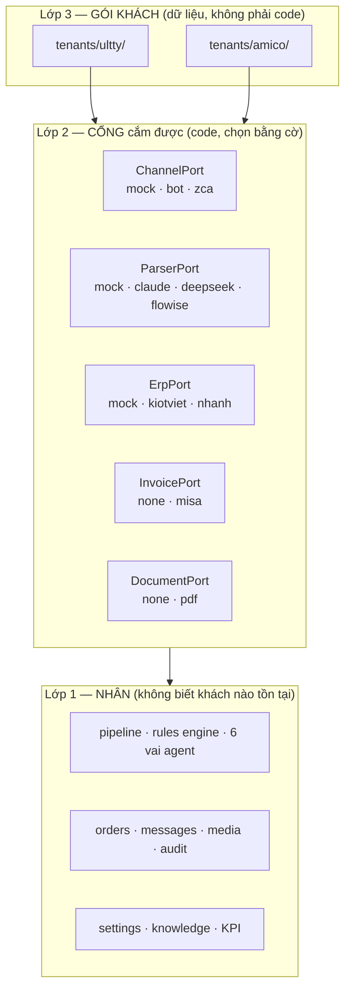

# KẾ HOẠCH — NỀN TẢNG DÙNG CHUNG CHO NHIỀU KHÁCH (base + gói khách)

> **Vai trò:** kế hoạch con — CHỈ mô tả phạm vi/thiết kế, **không chứa trạng thái** (trạng thái ✅/⬜ nằm ở [tong-quan.md](tong-quan.md)).
> **Bối cảnh:** khách thứ 2 — Công ty **Amico** (gia dụng cao cấp, ~30 nhóm Zalo B2B), nguồn: `docs/khach-hang/amico/nguon-goc/bao-gia-ai-agent-2026-08.md`. Trước mắt **2 khách**; mô hình bán dịch vụ đã chốt ở **D19**.
> **Kế hoạch liên quan:** [nen-tang.md](nen-tang.md) (Đợt 0) · [tinh-nang-dai-han.md](tinh-nang-dai-han.md) (Đợt 1-4) · [gd1.md](gd1.md).
> Lập: **11/08/2026** theo quy trình `search-first`.

---

## 0. Kết luận trong 6 dòng

1. **Một repo, một image, một bộ code.** Khác nhau giữa các khách = **dữ liệu + cấu hình + adapter tích hợp**, tuyệt đối không phải nhánh/bản fork riêng cho từng khách.
2. **Cách ly bằng kiến trúc:** mỗi khách một ngăn xếp riêng — DB riêng, secret riêng, bucket riêng, domain riêng. Không dùng chung DB ⇒ **chưa cần `tenantId`**. Đây là nâng cấp quyết định **H3** thành nguyên tắc nền tảng.
3. **Bắt buộc phải chọn mô hình này** vì có khách sẽ đòi chạy trên hạ tầng của họ — khi đã phải chạy được như một stack độc lập thì làm thêm mô hình dùng chung DB chỉ là chi phí kép.
4. **Hai chế độ hạ tầng dùng CÙNG một artefact** (image + compose + .env mẫu + runbook). Khác nhau duy nhất: **nơi giữ secret và ai giữ khóa**.
5. **Công sức code không lớn:** base hiện đã trung tính khoảng 90% — chỉ **một dòng prompt** gắn tên khách ([parser-prompt.ts:20](../../apps/api/src/pipeline/parser-prompt.ts:20)); rules/ngưỡng agent **đã là dữ liệu có vòng đời** draft→preview→active.
6. **Có 4 mâu thuẫn trong báo giá Amico phải chốt trước khi ký** (§8) — trong đó 1 lỗi pháp lý, 1 lỗi số học, 1 lời hứa kênh Zalo chưa có đường thực hiện hợp lệ, 1 khoản phí hạ tầng đang thấp hơn giá vốn đã biết.

---

## 1. Bước search-first — đã tra gì, kết luận gì

| Kênh tra | Truy vấn | Kết quả | Quyết định |
|---|---|---|---|
| Repo (`rg`) | `tenant`, `multi`, `white-label` | Chỉ 3 dòng **tài liệu** (H3, nen-tang §4, so-do §2). Code **chưa có** khái niệm khách nào | Base chưa có tenancy, nhưng hướng cách ly đã đúng từ đầu |
| npm | `prisma-rls`, `prisma-extension-rls` | `prisma-rls@0.5.4` (cập nhật 08/2026) + ví dụ chính chủ `prisma/prisma-client-extensions/row-level-security` | **KHÔNG dùng** — chỉ cần khi dùng chung DB. Ghi vào tủ, mở lại nếu đổi sang mô hình Pool (§3) |
| npm | `kiotviet` | `kiotviet-client-sdk@0.4.0` (24/05/2026, 1 maintainer, còn 0.x) | **KHÔNG adopt** — giữ quyết định [nen-tang.md §2](nen-tang.md): tự viết client mỏng; SDK chỉ để tham khảo |
| npm | `nhanh.vn` | `@dtxasia/nhanh-api-js@1.1.2` — **xuất bản 2021**, viết cho API đời cũ | **KHÔNG adopt** — Nhanh v3 ra 31/08/2025 và **v2 dừng hỗ trợ sau 30/11/2026**; lấy SDK 2021 là mua nợ kỹ thuật ngay lúc mua |
| npm | `meinvoice`, `misa` | **Không có gói nào** | **Build** — client mỏng theo `doc.meinvoice.vn` |
| Web | Nhanh.vn Open API | Có **API v3 thật**: đồng bộ sản phẩm/đơn/tồn kho/khách, rate limit **150 request/30 giây**, domain tách theo dịch vụ (`pos.open.nhanh.vn`), đăng ký app tại `open.nhanh.vn` | ✅ Thuận lợi lớn: khác hẳn KiotViet của Ultty (khảo sát ghi "không có API") |
| Web | MISA meInvoice | Có Open API + SDK chính thức, tài liệu `doc.meinvoice.vn`: lấy mẫu số, phát hành, ký số, tải/điều chỉnh/thay thế hóa đơn | ✅ Khả thi, tự viết client mỏng |
| Web | Triển khai nhiều khách | Mô hình silo/pool/bridge; Ansible quản Compose nhiều máy; Kamal 2 chạy nhiều app trên một máy | **Giữ Compose + script sẵn có**. Với 2 khách, thêm Ansible/Kamal là công cụ thừa — chỉ tham số hóa cái đang có |

**Không có gói nào đáng cài thêm cho phần đa-khách.** Toàn bộ nhu cầu (validate cấu hình, chọn adapter theo cờ, tách stack) đều đã có sẵn công cụ trong repo: `zod`, provider factory của NestJS, Docker Compose.

---

## 2. Base hiện tại đã trung tính tới đâu (đối chiếu code)

| Thành phần | Trung tính? | Bằng chứng | Việc phải làm |
|---|---|---|---|
| Chọn kênh / parser / kho ảnh / lưu trữ | ✅ đã là khuôn cắm được | [parser.provider.ts](../../apps/api/src/pipeline/parser.provider.ts) · `channel.provider.ts` · `media.provider.ts` — đều chọn theo cờ env | Không |
| Rules số (ship/VAT/COD/dung sai) + ngưỡng agent | ✅ **đã là dữ liệu**, có vòng đời draft→preview→active | `ruleSettingsSchema` + `agentSettingsSchema` ([settings.ts](../../packages/shared/src/settings.ts)) · model `RuleConfigVersion` | Chỉ cần **hạt giống** khác nhau theo khách |
| Nguồn sự thật SKU/giá/đại lý/glossary/map nhóm | 🟡 ở DB + CRUD `/settings`, nhưng **hạt giống cứng trong code** | [seed.ts](../../apps/api/src/knowledge/seed.ts) — 19 SKU + bảng giá của riêng Ultty | Tách ra `tenants/<slug>/data/` |
| Prompt LLM | 🟡 **đúng một dòng** gắn tên khách | [parser-prompt.ts:20](../../apps/api/src/pipeline/parser-prompt.ts:20) | Đưa persona vào gói khách |
| Cổng ERP | 🟡 đã là cổng abstract nhưng **đặt tên theo một khách** | `abstract class KiotVietAdapter` · type `KiotVietProduct` trong `@netviet/shared` | Đổi tên thành `ErpPort`; KiotViet/Nhanh là 2 hiện thực |
| Chính sách bán hàng | 🔴 **enum cứng** trong Prisma + shared | `enum PolicyType { cong_no_30 · cong_no_45 · ky_gui · thanh_toan_ngay · cod }` | Khách khác chính sách ⇒ phải sửa schema. Xem **D28** |
| Ngưỡng/regex phát hiện rủi ro | ✅ code-owned có chủ ý | [agents.config.ts](../../apps/api/src/agents/agents.config.ts) — ghi rõ "regex không nhận qua Settings" | Giữ nguyên (regex do khách nhập = lỗ hổng) |
| Tên gói + thương hiệu | 🔴 gắn cứng một khách | tên gói `@ultty/*` (đã đổi `@netviet/*` ở B1); còn `zalo-ultty` + secret `zalo-ultty-*` ở deploy, chuỗi UI ở `layout.tsx`/`TopBar.tsx` | Phần deploy + UI làm ở §9 Đợt B3 |

**Đọc bảng này theo hướng tích cực:** thứ khó nhất của đa-khách — tách "luật kinh doanh" ra khỏi mã nguồn — thì repo **đã làm xong từ trước**, vì lý do khác (để Sale tự sửa giá). Phần còn lại chủ yếu là đổi tên và di chuyển dữ liệu.

---

## 3. Ba mô hình cách ly — chọn cái nào

| Tiêu chí | **A. Silo** (mỗi khách 1 stack) | **B. Pool** (chung app + chung DB + RLS) | **C. Bridge** (chung app, DB riêng/khách) |
|---|---|---|---|
| Rủi ro rò dữ liệu chéo | Gần như không — không có đường nối | **Cao nhất**: một câu query quên `where tenantId` là rò | Trung bình: nhầm chuỗi kết nối |
| Khách đòi hạ tầng riêng của họ | ✅ chạy được ngay | ❌ không thể | 🟡 phải tách app ra |
| Luật 91/2025 + NĐ 356/2025, DPA từng khách | Dễ nhất: ranh giới dữ liệu = ranh giới máy | Khó: phải chứng minh cách ly ở tầng logic | Trung bình |
| Chi phí hạ tầng / khách / tháng | Cao nhất (~$44 theo **D23**) | Thấp nhất | Ở giữa |
| Công vận hành khi có N khách | Tuyến tính theo N | Gần như không đổi | Tuyến tính nhẹ |
| Công sức code để đạt được | **Thấp nhất** — hầu như không đổi code | Cao: `tenantId` mọi bảng, mọi query, mọi test | Trung bình |
| Bán kèm được "dữ liệu của anh nằm trên máy của anh" | ✅ | ❌ | 🟡 |

**→ Chốt: mô hình A (Silo)** cho giai đoạn 2-5 khách.

Lý do quyết định (không phải lý do phụ): **đã có khách sẽ yêu cầu dùng hạ tầng riêng của họ**. Nghĩa là hệ thống *bắt buộc* phải chạy được như một stack độc lập, tự đứng. Khi năng lực đó đã bắt buộc phải có, làm thêm mô hình dùng chung DB không tiết kiệm được gì mà lại phải nuôi hai kiến trúc.

**Ngưỡng mở lại quyết định:** khi vượt ~8-10 khách, **hoặc** khi xuất hiện phân khúc khách nhỏ trả ít tiền mà $44/tháng hạ tầng ăn hết biên lợi nhuận. Lúc đó dùng `prisma-rls` (đã tra sẵn ở §1) làm mô hình B cho *riêng* phân khúc đó, giữ mô hình A cho khách lớn. **Không làm sớm.**

---

## 4. Kiến trúc 3 lớp



**Nguyên tắc bất di bất dịch:** *cái gì có thể là dữ liệu thì phải là dữ liệu; chỉ **năng lực** mới được là code.*
Giá, SKU, chính sách, từ điển viết tắt, ngưỡng cảnh báo, persona, thương hiệu → **dữ liệu**.
"Biết nói chuyện với Nhanh.vn", "biết sinh PDF" → **code**, nằm sau cổng, bật bằng cờ.

Cây thư mục đề xuất (giữ nguyên monorepo hiện có):

```
packages/
  core/                    ← đổi tên từ shared/ (@netviet/core): kiểu domain, env schema, hợp đồng cổng
  tenant/                  ← MỚI (@netviet/tenant): schema zod + loader gói khách
apps/
  api/                     ← 100% trung tính; integrations/ đặt trong đây tới khi có consumer thứ 2
    src/integrations/kiotviet|nhanh|misa/
  web/                     ← thương hiệu đọc từ cấu hình lúc chạy
tenants/
  _example/                ← gói mẫu + tài liệu điền
  ultty/  { tenant.json · data/ · infra.json }
  amico/  { tenant.json · data/ · infra.json }
deploy/
  stack/                   ← compose.yaml tham số hóa theo $TENANT (từ deploy/netviet/)
```

---

## 5. Gói khách gồm gì

**Phân biệt quan trọng — hai loại cấu hình, đừng trộn:**

| Loại | Đọc lúc nào | Đổi lúc chạy? | Ở đâu | Ví dụ |
|---|---|---|---|---|
| **Năng lực & danh tính** | Boot | Không (phải deploy lại) | `tenant.json` + env | dùng ERP nào, có bật hóa đơn không, tên bot, persona, màu thương hiệu |
| **Luật kinh doanh & nguồn sự thật** | Lúc chạy | **Có** — qua `/settings` | **Postgres** | giá, SKU, đại lý, map nhóm, phí ship, VAT, ngưỡng đơn lớn |

Gói khách **là hạt giống, không phải nguồn sự thật lúc chạy**. Sau lần seed đầu, DB thắng. Nếu để cả hai cùng "đúng" thì sẽ có ngày sửa giá trên `/settings` xong deploy lại là giá cũ quay về — lỗi kiểu đó rất khó truy.

```jsonc
// tenants/amico/tenant.json  — validate bằng zod, CI chặn nếu sai
{
  "schemaVersion": 1,
  "slug": "amico",
  "displayName": "Công ty Amico",
  "branding":    { "productName": "Trợ lý đơn hàng Amico", "primaryColor": "#0F62FE" },
  "persona":     { "parserIntro": "Ban la bo PHAN LOAI Y DINH + TRICH XUAT don hang cho Amico (gia dung cao cap).",
                   "botName": "Nhân viên AI Amico" },
  "policies":    ["cong_no_30", "thanh_toan_ngay", "cod"],   // tập con của enum — xem D28
  "features":    { "autoAck": true,  "autoSend": false, "invoiceDraft": true,
                   "deliveryPdf": true, "backorderWatch": true, "consignment": false },
  "integrations":{ "erp": "nhanh", "invoice": "misa" },
  "seeds":       { "rules": { "vatRate": 0.1, "codFee": 20000, "...": "..." },
                   "agents": { "largeOrderTotal": 20000000, "...": "..." } },
  "compliance":  { "dataRegion": "vn", "llmVendors": ["anthropic"], "channelRiskAccepted": false }
}
```

**Dữ liệu thương mại (`data/`) KHÔNG vào git.** Bảng giá + danh sách đại lý của khách A không được nằm trong repo mà kỹ thuật của khách B đọc được — đó chính là "cách ly bằng kiến trúc chứ không bằng lời hứa". Chỉ commit `data/*.example.csv`; bản thật đi qua kho secret/bucket riêng. (Dữ liệu Ultty hiện **đã** nằm trong `seed.ts` đã commit — chuyển ra theo cơ chế mới, biết trước là git history vẫn còn bản cũ.)

**Lưới an toàn bắt buộc: CI chạy bộ test cho CẢ HAI gói.** Đây là thứ duy nhất chứng minh được base không âm thầm nghiêng về một khách. Không có nó thì "base dùng chung" chỉ là tên gọi.

---

## 6. Hạ tầng: hai chế độ, một artefact

| Hạng mục | **NetViet thuê hộ** | **Khách tự có hạ tầng** |
|---|---|---|
| Máy chủ | NetViet mua, đứng tên NetViet | Khách cấp VM/máy chủ, NetViet chỉ có quyền deploy |
| Domain + TLS | NetViet cấp (`<slug>.<domain>`) | Khách cấp; Caddy vẫn tự xin chứng chỉ |
| Nơi giữ secret | GCP Secret Manager (đang dùng) | **SOPS + age** hoặc file `.env` do khách giữ — chọn bằng `SECRET_BACKEND` |
| Ai giữ khóa Zalo/LLM/ERP | NetViet (kèm D20 về ToS) | Khách giữ, NetViet không có bản sao |
| Sao lưu | GCS của NetViet, 7 ngày + 4 tuần | Bucket của khách; script giữ nguyên (đã dùng chuẩn S3) |
| Giám sát + on-call | NetViet (**D24** — SLA còn treo) | NetViet cảnh báo, khách xử lý tầng hạ tầng |
| Cập nhật phiên bản | NetViet chủ động | Theo lịch thỏa thuận, khách bấm nút |

**Giống hệt nhau ở cả hai chế độ:** image Docker, `compose.yaml`, `.env.tpl`, các timer health/backup, runbook, quy trình rollback. Đây là điều làm chế độ thứ hai gần như miễn phí.

**Việc phải làm để đạt được:**
- Bỏ chuỗi `zalo-ultty` gắn cứng ở **21 file** trong `deploy/netviet/` → biến `$TENANT`: thư mục `/srv/netviet/apps/$TENANT`, tên compose project, secret `$TENANT-<key>` ([render-secrets.sh](../../deploy/netviet/render-secrets.sh) đang gọi thẳng `secret zalo-ultty-*`).
- Thêm `SECRET_BACKEND=gcp|sops|envfile` — cùng một `render-secrets` với 3 nguồn.
- Tách `deploy/netviet/` → `deploy/stack/` (chung) + `tenants/<slug>/infra.json` (riêng: domain, cỡ máy, vùng, bucket).

**Cân nhắc chi phí:** mỗi stack hiện gồm Postgres + Flowise + API + Web + Caddy. **Flowise là thành phần nặng nhất và ít thiết yếu nhất** — nó chỉ là adapter parser (`PARSER_MODE=flowise`), trong khi `claude`/`deepseek` gọi thẳng vẫn chạy. Với khách mới nên **mặc định không dựng Flowise**, giảm đáng kể RAM và một mặt tấn công. Xem **D29**.

---

## 7. Khoảng cách Amico ↔ base hiện có

| Amico cần (theo báo giá) | Base hiện có? | Việc |
|---|---|---|
| Đọc tin nhóm Zalo, chuẩn hóa tiếng Việt không dấu, nhận intent, bóc tách đơn | ✅ **có đủ** | Chỉ nạp dữ liệu Amico |
| Áp giá theo cấp đại lý, chọn chính sách, tính VAT, sinh đơn | ✅ **có đủ** | Chỉ đổi hạt giống rules |
| 6 agent chuyên trách + Giám sát leo thang | ✅ **có đủ** (6 vai, 1 lần gọi LLM/tin) | Đổi nhãn vai theo Amico |
| Dashboard theo dõi hội thoại/đơn + thông báo chờ duyệt | 🟡 có console + `/settings`, **chưa có phân quyền** | **D5 vẫn treo ở Ultty** — Amico đã *bán* phần này ⇒ phải làm ở base |
| **Tích hợp Nhanh.vn**: tồn kho realtime + tạo đơn | ❌ chưa có | `ErpNhanhAdapter` sau `ErpPort` — có API v3, rate limit 150/30s |
| **Tích hợp MISA**: draft hóa đơn PDF | ❌ chưa có | `InvoiceMisaAdapter` sau `InvoicePort` mới |
| **Sinh PDF đơn giao** gửi vào nhóm | ❌ chưa có | Năng lực nền mới (`DocumentPort`) — dùng được cho cả Ultty |
| **Chờ hàng về / ghép đơn / tự báo khi đủ tồn** | ❌ chưa có | Watcher tồn kho — logic mới, không nhỏ |
| **AI tự tư vấn 24/7 trong nhóm** | 🟡 có cờ `AUTO_ACK`/`AUTO_SEND` nhưng Ultty **tắt** theo GĐ1 | Thành **chính sách theo khách**, không phải hằng số hệ thống — đúng như thiết kế cờ hiện tại |
| 30 nhóm Zalo | 🟡 cùng bài toán kênh | Mention-gating của Bot Platform / rủi ro ToS của zca — **y hệt Ultty** |

**Đọc bảng:** phần "lõi AI + luật kinh doanh" Amico gần như dùng lại được nguyên. Phần mới thực sự là **4 năng lực tích hợp/tài liệu**, và cả 4 đều làm ở base để Ultty dùng lại sau.

---

## 8. Bốn mâu thuẫn trong báo giá Amico — chốt trước khi ký

1. **Sai căn cứ pháp lý.** Báo giá viện dẫn **NĐ 13/2023/NĐ-CP**. Nghị định này **đã hết hiệu lực** — nay là **Luật 91/2025/QH15 + NĐ 356/2025** (từ 01/01/2026), đã ghi trong `CLAUDE.md`. Nặng hơn: câu *"dữ liệu được lưu trữ trong lãnh thổ Việt Nam"* **mâu thuẫn với hạ tầng đang chạy** — chốt 11/08/2026 là **giữ GCP**, sau này chuyển OVHcloud. ⇒ Hoặc sửa câu chữ báo giá, hoặc dựng riêng stack Amico ở nhà cung cấp trong nước (**D27**). Kèm theo là hồ sơ chuyển dữ liệu xuyên biên giới ở **D22** (chế tài tới 5% doanh thu năm liền trước).
2. **Lỗi số học trong bảng giá.** Mục II.2: *Dịch vụ AI 2.000.000 · VAT 10% **200.000** · **TỔNG 2.000.000***. Tổng phải là **2.200.000**. (Mục II.3 tính đúng: 400.000 × 12 = 4.800.000 + VAT 480.000 = 5.280.000.)
3. **Lời hứa kênh Zalo chưa có đường thực hiện hợp lệ.** Báo giá bán "AI nhắn tin, tư vấn 24/7 trên nhóm". Thực tế đã đo: Bot Platform **chỉ nhận tin @mention** (hành vi gốc, không tắt được), còn zca **vi phạm ToS Zalo, có thể bị khóa tài khoản**. ⇒ Phải nói rõ trong hợp đồng dùng kênh nào, và nếu là zca thì cần **văn bản chấp nhận rủi ro** như **D16**, cộng **D20** (ai đứng tên tài khoản phụ — nếu NetViet đứng tên thì NetViet là bên vi phạm ToS).
4. **Phí hạ tầng đang thấp hơn giá vốn đã biết.** Báo giá thu **400.000đ/tháng** (≈ $15) cho lưu trữ + backup, trong khi **D23** ghi hạ tầng ~**$44/khách/tháng**. Nếu 80 triệu phí xây dựng đã tính bù phần này thì ổn — nhưng phải là một phép tính có chủ đích, không phải phát hiện sau 12 tháng. Ghi chú "có thể thay đổi khi quy mô tăng" ở mục III chưa đủ để chịu chênh lệch ~3 lần.

**Ngoài ra — mốc 3 tuần:** khả thi cho phần *cấu hình trên nền có sẵn* (nạp dữ liệu, persona, rules, đọc/bóc tách/duyệt). **Không khả thi** nếu tính cả Nhanh.vn + MISA + PDF + watcher tồn kho. ⇒ Đề nghị tách hai mốc trong hợp đồng: **Mốc 1 (3 tuần)** chạy được trên nền + dữ liệu Amico; **Mốc 2** các tích hợp.

---

## 9. Lộ trình 5 đợt

| Đợt | Nội dung | Điều kiện nghiệm thu |
|---|---|---|
| **B1 — Trung tính hóa nhân** ✔<br/>*(không đổi hành vi)* | Đổi tên `@ultty/*` → `@netviet/*`; tách `seed.ts` → `tenants/ultty/data/knowledge.json`; persona ra `tenants/ultty/tenant.json`; `KiotVietAdapter` → `ErpPort` (KiotViet là một hiện thực) | **Toàn bộ test cũ xanh, số lượng không đổi** (mốc: api 430 pass/21 skip · shared 69 · web 29 · route 8). Đây là refactor cơ học — một test đổi trạng thái là dấu hiệu làm sai |
| **B2 — Gói khách + CI hai gói** | `packages/tenant` (schema zod + loader); `tenants/ultty` đầy đủ; `tenants/amico` khung; CI chạy test theo ma trận 2 gói | Đổi `TENANT=amico` thì persona/thương hiệu/rules đổi theo, **không sửa một dòng code nào** |
| **B3 — Hạ tầng tham số hóa** | Bỏ `zalo-ultty` cứng khỏi 21 file deploy; `$TENANT`; `SECRET_BACKEND=gcp\|sops\|envfile`; tách `deploy/stack/`; runbook cho cả hai chế độ hạ tầng | Dựng được stack thứ hai **trên cùng VM** bằng đúng script đó, hai DB không thấy nhau |
| **B4 — Năng lực mới cho Amico** | `ErpNhanhAdapter` · `InvoiceMisaAdapter` · `DocumentPort` (PDF) · watcher tồn kho/ghép đơn — mỗi thứ sau một cổng + một cờ | Ultty bật `erp=kiotviet` vẫn chạy y nguyên; mọi năng lực mới mặc định **tắt** |
| **B5 — Bảng điều khiển nhiều stack** | Nhìn trạng thái/KPI nhiều khách một chỗ | **Chỉ làm khi đã có khách thứ 3.** Với 2 khách thì mở 2 tab — YAGNI |

Thứ tự có lý do: **B1 phải xong trước khi Amico có bất kỳ dòng code nào**, nếu không sẽ có hai bộ mã song song và mọi lợi ích của "base dùng chung" biến mất trong 2 tuần.

### B1 đã làm gì (12/08/2026)

| Trước | Sau |
|---|---|
| `@ultty/*` — tên gói mang tên một khách | `@netviet/*` (124 file) |
| 19 SP + bảng giá + đại lý + glossary nằm thẳng trong `apps/api/src/knowledge/seed.ts` | `tenants/ultty/data/knowledge.json`; `seed.ts` chỉ còn một dòng gọi loader |
| Tên khách hardcode ở `parser-prompt.ts:20` | `tenants/ultty/tenant.json` → `persona.parserIntro` |
| `KiotVietAdapter` là cổng — nhà cung cấp đứng tên hợp đồng | `ErpPort` là cổng, `KiotVietMockAdapter` là một hiện thực (`apps/api/src/erp/`) |
| `KiotVietProduct` / `KiotVietOrder` | `ErpProduct` / `ErpOrder` |

Chọn gói khách bằng `TENANT=<slug>` hoặc `TENANT_DIR=<path>` (đường dẫn tuyệt đối, cho khách chạy hạ tầng riêng) — xem [tenants/README.md](../../tenants/README.md).

**Cố ý CHƯA làm** (thuộc đợt sau, đừng tưởng bỏ sót): `packages/tenant` riêng + CI ma trận 2 gói (B2) · bỏ `zalo-ultty` khỏi deploy + chuỗi UI ở `layout.tsx`/`TopBar.tsx` (B3) · `NhanhAdapter`, MISA, PDF (B4). Trường `kiotVietCode` trên `OrderView`/Prisma **giữ nguyên tên** vì đổi là chạm schema DB + web — dồn vào B3.

Nghiệm thu: api **430 test cũ xanh nguyên** (+8 test mới cho loader gói khách) · shared 69 · web 29 · route 8 · typecheck 0 · lint 0.

---

## 10. Quyết định mới cần chốt

> Nối tiếp bảng D ở [tong-quan.md §4](tong-quan.md) (đang tới D25). Liên quan sẵn có: **D19** (mô hình bán dịch vụ) · **D22** (hồ sơ chuyển dữ liệu) · **D23** (đơn vị kinh tế) · **D24** (SLA/on-call).

| # | Quyết định | Chặn gì |
|---|---|---|
| **D26** | **Xác nhận mô hình Silo** (mỗi khách một stack, không dùng chung DB) làm nguyên tắc nền tảng, kèm ngưỡng mở lại ở §3 | Toàn bộ lộ trình §9 |
| **D27** | **Đặt hạ tầng Amico ở đâu** — GCP như Ultty, hay nhà cung cấp trong nước để đúng câu "dữ liệu lưu tại Việt Nam" trong báo giá | Ký hợp đồng Amico + D22 |
| **D28** | **Chính sách bán hàng: giữ `enum` hay chuyển thành bảng?** Enum cứng thì khách có chính sách lạ là phải sửa schema + migration | B2, và mọi khách thứ 3 trở đi |
| **D29** | **Có dựng Flowise cho khách mới không?** Bỏ đi thì stack nhẹ hơn nhiều và bớt một mặt tấn công; đổi lại mất giao diện sửa luồng LLM không cần lập trình | B3, cỡ máy, báo giá hạ tầng |
| **D30** | **Tên thương hiệu nền tảng** (`@netviet/*`? tên sản phẩm hiển thị cho khách?) — đổi càng muộn càng đắt | B1 |
| **D31** | **Ai giữ secret khi khách tự host** — NetViet có được giữ bản sao khóa Zalo/ERP của khách không, hay chỉ khách giữ | B3 + hợp đồng |

---

## 11. Việc KHÔNG làm (ghi để khỏi bàn lại)

- **Không** thêm `tenantId` vào Prisma schema — không dùng chung DB thì cột đó chỉ là tiếng ồn tạo cảm giác an toàn giả.
- **Không** fork repo cho từng khách — hai bộ mã là hai lần sửa lỗi, và sau 3 tháng chúng sẽ khác nhau tới mức không merge được nữa.
- **Không** dựng Kubernetes/Ansible/Kamal cho 2 khách — Compose + script hiện tại đã chạy qua soak 24 giờ.
- **Không** làm bảng điều khiển đa khách trước khách thứ 3.
- **Không** cài `prisma-rls`, `kiotviet-client-sdk`, `@dtxasia/nhanh-api-js` — lý do từng gói ở §1.
