# KẾ HOẠCH — TỔNG QUAN & TRẠNG THÁI (nguồn sự thật duy nhất)

> **Vai trò:** tài liệu DUY NHẤT giữ **trạng thái** mọi kế hoạch (đang ở đâu, xong gì, chờ gì, quyết định treo, dữ liệu thiếu). Các kế hoạch con CHỈ mô tả phạm vi/thiết kế — **không chứa trạng thái**; muốn biết tiến độ, quay về đây.
> **Kế hoạch con:** [nen-tang.md](nen-tang.md) (Đợt 0 — nền phải xong) · [tinh-nang-dai-han.md](tinh-nang-dai-han.md) (Đợt 1-4 — 6 tính năng mới).
> **Thay thế (11/07/2026):** `tien-do-va-ke-hoach.md` + `checklist-du-lieu-khach.md` + phần trạng thái của `ke-hoach-dai-han.md` + 2 plan code trong `.claude/plans/` — tất cả đã xóa, git history còn.
> Cập nhật: **11/07/2026**.

---

## 1. Ảnh chụp nhanh (11/07/2026)

- **Nhánh đang làm:** `feat/phase3-persistence` (tách từ `feat/console-realtime-ui`). Cả 2 nhánh **CHƯA merge `main`**.
- **Demo chạy được ngay** trên **dữ liệu thật** (19 SKU + bảng giá tháng 7 + 24 glossary) + **kênh Zalo thật** (zca, 2 nhóm đã map) + AI thật (DeepSeek — eval 35/35).
- **Lưu trữ:** mặc định in-memory (`PERSISTENCE=memory` → demo/CI không cần DB); bật Postgres bằng `PERSISTENCE=prisma`.
- **Nguồn sự thật ĐỘNG:** sửa qua panel `/admin` (AdminJS) hoặc MCP tool (8 tool) → ghi Postgres + pipeline nạp lại ngay.
- **Chất lượng:** 137 test xanh (memory) · IT Postgres gated `RUN_PRISMA_IT=1` · lint · typecheck.

### Cách chạy nhanh

```bash
# Demo offline (không cần DB)
pnpm dev:api && pnpm dev:web

# Bản thật: Postgres + panel chỉnh nguồn sự thật
docker compose up -d postgres
pnpm --filter @ultty/api exec prisma migrate deploy
pnpm --filter @ultty/api exec tsx prisma/seed.ts
PERSISTENCE=prisma ADMIN_UI=on pnpm --filter @ultty/api dev   # → /admin

# MCP tool (agent sửa nguồn sự thật bằng hội thoại)
pnpm --filter @ultty/api mcp
```

---

## 2. Bức tranh lớn: lộ trình 3 giai đoạn (NetViet) + vị trí hiện tại

```mermaid
flowchart LR
    subgraph P0["Chuẩn bị ✅"]
        A1["Scaffold monorepo ✅"]
        A2["PoC Bot + zca ✅"]
        A3["Nguồn sự thật thật ✅"]
        A4["Bake-off parser (100%) ✅"]
    end

    subgraph G1["GĐ1 — Đọc tự động + Sale duyệt (⬅ ĐANG Ở CUỐI GĐ NÀY)"]
        B1["Pipeline: intent + trích xuất<br/>+ rules + validation ✅"]
        B2["Console duyệt 1 chạm ✅"]
        B3["Lưu mọi tin + rules-config động ⬜"]
        B4["KiotViet Excel/API + auth ⬜"]
        B5["Pilot 1-2 nhóm, đo 4 KPI ⬜"]
    end

    subgraph G2["GĐ2 — Tự động hóa & đa kênh ⬜"]
        C1["KiotViet API + Base API"]
        C2["Zalo OA 1:1 + ZNS"]
        C3["Đối soát ký gửi/công nợ + AUTO_SEND"]
    end

    subgraph G3["GĐ3 — Tối ưu & chủ động ⬜"]
        D1["Dự báo mùa vụ, cảnh báo tồn"]
        D2["Up-sell / nhắc tái đặt"]
    end

    P0 --> G1 --> G2 --> G3
```



Đợt 1-4 của [tinh-nang-dai-han.md](tinh-nang-dai-han.md) (6 tính năng mới) đứng TRÊN nền Đợt 0 và đan vào GĐ2-3 NetViet.

---

## 3. BẢNG TRẠNG THÁI kế hoạch (nơi duy nhất có ✅/⬜)

### 3.1 [nen-tang.md](nen-tang.md) — Đợt 0 (việc đang dở, chắc chắn làm)

| Hạng mục (phạm vi chi tiết ở kế hoạch con) | Trạng thái |
|---|---|
| Phase 0-2 — scaffold · PoC · pipeline · rules · console SSE · kênh zca · dữ liệu thật | ✅ XONG |
| Phase 3 — Postgres/Prisma + repo seam + panel `/admin` + MCP tool + seed thật | ✅ XONG |
| Phase 3 còn lại — **lưu MỌI tin vào DB** (`messages`) | ⬜ |
| Phase 3 còn lại — **rules-config động** + sửa nghiệp vụ theo nguồn gốc (VAT-default **D8** · phí COD dạng bảng · xác minh `cong_no_7` **D15** · ship/ngưỡng thành config) | ⬜ chờ D8/D15 + A3 |
| Phase 3 còn lại — **import Excel A4** (đại lý + map nhóm, dùng `exceljs`) | ⬜ chờ A4 |
| Phase 4 — KiotViet Excel/API + map SKU↔mã số · Base · đổi LLM sang Claude cho dữ liệu thật | ⬜ chờ C1 |
| Phase 5 — auth theo vai (2 cổng KSNB) + ghi `kpi_events` + feedback loop | ⬜ chờ D5 |
| Phase 6 — deploy 1 VM + webhook always-on + sao lưu + **pilot 1-2 nhóm → go/no-go** | ⬜ chờ E1-E4 + B1-B2 |
| Việc "thật hơn" treo — đọc 6 quy trình gốc chưa phản ánh · mô hình hóa sau `synced` · PWA 5 tab | ⬜ |

### 3.2 [tinh-nang-dai-han.md](tinh-nang-dai-han.md) — Đợt 1-4 (6 tính năng mới, định hướng)

| Đợt | Gồm | Trạng thái | Cổng vào (chi tiết ở kế hoạch con) |
|---|---|---|---|
| 1 — Giá trị nhanh | F6a gọi nhân viên → F1 sửa đơn NL → F3 dashboard v1 | ⬜ chưa bắt đầu | Đợt 0 xong phần nền + D10 · D11 · D14 |
| 2 — Dòng tiền | F2 QR + payments → F5 v1 nhắc công nợ | ⬜ chưa bắt đầu | D9 · D13 |
| 3 — Năng lực AI | F4 ảnh viết tay (PoC trước) · F6b chống gian lận v1 | ⬜ chưa bắt đầu | D12 · D14 |
| 4 — Tối ưu (GĐ3) | F5 v2 đối soát · F6b v2 baseline · dự báo/up-sell | ⬜ chưa bắt đầu | vài tháng dữ liệu thật sau pilot |

Ghi chú trạng thái đã chốt cho kế hoạch dài hạn: **lộ trình Đợt 1→4 đã được duyệt** (10/07/2026) · **thư viện/dịch vụ đã chốt qua search-first** (danh sách trong kế hoạch con §7) · ⚠️ deadline kỹ thuật: **DeepSeek khai tử model cũ 24/07/2026** — demo đã chuyển `deepseek-v4-flash` ✅.

---

## 4. DỮ LIỆU CÒN THIẾU (chặn gì — hỏi chị Nguyễn Thu Phương)

> Nguồn sự thật đã **động** → thiếu A2/A3/A4 **không chặn BUILD** (nhập dần qua `/admin`/MCP) nhưng vẫn chặn **chạy thật đúng số**. B1-B2 là **cổng go-live**, không thay thế được.
> Trạng thái: ⬜ chưa có · 🟡 đã hỏi, đang chờ · ✅ đã nhận & kiểm tra.

**Ưu tiên đỏ:** 🔴 A3 (rules hết "tạm tính") · 🔴 A4 (áp đúng đại lý) · 🔴 A2 (deal riêng) · 🟠 B1-B2 (cổng go-live) · 🟡 C1 (Phase 4).

### A — Nguồn sự thật

| # | Cần gì | Chi tiết hỏi | Chặn | TT |
|---|---|---|---|---|
| A1 | Danh mục SKU | ~~Mã, tên, tên gọi tắt, đơn vị~~ — **đã có 19 SKU từ hồ sơ giá tháng 7**; chỉ còn xác nhận đủ/thiếu | — | ✅ |
| A2 | Deal riêng theo đại lý | Ai có deal riêng, SKU nào, giá nào (cơ chế `DealerPriceOverride` sẵn, đang rỗng) | Giá đúng cho đại lý SL lớn | ⬜ |
| A3 | **Biểu phí COD + biểu cước ship + ngưỡng công nợ** | Bảng phí thu hộ COD ("biểu mẫu riêng"); mức cước Grab nội thành/Viettel tỉnh; định nghĩa "nội thành"; ngưỡng SL áp công nợ 30 vs 45 | Rules hết **tạm tính** (COD 20k, ship 30k/40k đang là giả định) | ⬜ |
| A4 | Danh sách đại lý/CTV + map nhóm Zalo | Tên, cấp, chính sách mặc định, SĐT + nhóm Zalo nào thuộc đại lý nào (từ tag Zalo đang dùng); ưu tiên 10-20 nhóm pilot; gửi file mẫu cho Sale điền dần | Áp đúng đại lý/chính sách (cơ chế nhập sẵn: `/admin` + hộp thư nhóm chưa map + import exceljs) | ⬜ |

### B — Dữ liệu kiểm thử AI (CỔNG GO-LIVE)

| # | Cần gì | Chi tiết | TT |
|---|---|---|---|
| B1 | **20-30 tin đặt hàng THẬT** | Nguyên văn (giữ viết tắt/không dấu), đủ dạng TH1/TH2/sửa đổi/nhiều SP, kèm nhóm/đại lý | ⬜ |
| B2 | Đơn ĐÚNG tương ứng (golden) | Đơn cuối lên KiotViet cho từng tin B1 — đo field-accuracy + bake-off model | ⬜ |
| B3 | 5-10 ảnh chụp bảng đặt hàng | Cho <20% đơn ảnh (sau này là bộ eval F4) | ⬜ |
| B4 | Từ điển viết tắt bổ sung | Đã có 24 mục từ `Viết tắt_.docx`; nhờ Sale bổ sung tên gọi tắt SP/đại lý | 🟡 |
| B5 | Mẫu format xác nhận Sale đang gửi | 2-3 tin xác nhận TH1 + TH2 thật (đúng giọng hiện tại) | ⬜ |

### C — Truy cập hệ thống (hỏi sớm vì chờ lâu)

| # | Cần gì | Chi tiết | TT |
|---|---|---|---|
| C1 | KiotViet — gói & API | Gói nào, có mục Thiết lập → API không (docs công khai: 5.000 GET/giờ, token 24h); xin file Excel export 5-10 đơn gần nhất + file mẫu import | ⬜ |
| C2 | Base — phạm vi dùng & API | App nào (Workflow/Wework), đầu mối kỹ thuật, format đơn nhập Base (ảnh màn hình) | ⬜ |
| C3 | Hóa đơn VAT | Phần mềm nào, thông tin chuẩn bị khi xuất (STK công ty/cá nhân) | ⬜ |

### D — Quyết định cần chốt (bảng thống nhất — đánh số CHUẨN từ 11/07/2026)

> D1-D7 giữ nguyên số cũ của checklist; D9-D14 giữ nguyên số của kế hoạch dài hạn; 2 câu hỏi rules (trước tạm gọi "D6/D7 mới" — bị trùng số) đổi thành **D8/D15**.

| # | Quyết định | Chặn gì | TT |
|---|---|---|---|
| D1 | Nhóm Zalo test + add bot PoC | — | ✅ 07/07 |
| D2 | Đại lý có chấp nhận **tag bot** khi đặt hàng? | Bật Bot mode (kênh phụ) | 🟡 |
| D3 | Design PWA là spec hay tham khảo UX? Console PC hay PWA mobile 5 tab? | Hướng app Sale sau demo | ⬜ |
| D4 | AI có được **tự gửi/trả lời** trong nhóm (`AUTO_SEND`/auto-reply)? | Cần **văn bản đồng ý** — GĐ2 | ⬜ |
| D5 | Danh sách người dùng app (tên + SĐT + vai: BPKD/KSNB/kế toán/quản lý) | Phase 5 auth | ⬜ |
| D6 | Mẫu thông báo "nhóm có hệ thống hỗ trợ tự động" | Tuân thủ Zalo + NĐ13 khi chạy thật | ⬜ |
| D7 | Chốt phạm vi GĐ1 + KPI + mốc pilot 1-2 nhóm | Phase 6 | ⬜ |
| **D8** | **VAT-default** theo chính sách/đại lý (PO công nợ B2B ghi "giá đã gồm GTGT") hay giữ "chỉ VAT khi khách ghi rõ"? | Increment rules-config (Đợt 0) | ⬜ |
| D9 | STK nhận tiền + chọn SePay/Open API bank/bán tự động + bổ sung hợp đồng xử lý dữ liệu giao dịch | F2 (Đợt 2) | ⬜ |
| D10 | Đơn trạng thái nào còn được sửa/hủy qua AI; đơn đã giao đi quy trình hoàn trả nào | F1 (Đợt 1) | ⬜ |
| D11 | Danh sách chỉ số dashboard (đề xuất: 4 KPI + doanh thu đại lý/chi nhánh + phễu đơn) | F3 (Đợt 1) | ⬜ |
| D12 | Cấp Claude API credit + 20-30 ảnh đơn viết tay thật kèm đáp án | F4 (Đợt 3) | ⬜ |
| D13 | Ngưỡng công nợ chính thức (A3) + cách xác định "ngày nhận hàng" + số dư công nợ đầu kỳ từ Excel BPKD | F5 (Đợt 2) | ⬜ |
| D14 | Danh sách Sale trực + kênh nhận cảnh báo + case đơn ảo/gian lận thật + ngưỡng | F6 (Đợt 1+3) | ⬜ |
| **D15** | **"Công nợ 7 ngày"** là chính sách riêng hay điều khoản TT-7-ngày của ký gửi? | Increment rules-config (Đợt 0) | ⬜ |
| **D16** | **Văn bản chấp nhận rủi ro ToS** cho kênh zca (tài khoản phụ) | Chạy thật kênh zca | ⬜ |
| **D17** | DeepSeek: bổ sung vào thỏa thuận xử lý dữ liệu HAY đổi hẳn `PARSER_MODE=claude`? | Chạy thật với dữ liệu khách | ⬜ |

### E — Hạ tầng production (chặn chạy 24/7)

| # | Cần gì | TT |
|---|---|---|
| E1 | Máy chủ 24/7 + domain + HTTPS (webhook always-on) — ai cung cấp/trả tiền | ⬜ |
| E2 | Postgres production + lịch sao lưu (managed hay tự host) | ⬜ |
| E3 | Ai vận hành hằng ngày sau bàn giao (NetViet managed?) + SLA | ⬜ |
| E4 | Kênh nhận cảnh báo sự cố (bot/kênh chết → báo ai, qua đâu) | ⬜ |

### F — Tài khoản & chi phí

| # | Cần gì | TT |
|---|---|---|
| F1 | Chủ sở hữu bot Zalo + tài khoản Zalo phụ (zca) production — ai giữ token/SIM | ⬜ |
| F2 | Ai add bot/tài khoản phụ vào ~200 nhóm, theo đợt nào (khớp A4) | ⬜ |
| F3 | Gói Zalo Bot Premium nếu cần (giới hạn nhóm/rate limit — hỏi Zalo) | ⬜ |
| F4 | Tài khoản + ngân sách LLM API (ai trả, hạn mức/tháng) | ⬜ |

### G — AI/LLM production

| # | Cần gì | TT |
|---|---|---|
| G1 | Chốt model qua bake-off trên B1-B2 (demo tạm DeepSeek 35/35) | ⬜ |
| G2 | Quyền gửi dữ liệu cá nhân (SĐT/địa chỉ đơn TH2) sang LLM — tối thiểu hóa, NĐ13/2023 | ⬜ |

### Gợi ý cách hỏi hiệu quả

1. Gửi khách **đúng 1 email/tin Zalo** kèm bảng A+B (đính file Excel mẫu cho A4, B1-B2 để Sale điền thẳng) — tránh hỏi rải rác.
2. Đề xuất **1 buổi call 30-45 phút với chị Phương** đi qua A3 (chính sách) + B4 (viết tắt) — hỏi miệng nhanh hơn chờ điền form.
3. B1-B2: hướng dẫn Sale mở 10 nhóm gần nhất có đơn → copy tin + chụp đơn KiotViet tương ứng — ~1 giờ đủ 20-30 cặp.
4. Nhấn mạnh: **A + B là điều kiện bật AI thật** ("chuẩn hóa nguồn sự thật trước khi bật AI" — NetViet §1).

---

## 5. Việc nội bộ đang treo (không phải quyết định của khách)

| Việc | Ghi chú |
|---|---|
| Merge `feat/console-realtime-ui` + `feat/phase3-persistence` vào `main` | Nhiều commit đang chờ |
| KiotViet: làm `KiotVietExcelAdapter` ngay hay chờ xác nhận API (C1) | Khảo sát ghi "chưa có API" |
| Regen 3 PDF lãnh đạo (`docs/pdf/`) theo bộ tài liệu mới 11/07 | Cần mạng (mermaid CDN); lệnh trong `docs/pdf/src/README.md` |
