# Giới thiệu hệ thống vận tải cho lãnh đạo

**Vận tải Việt** · Bản tháng 9/2026 · Đọc trong khoảng 15 phút

Tài liệu này mô tả hệ thống **đang chạy hôm nay**:

- một đơn hàng đi qua công ty thế nào;
- ai làm bước nào;
- tiền được ghi ở đâu;
- những chỗ còn hạn chế.

Hình chụp từ đúng phiên bản phần mềm đang chạy, trên **dữ liệu mẫu**: tên khách, biển số, lái xe và số tiền đều là giả lập.

---

## 1. Hệ thống giải quyết việc gì

Công ty từng nêu bốn nỗi lo khi mọi việc còn làm bằng Excel và Zalo:

- không nắm được xe và chuyến đang ở đâu;
- tiền dầu dễ thất thoát;
- giấy tờ xe dễ quên hạn;
- đối chiếu công nợ mất nhiều thời gian.

Hệ thống trả lời bốn nỗi lo đó bằng **một nguồn dữ liệu chung** cho điều hành, lái xe và kế toán. Nó giữ một đơn hàng từ lúc nhận tới lúc tiền về.

| Việc                 | Trước đây                                               | Bây giờ                                                                                                    |
| -------------------- | ------------------------------------------------------- | ---------------------------------------------------------------------------------------------------------- |
| Nhận đơn             | Ghi tên điểm lấy, điểm giao bằng chữ                    | **Điểm lấy và điểm giao được xác định trên bản đồ, không còn chỉ là một dòng chữ**                         |
| Điều xe              | Lập chuyến bằng tay, tự nhớ đoạn nào xe chạy không hàng | Chọn xe. Hệ thống lập **vòng xe**, tự tách **chặng rỗng** và **chặng có hàng**, rồi giao cho lái xe của xe |
| Theo dõi hiện trường | Gọi điện hỏi lái xe                                     | Lái xe bấm mốc trên điện thoại, chụp giấy tờ. Văn phòng thấy ngay                                          |
| Chốt đơn với khách   | Dò giấy tờ rời rạc                                      | Hàng đợi **Kết thúc đơn**. Mỗi quyết định ghi rõ người và giờ                                              |
| Tiền dầu             | Lẫn giữa tiền lái xe tự trả và tiền nợ cây xăng         | **Hai đường riêng**, không bao giờ cộng lẫn                                                                |
| Nhìn tổng thể        | Tổng hợp cuối tháng                                     | Một màn hình cho giám đốc, số liệu theo ngày                                                               |

---

## 2. Một đơn hàng đi qua công ty

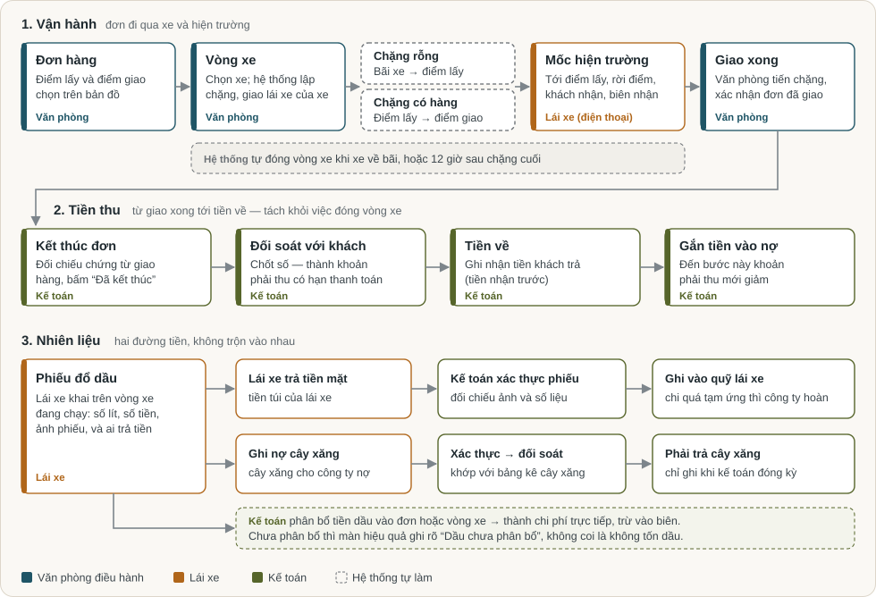

Đọc sơ đồ theo ba dòng.

**Dòng 1: vận hành.** Văn phòng tạo **đơn hàng** và chọn điểm lấy, điểm giao trên bản đồ.

Khi chọn xe, hệ thống lập một **vòng xe**:

- **chặng rỗng**: từ bãi xe tới điểm lấy hàng, chỉ có khi xe chưa đứng sẵn ở đó;
- **chặng có hàng**: từ điểm lấy tới điểm giao.

Lái xe của xe đó nhận việc ngay trên điện thoại, không phải tự đi nhận. Ở hiện trường, lái xe bấm các mốc và chụp biên nhận. Đây là **bằng chứng**; mốc lái xe bấm không tự đẩy tiến độ.

Văn phòng xem bằng chứng, tiến từng chặng, rồi **xác nhận đơn đã giao xong**.

**Việc đóng vòng xe do hệ thống tự quyết**, không ai phải bấm. Hệ thống đóng khi chặng cuối kết thúc ở bãi xe. Nếu xe không về bãi, hệ thống đóng sau thời gian nghỉ công ty đã khai, hiện là **12 giờ**.

**Dòng 2: tiền thu.** Giao xong chưa phải là nợ của khách. Kế toán lần lượt:

1. đối chiếu chứng từ rồi bấm **“Đã kết thúc”** đơn;
2. **đối soát** với khách, lúc đó mới thành khoản phải thu có hạn thanh toán;
3. ghi **tiền về**;
4. **gắn tiền vào nợ**. Chỉ tới bước này, khoản phải thu mới giảm.

Đóng vòng xe và kết thúc đơn là **hai việc khác nhau**. Việc thứ nhất là chuyện xe, do hệ thống lo. Việc thứ hai là chuyện tiền với khách, do kế toán quyết.

**Dòng 3: nhiên liệu.** Lái xe khai phiếu đổ dầu và chọn ai trả tiền. Hai trường hợp đi hai đường khác nhau (xem mục 6).

---

## 3. Những từ cần biết

| Từ                      | Nghĩa                                                                                                                                           |
| ----------------------- | ----------------------------------------------------------------------------------------------------------------------------------------------- |
| **Đơn hàng**            | Việc công ty nhận với khách: lấy ở đâu, giao ở đâu, cước bao nhiêu. Mọi việc bắt đầu từ đây                                                     |
| **Vòng xe**             | Một lượt đi của một xe để làm đơn. Trên màn hình văn phòng còn gọi là **vòng chạy**. Hiện nay mỗi đơn có một vòng xe riêng                      |
| **Chặng**               | Một đoạn đường trong vòng xe, có điểm đầu và điểm cuối                                                                                          |
| **Chặng rỗng**          | Xe chạy không hàng, ví dụ từ bãi tới điểm lấy. Hệ thống tự lập và tô đỏ để dễ thấy xe chạy rỗng nhiều                                           |
| **Chặng có hàng**       | Xe chở hàng của đơn, từ điểm lấy tới điểm giao                                                                                                  |
| **Kế hoạch vận chuyển** | Danh sách chặng hệ thống đề xuất khi văn phòng chọn xe. Văn phòng xem rồi bấm xác nhận                                                          |
| **Mốc hiện trường**     | Lái xe bấm trên điện thoại: đã tới điểm lấy, đang xếp hàng, rời điểm lấy, đã đến nơi, khách đã nhận hàng. Là bằng chứng, không tự đổi tiến độ   |
| **Phiên chờ**           | Thời gian lái xe chờ người nhận ở điểm giao. Tự kết thúc khi lái xe bấm “Khách đã nhận hàng”                                                    |
| **Hoàn tất chặng**      | Văn phòng xác nhận một chặng đã chạy xong                                                                                                       |
| **Đóng vòng xe**        | Hệ thống tự làm khi xe hết việc và về bãi, hoặc sau thời gian nghỉ                                                                              |
| **Giao xong đơn**       | Văn phòng xác nhận hàng đã tới khách. Việc này không tạo công nợ                                                                                |
| **Kết thúc đơn**        | Kế toán xác nhận đủ căn cứ, và đơn được vào đối soát với khách                                                                                  |
| **Phải thu**            | Tiền khách nợ công ty, chỉ tính sau khi đối soát                                                                                                |
| **Phải trả**            | Tiền công ty nợ đối tác: cây xăng, nhà xe thuê ngoài, hoa hồng nguồn đơn                                                                        |
| **Quỹ lái xe**          | Sổ tiền riêng của từng lái xe với công ty: tạm ứng, tiền lái xe tự trả rồi được hoàn, hoàn quỹ                                                  |
| **Biên trực tiếp**      | Doanh thu trừ chi phí trực tiếp của đơn (dầu, phí…). **Chưa gồm chi phí cố định** như khấu hao, lương văn phòng. Không phải lợi nhuận cuối cùng |
| **Chuyến cũ**           | Chuyến lập tay theo cách làm trước đây. Chỉ còn để khép sổ và vẫn được tính trong báo cáo, không cộng hai lần                                   |

---

## 4. Ai làm gì

| Người                   | Làm gì trong hệ thống                                                                                            |
| ----------------------- | ---------------------------------------------------------------------------------------------------------------- |
| **Văn phòng điều hành** | Tạo đơn trên bản đồ, chọn xe, xác nhận kế hoạch, tiến chặng, xác nhận giao xong                                  |
| **Lái xe**              | Xem việc được giao, bấm mốc, chụp giấy tờ, khai phiếu dầu, xem quỹ và phiếu lương của mình                       |
| **Kế toán**             | Kết thúc đơn, đối soát với khách, ghi tiền về, xác thực phiếu dầu, đối soát bảng kê cây xăng, quỹ lái xe, lương  |
| **Giám đốc**            | Xem tổng hợp mỗi ngày. Làm được mọi việc của văn phòng và kế toán, và thêm các việc chỉ giám đốc được làm        |
| **Hệ thống**            | Lập chặng, giao việc cho lái xe của xe, đóng vòng xe, tính biên trực tiếp, nhắc giấy tờ và bảo dưỡng sắp hết hạn |

Có ba điểm lãnh đạo nên biết.

- **Người quyết, máy ghi.** Máy không tự đánh dấu “giao xong”, không tự “kết thúc đơn”, không tự trừ tiền của ai. Những bước đó luôn có một người bấm, và hệ thống lưu tên người đó cùng giờ bấm.
- **Kế toán thấy cùng danh mục với giám đốc**, nhưng không được làm một số việc:
  - mở lại một kỳ đã chốt, như kỳ chi phí hay kỳ đối soát dầu;
  - xem lịch sử vị trí của lái xe trên bản đồ;
  - vài việc quản trị khác.

  Giới hạn này do máy chủ giữ, không chỉ ẩn trên màn hình.

- **Hiện kế toán cũng tạo đơn và điều xe được.** Nếu công ty muốn tách hẳn việc điều xe khỏi kế toán, cần quyết định (mục 10).

---

## 5. Xem trên màn hình

Hình dưới đây đi theo đúng đường của một đơn hàng. Số khoanh trong hình được giải thích ngay bên dưới hình.

### 5.1. Tổng quan: mở hệ thống ra thấy gì

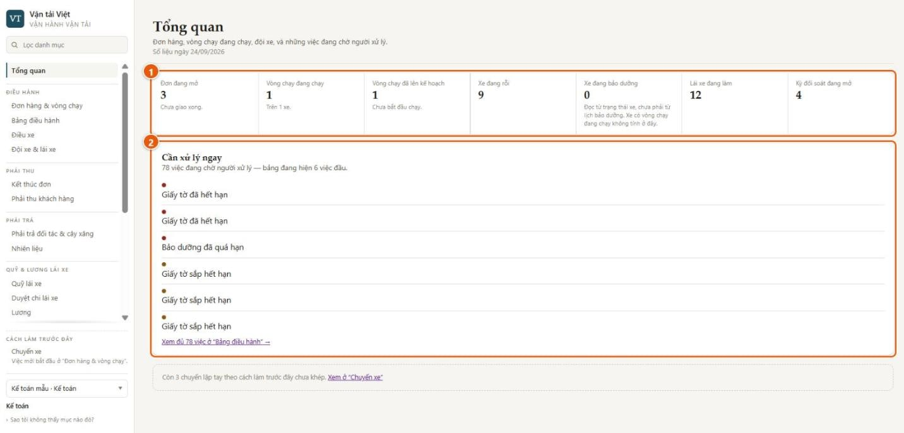

1. **Bảy ô đếm**: đơn đang mở, vòng chạy đang chạy, vòng chạy đã lên kế hoạch, xe rỗi, xe bảo dưỡng, lái xe đang làm, kỳ đối soát đang mở.
2. **Cần xử lý ngay**: việc đang chờ người, ví dụ giấy tờ xe hết hạn, bảo dưỡng quá hạn. Bấm vào để xem đủ danh sách.

Dòng mờ cuối trang nhắc số chuyến cũ chưa khép. Đó là dữ liệu của cách làm trước đây, không phải việc mới.

### 5.2. Tạo đơn trên bản đồ

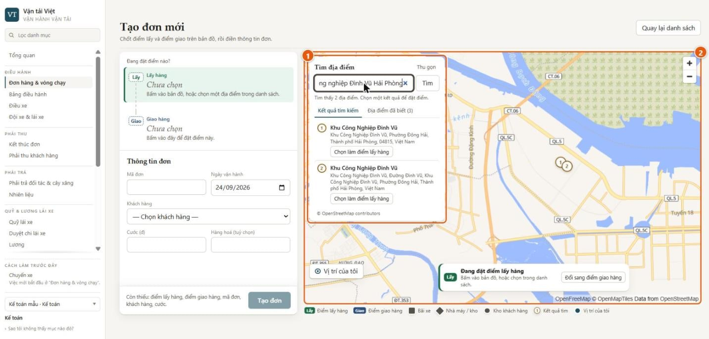

1. **Tìm địa điểm** bằng tiếng Việt, ví dụ “Khu công nghiệp Đình Vũ Hải Phòng”. Kết quả chỉ là gợi ý. Một kết quả chỉ trở thành điểm của đơn khi người tạo đơn bấm chọn.
2. **Bản đồ**: bấm thẳng lên bản đồ để đặt điểm, kéo ghim để chỉnh. Nút **“Vị trí của tôi”** giúp đặt nhanh khi đang đứng tại chỗ. Đây chỉ là gợi ý để chọn điểm, **không phải bằng chứng vị trí**.

Ngoài hai cách trên còn có danh sách **Địa điểm đã biết**, gồm bãi xe, nhà máy, kho của khách. Chọn một lần là xong, không phải gõ lại.

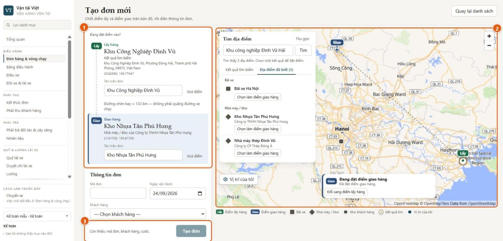

1. **Phiếu tuyến**:
   - Mỗi điểm ghi rõ lấy từ đâu (kết quả tìm, địa điểm đã biết, hay chọn trên bản đồ).
   - Tên in trên đơn sửa được mà không làm dịch điểm.
   - Dòng “Đường chim bay ≈ 133 km” chỉ để tham khảo, **không phải quãng đường xe chạy**.
2. **Hai ghim Lấy và Giao** trên bản đồ, cạnh danh sách địa điểm đã biết.
3. **Nút “Tạo đơn” chỉ mở khi đủ**: hai điểm, mã đơn, khách hàng, cước. Dòng “Còn thiếu” nói rõ còn thiếu gì.

Bản đồ nền là bản đồ mở, không cần tài khoản Google.

### 5.3. Đơn, vòng xe và chặng

Sau khi tạo đơn, văn phòng làm ba bước ngay trên trang đơn:

1. chọn xe;
2. bấm **“Xem kế hoạch”**;
3. bấm **“Xác nhận kế hoạch và giao xe”**.

Lái xe đang gắn với xe được giao việc tự động. Nếu xe chưa có lái xe, hoặc có hai lái xe cùng lúc, hệ thống không cho xác nhận.

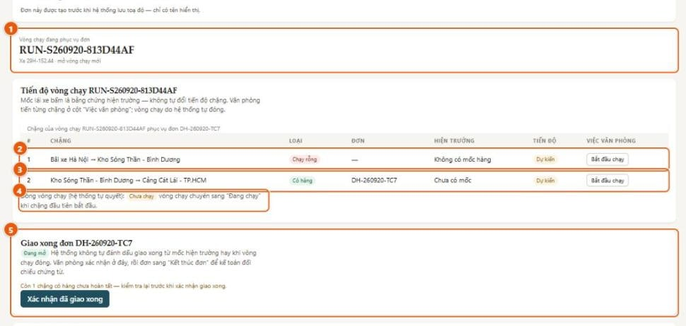

1. **Vòng chạy đang phục vụ đơn**: mã vòng, xe, và cho biết đây là vòng mới hay nối vào vòng đang chạy.
2. **Chặng 1, chạy rỗng**: từ bãi xe tới điểm lấy. Chặng này không có mốc hàng.
3. **Chặng 2, có hàng**: gắn với đơn. Cột “Hiện trường” cho thấy lái xe đã bấm tới đâu. Cột “Việc văn phòng” là nơi văn phòng bấm **“Bắt đầu chạy”**, rồi **“Hoàn tất chặng”**.
   - Nếu hiện trường chưa ghi khách đã nhận mà văn phòng vẫn muốn hoàn tất, phải ghi lý do. Lý do được lưu lại.
4. **Đóng vòng chạy (hệ thống tự quyết)**: chỉ là dòng trạng thái, không có nút.
5. **Giao xong đơn**: văn phòng bấm **“Xác nhận đã giao xong”**.
   - Hệ thống nhắc nếu còn chặng có hàng chưa hoàn tất.
   - Việc này không đóng vòng xe và không tạo công nợ.

Đơn trong hình được tạo trước khi có bản đồ, nên dòng trên cùng ghi “chỉ có tên hiển thị”. Đơn mới luôn có điểm trên bản đồ.

### 5.4. Bảng điều hành: xe đang ở bước nào

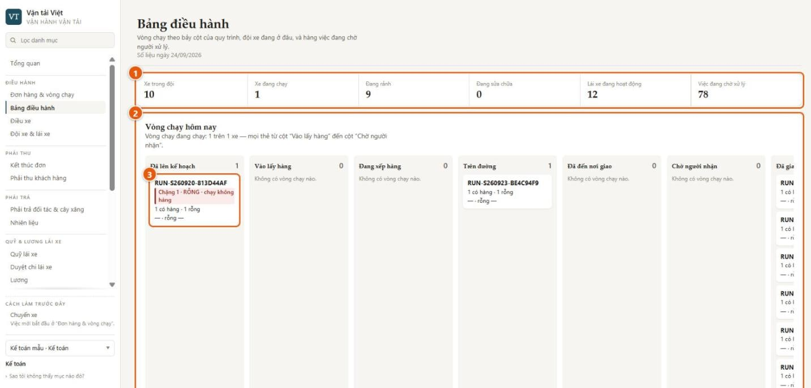

1. **Đội xe hôm nay**: xe trong đội, đang chạy, đang rảnh, đang sửa, lái xe đang hoạt động, việc đang chờ xử lý.
2. **Vòng chạy theo bảy cột của quy trình**:
   1. Đã lên kế hoạch
   2. Vào lấy hàng
   3. Đang xếp hàng
   4. Trên đường
   5. Đã đến nơi giao
   6. Chờ người nhận
   7. Đã giao xong

   Thẻ chuyển cột theo mốc lái xe bấm. Riêng cột cuối nghĩa là **vòng xe đã đóng**, không có nghĩa là đơn đã được xác nhận giao.

3. **Thẻ vòng chạy** cho biết đang ở chặng nào. Chặng rỗng được tô đỏ.

Đây là màn người trực điều hành làm việc cả ngày. Bên dưới bảng là hàng việc đang chờ người xử lý.

### 5.5. Lái xe trên điện thoại

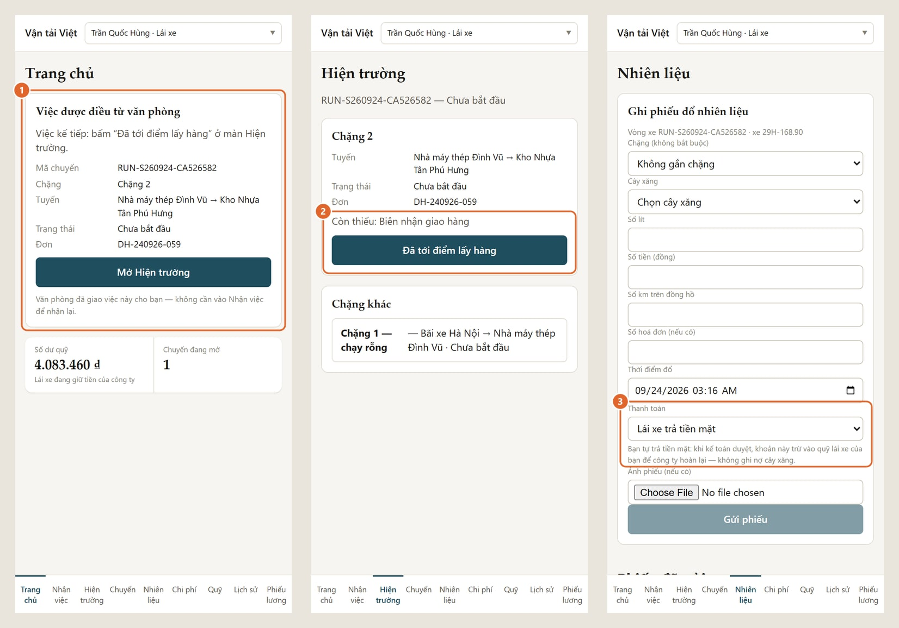

1. **Trang chủ: việc được điều từ văn phòng.** Lái xe thấy ngay:
   - việc kế tiếp phải bấm;
   - tuyến và mã đơn;
   - số dư quỹ của mình.

   Lái xe không phải đi nhận việc lại.

2. **Hiện trường**:
   - Chỉ hiện đúng nút kế tiếp, ở đây là “Đã tới điểm lấy hàng”.
   - Dòng “Còn thiếu” nhắc giấy tờ bắt buộc, hiện là biên nhận giao hàng.
   - Chặng rỗng không có nút nào, vì văn phòng tự tiến chặng đó.
   - Hai mốc “Đã đến nơi” và “Khách đã nhận hàng” lấy vị trí điện thoại ngay lúc bấm. Nếu máy chưa bật định vị, mốc **không được ghi**, và máy nói rõ phải làm gì.
3. **Nhiên liệu: lái xe chọn ai trả tiền.** Máy nói rõ ngay dưới ô chọn tiền sẽ đi đâu (mục 6).

Lái xe có chín mục ở thanh dưới: Trang chủ, Nhận việc, Hiện trường, Chuyến, Nhiên liệu, Chi phí, Quỹ, Lịch sử, Phiếu lương.

Hệ thống cần sóng điện thoại. Nếu mất sóng, lái xe bấm lại khi có sóng; bấm nhiều lần không tạo mốc trùng.

_Hình màn lái xe chụp trên một bản cài riêng của đúng phiên bản phần mềm đang chạy. Giao diện và cách hoạt động giống hệt._

### 5.6. Kết thúc đơn: kế toán nhận bàn giao

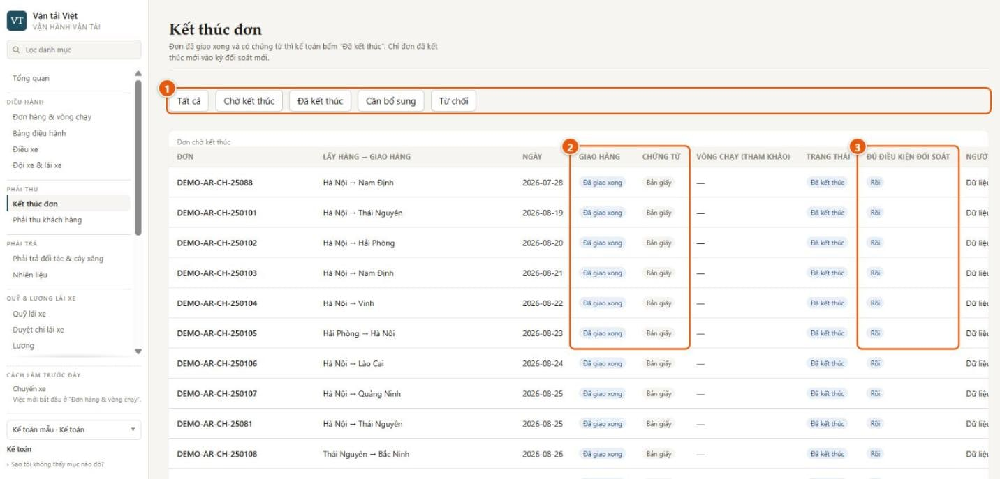

1. **Lọc theo trạng thái**: chờ kết thúc, đã kết thúc, cần bổ sung, từ chối.
2. **Giao hàng và chứng từ**: chỉ đơn đã được văn phòng xác nhận giao xong mới vào đây. Cột “Chứng từ” cho biết có giấy tờ số hay bản giấy.
3. **Đủ điều kiện đối soát**: chỉ đơn đã giao xong **và** đã được kế toán bấm “Đã kết thúc” mới vào kỳ đối soát với khách.

Kế toán có ba lựa chọn cho mỗi đơn: “Đã kết thúc”, “Cần bổ sung”, “Từ chối”. Mỗi quyết định phải có căn cứ:

- hoặc chọn chứng từ số;
- hoặc ghi rõ bên kia đã nhận hay xác nhận gì.

Hệ thống lưu người quyết và giờ máy chủ.

### 5.7. Phải thu khách hàng

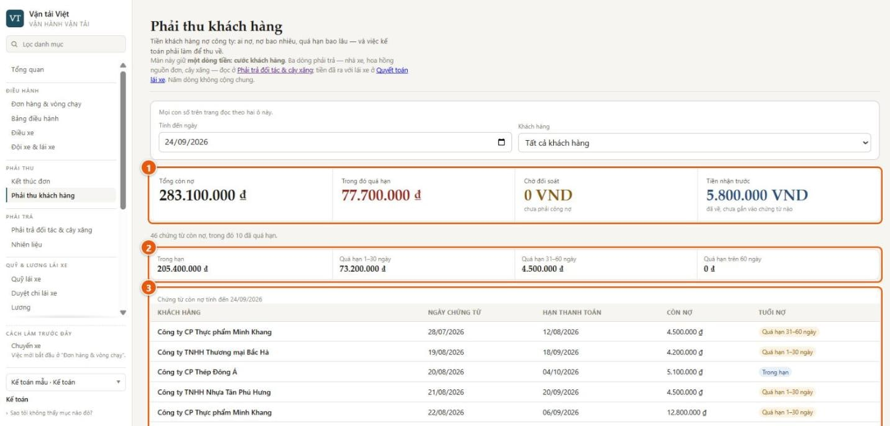

1. **Bốn con số tách bạch**:
   - tổng còn nợ;
   - trong đó quá hạn;
   - chờ đối soát, tức đã giao nhưng **chưa phải công nợ**;
   - tiền nhận trước, tức tiền đã về nhưng chưa gắn vào chứng từ nào.
2. **Tuổi nợ**: trong hạn, quá hạn 1–30 ngày, 31–60 ngày, trên 60 ngày.
3. **Chứng từ còn nợ theo khách**: ngày, hạn thanh toán, còn nợ, tuổi nợ.

Màn này chỉ giữ **một dòng tiền: cước khách hàng**. Tiền nợ cây xăng, nhà xe, hoa hồng nằm ở “Phải trả đối tác & cây xăng”. Tiền với lái xe nằm ở “Quỹ lái xe” và “Quyết toán lái xe”.

### 5.8. Tổng hợp tài chính và biên trực tiếp

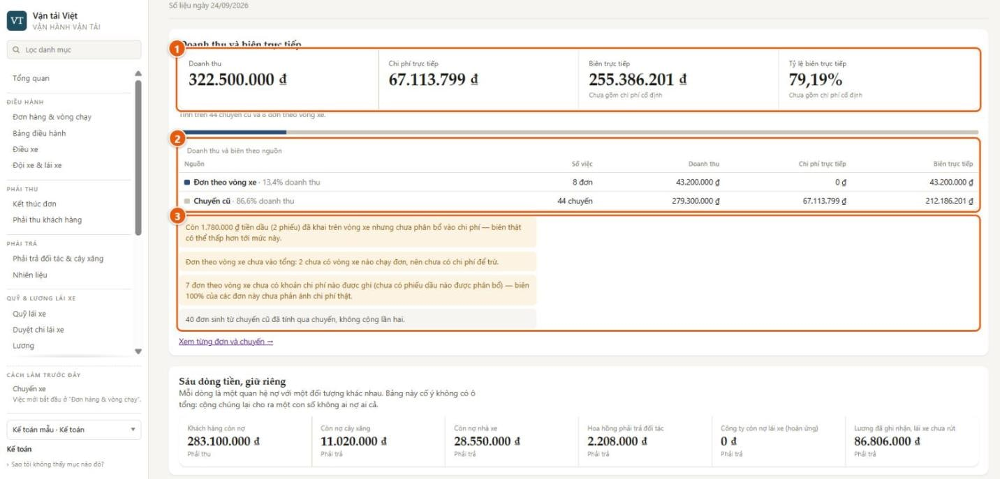

1. **Doanh thu, chi phí trực tiếp, biên trực tiếp**. Biên trực tiếp luôn kèm câu **“Chưa gồm chi phí cố định”**.
2. **Theo nguồn**: đơn theo vòng xe (cách làm hiện nay) và chuyến cũ (cách làm trước đây) nằm cạnh nhau. Một đơn sinh từ chuyến cũ chỉ được tính một lần.
3. **Lưu ý về con số**. Hệ thống tự nói khi con số chưa đủ, thay vì lặng lẽ cho ra số đẹp:
   - “Dầu chưa phân bổ”: có phiếu dầu trên vòng xe nhưng kế toán chưa phân bổ vào chi phí, nên biên thật có thể thấp hơn.
   - “Chưa ghi chi phí”: đơn chưa có khoản chi nào. **Biên 100% ở đây là “chưa ghi chi phí”, không phải “không tốn chi phí”.**

Phía dưới là **sáu dòng tiền, giữ riêng**:

- khách hàng còn nợ;
- còn nợ cây xăng;
- còn nợ nhà xe;
- hoa hồng phải trả đối tác;
- công ty còn nợ lái xe;
- lương đã ghi nhận mà lái xe chưa rút.

Bảng **cố ý không có ô tổng**, vì cộng các dòng này lại cho ra một con số không ai nợ ai cả.

### 5.9. Tổng hợp giám đốc: năm phút mỗi sáng

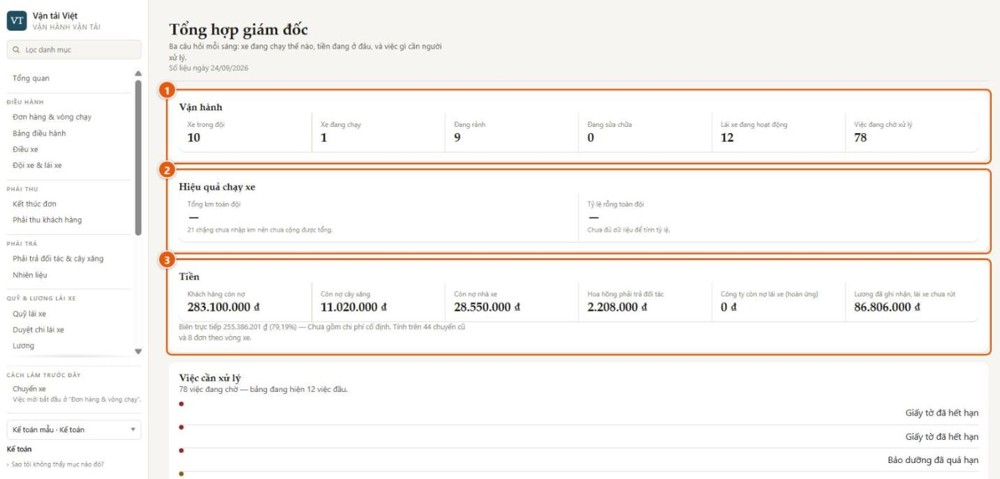

Màn này trả lời ba câu hỏi mỗi sáng.

1. **Xe đang chạy thế nào**: số xe trong đội, đang chạy, đang rảnh, đang sửa, lái xe hoạt động, việc đang chờ.
2. **Hiệu quả chạy xe**: tổng km và tỷ lệ chạy rỗng toàn đội.
   - Trong hình hai ô này đang trống, kèm dòng “21 chặng chưa nhập km nên chưa cộng được tổng”.
   - Lý do: km của chặng theo vòng xe hiện chưa được ghi (mục 9).
3. **Tiền đang ở đâu**: sáu dòng tiền ở mục 5.8, cùng biên trực tiếp và tỷ lệ biên. Luôn kèm câu “chưa gồm chi phí cố định” và số đơn, chuyến đã được tính.

Bên dưới là **việc cần xử lý**.

**Một ngày của giám đốc** đi theo bốn bước:

1. Mở **Tổng hợp giám đốc** và đọc ba khối.
2. Có việc đỏ thì mở **Bảng điều hành** để xem đủ hàng việc và người phải làm.
3. Cần chi tiết tiền thì mở **Phải thu khách hàng** hoặc **Hiệu quả từng chuyến**. Màn thứ hai có một dòng cho mỗi đơn hoặc chuyến, kèm lý do nếu dòng đó chưa đủ số.
4. Cần xem xe đang ở bước nào thì cũng mở **Bảng điều hành**.

---

## 6. Nhiên liệu và quỹ lái xe: hai đường tiền

Khi khai phiếu đổ dầu trên vòng xe, lái xe chọn một trong hai cách thanh toán.

| Cách trả                | Tiền đi đâu                                                                                                                                                         | Ai làm                        |
| ----------------------- | ------------------------------------------------------------------------------------------------------------------------------------------------------------------- | ----------------------------- |
| **Lái xe trả tiền mặt** | Kế toán xác thực phiếu. Số tiền được **trừ vào quỹ của lái xe**, ghi là chi phí của vòng xe, để công ty hoàn lại cho lái xe. **Không** ghi nợ cây xăng              | Lái xe khai, kế toán xác thực |
| **Ghi nợ cây xăng**     | Kế toán nhập bảng kê của cây xăng và cho máy so khớp từng phiếu. Khi kế toán **đóng kỳ**, khoản nợ mới vào **phải trả cây xăng**. **Không** đụng tới quỹ của lái xe | Lái xe khai, kế toán đối soát |

Khi so khớp, hệ thống bắt các chỗ lệch:

- phiếu chỉ có một phía;
- số hoá đơn khác nhau;
- lệch quá dung sai;
- phiếu lái xe đã trả tiền mặt nhưng vẫn xuất hiện trên bảng kê.

Kế toán xử lý từng dòng lệch, kèm lý do. Đây là chỗ chặn thất thoát dầu quan trọng nhất.

Tiền dầu **không tự** vào chi phí của đơn. Kế toán phân bổ phiếu dầu vào vòng xe hoặc chặng. Trước khi phân bổ, màn hiệu quả hiện “Dầu chưa phân bổ”, để không ai nhầm là đơn không tốn dầu.

---

## 7. Bản đồ và vị trí: dùng để làm gì

- **Bản đồ để chọn đúng điểm.** Điểm lấy và giao là một vị trí trên bản đồ. Tên chỉ để đọc cho dễ. Nhờ vậy hệ thống tính được chặng rỗng từ bãi tới điểm lấy mà không phải đoán từ chữ.
- **Tìm địa điểm theo tên** dựa trên dữ liệu bản đồ công cộng. Đây là tiện ích và có thể tắt khi chạy với dữ liệu thật của công ty. Khi đó bản đồ, danh sách địa điểm đã biết và nút “Vị trí của tôi” vẫn dùng được.
- **“Vị trí của tôi” lúc tạo đơn chỉ là gợi ý**, không phải bằng chứng xe đã ở đó.
- **Bằng chứng vị trí** là vị trí điện thoại lái xe gửi lên đúng lúc bấm “Đã đến nơi” và “Khách đã nhận hàng”.
- Hệ thống **chưa** theo dõi liên tục cả hành trình, và **chưa** nối với thiết bị giám sát hành trình gắn trên xe.

---

## 8. Lái xe không nhìn thấy tiền của công ty

Màn hình lái xe **không có** cước vận chuyển, doanh thu, biên, hay công nợ của khách. Lái xe chỉ thấy:

- việc được giao;
- quỹ của chính mình;
- phiếu dầu của chính mình;
- phiếu lương của chính mình.

Giới hạn này do máy chủ giữ. Lái xe có cố mở đường khác thì máy chủ cũng không trả những số đó về.

---

## 9. Hạn chế hiện tại

Chỉ ghi những điều có ảnh hưởng tới quyết định. Các điểm dưới đây đều đã được ghi nhận để sửa.

### Ảnh hưởng tới tiền

| Hạn chế                                                                                                                          | Ảnh hưởng                                                                  | Làm tạm                                                      |
| -------------------------------------------------------------------------------------------------------------------------------- | -------------------------------------------------------------------------- | ------------------------------------------------------------ |
| Lái xe **chưa ghi được chi phí dọc đường** (cầu đường, bốc xếp, bến bãi, sửa dọc đường) cho vòng xe. Hiện chỉ phiếu dầu ghi được | Các khoản này chưa vào chi phí của đơn, nên biên trực tiếp cao hơn thực tế | Theo dõi riêng cho tới khi sửa                               |
| **Km của chặng theo vòng xe chưa được ghi**                                                                                      | Tổng km và tỷ lệ chạy rỗng chỉ có từ chuyến cũ hoặc để trống               | Đọc km theo chuyến cũ; chờ quyết định lấy km từ đâu (mục 10) |
| **Lương theo chuyến và theo km chưa tính việc theo vòng xe**                                                                     | Phiếu lương của lái xe chạy theo vòng xe chỉ có lương cơ bản               | Nếu trả theo chuyến hoặc km, kế toán cộng tay phần này       |

### Ảnh hưởng tới vận hành

| Hạn chế                                                                                                                               | Ảnh hưởng                                       | Làm tạm                         |
| ------------------------------------------------------------------------------------------------------------------------------------- | ----------------------------------------------- | ------------------------------- |
| Ở **Kết thúc đơn**, chọn chứng từ số bằng chuột chưa được                                                                             | Kế toán ghi rõ đã nhận giấy gì thay vì chọn tệp | Quyết định vẫn lưu người và giờ |
| Vòng xe giao xong xa bãi được **giữ mở tới 12 giờ**. Trong thời gian đó, cùng lái xe **không ghi được hai mốc giao hàng** của đơn mới | Một lái xe khó làm hai đơn liền trong ngày      | Giao đơn kế tiếp cho xe khác    |
| **Tự đóng vòng xe sau 12 giờ nghỉ** đã được cài nhưng **chưa quan sát** trên bản đang chạy. Đóng khi xe về bãi thì đã chạy thật       | Có thể thấy vòng xe ở trạng thái “Đang giữ” lâu | Không cần làm gì; đang theo dõi |
| Một số việc văn phòng **chưa có nút**: huỷ đơn, đóng phiên chờ thay lái xe, duyệt phụ cấp chờ, ghi nhận lái xe đã nộp biên nhận giấy  | Các việc này phải xử lý ngoài hệ thống          | Ghi chú lại cho tới khi có nút  |
| Lái xe **chưa xem được lịch sử vòng xe đã xong**. Mục “Chuyến” và “Lịch sử” chỉ có chuyến cũ                                          | Lái xe hỏi lại văn phòng khi cần                | —                               |

### Ngoài phạm vi đợt này

- **Mỗi đơn một vòng xe.** Chưa gom nhiều đơn lên một vòng xe.
- **Chưa nối thiết bị giám sát hành trình trên xe.** Vị trí chỉ lấy lúc lái xe bấm hai mốc giao hàng.
- **Phí đường bộ tự động (ETC)** chưa nằm trong đợt này.
- **Tìm địa điểm theo tên** có thể tắt khi chạy dữ liệu thật (mục 7).

---

## 10. Điều cần lãnh đạo quyết trước khi chạy dữ liệu thật

1. **Lương lái xe cho việc theo vòng xe tính theo gì?**
   - Theo vòng xe, theo đơn giao xong, hay theo chặng có hàng?
   - Chặng rỗng có tính km không?
2. **Km lấy từ đâu?** Đồng hồ xe, bản đồ, hay nhập tay. Câu trả lời quyết định cả lương theo km lẫn báo cáo chạy rỗng.
3. **Một xe chạy nhiều đơn liên tiếp trong ngày có phổ biến không?** Nếu có, cần hai việc:
   - ưu tiên sửa hạn chế “giữ mở 12 giờ”;
   - cân nhắc gom nhiều đơn lên một vòng xe.
4. **Thời gian nghỉ 12 giờ để tự đóng vòng xe có hợp lý không?**
5. **Danh sách bãi xe, nhà máy, kho của khách cần nhập sẵn**, vì tìm địa điểm theo tên có thể tắt.
6. **Ai được tạo đơn và điều xe.** Hiện kế toán cũng làm được.

---

_Tài liệu cũ trong thư mục này (“Bắt đầu nhanh”, “Kịch bản demo”, “Vận hành bản demo”) viết theo cách làm dựa trên chuyến. Khi nội dung khác nhau, tài liệu này là bản đúng._
