# Hướng dẫn cho kế toán

**Vận tải Việt** · Bản tháng 9/2026

Kế toán vào hệ thống để xử lý **phần tiền** của những việc vận tải đã đủ điều kiện. Ba nguyên tắc:

- **Không sửa lịch sử hiện trường thay lái xe.** Mốc và ảnh lái xe gửi là bằng chứng; kế toán đọc chúng, không ghi đè.
- **Con số chưa đủ phải hiện là chưa đủ.** Hệ thống ghi rõ "Chưa ghi chi phí", "Dầu chưa phân bổ", "Chưa biết"; đừng hiểu các chữ đó là 0.
- **Mỗi quyết định có người và giờ.** Kết thúc đơn, đối soát, xác thực phiếu, đóng kỳ đều lưu tên người bấm và giờ máy chủ.

Hình trong tài liệu là dữ liệu mẫu. Tài liệu chung về cách cả công ty dùng hệ thống: [Giới thiệu hệ thống cho lãnh đạo](gioi-thieu-he-thong-cho-lanh-dao.md).

---

## 1. Đầu ngày: xem việc cần xử lý

Mở ba chỗ, theo thứ tự:

1. **Kết thúc đơn**, bấm lọc **"Chờ kết thúc"**. Đây là những đơn văn phòng đã xác nhận giao xong và đang chờ kế toán.
2. **Nhiên liệu**, xem nhãn **"… chờ xác thực"** ở khối "Phiếu nhiên liệu". Đây là phiếu dầu lái xe vừa khai.
3. **Phải thu khách hàng**, xem ô **"Chờ đối soát"** và **"Trong đó quá hạn"**.

**Bảng điều hành** còn một hàng việc chung cho cả công ty. Ngoài giấy tờ xe và bảo dưỡng, hàng này có cả việc của kế toán: phiếu dầu chờ xác thực, kỳ đối soát bảng kê còn mở, quỹ lái xe âm, đề nghị chi chờ duyệt.

---

## 2. Kết thúc đơn

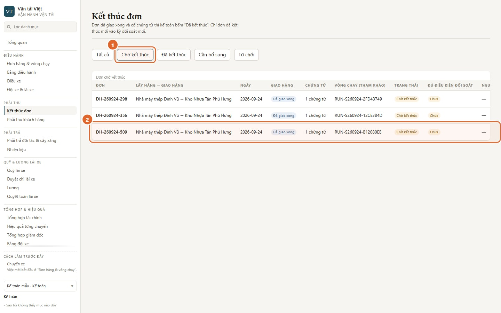

1. Lọc **"Chờ kết thúc"**.
2. Mỗi dòng là một đơn đã giao xong. Dòng cho biết:
   - số chứng từ đã ghi cho đơn; "Bản giấy" nghĩa là chưa có chứng từ nào được ghi;
   - vòng xe đã chạy đơn, chỉ để tham khảo.

**Đơn chỉ vào hàng này khi văn phòng đã bấm "Xác nhận đã giao xong".** Không thấy một đơn thì hỏi điều hành trước.

**Kế toán kiểm gì:**

- biên nhận giao hàng có chữ ký người nhận;
- số lượng khớp đơn;
- các giấy tờ công ty yêu cầu.

Hiện **chưa có chỗ mở ảnh** biên nhận lái xe gửi từ màn này: danh sách chứng từ nằm sau hộp xác nhận (xem hạn chế bên dưới). Cần xem ảnh thì hỏi điều hành.

**Quyết định** nằm ở cột "Kết thúc", bên phải bảng; kéo ngang nếu màn hẹp. Có ba lựa chọn:

- **Đã kết thúc**: đủ căn cứ. Đơn được vào đối soát với khách, nếu đơn đã có khách hàng và giá cước.
- **Cần bổ sung**: thiếu giấy tờ. Đơn nằm ở lọc "Cần bổ sung"; khi đủ giấy tờ, kế toán quyết định lại.
- **Từ chối**: không chấp nhận.

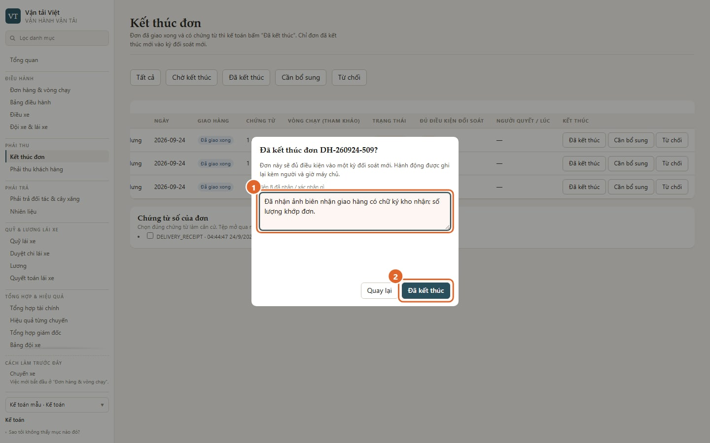

1. Ghi rõ **bên kia đã nhận hay xác nhận gì**. Ô này bắt buộc khi không chọn chứng từ số.
2. Bấm **"Đã kết thúc"**.

> **Hạn chế hiện tại.** Danh sách chứng từ số của đơn đang nằm **phía sau** hộp xác nhận, nên chưa bấm chuột chọn được. Trong lúc chờ sửa, kế toán ghi rõ đã nhận giấy gì vào ô ở số 1. Quyết định vẫn được lưu kèm người và giờ.

**Sau bước này**, đơn sang **Phải thu khách hàng**, dòng **"Chờ đối soát"**. Lúc này nó **chưa phải công nợ**.

---

## 3. Phải thu khách hàng

Màn này chỉ giữ **một dòng tiền: cước khách hàng**. Tiền phải trả đối tác và tiền với lái xe nằm ở màn khác, và không bao giờ cộng chung vào đây.

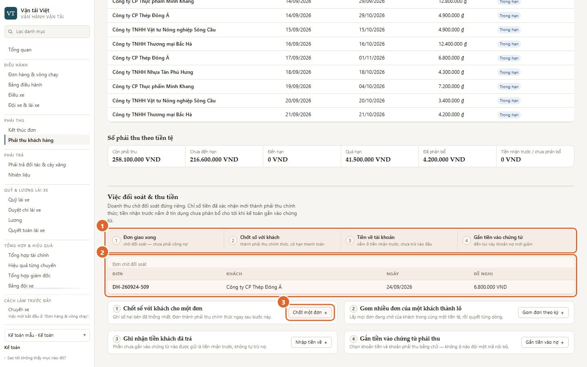

1. **Đường đi của một đồng tiền**, bốn bước:
   1. đơn giao xong;
   2. chốt số với khách;
   3. tiền về;
   4. gắn tiền vào chứng từ.
2. **Đơn chờ đối soát**: đơn đã kết thúc, chưa thành phải thu.
3. Bấm **"Chốt một đơn"** để bắt đầu.

### 3a. Chốt số với khách

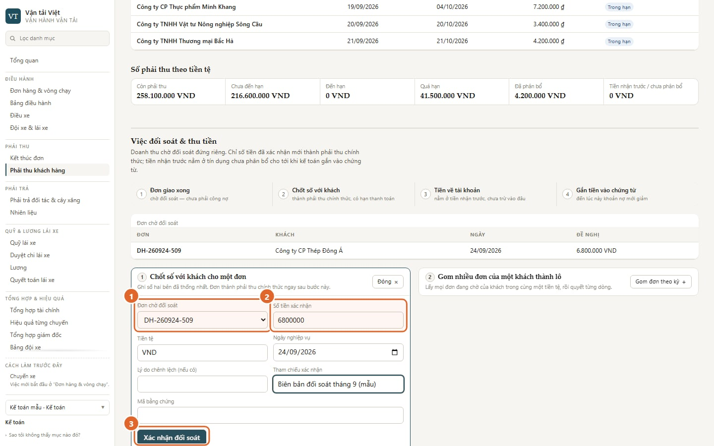

1. Chọn **đơn chờ đối soát**.
2. Nhập **số tiền hai bên đã thống nhất**. Nếu khác số đề nghị, ghi lý do chênh lệch.
3. Bấm **"Xác nhận đối soát"**.

Đơn thành **phải thu chính thức**. Hạn thanh toán được tính nếu khách đã cài điều khoản thanh toán; chưa cài thì chứng từ không có hạn.

Nhiều đơn của cùng một khách thì dùng **"Gom đơn theo kỳ"**. Lô lấy **mọi** đơn đang chờ của khách đó trong cùng tiền tệ; ô ngày chỉ để ghi, không lọc. Mỗi dòng chỉ có hai lựa chọn: **"Xác nhận số đề nghị"** hoặc **"Hoãn đối soát"**. Số khác đề nghị thì hoãn dòng đó, rồi dùng "Chốt một đơn".

### 3b. Ghi nhận tiền khách trả

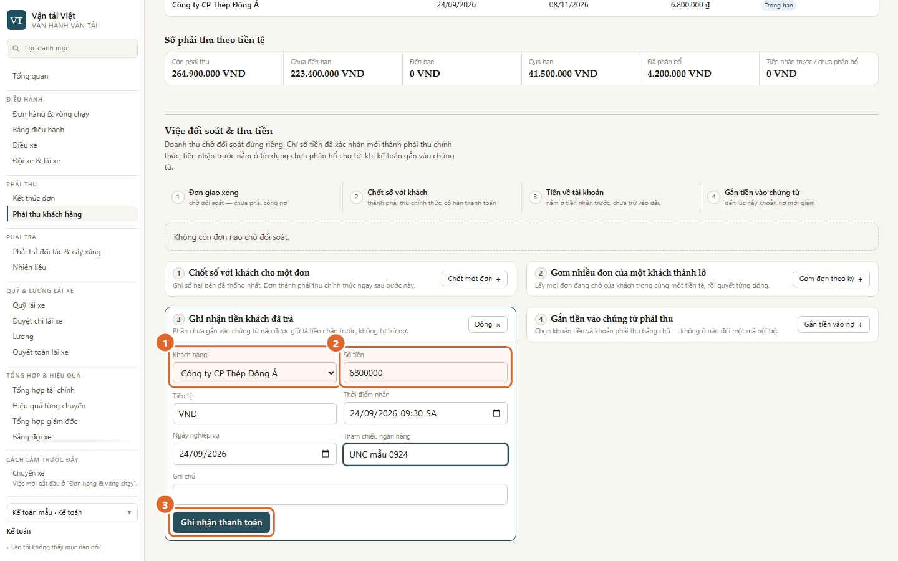

1. Chọn **khách hàng**.
2. Nhập **số tiền** và **thời điểm nhận**; cả hai bắt buộc. Tham chiếu ngân hàng không bắt buộc nhưng nên điền.
3. Bấm **"Ghi nhận thanh toán"**.

Tiền này nằm ở **"Tiền nhận trước"**. Nó **chưa trừ vào nợ nào**.

### 3c. Gắn tiền vào nợ

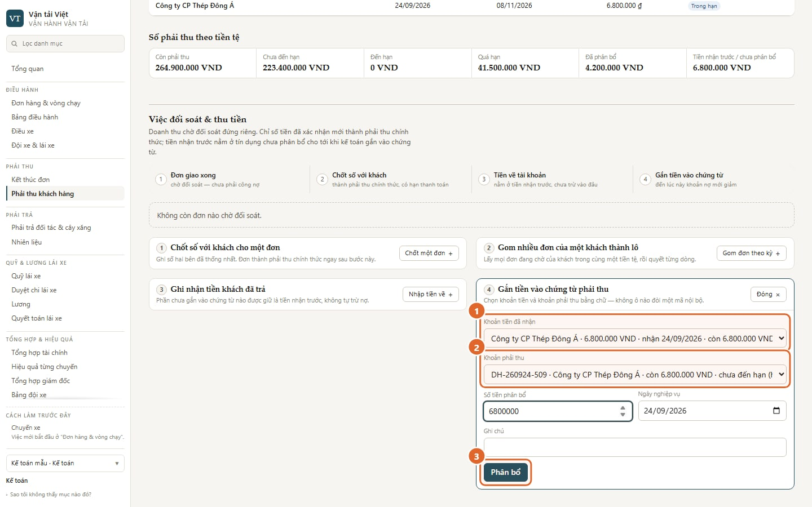

1. Chọn **khoản tiền đã nhận**.
2. Chọn **khoản phải thu**. Cả hai ô đều chọn bằng chữ, không phải gõ mã nội bộ.
3. Nhập số tiền, bấm **"Phân bổ"**.

**Chỉ tới bước này, khoản phải thu mới giảm.** Phần tiền chưa gắn vẫn nằm ở tiền nhận trước.

Phía trên màn luôn có bốn ô: tổng còn nợ, trong đó quá hạn, chờ đối soát, tiền nhận trước. Bên dưới là tuổi nợ và danh sách chứng từ còn nợ theo khách.

---

## 4. Phải trả đối tác và cây xăng

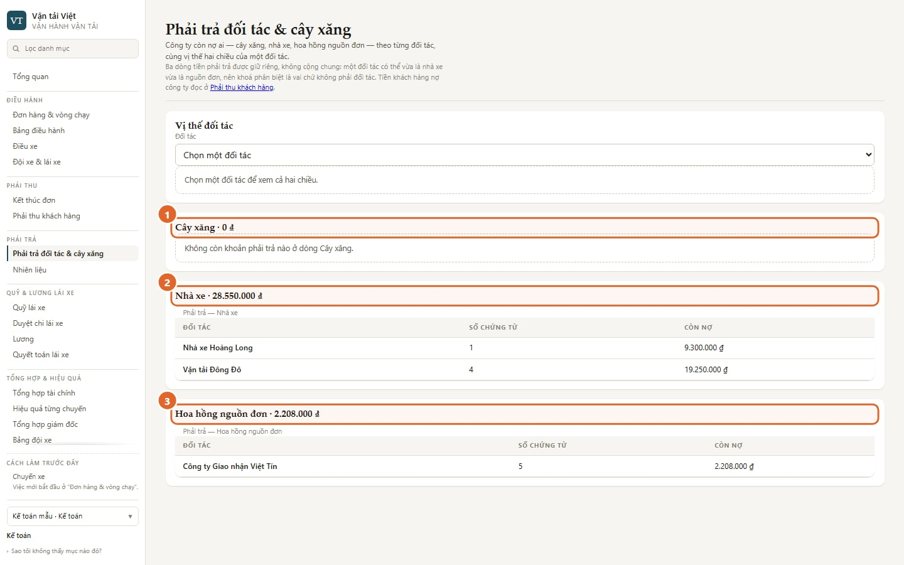

Ba dòng phải trả, **giữ riêng**:

1. **Cây xăng**: khoản nợ cây xăng. Nó chỉ phát sinh khi kế toán **đóng kỳ đối soát bảng kê** (mục 5).
2. **Nhà xe**: cước thuê xe ngoài.
3. **Hoa hồng nguồn đơn**: hoa hồng phải trả đối tác giới thiệu đơn.

"Vị thế đối tác" đặt hai chiều cạnh nhau: họ nợ mình, và mình nợ họ. Phần này **chỉ để xem**. Hệ thống không tự bù trừ.

Phí đường bộ tự động (ETC) nằm ngoài phạm vi đợt này, nên không có trong danh mục.

---

## 5. Nhiên liệu

### 5a. Xác thực phiếu dầu

Mở **Nhiên liệu**. Khối "Phiếu nhiên liệu" lọc được theo mã vòng xe, trạng thái xác thực, trạng thái đối soát và ngày. Bấm một dòng để mở phiếu: ảnh chứng từ, số lít, số tiền, km, ai trả tiền.

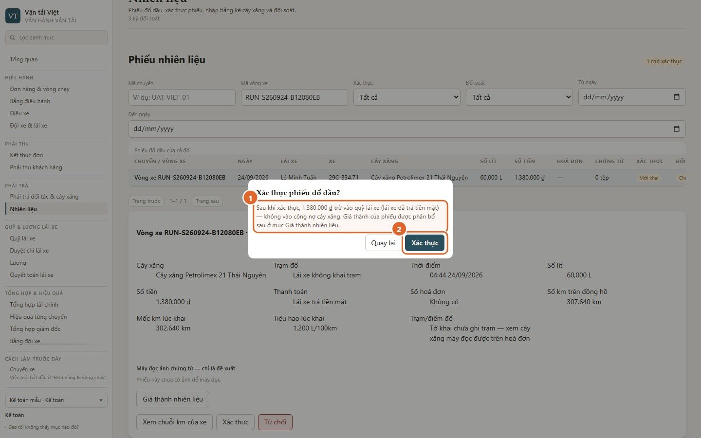

1. Hộp xác nhận nói rõ **tiền đi đâu**, tuỳ cách lái xe đã trả:
   - **Lái xe trả tiền mặt**: số tiền trừ vào **quỹ lái xe**, không vào công nợ cây xăng.
   - **Ghi nợ cây xăng**: phiếu vào kỳ đối soát bảng kê. Công nợ cây xăng chỉ ghi khi **đóng kỳ**.
2. Bấm **"Xác thực"**.

Ba việc còn lại trên một phiếu:

- **Từ chối**: phải ghi lý do. Lái xe đọc được lý do và nộp lại.
- **Cho nộp lại**: đưa phiếu về trạng thái chờ xác thực.
- **Xem chuỗi km của xe**: kiểm tiêu hao theo km.

### 5b. Phân bổ giá thành dầu vào vòng xe

Tiền dầu trên vòng xe **không tự** vào chi phí của đơn. Sau khi phiếu **đã xác thực**, trong phiếu mở **"Giá thành nhiên liệu"**. Phiếu gắn chuyến theo cách cũ thì tự vào chi phí chuyến khi xác thực, không phân bổ ở đây.

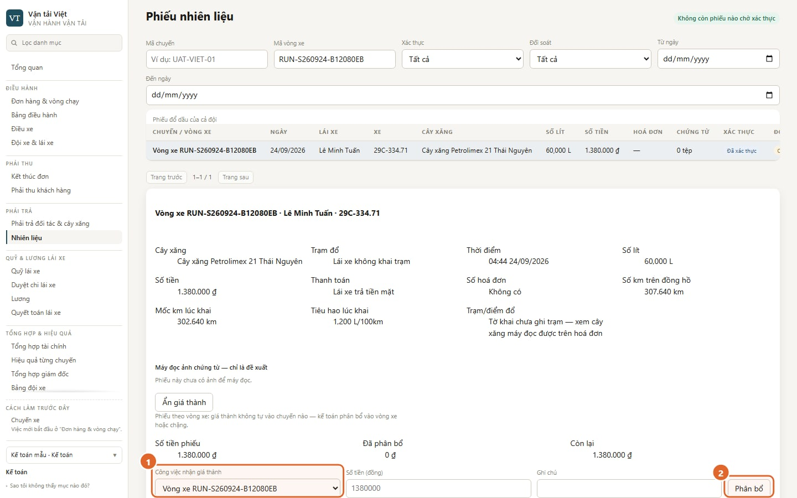

1. Chọn **công việc nhận giá thành**: vòng xe hoặc chặng.
2. Bấm **"Phân bổ"**.

Chưa phân bổ thì màn hiệu quả ghi **"Dầu chưa phân bổ"** (mục 8).

### 5c. Nhập bảng kê và đối soát với cây xăng

1. Ở **"Nhập bảng kê cây xăng"**, bấm **"Mở biểu nhập"** và chọn:
   - cây xăng;
   - từ ngày, đến ngày;
   - định dạng tệp;
   - tệp bảng kê.
2. Bấm **"Xem trước"**. Bước này chưa ghi gì.
3. Bấm **"Nhập bảng kê"**. Hệ thống tạo **kỳ đối soát** cho khoảng thời gian đó.

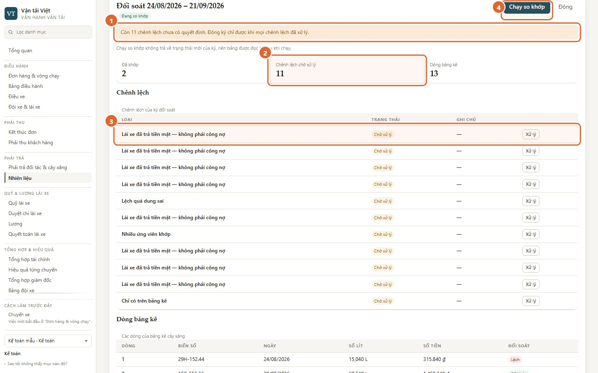

1. **Đóng kỳ chỉ được khi mọi chênh lệch đã xử lý.**
2. Số **chênh lệch chờ xử lý**.
3. Mỗi dòng chênh lệch có nút **"Xử lý"**. Các loại chênh lệch:
   - nhiều ứng viên khớp;
   - chỉ có trên bảng kê;
   - chỉ có phiếu nội bộ;
   - lệch quá dung sai;
   - số hoá đơn hai bên khác nhau;
   - lái xe đã trả tiền mặt, nên không phải công nợ;
   - phiếu sinh từ chính bảng kê.
4. **"Chạy so khớp"**: chạy lại khi có thêm phiếu trong khoảng ngày của kỳ, ví dụ lái xe vừa khai hoặc nộp lại và kế toán vừa xác thực. Không nhập thêm bảng kê vào một kỳ đã có được, và chưa có màn nào sửa số trên phiếu.

Cách xử lý một dòng: chấp nhận số của cây xăng, từ chối dòng bảng kê, xác nhận cặp khớp, bỏ qua, hoặc yêu cầu sửa phiếu. Hệ thống **không bắt** ghi lý do khi bỏ qua; kế toán nên tự ghi vào ô "Ghi chú".

Khi kế toán **đóng kỳ**, khoản nợ cây xăng mới vào **Phải trả đối tác và cây xăng**. **Mở lại kỳ đã đóng chỉ giám đốc làm được.**

> Một dòng lệch **không** tự trừ vào quỹ hay lương của lái xe. Nếu cần quy trách nhiệm, đó là quyết định của người, làm ngoài bước so khớp.

---

## 6. Quỹ lái xe và duyệt chi

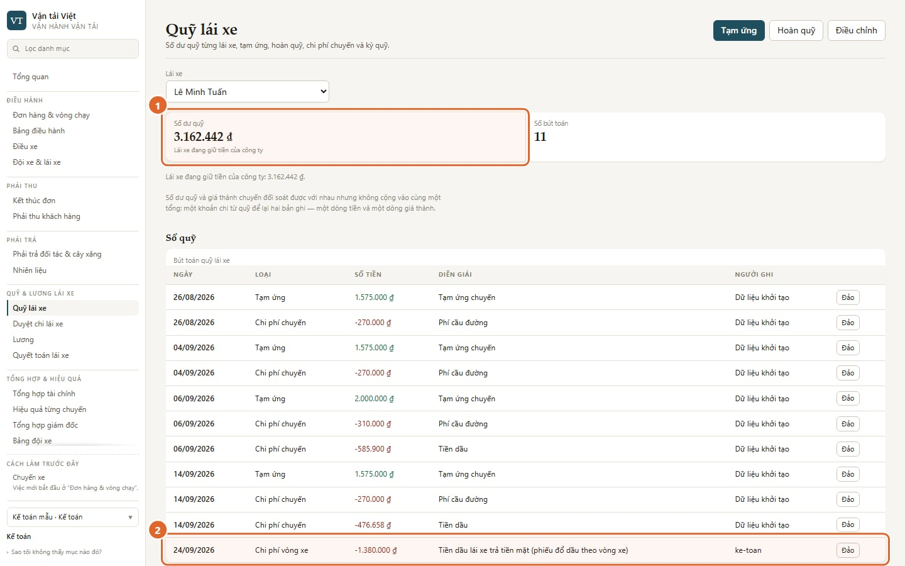

1. **Số dư quỹ** của lái xe đang chọn, kèm ý nghĩa: lái xe đang giữ tiền công ty, đã cân bằng, hay công ty đang nợ lái xe.
2. **Chi phí vòng xe**: dòng sinh ra khi kế toán xác thực một phiếu dầu **lái xe trả tiền mặt**.

Các nút ở góc trên:

- **Tạm ứng**: đưa tiền cho lái xe.
- **Hoàn quỹ**: lái xe trả lại tiền thừa.
- **Điều chỉnh**: sửa số khi cần.

Một dòng ghi sai thì bấm **"Đảo"** trên dòng đó. Hệ thống không xoá dòng; nó ghi một dòng đảo ngược.

**Phân biệt với nhiên liệu cây xăng:** phiếu **ghi nợ cây xăng** không bao giờ đụng tới quỹ lái xe. Nó đi qua kỳ đối soát bảng kê (mục 5c).

**Duyệt chi lái xe**: hiện chưa có màn nào gửi đề nghị vào đây, nên danh sách thường trống. Khoản chi lái xe ghi trên điện thoại (chỉ cho chuyến theo cách cũ) vào **thẳng quỹ**, không qua duyệt. Khoản chi dọc đường của việc theo vòng xe **chưa có chỗ ghi** vào chi phí; lái xe báo văn phòng, và kế toán chỉ phản ánh được vào quỹ bằng "Điều chỉnh".

---

## 7. Lương và quyết toán lái xe

- **Lương**: mở một kỳ lương (tên kỳ, từ ngày, đến ngày), bấm **"Chạy tính lương"**, **"Duyệt"** từng phiếu, **"Chi trả"** khi đã trả, rồi **"Chốt kỳ"**. Lái xe thấy phiếu ngay khi phiếu được duyệt; phiếu tạm tính thì không thấy.
- **Quyết toán lái xe**: theo từng lái xe, gồm Đã ghi nhận, Đã chi, Còn lại, và hoàn ứng công ty còn nợ. Đây cũng là nơi **"Ghi một lần chi"** (lương tháng và/hoặc hoàn ứng, chuyển khoản hay tiền mặt) và đảo một lần chi ghi sai.

> **Hạn chế hiện tại.** Phần lương **theo chuyến** và **theo km** chỉ đếm chuyến theo cách làm cũ, chưa đếm việc theo vòng xe. Nếu công ty trả lương theo chuyến hoặc km, kế toán cộng tay phần việc theo vòng xe cho tới khi hệ thống sửa.

---

## 8. Tổng hợp tài chính và hiệu quả từng đơn

**Tổng hợp tài chính** cho cả công ty:

- doanh thu, chi phí trực tiếp, **biên trực tiếp** — luôn kèm câu "chưa gồm chi phí cố định";
- **sáu dòng tiền giữ riêng**, không có ô tổng.

Mỗi dòng tiền mở sang màn chi tiết của nó. Tổng hợp giám đốc chỉ lấy lại các con số này, đặt cạnh tình hình xe chạy.

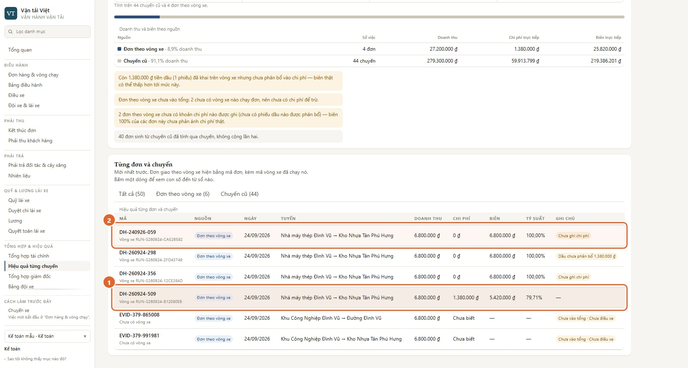

Mở **Hiệu quả từng chuyến** và lọc **"Đơn theo vòng xe"**:

1. Đơn đã **phân bổ dầu** có chi phí dầu và biên trực tiếp tương ứng. Con số vẫn chưa gồm cầu đường, lương và chi phí cố định.
2. Đơn **"Chưa ghi chi phí"** hiện biên 100%. Con số đó có nghĩa **chưa ghi chi phí**, không có nghĩa không tốn chi phí.

Nhãn **"Dầu chưa phân bổ …"** nghĩa là có phiếu dầu trên vòng xe mà chưa phân bổ. Biên thật có thể thấp hơn tới mức số tiền đó.

---

## 9. Các tình huống thường gặp

| Bạn thấy                                   | Nghĩa là                                                         | Làm gì                                      |
| ------------------------------------------ | ---------------------------------------------------------------- | ------------------------------------------- |
| Đơn không có trong "Kết thúc đơn"          | Văn phòng chưa xác nhận giao xong                                | Hỏi điều hành                               |
| Đơn không có trong "Chờ đối soát"          | Chưa bấm "Đã kết thúc", hoặc đơn chưa có khách hàng hay giá cước | Quay lại mục 2                              |
| Bấm nút thì trình duyệt nhắc "điền ô này"  | Còn ô bắt buộc chưa điền, ví dụ "Thời điểm nhận" khi ghi tiền về | Điền đủ các ô, bấm lại                      |
| "Cần ghi lý do trước khi xác nhận"         | Hộp xác nhận này bắt buộc ghi lý do hoặc căn cứ                  | Ghi rõ đã nhận gì                           |
| Không đóng được kỳ đối soát                | Còn chênh lệch chưa xử lý                                        | Xử lý hết các dòng "Chờ xử lý"              |
| Cần mở lại một kỳ đã đóng                  | Chỉ giám đốc làm được                                            | Báo giám đốc, kèm lý do                     |
| "Chưa ghi chi phí" hoặc "Dầu chưa phân bổ" | Con số chưa đủ                                                   | Phân bổ dầu (mục 5b); đừng coi biên là thật |
| Màn báo lỗi đọc dữ liệu                    | Mất kết nối hoặc máy chủ chưa trả lời                            | Bấm "Thử lại". Không nhập lại số tay        |

Không có đường tắt nào bỏ qua các bước trên. Mọi quyết định đều qua đúng màn hình, để còn lại dấu người và giờ.
