# Hướng dẫn cho lái xe

**Vận tải Việt** · Bản tháng 9/2026 · Đọc trên điện thoại

- Văn phòng **giao việc** cho bạn. Việc hiện ngay trên điện thoại.
- Ở hiện trường, bạn **bấm mốc** và **chụp giấy tờ**. Văn phòng nhìn thấy những gì bạn bấm.
- Điện thoại cần **có sóng** và **bật định vị**.

Hình trong tài liệu là dữ liệu mẫu, không phải việc thật.

---

## 1. Trang chủ: xem việc được giao

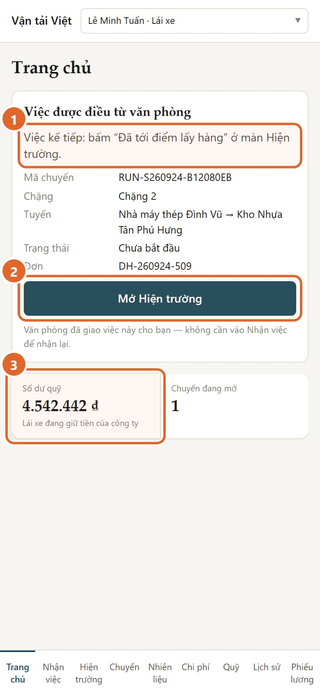

1. **Việc kế tiếp**: nút nào cần bấm, và bấm ở màn nào.
2. **Mở Hiện trường**: vào màn bấm mốc.
3. **Số dư quỹ** của bạn.

Việc văn phòng đã giao thì bạn **không cần** vào "Nhận việc" để nhận lại. "Nhận việc" chỉ dùng khi bạn đã tới điểm lấy hàng mà văn phòng chưa giao việc.

---

## 2. Hiện trường: chặng của bạn

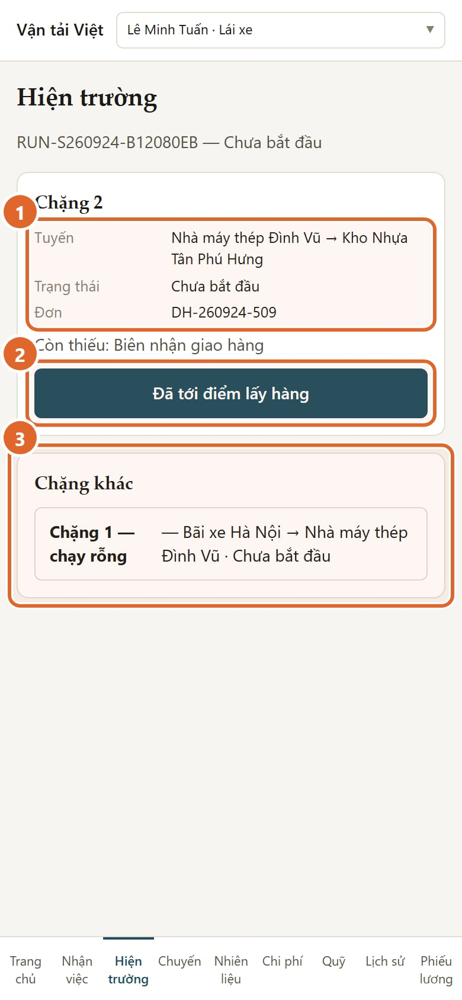

1. **Chặng đang làm**: tuyến, trạng thái, mã đơn.
2. **Nút bấm được lúc này**. Màn chỉ hiện những nút đúng bước.
3. **Chặng khác**: chặng chạy rỗng.

**Chặng rỗng** là đoạn xe chạy **không chở hàng**, ví dụ từ bãi tới điểm lấy. Chặng này không có nút nào. Văn phòng tự cho chạy và hoàn tất. Dòng của nó có thể vẫn ghi "Chưa bắt đầu"; bạn không cần làm gì.

**Chặng có hàng** là đoạn xe **chở hàng của đơn**, từ điểm lấy tới điểm giao. Mọi nút bạn bấm đều ở chặng này.

---

## 3. Tới điểm lấy hàng

Bấm **"Đã tới điểm lấy hàng"**. Màn hiện ba nút:

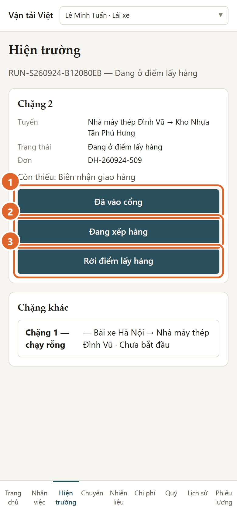

1. **Đã vào cổng**: khi xe vào cổng nhà máy hoặc kho.
2. **Đang xếp hàng**: bấm được nhiều lần nếu xếp hàng lâu.
3. **Rời điểm lấy hàng**: khi xe đã lên hàng và rời đi.

Bên dưới là các nút chụp giấy vào cổng, phiếu xếp hàng, phiếu cân. Chụp được thì tốt, nhưng **không bắt buộc**.

---

## 4. Trên đường

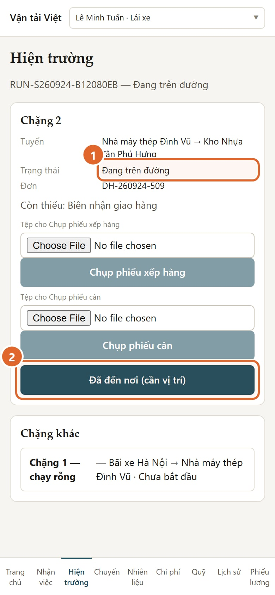

1. Trạng thái chuyển sang **"Đang trên đường"**.
2. Tới nơi giao thì bấm **"Đã đến nơi (cần vị trí)"**.

Hai nút có chữ **"(cần vị trí)"** lấy vị trí điện thoại đúng lúc bấm: "Đã đến nơi" và "Khách đã nhận hàng". Các nút khác không cần vị trí.

---

## 5. Khi máy chưa bật định vị

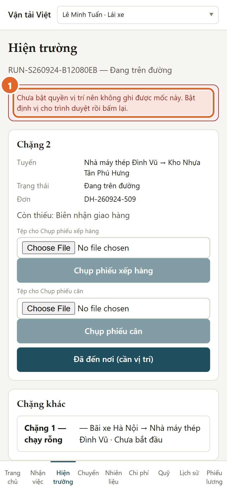

1. Màn báo: **chưa bật quyền vị trí nên mốc chưa được ghi**.

Bật định vị cho trình duyệt, ra chỗ thoáng, rồi bấm lại. **Mốc chỉ được ghi khi máy lấy được vị trí.**

---

## 6. Đã đến nơi: chờ người nhận

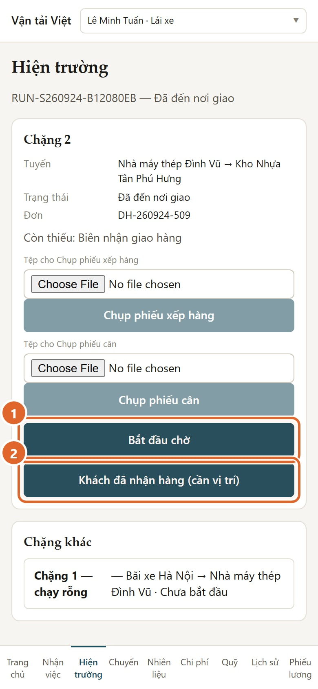

1. **Bắt đầu chờ**: bấm khi phải chờ người nhận.
2. **Khách đã nhận hàng (cần vị trí)**: bấm khi giao xong.

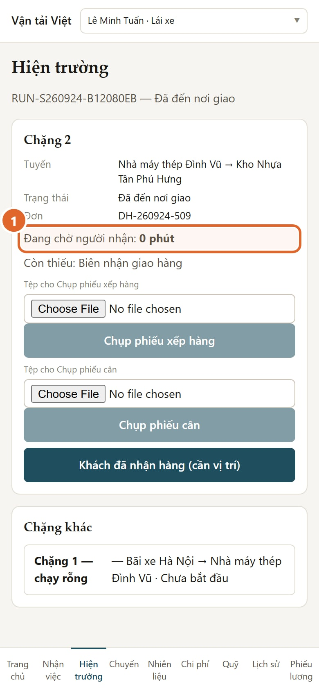

1. Màn đếm **thời gian chờ**, theo giờ của hệ thống.

- "Bắt đầu chờ" chỉ có sau "Đã đến nơi", và trước khi khách nhận hàng.
- **Không có nút dừng chờ.** Thời gian chờ tự dừng khi bạn bấm "Khách đã nhận hàng".

---

## 7. Chụp biên nhận giao hàng

Sau "Khách đã nhận hàng", màn nhắc chụp biên nhận.

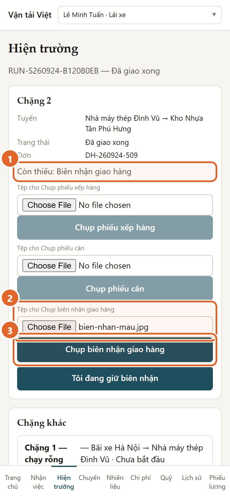

1. **Còn thiếu: Biên nhận giao hàng**. Đây là giấy **bắt buộc**.
2. Chọn ảnh biên nhận.
3. Bấm **"Chụp biên nhận giao hàng"** để gửi.

Ảnh phải thấy rõ **chữ ký người nhận, số lượng, ngày**. Chụp thẳng, đủ sáng, không mất góc.

Nếu bạn còn cầm bản giấy, bấm **"Tôi đang giữ biên nhận"**.

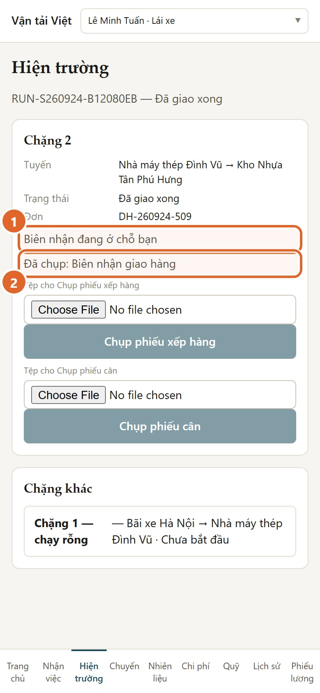

1. **Biên nhận đang ở chỗ bạn**: nhớ nộp bản giấy cho văn phòng.
2. **Đã chụp: Biên nhận giao hàng**: ảnh đã gửi thành công.

---

## 8. Nhiên liệu: ghi phiếu đổ dầu

Vào mục **Nhiên liệu** ở thanh dưới.

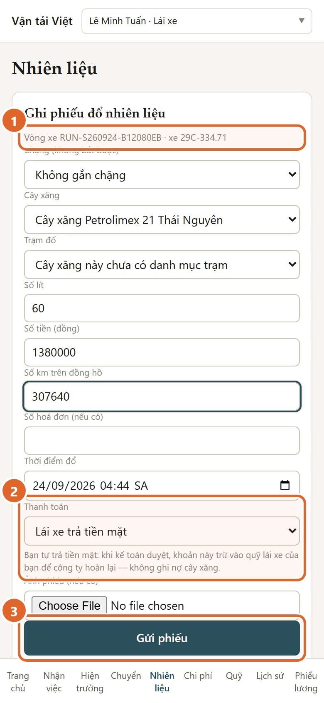

1. **Vòng xe và xe** được điền sẵn theo việc đang làm.
2. **Thanh toán**: chọn đúng ai trả tiền. Dòng chữ bên dưới nói rõ tiền đi đâu.
3. Bấm **"Gửi phiếu"**.

| Bạn chọn                | Nghĩa là                                                                                                |
| ----------------------- | ------------------------------------------------------------------------------------------------------- |
| **Lái xe trả tiền mặt** | Bạn tự trả. Khi kế toán duyệt, khoản này vào **quỹ của bạn** để công ty hoàn lại. Không ghi nợ cây xăng |
| **Ghi nợ cây xăng**     | Cây xăng cho công ty nợ. Khoản này vào công nợ cây xăng. **Không đụng tới quỹ của bạn**                 |

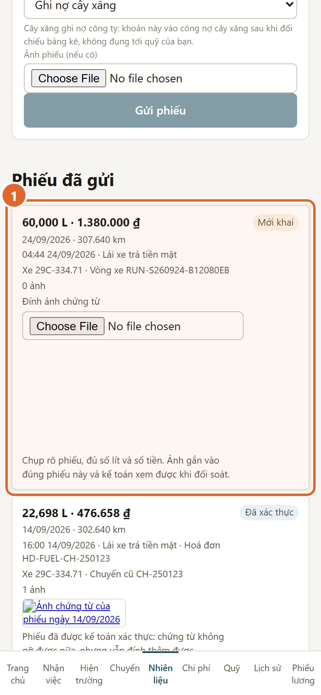

1. Phiếu vừa gửi hiện ở **"Phiếu đã gửi"**, trạng thái **"Mới khai"**. Bấm "Đính ảnh chứng từ" để gắn ảnh phiếu nếu chưa gắn.

Kế toán sẽ **xác thực** hoặc **từ chối kèm lý do**. Phiếu bị từ chối thì nộp lại được, không phải khai từ đầu.

---

## 9. Chi phí dọc đường

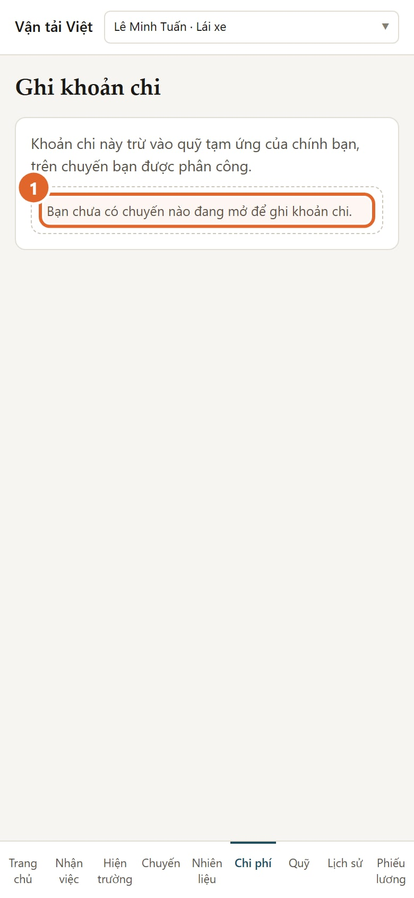

1. Hiện **chưa ghi được** khoản chi dọc đường (cầu đường, bốc xếp, bến bãi, sửa xe) cho việc văn phòng giao theo vòng xe.

Có khoản chi dọc đường thì **báo văn phòng** và giữ hoá đơn.

---

## 10. Quỹ và phiếu lương

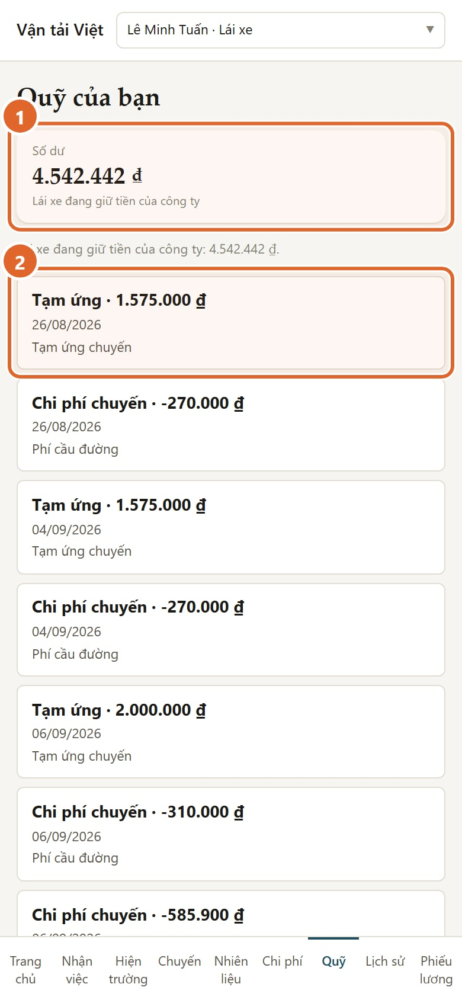

1. **Số dư quỹ** và ý nghĩa của nó:
   - "Lái xe đang giữ tiền của công ty";
   - "Đã cân bằng";
   - "Công ty đang nợ lái xe".
2. **Từng khoản**: tạm ứng, chi phí, hoàn quỹ. Bạn chỉ xem, không sửa được.

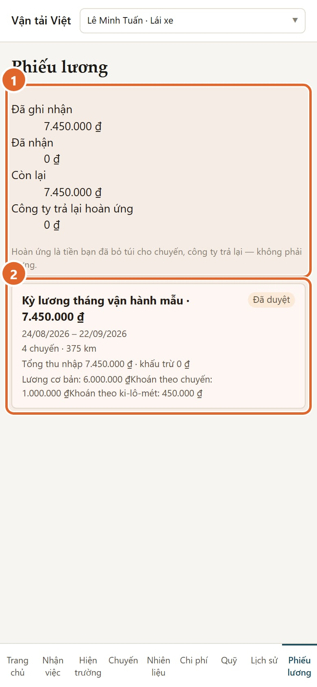

1. **Bảng quyết toán của tôi**:
   - lương đã ghi nhận;
   - đã nhận;
   - còn lại;
   - tiền công ty trả lại hoàn ứng.
2. **Phiếu lương**. Chỉ phiếu kế toán đã công bố mới hiện ở đây.

Thấy phiếu lương thiếu chuyến hay km, hãy **báo kế toán**.

---

## 11. Khi mất sóng hoặc bấm không được

- Hệ thống **cần mạng**. Chưa có chế độ làm việc khi mất sóng.
- Mất sóng lúc bấm thì đợi có sóng rồi **bấm lại**. Bấm lại cùng một mốc **không** tạo mốc trùng. Riêng "Đang xếp hàng" được ghi nhiều lần.
- Màn Hiện trường tự làm mới. Nếu thấy dòng "Chưa làm mới được việc hiện trường", điện thoại đang yếu sóng; màn vẫn hiện lần đọc trước.
- Nếu một mốc cần vị trí báo lỗi **"đang có một phiên mở trên việc khác"**, bạn **gọi văn phòng**. Đừng bấm lặp lại nhiều lần.

---

## 12. Những gì bạn không thấy

Màn hình lái xe **không có**:

- giá cước;
- doanh thu;
- biên;
- công nợ của khách.

Máy chủ **không gửi** những số này xuống điện thoại. Đây là phân quyền dữ liệu, không phải chỉ ẩn nút.
