# SƠ ĐỒ & THIẾT KẾ KỸ THUẬT — NỀN TẢNG AI AGENT ĐA KHÁCH

> **Vai trò tài liệu:** bản KỸ THUẬT hợp nhất — toàn bộ **sơ đồ hệ thống (12 sơ đồ Mermaid)** + **quyết định thiết kế đã chốt** + **phụ lục bằng chứng PoC**. Xem trên GitHub hoặc VS Code (extension Markdown Preview Mermaid).
> **Hợp nhất 11/07/2026:** nuốt trọn `thiet-ke-ky-thuat-hop-nhat.md` (quyết định kỹ thuật — §2/§3/§15) và 2 tài liệu PoC `poc-zalo-bot.md`, `poc-parser.md` (→ Phụ lục A/B) — 3 file gốc đã xóa, git history còn.
> **Đối chiếu code/yêu cầu 12/08/2026:** base đa khách đã tách tenant; lát cắt P1 auto-confirm đã khớp sơ đồ (`sent` + handoff Sale, không gọi ERP). Bảng sai lệch còn lại ở [nghiệp vụ Ultty](../khach-hang/ultty/nghiep-vu/mo-ta-nghiep-vu.md).
> Nghiệp vụ + sai lệch nguồn gốc: [nghiệp vụ Ultty](../khach-hang/ultty/nghiep-vu/mo-ta-nghiep-vu.md) · Kế hoạch + trạng thái: [tổng quan](../phat-trien/ke-hoach/tong-quan.md).

**Mục lục:** §1 Bối cảnh · §2 Quyết định kỹ thuật · §3 Ma trận kênh Zalo · §4 Kiến trúc 6 tầng · §5 Bản đồ module · §6 Luồng 1 đơn hàng · §7 Pipeline chi tiết · §8 Vòng đời đơn · §9 Bảy intent · §10 Nguồn sự thật động · §11 Realtime SSE · §12 ERD · §13 Runtime & cờ env · §14 Chọn kênh · §15 Tích hợp, KPI, bảo mật, rủi ro · Phụ lục A/B (PoC).

---

## 1. Bối cảnh tổng thể (ai dùng, hệ thống nói chuyện với gì)

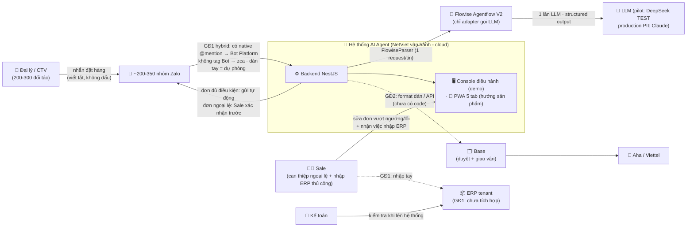

**Đọc sơ đồ:** đại lý có thể nhắn như hiện tại; hybrid bảo đảm chỉ một nhánh vào pipeline. Rules engine quyết định số. Đơn đủ dữ liệu có tổng số lượng trong ngưỡng tenant được gửi xác nhận ngay khi kill switch cho phép; đơn vượt ngưỡng/lỗi chuyển Sale trước gửi. Sau outbound thành công, hệ thống tạo hàng việc Sale nhập ERP thủ công. `AUTO_SEND` là kill switch, không chứa ngưỡng/policy tenant.

---

## 2. Quyết định kỹ thuật đã chốt

*(gốc: `thiet-ke-ky-thuat-hop-nhat.md` v1.0 06/07 — hợp nhất vào đây 11/07/2026; khi nguồn khác nhau, bảng này là quyết định cuối cho phần kỹ thuật)*

| Hạng mục | Quyết định | Ghi chú |
|---|---|---|
| Kiến trúc 6 tầng, intent taxonomy, luồng chính sách/bảo hành, checklist chốt đơn | Theo NetViet (`docs/khach-hang/ultty/nguon-goc/de-xuat-giai-phap-netviet.md` §3, §5 — giữ nguyên) | Nghiệp vụ không đổi |
| Lộ trình 3 giai đoạn, KPI, managed service | Theo NetViet (§6, §7) | Sơ đồ lộ trình: [tổng quan](../phat-trien/ke-hoach/tong-quan.md) |
| Stack | TypeScript (Node 22) · NestJS · Next.js · PostgreSQL + **Prisma 6 (pin, KHÔNG nâng v7** — `@adminjs/prisma` chưa hỗ trợ) · Flowise 3.1.4 · Claude/DeepSeek API · monorepo pnpm | BullMQ/Redis có trong stack nhưng **chưa dùng** (YAGNI — thêm khi pipeline thật sự cần queue) |
| Kênh Zalo GĐ1 | **Hai Bot cùng nhóm qua `CHANNEL_MODE=hybrid`** (03/08/2026): native @mention Bot chính thức → Bot Platform; không tag Bot → zca. Các mode đơn `mock\|bot\|zca` vẫn giữ để rollback/test | `getMe` lấy Bot UID; zca so metadata `mentions[].uid`, bỏ tin do Bot chính thức gửi; không lấy được UID thì zca fail-closed. Điều kiện zca: **tài khoản phụ** + **văn bản chấp nhận rủi ro** |
| Multi-agent 6 vai | 6 vai chuyên trách **dưới 1 orchestrator, dùng chung 1 lần gọi LLM/tin** (Router parse) — KHÔNG phải 6 LLM độc lập | Chi phí như 1 orchestrator; rules engine tính tiền |
| LLM vs rules | **LLM không tính tiền, không quyết chính sách** — chỉ phân loại intent + trích xuất + soạn văn bản; giá/ship/VAT/chính sách do rules engine TS tất định tính từ nguồn sự thật | Nguyên tắc bất di bất dịch |
| Dify → Flowise | NestJS giữ orchestrator; `FlowiseParser` gọi Agentflow `zalo-order-parser-v1` chỉ gồm form input + một LLM structured output. Không tool/code/memory/MCP/callback vào NestJS | `PARSER_MODE=deepseek` được giữ để rollback; D18a-c ở kế hoạch tổng quan |
| Cách ly khách v1 | Một Compose stack + DB/user/secret/volume/network riêng cho mỗi dự án; chưa cần `tenantId` khi không dùng chung DB | Stack đầu: `/srv/netviet/apps/zalo-ultty` |
| ERP/kho | KHÔNG xây module kho riêng. GĐ1 không gọi ERP; Sale nhập tay. Khi tích hợp sau này, ERP tenant là source of truth tồn kho | 10-20 đơn/ngày không cần cache |
| Lưu trữ | Mặc định **in-memory** (`PERSISTENCE=memory` — demo/CI không cần DB); bật Postgres bằng `PERSISTENCE=prisma` (cờ riêng, tách khỏi `DATABASE_URL`) | as-built Phase 3 |
| Nguồn sự thật ĐỘNG | Trang **`/settings`** cho người vận hành (6 tab: Kênh Zalo · Nhóm & thành viên · Đại lý/SP/giá · Rules · Tự động hóa · Lịch sử) + panel **`/admin`** (AdminJS auto-CRUD, power-user) + **MCP tool** (8 tool) — tất cả đi qua một `SourceTruthWriteService` (transaction → audit → reload snapshot) | Thay cho tab "Prompt AI" của PWA trong thiết kế cũ; `/settings` là mặt chính, `/admin` giữ làm fallback |
| Policy GĐ1 theo tenant | Auto-confirm ceiling inclusive · ERP mode · retail advice field/qualifier · campaign window/spacing/max-target là runtime config có audit | Không hard-code 50/tên khách trong base; `AUTO_SEND` chỉ kill switch |
| Campaign CSKH | Năng lực base: draft → approved → scheduled → running → completed/partially_failed/cancelled; delivery được phân bổ trong cửa sổ và claim bền vững | Không dùng broadcast `for + sleep` trong HTTP request |
| Drive/content | Binary gốc ở Drive/object storage; provenance, mapping SP, FAQ, link catalog/video, nội dung tư vấn và readiness ở DB/config + `/settings` | Inventory 12/08: 122 folder/825 file; thiếu T8 và promo formula |
| App Sale | Demo = **console PC 3 cột** (Feed · 6-agent theater SSE · Nguồn sự thật); PWA mobile 5 tab theo `docs/khach-hang/ultty/thiet-ke-giao-dien/` = hướng sản phẩm, làm sau | Quyết định treo D3 |

---

## 3. Kênh Zalo — ma trận 4 phương án

| Phương án | Chính thức | Đọc tin nhóm | Chi phí | Vị trí trong lộ trình |
|---|---|---|---|---|
| **A. Co-pilot / dán tay** (Sale dán tin vào app) | ✅ Không đụng ToS | Thủ công | 0đ | **Fallback vĩnh viễn** (khi zca lỗi/khóa) |
| **B. Zalo Bot Platform** (bot.zapps.me, Beta) | ✅ | **CHỈ tin @mention** (mention-gating gốc Zalo, không tắt được — Phụ lục A) | 0đ (Premium chưa công bố) | Kênh phụ — bật khi đại lý chịu tag bot (quyết định D2) |
| **C. Zalo OA + GMF** | ✅ | Tự động (API đầy đủ) | ~25-300k/tháng/nhóm × 200-350 nhóm + gói OA | GĐ2-3: OA cho CSKH 1:1 + ZNS; GMF chỉ khi khách chịu chi phí |
| **D. zca-js (userbot)** | ❌ vi phạm ToS | **Tự động — thấy MỌI tin nhóm**; ở hybrid tự nhường tin tag Bot chính thức | 0đ | Nhánh nhận tin không tag trong `CHANNEL_MODE=hybrid`; mode `zca` đơn giữ làm rollback |

Mọi kênh đi qua interface `ChannelAdapter` → đổi kênh không đập hệ thống. Bằng chứng PoC Bot Platform: **Phụ lục A**.

---

## 4. Kiến trúc 6 tầng (NetViet) → module code thực tế

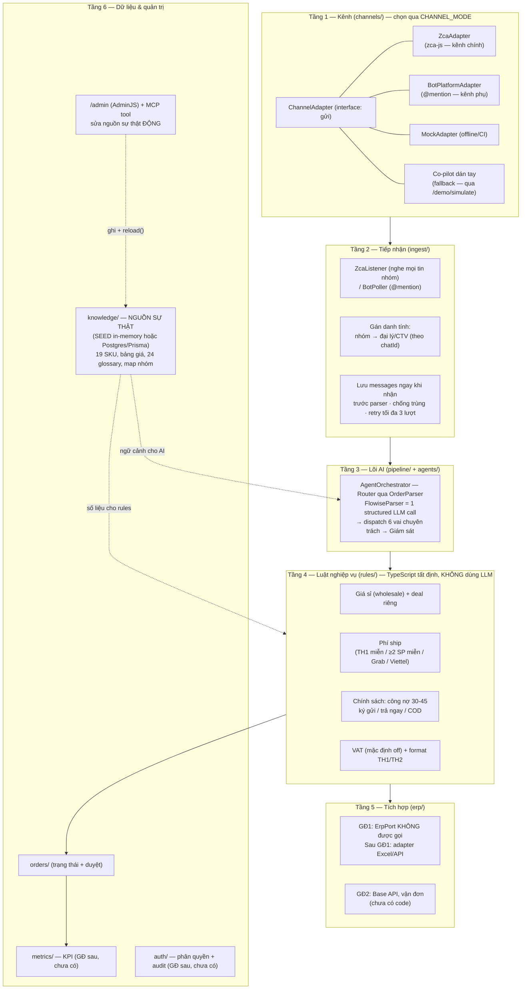

**Điểm mấu chốt:** tầng 3 (AI) chỉ *hiểu và soạn*; tầng 4 (rules) mới *tính tiền và áp chính sách* — từ nguồn sự thật ở tầng 6. AI sai thì validation + Sale chặn; số tiền không bao giờ do AI "đoán".

---

## 5. Bản đồ module & phụ thuộc (as-built)

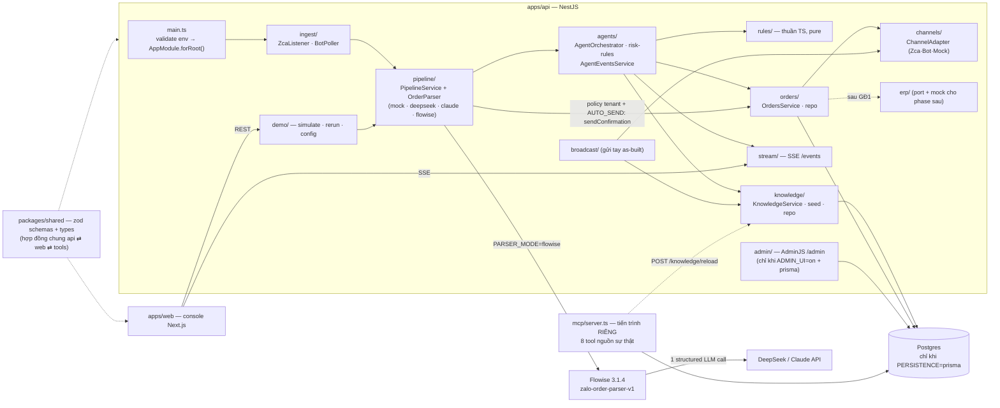

Console web hiện gọi REST `/orders` · `/messages` · `/knowledge/*` · `/broadcast`; tab KiotViet đã ẩn khỏi console GĐ1. Route `/kiotviet/*` và mock adapter còn trong code cho dữ liệu legacy/bề mặt phase ERP tương lai nhưng không nằm trong luồng xác nhận đơn. Target GĐ1 thay gửi trực tiếp `/broadcast` bằng API campaign bền vững.

---

## 6. Luồng xử lý 1 đơn hàng GĐ1 (tự xác nhận có kiểm soát, không ERP)

```mermaid
sequenceDiagram
    autonumber
    actor DL as Đại lý (nhóm Zalo)
    actor S as Sale (console)
    participant IN as Ingest
    participant AI as AgentOrchestrator (Router + 6 vai)
    participant FL as Flowise Agentflow V2
    participant RU as Rules engine
    participant ST as Lưu trữ (in-memory / Postgres)

    DL->>DL: "gui 10 ghe felix ve TN cho c, ko lay VAT"

    alt CHANNEL_MODE=zca (kênh chính GĐ1)
        DL-->>IN: zca đọc mọi tin nhóm (KHÔNG cần tag)
    else CHANNEL_MODE=bot / dán tay
        DL-->>IN: Bot nhận tin @mention / Sale dán qua console
    end

    IN->>ST: Lưu message thô TRƯỚC xử lý<br/>chống trùng externalMessageId
    IN->>AI: Đưa vào pipeline
    AI->>ST: Lấy ngữ cảnh: nhóm→đại lý Meta HN,<br/>19 SKU, glossary (TN=Thái Nguyên)
    AI->>FL: FlowiseParser gửi form + ngữ cảnh đóng
    FL->>FL: 1 lần LLM, structured output<br/>không tool/memory/callback
    FL-->>AI: parseResultSchema: intent=dat_don<br/>10 x Ghế Felix, giao TN, không VAT
    AI->>RU: JSON đơn thô
    RU->>ST: Tra giá sỉ + deal riêng + phí ship + chính sách
    RU->>RU: Validation: SKU/giá/đại lý đủ?<br/>tổng lệch? tổng SL ≤ ngưỡng tenant?
    RU->>ST: Tạo order + format xác nhận TH1
    alt đủ dữ liệu và tổng SL ≤ maxAutoConfirmQuantity
        ST->>DL: Gửi format xác nhận vào đúng nhóm (kèm nhãn tenant)
        ST->>ST: Chuyển sent; tạo SalesTask manual_erp_create
        ST-->>S: 🔔 Khách đã xác nhận — nhập ERP thủ công
    else > ngưỡng hoặc thiếu dữ liệu/validation lỗi
        ST-->>S: 🔔 needs_edit/pending_review
        S->>ST: Sửa + xác nhận trước khi gửi
        ST->>DL: Gửi sau khi Sale can thiệp
        ST->>ST: Chuyển sent; tạo SalesTask manual_erp_create
    end
    Note over ST: kpi_events — model đã có, CHƯA ghi (Phase 5)
```

---

## 7. Pipeline chi tiết trong 1 tin (định tuyến theo độ tin cậy + rủi ro)

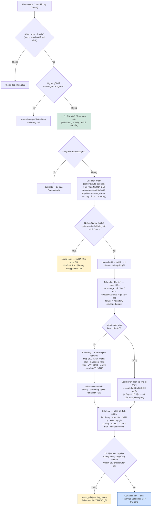

**Thứ tự hai cổng lọc là có chủ ý (sửa 04/08/2026).** Trước đó cả hai listener chặn ngay từ đầu bằng điều kiện "nhóm đã map", nên tin của nhóm chưa map **không bao giờ được lưu** — mà Zalo không phát lại, tức mất hẳn. Nay tách rõ: **allowlist** là sự đồng ý *đọc* nhóm (điều kiện để lưu), còn **đã map đại lý** chỉ là điều kiện để đưa *nội dung* sang parser/LLM. Nhóm chưa map vẫn giữ trọn tin trong DB và vẫn góp người gửi vào danh sách thành viên; chọn đại lý ở `/settings` là chạy tiếp ngay.

`intake()` trả kết quả **có nhãn** (`processed` · `stored_only` · `duplicate` · `ignored`) dạng union phân biệt — trước đây mọi trường hợp bỏ qua đều trả `null` giống hệt lỗi thật, nên listener gọi `guard.release()` cho cả hai và tin bỏ-qua-có-chủ-ý bị xếp lịch chạy lại.

Lưới an toàn: tin thô được giữ trong PostgreSQL; timeout/401/404/429/5xx/schema sai làm lượt xử lý thất bại, ingest thử tối đa **3 lượt** rồi để vận hành chạy lại — không âm thầm đổi sang MockParser. Tiền dạng chuỗi ("11tr5", "1.150k") được ép về số trước khi validate (Phụ lục B).

---

## 8. Vòng đời đơn GĐ1 — as-built sau P1

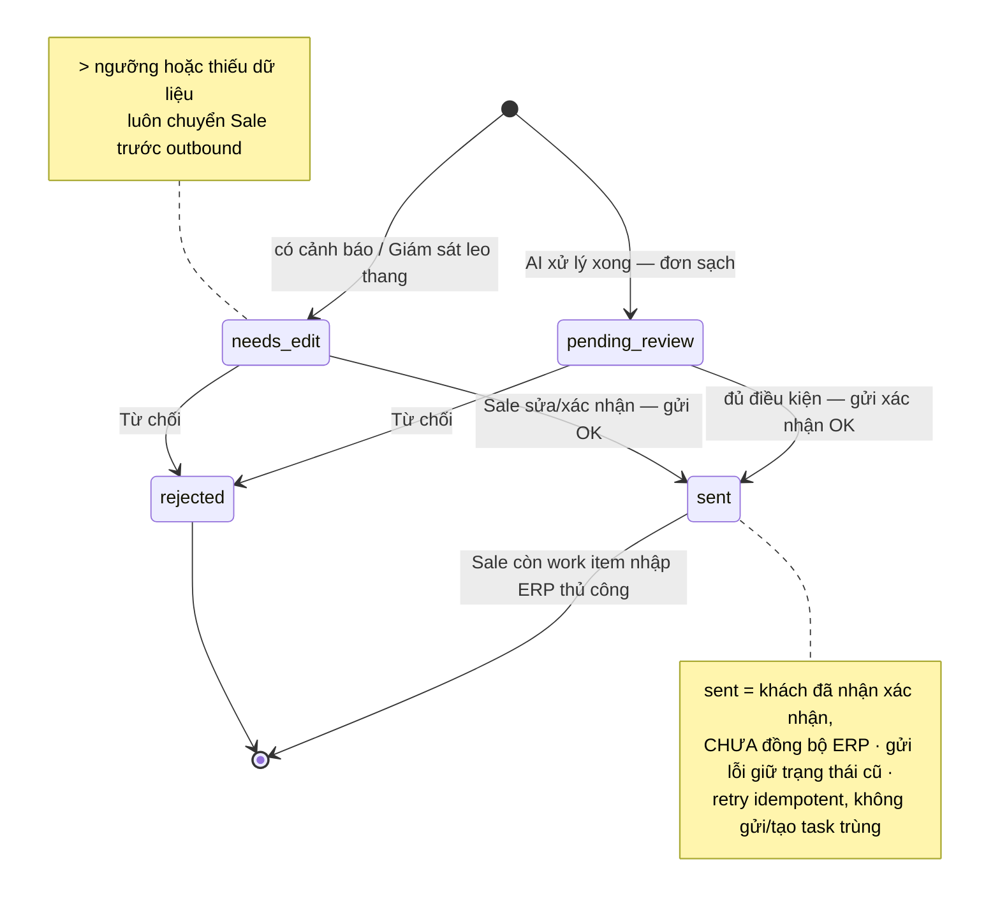

> **As-built sau P1 12/08/2026:** `PipelineService` dùng policy tenant inclusive, không dùng toàn bộ risk làm cổng outbound; `OrdersService.sendConfirmation()` ghi `sent` + `salesHandoff` và không có dependency ERP. Hai thao tác đồng thời cùng tiến trình dùng chung một outbound đang chạy; `sent` chặn gửi/rerun lại. Sale có endpoint/UI hoàn tất handoff. Đây không phải cam kết exactly-once qua lúc process crash vì Zalo outbound chưa có idempotency key. `synced` chỉ còn cho dữ liệu legacy/phase ERP tương lai.

---

## 9. Bảy loại ý định (intent) và đường đi của từng loại

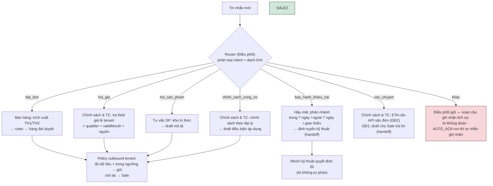

**Nguyên tắc:** không có dữ liệu/nguồn hiện hành → handoff hoặc nói rõ thiếu, tuyệt đối không bịa/fallback tháng cũ. Quyền gửi theo loại nội dung + policy tenant; campaign luôn cần Sale duyệt nội dung trước lịch chạy.

---

## 10. Nguồn sự thật ĐỘNG (Phase 3): 2 cửa ghi, 1 lần nạp lại

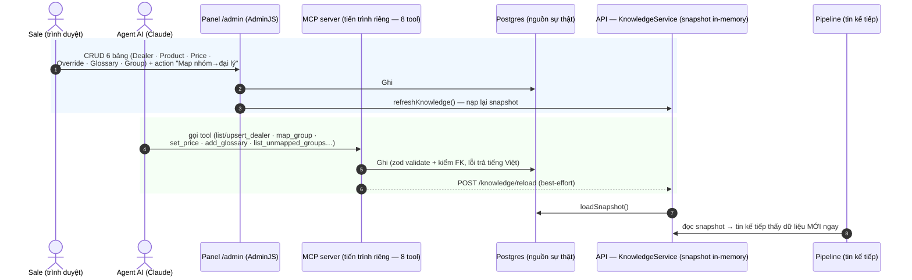

- Panel `/admin` chỉ mount khi `ADMIN_UI=on` **và** `PERSISTENCE=prisma` (dynamic import — chế độ memory không nạp AdminJS). Hộp thư "**nhóm chưa map**": danh sách Group mặc định lọc `status=pending`.
- MCP đọc `DATABASE_URL` trực tiếp; chạy `pnpm --filter @netviet/api mcp`.

---

## 11. Realtime: SSE 6-agent theater trên console

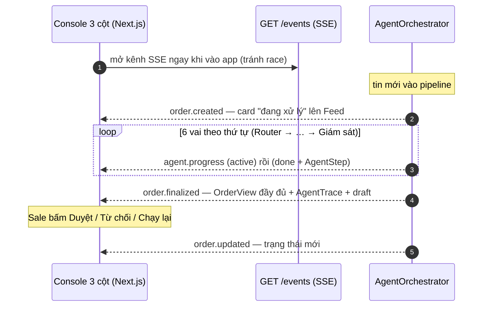

- Độ trễ vai Router là **thật** (LLM); các vai rules tức thì được giãn `STREAM_STEP_DELAY_MS` (mặc định 280ms, chỉ khi có client xem) cho dễ nhìn.
- `STREAM_MODE=off` → frontend quay về polling (lưới an toàn demo). AgentTrace ghi `llmCalls` (0 với mock, 1 với LLM) — minh bạch chi phí.

---

## 12. Dữ liệu chính (ERD as-built — Prisma 15 model, Phase 3)

> **Bổ sung 03/08/2026** (migration `20260803102000_operator_settings`): `GROUP_PARTICIPANTS` (thành viên
> nhóm đồng bộ bằng zca + phân loại), `RULE_CONFIG_VERSIONS` (rules typed có vòng đời
> draft → preview → active → archived) và `AUDIT_LOGS` (append-only, đã lọc secret/PII).
> `ORDERS.rule_config_version` giữ vết version rules đã dùng cho từng đơn.

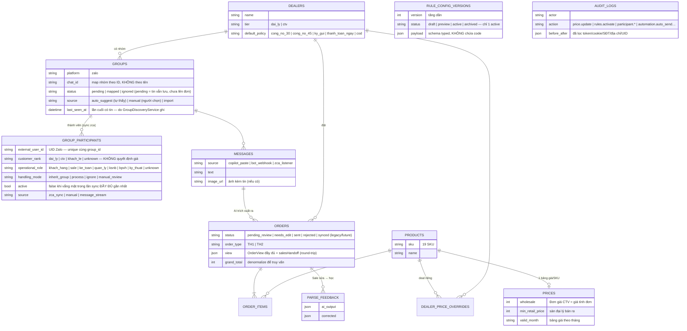

Bảng độc lập (chưa nối quan hệ): `glossary_entries` (24 mục) · `users` (Phase 5 auth) · `kpi_events` (Phase 5).

> **Bảng nào ĐANG được ghi thật (31/07/2026):**
> - **Ghi rồi:** `dealers` · `groups` · `products` · `prices` · `dealer_price_overrides` · `glossary_entries` (qua seed + `/admin` + MCP), `messages` (ghi trước pipeline, chống trùng) và `orders` (khi `PERSISTENCE=prisma`; dòng đơn nằm trong cột JSON `view`, scalar denormalize để lọc).
> - **Model có, CHƯA ghi:** `order_items` (dữ liệu dòng đang nằm trong `orders.view`) · `parse_feedback` · `users` · `kpi_events` (Phase 5).
> - Các bảng thuộc **đích GĐ sau, CHƯA có model**: `conversations` · `warranty_tickets` · `policies` (điều khoản dạng bảng — hiện là enum trên dealer + rules-config) · `audit_logs`.
> Schema thật: [apps/api/prisma/schema.prisma](../../apps/api/prisma/schema.prisma). Mặc định app chạy in-memory (`PERSISTENCE=memory`).

---

## 13. Runtime & cờ môi trường

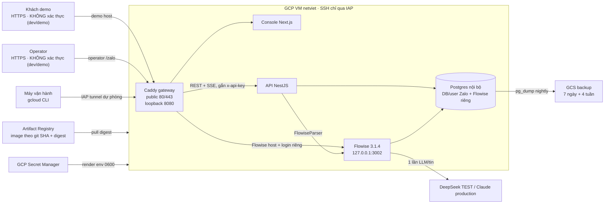

**Cờ env quyết định hành vi** (đủ bộ: [packages/shared/src/env.ts](../../packages/shared/src/env.ts) — validate lúc boot, fail fast):

| Cờ | Giá trị (mặc định **đậm**) | Quyết định gì |
|---|---|---|
| `CHANNEL_MODE` | **mock** · bot · zca · hybrid | `hybrid`: chạy đồng thời Bot Platform + zca và định tuyến phản hồi về đúng kênh nguồn |
| `PARSER_MODE` | **mock** · claude · deepseek · flowise | Bộ não parse; `flowise` gọi Agentflow nội bộ, `deepseek` giữ làm rollback pilot |
| `PERSISTENCE` | **memory** · prisma | Lưu đơn + nguồn sự thật (memory = demo/CI không cần DB) |
| `ADMIN_UI` | **off** · on | Mount panel `/admin` (đòi thêm `PERSISTENCE=prisma`) |
| `AUTO_SEND` | **off** · on | Kill switch khởi động/runtime. Không chứa business policy; quyền đã có. Eligibility/ngưỡng nằm trong tenant config có audit; restart behavior phải rõ |
| `AUTO_ACK` | **off** · on | Tự nhắn "đã ghi nhận" khi intent=khac |
| `STREAM_MODE` | **on** · off | SSE real-time / polling |
| `ZALO_SELF_LISTEN` | **off** · on | zca có nghe tin do chính tài khoản gửi không (chống vòng lặp) |
| Flowise | `FLOWISE_BASE_URL`, `FLOWISE_FLOW_ID`, `FLOWISE_API_KEY`, `FLOWISE_TIMEOUT_MS`=30000 | Bắt buộc và fail-fast khi `PARSER_MODE=flowise`; không dùng `overrideConfig` |
| `AUTH_MODE` | **api-key** · none | **Công tắc xác thực toàn hệ thống.** `api-key`: guard `x-api-key` + kiểm `Origin` cho mutation + CORS theo `CORS_ORIGIN` + AdminJS đòi đăng nhập. `none`: **tắt cả bốn** — dùng cho VM dev/demo (VM `netviet` chạy `none` từ 04/08/2026, kèm bỏ Basic Auth ở Caddy). `none` cũng miễn luôn fail-fast "production phải có `API_KEY`" |
| Bảo vệ API | `API_KEY` | Bắt buộc khi `NODE_ENV=production` **trừ khi** `AUTH_MODE=none`; gateway nội bộ gắn header, không đưa key vào browser/query string |
| Khác | `BOT_NAME`, `ZALO_CRED_PATH`, `BROADCAST_THROTTLE_MS`, `BROADCAST_MAX_TARGETS`, `STREAM_STEP_DELAY_MS`, auth/DB/LLM/Zalo secrets | Hai biến broadcast env hiện chỉ là as-built; target campaign dùng policy tenant + scheduler/limiter bền vững |

---

## 14. Chọn kênh tiếp nhận bằng `CHANNEL_MODE`

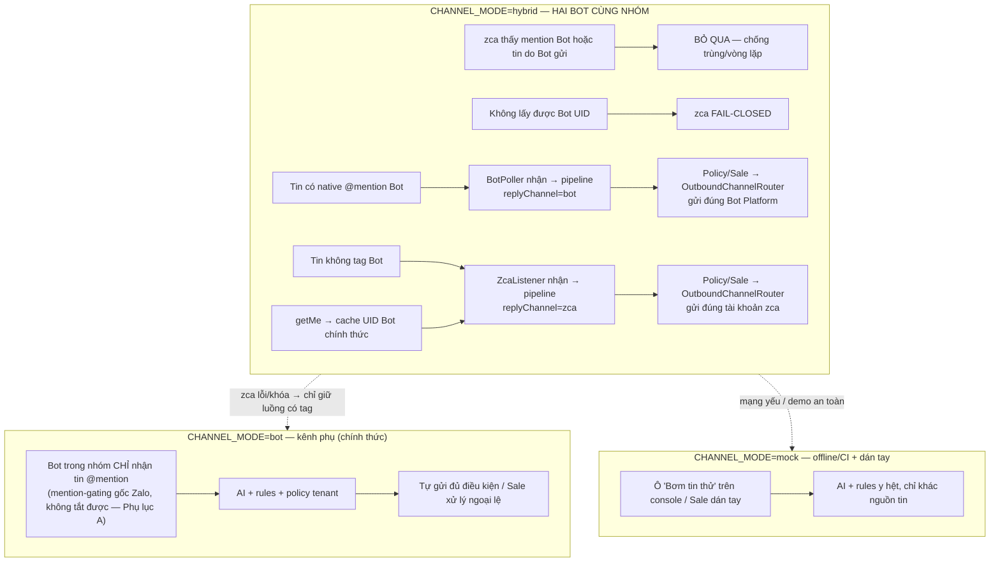

**Vì sao an toàn:** `OrderView.replyChannel` được lưu cùng đơn (`bot|zca|mock`); `OrdersService`, auto-ack và auto-send đều đi qua `OutboundChannelRouter`, không dùng một adapter toàn cục để đoán kênh. Đơn cũ thiếu `replyChannel` bị từ chối trong hybrid. Broadcast gửi thật cũng bị khóa trong hybrid tới khi UI buộc chọn kênh/chat ID rõ ràng.

**Map nhóm:** Bot Platform `chat.id` và zca `threadId` là hai ID khác nhau. Cần tạo hai bản ghi Group cùng trỏ về một Dealer. Bot Platform chỉ đưa tin nhóm đã map vào pipeline; zca còn qua allowlist operator riêng trước LLM.

Chi tiết hành vi zca as-built: bỏ tin do chính tài khoản gửi (trừ khi `ZALO_SELF_LISTEN=on`) · tin chỉ-ảnh nay được lưu và tải media bất đồng bộ khi bật store · chống trùng 2.000 id gần nhất · tự ghi nhận nhóm/người gửi · mỗi tài khoản chỉ 1 listener (mở Zalo Web cùng tài khoản → listener dừng). Trang Operator đăng xuất cục bộ dừng listener, xóa credential/QR/allowlist; không phải thu hồi phiên phía Zalo.

> **Điều kiện chặn kênh zca:** dùng **tài khoản Zalo phụ** (không dùng tài khoản Sale chính) + **văn bản chấp nhận rủi ro của khách** (vi phạm ToS Zalo, có thể bị khóa tài khoản; Luật BVDLCN 91/2025/QH15 + NĐ 356/2025).

---

## 15. Tích hợp vận hành · KPI · Bảo mật · Rủi ro

### 15.1 Tích hợp (nguyên tắc NetViet: API-first nhưng không phụ thuộc API)

| Hệ thống | Hiện tại | Kế tiếp (Phase 4 / GĐ2+) |
|---|---|---|
| ERP/KiotViet | GĐ1: **không gọi**; `OrdersService` đã bỏ dependency ERP, Sale nhập thủ công sau work item. Mock adapter chỉ còn phục vụ bề mặt demo/phase tương lai | Sau GĐ1: Excel/API + map SKU ↔ mã hàng số |
| Base | Chưa có code | GĐ1: sinh format dán tay · GĐ2: API/webhook nếu có tài liệu |
| Vận chuyển | Cước theo bảng nội bộ (tạm tính) | API vận đơn Aha/Viettel (GĐ2-3) |
| VAT | AI chuẩn bị dữ liệu (có/không VAT theo tin nhắn) — kế toán quyết | Giữ quy trình kế toán (nháp → khách kiểm → xuất) |

### 15.2 KPI (NetViet 7.1 — đo từ `kpi_events`, Phase 5 mới ghi)

| KPI | Cách đo | Mục tiêu tham chiếu |
|---|---|---|
| Tỷ lệ bóc tách đúng | đơn duyệt không sửa field / tổng đơn AI tạo | ≥90% sau GĐ1 ổn định |
| Thời gian chốt đơn TB | t(nhận tin → duyệt) | < mốc 5 phút hiện tại |
| Tỷ lệ trả lời cần sửa | draft bị sửa / tổng draft | giảm dần |
| Tỷ lệ handoff | đơn chuyển người thật / tổng | hợp lý theo độ phức tạp |

### 15.3 Bảo mật & tuân thủ

- Secrets production nằm trong Secret Manager, render file 0600; env validate lúc boot, không hardcode; phiên zca (`secrets/zalo-cred.json`) bảo mật như secret, đã gitignore.
- Dữ liệu khách (SĐT, địa chỉ, đơn) là nội bộ — **không gửi bên thứ 3** ngoài API đã thống nhất (KiotViet, Claude). DeepSeek không có DPA phù hợp cho luồng này → pilot Flowise chỉ dùng dữ liệu TEST; bản chạy thật phải dùng Claude.
- Mọi tin bot/hệ thống gửi ra đều nối nhãn lấy từ `tenant.persona.botName`; base không hard-code tên khách.
- Lưu mọi tin về DB ngay khi nhận; lỗi parser không đánh dấu đã xử lý và được retry tối đa 3 lượt.
- `ApiKeyGuard` bảo vệ toàn API ở production; pilot chỉ bind loopback/IAP. **Auth người dùng theo vai + audit log** vẫn còn thiếu trước production nhiều người dùng (Phase 5).

### 15.4 Rủi ro kỹ thuật chính

| Rủi ro | Giảm thiểu |
|---|---|
| zca vi phạm ToS → khóa tài khoản | Tài khoản phụ + văn bản chấp nhận rủi ro; Bot Platform + dán tay là fallback; `CHANNEL_MODE` đổi kênh 1 biến |
| Bot Platform mention-gating (chỉ tin @mention) | Kênh lai: bot bắt đơn có tag; phần còn lại zca/dán tay (Phụ lục A) |
| Tin gửi lúc bot/zca offline không replay | Production: webhook always-on / listener không gián đoạn + lưu mọi tin DB; Sale vẫn thấy tin trong nhóm (dán tay) |
| AI trả lời sai giá/chính sách | Rules engine tất định + RAG bắt buộc kèm nguồn + không dữ liệu thì không đoán |
| LLM/Flowise lỗi, timeout hoặc output sai schema | Ném lỗi, retry tối đa 3 lượt, giữ tin thô chưa xử lý để vận hành chạy lại; không fallback âm thầm. Rollback pilot bằng `PARSER_MODE=deepseek` |
| DeepSeek khai tử model cũ 24/07/2026 | Đã dùng `deepseek-v4-flash` (cập nhật trước hạn) |
| Flowise 3.1.4 thiếu `thinking:disabled` và không expose Agentflow structured output tại `response.json` | Image dẫn xuất từ digest khóa phiên bản, patch có source guard cho cả hai điểm; contract container kiểm tra lại |
| Một VM tự host là single point of failure | Pilot có backup/restore, health alert và rollback; không cam kết SLA production cho tới khi chốt E3/D24 |
| Beta Bot Platform đổi chính sách | `ChannelAdapter` đổi kênh không đập hệ thống; tin đã lưu DB |

---

## Phụ lục A — Kết quả PoC Zalo Bot Platform (07/07/2026)

*(gốc: `poc-zalo-bot.md` — hợp nhất 11/07/2026; log thô: `tools/poc-zalo-bot/logs/`, chạy lại theo [tools/poc-zalo-bot/README.md](../../tools/poc-zalo-bot/README.md))*

**Bot:** `Bot ultty AI orders` · nhóm test `zgr-f8a7101d77709e2ec761`.

| Câu hỏi Beta | Kết quả |
|---|---|
| 1. Bot vào được nhóm cá nhân có sẵn? | ✅ **CÓ** — "Thêm thành viên" tìm tên bot, hoặc link mời của bot (hữu ích onboard 200 nhóm) |
| 2. Nhận mọi tin hay chỉ @mention? | ⚠️ **CHỈ @mention** — 6/6 test nhất quán: text/ảnh/thoại KHÔNG tag đều không về; tin CÓ tag về **trọn nội dung**, **kể cả ẢNH** (event `message.image.received` kèm `photo_url` tải được + `caption`) |
| 3. Giới hạn nhóm / rate limit? | ⬜ chưa test (mới 1 nhóm) |
| 4. Có API danh sách thành viên nhóm không? *(dò 04/08/2026)* | ❌ **KHÔNG CÓ** — xem dưới |

**Dò API thành viên bằng token thật (04/08/2026), trên 2 nhóm thật:**

```
getMe                  => ok:true  {"account_type":"BASIC","can_join_groups":true}
getChat                => 404 Not Found
getChatMemberCount     => 404 Not Found
getChatMembersCount    => 404 Not Found
getChatAdministrators  => 404 Not Found
```

`getMe` trả 200 trên **cùng dạng đường dẫn** ⇒ 404 nghĩa là **method không tồn tại**, không phải thiếu quyền hay sai chat_id. Kết luận: Bot Platform **không cấp danh sách thành viên** ở gói BASIC. Cộng với việc `getGroupInfo` của zca trả mảng rỗng, **luồng tin là nguồn duy nhất còn lại** để dựng danh sách thành viên — xem `ParticipantSource.message_stream` (§12) và [tổng quan trạng thái](../phat-trien/ke-hoach/tong-quan.md).

**Bổ sung 05/08/2026 — còn một trường UID nữa trong chính response đó.** Kiểu `GroupInfoResponse` của zca-js 2.1.2 khai `gridInfoMap[groupId]: GroupInfo & { memVerList: string[] }`. `memVerList` là danh sách `"uid_version"` Zalo dùng để bắt cache hồ sơ — **không** nằm trong model `GroupInfo` nên dễ bị bỏ sót, và code trước đó chỉ đọc `memberIds` + `currentMems`. `fetchGroupMembers` nay đọc cả ba. Đây **chưa** phải kết luận: log VM cũ không đếm `memVerList` nên chưa biết Zalo có điền hay cũng bỏ trống; dòng cảnh báo đã thêm số đếm để lần bấm "Đồng bộ" kế tiếp trả lời dứt điểm. Rà API còn lại của zca-js 2.1.2 (`getGroupMembersInfo`, `getGroupBlockedMember`, `getPendingGroupMembers`) — **không có** endpoint liệt kê thành viên phân trang nào; `hasMoreMember=0` nên cũng không có trang tiếp. npm chốt ở 2.1.2, không có bản mới hơn để nâng.

**Nguyên nhân gốc đã rõ (05/08/2026): Zalo CHỦ ĐỘNG đóng, không phải mình làm sai.** Hai issue trên repo zca-js chốt lại điều này, và nó **loại bỏ cả hai giả thuyết** còn treo trong [tổng quan trạng thái](../phat-trien/ke-hoach/tong-quan.md) (lệch phiên bản thư viện / tài khoản bị hạn chế):

| Issue | Nội dung |
|---|---|
| [#359](https://github.com/RFS-ADRENO/zca-js/issues/359) (mở) | *"trước quét được giờ bị zalo lock rồi"* — người bảo trì: *"Zalo họ biết và có thể là đã sửa lỗi này rồi"* |
| [#349](https://github.com/RFS-ADRENO/zca-js/issues/349) (đóng) | *"link cũ vẫn gọi đc, còn link mới là k thấy members luôn"* |

⇒ Giữa 2026 Zalo chặn đọc danh sách thành viên ở **diện rộng**. Nâng thư viện không cứu được. Cơ chế `message_stream` **không phải giải pháp tạm — nó là giải pháp chính.**

**Đường vét vát cuối, đã cài đặt:** `getGroupLinkInfo` (endpoint **khác**: `group/link/ginfo`) vẫn trả `currentMems` kèm hồ sơ, có phân trang `mpage`. `ZaloUserClient.membersViaInviteLink` gọi nó **chỉ khi** cả ba trường UID của `getGroupInfo` đều rỗng, và **chỉ khi nhóm đã sẵn có link mời đang bật** — hệ thống **KHÔNG bao giờ gọi `enableGroupLink`**, vì bật link mời là đổi cài đặt nhóm của khách (ai có link đều vào được). Thất bại được coi là bình thường: trả `null`, lần đồng bộ đi tiếp với những gì có. `hasMoreMember` ⇒ `complete: false` để tầng persistence không đánh INACTIVE người ở trang sau.

**Kết luận câu hỏi “tin không tag có về server Bot không?”: KHÔNG.** PoC không thấy 6/6 tin text/ảnh/thoại không tag ở cả `getUpdates`/server nhận Bot; chỉ tin có native @mention mới phát event. Mention-gating là hành vi GỐC của Zalo (Beta), không tắt được — đã loại trừ khả năng cấu hình sai: docs OpenClaw ghi rõ "Groups require an @mention... not configurable"; docs webhook Zalo không có setting privacy/mention nào; `getMe` không có cờ `can_read_all_group_messages`; phía mình sạch (webhook 404, token ok, poller nhận đúng khi có tag).

**Quan sát vận hành:** bot gửi tin nhóm được (kèm nhãn tự động ✅ điều khoản); long-poll `getUpdates` trả HTTP 408 khi rảnh = BÌNH THƯỜNG; độ trễ vài giây ~20s; ⚠️ **tin gửi lúc bot offline KHÔNG được phát lại** → production phải webhook always-on + lưu mọi tin DB ngay.

**Hệ quả kiến trúc — kênh lai đã có code 03/08/2026:** text/ảnh **có native tag** → Bot Platform; **không tag** → zca. Gõ tên Bot bằng chữ nhưng không có `mentions[].uid` vẫn thuộc zca. Phản hồi đi theo `replyChannel` của tin nguồn. Runtime hiện vẫn long-poll; trước production 24/7 phải chuyển/kiểm chứng webhook official Bot và lưu event ngay.

**Còn treo (không chặn):** xác nhận mention từ NGƯỜI KHÁC (mọi test là chủ bot) · thoại-có-tag · đa nhóm + rate limit · chế độ webhook.

---

## Phụ lục B — Eval parser DeepSeek trên 35 tin (08/07/2026)

*(gốc: `poc-parser.md` — hợp nhất 11/07/2026; chạy lại: `pnpm --filter @netviet/poc-parser eval`, bộ đề `tools/poc-parser/eval-set.json`)*

Đo **phân loại 7 intent** qua đúng pipeline thật (`/demo/simulate`, `PARSER_MODE=deepseek`) trên 35 tin tiếng Việt không dấu (phủ 7 intent + bẫy TH2/nhiều SP/glossary/adversarial):

**Kết quả: 35/35 = 100%** (từng intent đều 100%; ngưỡng demo đề ra ≥90% → ĐẠT).

**Chạy lại qua `FlowiseParser` + Flowise 3.1.4 ngày 31/07/2026:** **35/35 = 100%**, ngang baseline gọi DeepSeek trực tiếp; mọi response thành công qua `parseResultSchema` và trace ghi `llmCalls=1`. Bộ đề hiện chỉ có nhãn intent, chưa có golden field — chưa được dùng để tuyên bố field-accuracy; cổng đó vẫn là B1-B2.

**Lịch sử tune (bài học nằm trong code dùng chung [parser-prompt.ts](../../apps/api/src/pipeline/parser-prompt.ts)):**

| Mốc | Accuracy | Nguyên nhân / cách sửa |
|---|---|---|
| Ban đầu | 43% | Prompt template luôn có khối `order` rỗng → intent hỏi bị fail schema → fallback `khac` |
| Fix 1 | 91% | Prompt rõ "intent≠dat_don thì KHÔNG có order" + normalizer bỏ `order` thừa trước validate |
| Fix 2 | **100%** | Tiền dạng chuỗi ("11tr5", "1.150k") → ép về số (`coerceVnd`); không đọc được thì bỏ field tùy chọn |

**Lưu ý:** `PARSER_MODE=mock` (tất định) vẫn là lưới an toàn offline. Khi có tin thật của khách (mục B1-B2), thay/bổ sung vào `eval-set.json` + golden output để đo cả **field-accuracy** — đó mới là cổng go-live.
