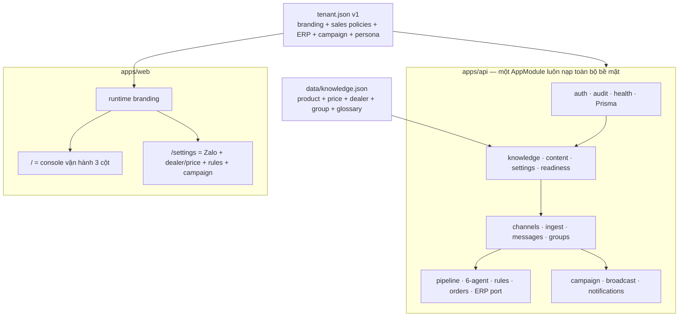
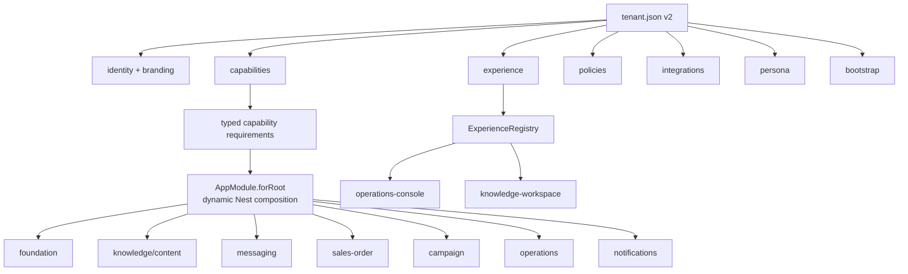
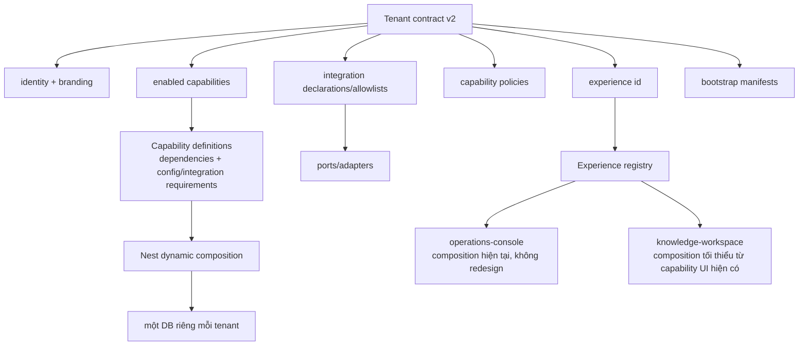

# Rà soát và refactor code đa khách hàng — 20/08/2026

> Phạm vi: `apps/`, `packages/`, `tenants/`, Prisma, web, integration adapters, CI/CD và tài liệu
> kiến trúc/vận hành. Code là nguồn sự thật cho trạng thái as-built. Tài liệu nguồn gốc/pháp lý của
> từng khách trong `docs/khach-hang/**/nguon-goc/` không thuộc phạm vi sửa.
>
> Baseline trước refactor: `pnpm lint` ✅ · `pnpm typecheck` ✅ · `pnpm test` ✅
> (`shared` 84, `tenant` 30, `web` 70, `api` 782 pass/24 skip, `poc-parser` 4,
> route contract 17). 24 test API bị skip gồm 23 Prisma/DB và 1 DeepSeek eval; đây không phải bằng
> chứng integration.

## A. Bản đồ kiến trúc trước refactor



Các boundary đang hoạt động tốt:

- `TENANT`/`TENANT_DIR` bắt buộc, không có tenant mặc định production
  (`packages/tenant/src/tenant.config.ts`).
- Một image không chứa gói tenant; web branding được đọc lúc chạy và đã có artifact contract.
- `ChannelAdapter`, parser port (`OrderParser`), `ErpPort`, `ContentSourcePort` và media store đã tách
  vendor ở phần lớn đường chính.
- Rules tiền/giá là TypeScript tất định; LLM không tính tiền; GĐ1 auto-confirm không gọi ERP.
- Không tìm thấy nhánh production `if/switch` theo slug khách trong `apps/**/src` hoặc
  `packages/**/src`.

### A.1 Bản đồ as-built sau refactor



`knowledge-workspace` + fixture `knowledge-only` là bằng chứng boundary, không phải fake business
engine hay thiết kế khách thứ ba. Fixture không khai channel/parser/ERP, sales policy/persona,
dealer/price/group mapping; tenant loader, backend DI boot và web composition vẫn hợp lệ.

## B. Coupling findings

| Severity | Location | Coupling | Vì sao có vấn đề | Kết quả 20/08 |
|---|---|---|---|---|
| P1 | `packages/tenant/src/tenant.schema.ts` | Tenant v1 bắt buộc sales policy/order/campaign/persona bot | Tenant không bán hàng/chat phải giả cấu hình | **Resolved:** v2 tách 8 concern, validate dependency theo capability, chặn version unsupported |
| P1 | `packages/tenant/src/tenant.schema.ts`, `tenant.config.ts` | Knowledge bắt buộc price/dealer/group | Knowledge đồng nghĩa nguồn sự thật đơn hàng | **Resolved:** knowledge-only schema chỉ cần products/glossary; sales collection chuẩn hóa rỗng |
| P1 | `apps/api/src/app.module.ts` | Mọi tenant nạp toàn bộ graph | Knowledge-only vẫn kéo Zalo/order/campaign | **Resolved:** dynamic composition typed theo owner; DI boot contract chứng minh graph tối thiểu |
| P1 | `apps/web/app/page.tsx` | `/` cố định console đơn hàng | Experience đồng nhất platform | **Resolved:** registry với `operations-console` và `knowledge-workspace` |
| P1 | `apps/web/components/settings/*` | Tab Zalo/order/campaign luôn hiện | UI domain khác nhìn surface không liên quan | **Resolved:** settings composition theo capability và public adapter metadata |
| P1 | `NotificationSettings.tsx`, notification defaults, `zalo-lead-dispatcher.ts` | Operator default cụ thể trong reusable app/runtime | Tenant/operator data leak, có thể gửi nhầm lead | **Resolved:** UI trung tính; mặc định disabled/recipient rỗng; dispatcher fail-closed cho tới khi runtime config có recipient |
| P1 | `apps/api/src/notifications/zalo-lead-dispatcher.ts` | Notifications import `zca-js` trực tiếp | Bỏ qua channel port, khóa notification vào Zalo | **Deferred:** capability đã mount riêng nhưng adapter boundary chưa được sửa trong structural slice này |
| P1 | `apps/api/src/channels/channel.provider.ts` | Bot thiếu token rơi về mock | Boot xanh nhưng dùng sai transport | **Resolved:** bot/hybrid thiếu token fail-fast; test giữ invariant |
| P1 | `packages/shared/src/channel-message.ts` | Envelope chỉ biết platform Zalo | Thêm channel phải đổi shared contract | **Deferred:** wire compatibility được giữ có chủ ý; chưa có channel thứ hai thật để định hình schema |
| P2 | `settings-query.service.ts`, `readiness.service.ts` | Nội dung operations giả định Zalo/order | Readiness chưa phải contributor registry | **Một phần:** surface chỉ mount khi `operations` bật; internals vẫn sales-order-shaped, còn debt |
| P2 | `knowledge.service.ts` | Model chung chứa dealer/group/price | Knowledge foundation mang sales model | **Một phần:** loader có knowledge-only boundary; repository/domain model sâu chưa tách để tránh rewrite |
| P2 | `pipeline/parser.provider.ts`, shared env | Parser chọn env, tenant không khai integration | Tenant không mô tả adapter hợp lệ | **Resolved:** tenant khai allowlist; env mode ngoài allowlist fail-fast |
| P2 | `content/content.module.ts` | Có Drive adapter nhưng bind local manifest | Content source selection chưa chạy thật | **Deferred:** contract có `contentSource`; binding runtime vẫn backlog |
| P2 | `erp/erp-adapter.ts` | Registry ERP là switch + enum đóng | Thêm vendor sửa product registry | **Accepted:** product-code registry, không phải tenant branch; thêm adapter thật mới mở rộng + test |
| P2 | CI/deploy workflows | Tenant inventory lặp thủ công | Onboarding phải sửa hai list | **Một phần:** CI tự liệt kê `tenants/`; deploy allowlist giữ thủ công vì là safety gate |
| P2 | `/zalo`, `ZaloSettings` | Vendor route/surface cấp app | Zalo bị coi là platform | **Một phần:** settings chỉ expose khi integration Zalo có; legacy route còn debt |
| P3 | production comments | Tên khách/vendor trong comment | Drift nhận thức | **Resolved nơi đã chạm;** fixture/docs khách có chủ đích được giữ |
| P3 | `ci-cd.md` | Tài liệu nói 7 job, workflow có 6 | Runbook sai | **Resolved:** tài liệu ghi đúng 6 job |

Không phát hiện P0. P1 là blocker kiến trúc cho tenant domain khác, không phải sự cố dữ liệu hiện tại.

## C. Tenant leakage inventory

| Nhóm | Occurrence tiêu biểu | Phân loại | Xử lý |
|---|---|---|---|
| Tên Ultty/Amico trong production comments | `erp.port.ts`, `shared/erp.ts`, `shared/agents.ts` | documentation only | Sửa wording, không đổi hành vi |
| `apps/api/vitest.setup.ts` đặt `TENANT=ultty` | test fixture | Hợp lệ cho regression hiện tại nhưng không chứng minh domain khác | Giữ và thêm fixture trung tính riêng |
| `apps/web/.env.local` đặt Ultty | local developer config, gitignored | legitimate infrastructure/local state | Không dùng làm contract production |
| Tên operator trong Notification UI/runtime dispatcher | tenant/operator data leak | Base không được chọn người nhận thay tenant | **Resolved:** không còn tên thật trong production default; runtime config bắt buộc |
| Tên khách trong mô tả bảng giá của web settings | tenant UI leak | Base UI không được giả định một thương hiệu | **Resolved:** copy trung tính, không đổi workflow bảng giá |
| SKU/giá/dealer trong `tenants/ultty/**` | tenant data | Đúng boundary | Không đưa vào image/code chung |
| Customer docs trong `docs/khach-hang/**` | documentation/source record | Đúng boundary | Không trung tính hóa |
| Tên `netviet` trong deploy/GCP/compose | legitimate infrastructure legacy | Định danh volume/project đang chạy | Tuyệt đối không đổi máy móc |

## D. Vấn đề boundary domain

As-built có các bounded context thật sau, không cần tạo module rỗng:

```text
Platform foundation
├── tenant contract + runtime resolution
├── auth / RBAC / audit
├── persistence / health
└── integration runtime

Capabilities hiện có
├── knowledge/content
├── messaging (channel-neutral intent, Zalo adapters hiện có)
├── sales-order (parser/orchestrator/rules/orders/handoff)
├── campaign
├── operations/readiness/settings
└── notifications
```

Vấn đề chính không phải logic đơn hàng sai, mà là sales-order từng bị coi là điều kiện boot của toàn
platform. Refactor đã **move/select trước**, không rewrite rules/order lifecycle. Loader, Nest graph
và web contract nay đều có proof knowledge-only; model knowledge nội bộ sâu hơn vẫn là debt.

## E. Vấn đề coupling UI

- Runtime branding phủ metadata/icon/text; palette CSS vẫn tĩnh và chưa phải token theme đầy đủ.
- `HomePage` nay chỉ resolve registry; composition ba cột nằm trong `operations-console`.
- Console components được giữ là capability UI sales-order/operations, không gọi là platform shell.
- Settings tab được lọc theo capability/integration; knowledge-only mặc định vào content.
- Không có code khách thứ ba; `knowledge-workspace` là generic boundary proof.

## F. Kiến trúc đích tối thiểu đã triển khai



Registry là metadata typed + factory composition, không cho business code gọi service theo tên và
không trở thành Service Locator. Adapter mới vẫn là product code được đăng ký một lần; tenant chỉ
chọn adapter đã được platform hỗ trợ.

## G. Kết quả migration/refactor

1. **Tenant foundation — hoàn tất:** contract v2, unsupported version fail-fast, typed capability
   requirements, integration/experience selection, hai tenant pack hiện tại đã migrate.
2. **Backend composition — hoàn tất:** `AppModule.forRoot()` compose foundation + capability graph;
   fixture knowledge-only boot không cần channel/parser/order policy.
3. **Sales-order boundary — hoàn tất ở mức structural:** graph chỉ được nạp khi capability bật; rules,
   order lifecycle và Prisma schema không bị rewrite/migrate.
4. **Web experience foundation — hoàn tất:** UI ba cột được move nguyên vào `operations-console`;
   registry, `knowledge-workspace`, settings composition và runtime public descriptor đã có.
5. **Contracts — hoàn tất:** fixture operations/sales-order và knowledge-only; loader/DI/web tests;
   single-artifact contract chạy hai experience khác nhau.
6. **CI/docs — hoàn tất trong scope:** tenant-pack test tự enumerate inventory; deploy allowlist giữ
   thủ công; tài liệu phân biệt platform với experience Ultty/Zalo/order.

Các increment được thực hiện theo RED/GREEN và gate trước khi đi tiếp. Boundary module/persistence đã
được chạy lại với Postgres thật (`RUN_PRISMA_IT=1`); xem chứng cứ cuối tài liệu.

## H. Những thứ cố ý không đổi

- Không WATA business logic/UI/integration; không suy diễn requirement khách thứ ba.
- Không shared DB, không thêm `tenantId`, không microservice/Kubernetes/control-plane/billing.
- Không đổi Prisma 6, order state machine, rules tính tiền, auto-confirm threshold hay GĐ1 manual ERP.
- Không đổi Zalo adapter behavior hiện hành trừ fail-fast cấu hình sai đã có test.
- Không đổi tên hạ tầng `netviet`, compose project, volume, hostname tenant đang chạy.
- Không sửa tài liệu pháp lý/nguồn gốc hoặc dữ liệu thương mại khách.
- Không deploy/push/trigger workflow từ máy phát triển trong task này.

## Chứng cứ baseline và verification sau refactor

- `pnpm lint`: PASS.
- `pnpm typecheck`: PASS.
- `pnpm test`: PASS sau final review — shared 89, tenant 47, web 78, API 789 pass/24 skip,
  poc-parser 4, deploy route contract 17. 24 API skip của run không DB là 23 Prisma + 1 DeepSeek.
- `pnpm --filter @netviet/tenant test`: PASS, 47/47; gồm inventory test tự nạp mọi tenant pack.
- Workflow YAML parse: PASS; `git diff --check`: PASS.
- Prisma-backed baseline audit chưa được chứng minh tại Phase 0. Sau refactor đã dựng Postgres thật,
  apply đủ 15 migration, seed thành công và chạy `RUN_PRISMA_IT=1`: **112 file pass, 809 test pass,
  1 DeepSeek external eval skip**. Không có Prisma integration test bị skip.
- `pnpm --filter @netviet/web build`: PASS; `pnpm test:tenant-runtime`: PASS với cùng `BUILD_ID`
  cho operations và knowledge-only; Playwright: **6/6 PASS**.
- App image và Flowise image build: PASS; image-isolation trên app image cuối: **3/3 PASS**, không
  có tenant pack/fixture data trong image và tenant loader code vẫn hiện diện.
- `pnpm audit --audit-level high`: PASS (0 high/critical). Audit vẫn báo 11 moderate + 1 low từ
  dependency bắc cầu AdminJS/React Router, MCP/Hono và Vitest/PostCSS; theo dõi ở debt dependency.
