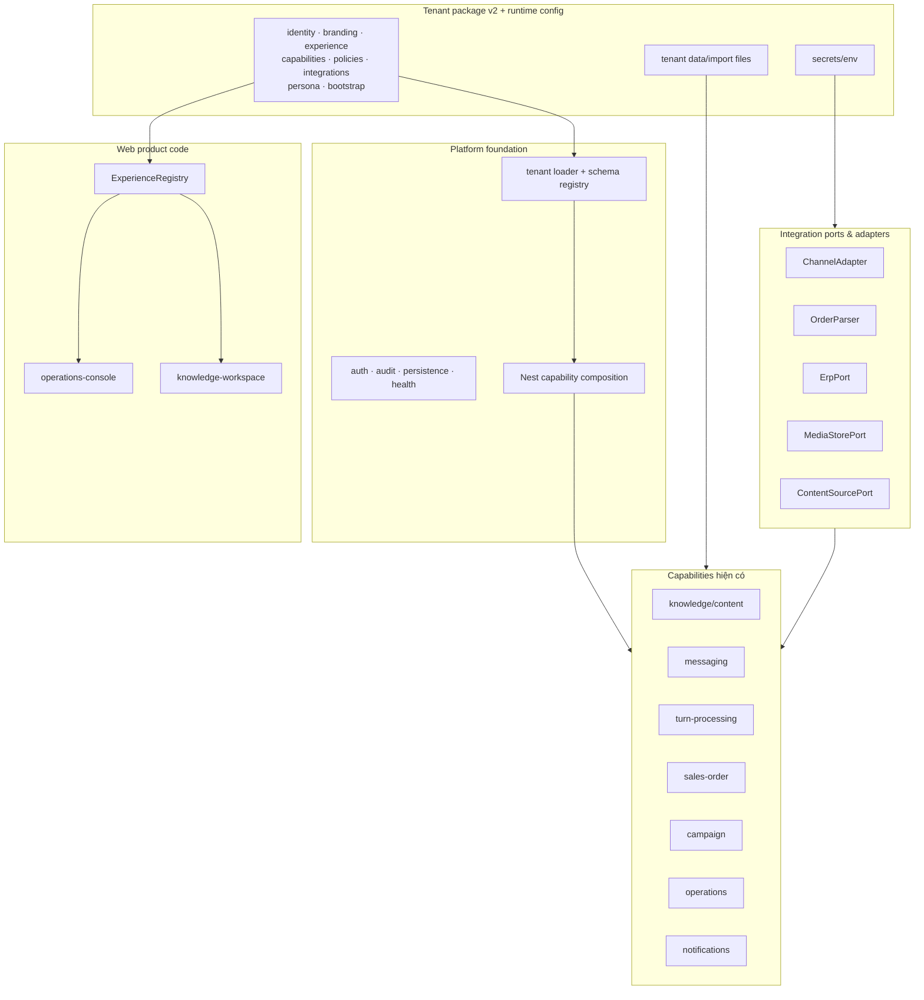

# KIẾN TRÚC TỔNG QUÁT — NỀN TẢNG NETVIET ĐA KHÁCH

> **Bổ sung 27/08/2026 — bốn mặt phẳng nền tảng.** Kiến trúc core/tenant mô tả ở đây được đặt
> vào bốn mặt phẳng (tenant data · shared control · AI engineering · agentic ops) tại
> [reference-platform-stack.md §2](reference-platform-stack.md#2-bốn-mặt-phẳng-của-nền-tảng).
> Điều kiện để một công nghệ được coi là **ADOPT** — và stack tham chiếu `ultty-gd1-test` hiện
> đứng ở đâu — nằm ở cùng tài liệu đó. Phân loại công nghệ: [tech-radar.md](tech-radar.md).

> **Vai trò:** tài liệu kiến trúc tổng quát cao nhất của hệ thống. File này mô tả mô hình sản phẩm dùng chung cho mọi khách hàng: cách chia layer/module, ranh giới core/tenant, runtime tenant, cách ly dữ liệu, port/adapter, source-of-truth và các bất biến bảo mật.
>
> **Không chứa trạng thái tiến độ.** Mọi trạng thái đã xong/chưa làm/blocked nằm duy nhất ở `tong-quan.md`. File này cũng không ghi lịch sử quyết định, không mô tả riêng khách nào và không dùng ví dụ dữ liệu thương mại của khách.
>
> **As-built 20/08/2026:** tenant contract v2, capability-aware Nest composition và web experience
> registry đã có. Tài liệu [`he-thong.md`](he-thong.md) mô tả chi tiết experience
> `operations-console` + capability `sales-order`; nó không đại diện cho mọi tenant/domain.

---

## 1. Nguyên tắc kiến trúc

Hệ thống được triển khai theo mô hình:

```text
Một repo
Một codebase
Một application image

              Base chung
                  │
        ┌─────────┴─────────┐
        │                   │
    tenant package      tenant package
```

Mỗi khách hàng chạy trong một **silo deployment** riêng:

```text
Customer stack
├── app stack
├── PostgreSQL
├── secrets
├── media/object bucket
├── tenant data
└── domain
```

Bất biến:

- Không fork repo/code theo khách.
- Không thêm nhánh kiểu `if tenant === ...` hoặc `if customer === ...`.
- Chưa dùng shared DB và chưa thêm `tenantId`.
- Application image không chứa dữ liệu thương mại của bất kỳ tenant nào.
- Tenant data được cấp vào runtime bằng cấu hình/mount/secret riêng.
- Thiếu tenant/config bắt buộc fail-fast.
- Một image/artifact phải chạy được nhiều tenant bằng runtime configuration.
- Năng lực mới nằm ở base chung; khác biệt khách nằm ở config/data/adapter.

## 2. Layer hệ thống



### 2.1 Platform foundation và capability

Foundation là phần dùng chung không biết tenant cụ thể nào tồn tại: tenant loader/schema, auth/RBAC,
audit, persistence, health và composition runtime. Domain code hiện có được định danh thành capability:

| Capability | Phạm vi as-built |
|---|---|
| `knowledge` | catalog/content/glossary và bootstrap nguồn tri thức |
| `messaging` | channel adapter, outbound, group participant, kho tin nhắn |
| `turn-processing` | parser, orchestrator 6 vai, ngữ cảnh, mạch hội thoại, kho lượt, đường trả lời, SSE agent theater |
| `sales-order` | rules/giá, order lifecycle, duyệt tay, handoff ERP |
| `campaign` | campaign persistence/scheduler/delivery |
| `operations` | settings, master data, readiness |
| `notifications` | lead notification surfaces hiện hành |

> **Đảo quyền sở hữu 24/08/2026 — `turn-processing`.** Cho tới bản này, `sales-order` sở hữu
> parser, `AgentOrchestrator`, `PipelineService`, mạch hội thoại, kho lượt và cả đường gửi câu trả
> lời. Hệ quả: một khách chỉ muốn AI đọc/trả lời tin nhắn vẫn phải khai bảng giá, đại lý, chính sách
> bán hàng và một cổng ERP. Không ai quyết định như vậy — `sales-order` đơn giản là capability duy
> nhất tồn tại lúc pipeline được viết, nên nó thừa kế tất cả.
>
> Ba chỗ rò rỉ chỉ lộ ra khi có một khách trung tính chạy thật, không phải khi đọc code:
> `AgentOrchestrator.dispatch()` gọi `tenantRetailAdvice()` cho **mọi** câu hỏi sản phẩm;
> `PipelineService.runPipelineTurn()` gọi `tenantOrderAutomation()` cho **mọi** lượt; và
> `assessRisk(senderKnown=false)` khiến khách không có sổ đại lý bị giám sát đẩy sang người thật ở
> **mọi** lượt — tức AI không bao giờ trả lời. Cả ba nay đã gắn vào đúng capability đòi hỏi chúng.
>
> `OrdersRepository` vẫn còn nhưng là một **góc nhìn**: composition nối nó vào cùng instance
> `TurnRecordsRepository` bằng `useExisting`. Bảng Postgres (`Order`) và kiểu `OrderView` **giữ
> nguyên** — ranh giới cần sửa là quyền sở hữu, không phải lưu trữ, nên không có di trú dữ liệu.
>
> Bằng chứng chạy được: `apps/api/src/turns/neutral-tenant.boot.spec.ts` (boot Nest thật, không
> resolve được `OrdersService`/`OrdersRepository`/`OrderCommandAdapter`/`ErpPort`/`CampaignService`),
> `neutral-turn.spec.ts` (một lượt đi hết đường và trả lời ra kênh, kèm trace),
> `turn-processing.composition.spec.ts` (bảng sở hữu).

`packages/tenant/src/tenant.schema.ts` giữ metadata dependency/config/integration bắt buộc theo
capability. `apps/api/src/app-composition.ts` gắn controller/provider/module với owner typed;
`AppModule.forRoot()` chỉ đưa phần được bật vào Nest graph. Đây là composition metadata, không phải
Service Locator: Nest vẫn khởi tạo và resolve dependency bình thường.

Core/capability code chỉ phụ thuộc interface, schema và dữ liệu runtime đã validate. Nó không chứa
giá, SKU, đại lý, FAQ, media catalog, campaign content hay thông điệp thương mại riêng khách.

### 2.2 Tenant package

Tenant package là gói dữ liệu/cấu hình, không phải fork code. Gói này chứa:

- `schemaVersion: 2`, slug và `identity`;
- runtime `branding`;
- một `experience` đã đăng ký;
- danh sách `capabilities` được bật;
- `policies`, `integrations`, `persona` theo capability;
- path `bootstrap` tương đối tới seed/import;
- smoke fixture tùy chọn của chính tenant.

Version khác 2 hoặc field không thuộc contract bị chặn, không silent migration. Capability dependency
được validate chéo: ví dụ `turn-processing` yêu cầu `knowledge` + `messaging` + integration `parser` +
`persona.turnProcessing`, còn `sales-order` yêu cầu thêm chính `turn-processing` và `policies.salesOrder`. Tenant chỉ bật `knowledge` không phải khai Zalo, dealer, price, order hay group
mapping.

Tenant package là **hạt giống**, không phải nguồn sự thật vĩnh viễn. Khi stack chạy với PostgreSQL, runtime source-of-truth là DB; thay đổi vận hành đi qua `/settings`, admin/importer/MCP và được audit.

### 2.3 Experience/UI

Experience là product code dùng lại được, không phải tenant code:

```text
tenant.json.experience
        ↓
ExperienceRegistry
        ├── operations-console  (console hiện hành)
        └── knowledge-workspace (knowledge-only proof)
```

Registry khai capability UI bắt buộc; route `/` resolve ID đã validate và fail rõ nếu registry thiếu.
Settings navigation được compose từ capability + public integration metadata. Branding được đọc lúc
runtime; đổi tenant không rebuild image. Shared primitive/design infrastructure tiếp tục dùng chung.

### 2.4 Ports/adapters

Mọi tích hợp bên ngoài đi qua port:

| Port | Trách nhiệm | Adapter ví dụ |
|---|---|---|
| `ChannelAdapter` | gửi tin theo kênh; listener/poller normalize inbound | mock, Bot Platform, zca, hybrid router |
| `OrderParser` | intent + extraction có schema | Claude, DeepSeek, Flowise |
| `ErpPort` | đọc/tạo dữ liệu ERP khi phase cho phép | mock, ERP adapter |
| `MediaStore`/`CatalogStore`/`MediaFetcher` | lưu/đọc media qua boundary | none, local, S3-compatible, HTTP |
| `ContentSourcePort` | đọc manifest/content từ nguồn ngoài | local manifest, Google Drive |

Các port trên là symbol as-built; `InvoicePort`/`DocumentPort` chưa tồn tại và không được mô tả như
đã triển khai. Adapter được tenant allow/chọn rồi env chọn mode cụ thể trong allowlist; mode ngoài
contract bị chặn. Credential nằm trong secret/env riêng, không nằm trong `tenant.json`. Business logic
không import trực tiếp SDK nhà cung cấp. Riêng notification-to-Zalo còn bypass channel port và được
ghi nhận là debt, không dùng nó làm mẫu cho adapter mới.

## 3. Code vs tenant data

| Thuộc code/base | Thuộc tenant/runtime data |
|---|---|
| tenant/capability/experience schema, validation | identity, branding, experience selection |
| parser schema, order schema, deterministic validation | SKU, alias, glossary |
| rules engine deterministic | bảng giá, kỳ giá, deal riêng |
| state machine đơn/campaign | đại lý, map nhóm, branch |
| port/interface + adapter registry | adapter allowlist/selection; credential ở secret riêng |
| experience/capability UI | FAQ, catalog, video link, campaign content |
| readiness/eval framework | golden dataset do khách cung cấp |
| RBAC engine | user thật và role assignment |

Quy tắc: nếu dữ liệu có thể thay đổi theo khách hoặc theo tháng mà không cần deploy code, nó phải là runtime data/source-of-truth, không nằm trong `apps/` hoặc `packages/`.

## 4. Runtime tenant và fail-fast

Khi boot, application phải:

1. resolve tenant bằng `TENANT` hoặc `TENANT_DIR`;
2. đọc và validate `tenant.json`;
3. kiểm `schemaVersion`, experience, capability dependency/policy/persona/bootstrap;
4. validate integration allowlist và required secrets theo mode capability đang bật;
5. compose Nest modules/controllers/providers và web experience;
6. seed/import dữ liệu nếu stack mới và được phép;
7. fail-fast nếu tenant/config/secrets không đủ để chạy mode đã chọn.

Không có tenant mặc định ở production. Default tenant trong test chỉ được dùng cho test fixture rõ ràng, không được leak sang runtime thật.

## 5. Một image cho nhiều khách

Image build phải độc lập tenant:

- không copy dữ liệu thương mại thật vào image;
- không hard-code branding/tên khách vào bundle;
- không bake secret vào image;
- không yêu cầu rebuild image để đổi tenant;
- cùng digest image có thể chạy nhiều stack khác nhau bằng env/mount riêng;
- contract test phải chứng minh image không chứa tenant data thật.

Tenant data được cấp qua một trong các cơ chế:

- mounted tenant directory;
- object storage/import job;
- secret manager/env;
- bootstrap package trong môi trường được kiểm soát;
- DB đã seed trước đó.

## 6. Source-of-truth lifecycle

Runtime source-of-truth nằm trong PostgreSQL của silo tenant. Các nguồn nhập chỉ là upstream:

```text
tenant seed / import file / content source
        ↓ preview + validate + diff
PostgreSQL runtime source-of-truth
        ↓ reload/apply
pipeline + rules + settings UI
```

Yêu cầu chung:

- preview trước khi ghi;
- validation schema + validation nghiệp vụ;
- idempotent import;
- diff dễ đọc;
- provenance rõ nguồn;
- không overwrite dữ liệu operator sửa tay khi chưa có policy;
- audit mọi mutation;
- reload/apply không cần sửa code.

## 7. Data isolation

Mỗi silo có:

- PostgreSQL riêng;
- DB user/password riêng;
- secret namespace riêng;
- media/object bucket hoặc prefix riêng;
- domain riêng;
- runtime env riêng;
- backup/restore riêng;
- deployment logs và audit riêng.

Không chia DB giữa khách trong giai đoạn này. Vì vậy không dùng `tenantId` để giả lập isolation logic. Ranh giới dữ liệu là ranh giới hạ tầng.

Nếu sau này mở mô hình pooled/shared DB, đó là kiến trúc mới: cần RLS/tenantId toàn schema, migration, test isolation và threat model riêng. Không trộn hai mô hình trong cùng phase.

## 8. LLM và rules

LLM chỉ được:

- phân loại intent;
- extract dữ liệu từ ngôn ngữ tự nhiên;
- nhận diện ngữ cảnh bounded;
- sinh câu trả lời nháp theo dữ liệu đã duyệt.

LLM không được:

- tính tiền;
- quyết giá;
- quyết VAT/COD/ship/công nợ/khuyến mãi;
- tự dùng dữ liệu chưa approved;
- tự suy luận khi thiếu source-of-truth.

Rules engine deterministic chịu trách nhiệm mọi số tiền và mọi quyết định nghiệp vụ có ảnh hưởng tài chính/vận hành. Thiếu dữ liệu phải fail-closed.

## 9. Security invariants

Bắt buộc trước pilot dữ liệu thật:

- auth bật, không dùng mode anonymous/public;
- session/cookie nếu dùng phải persistent, HttpOnly, Secure, SameSite phù hợp;
- mutation có CSRF/origin protection phù hợp với auth mode;
- RBAC bảo vệ settings, source-of-truth, campaign approve/schedule, manual send/retry/cancel, demo/simulate, admin, reload;
- secret không hard-code;
- audit thao tác quan trọng;
- input validation ở mọi boundary;
- parser provider phải thuộc danh sách vendor được phép cho dữ liệu thật;
- media store bền vững khi dùng real channel;
- readiness gate không cho go-live nếu thiếu dữ liệu/cấu hình bắt buộc.

## 10. Readiness và go-live

Hệ thống phải phân biệt:

- **Code complete:** năng lực code, schema, UI, tests, migration và readiness checks đã có.
- **Go-live ready:** dữ liệu/cấu hình/credential/kênh/golden eval của tenant cụ thể đã đủ.

Một tenant chưa đủ dữ liệu vẫn có thể code-complete nếu hệ thống:

- hiển thị rõ thiếu dữ liệu;
- không dùng số giả;
- không fallback sang kỳ cũ;
- không tự suy diễn;
- chặn outbound nguy hiểm;
- đưa thiếu sót vào readiness checklist.

## 11. Những điều không làm trong kiến trúc hiện tại

- Không fork code theo khách.
- Không thêm tenant-specific branch trong core.
- Không dùng shared DB/tenantId trong phase silo.
- Không nhét tenant commercial data vào app image.
- Không để import ghi đè thủ công không kiểm soát.
- Không dùng broadcast/scheduler không persistence cho outbound production.
- Không coi demo/mock path là production readiness.
