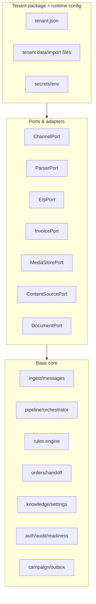

# KIẾN TRÚC TỔNG QUÁT — NỀN TẢNG NETVIET ĐA KHÁCH

> **Vai trò:** tài liệu kiến trúc tổng quát cao nhất của hệ thống. File này mô tả mô hình sản phẩm dùng chung cho mọi khách hàng: cách chia layer/module, ranh giới core/tenant, runtime tenant, cách ly dữ liệu, port/adapter, source-of-truth và các bất biến bảo mật.
>
> **Không chứa trạng thái tiến độ.** Mọi trạng thái đã xong/chưa làm/blocked nằm duy nhất ở `tong-quan.md`. File này cũng không ghi lịch sử quyết định, không mô tả riêng khách nào và không dùng ví dụ dữ liệu thương mại của khách.

---

## 1. Nguyên tắc kiến trúc

Hệ thống được triển khai theo mô hình:

```text
Một repo
Một codebase
Một application image

              Base chung
                  │
        ┌─────────┴─────────┐
        │                   │
    tenant package      tenant package
```

Mỗi khách hàng chạy trong một **silo deployment** riêng:

```text
Customer stack
├── app stack
├── PostgreSQL
├── secrets
├── media/object bucket
├── tenant data
└── domain
```

Bất biến:

- Không fork repo/code theo khách.
- Không thêm nhánh kiểu `if tenant === ...` hoặc `if customer === ...`.
- Chưa dùng shared DB và chưa thêm `tenantId`.
- Application image không chứa dữ liệu thương mại của bất kỳ tenant nào.
- Tenant data được cấp vào runtime bằng cấu hình/mount/secret riêng.
- Thiếu tenant/config bắt buộc fail-fast.
- Một image/artifact phải chạy được nhiều tenant bằng runtime configuration.
- Năng lực mới nằm ở base chung; khác biệt khách nằm ở config/data/adapter.

## 2. Layer hệ thống



### 2.1 Core

Core là phần dùng chung, không biết tenant cụ thể nào tồn tại. Core chứa:

- channel ingestion chuẩn hóa tin nhắn;
- message persistence, idempotency, retry/replay;
- parser orchestration;
- deterministic rules engine;
- order lifecycle và handoff;
- settings/source-of-truth;
- campaign/outbox;
- content knowledge;
- auth/RBAC/audit;
- readiness/health/eval.

Core chỉ được phụ thuộc vào interface, schema và dữ liệu runtime đã validate. Core không chứa giá, SKU, đại lý, FAQ, media catalog, campaign content hay thông điệp thương mại riêng khách.

### 2.2 Tenant package

Tenant package là gói dữ liệu/cấu hình, không phải fork code. Gói này chứa:

- danh tính tenant: slug, display name, branding;
- persona parser/bot;
- danh sách feature/integration được bật;
- seed mặc định nếu cần bootstrap;
- cấu hình policy runtime ban đầu;
- manifest import/content nếu tenant cung cấp;
- metadata hạ tầng riêng khi deploy.

Tenant package là **hạt giống**, không phải nguồn sự thật vĩnh viễn. Khi stack chạy với PostgreSQL, runtime source-of-truth là DB; thay đổi vận hành đi qua `/settings`, admin/importer/MCP và được audit.

### 2.3 Ports/adapters

Mọi tích hợp bên ngoài đi qua port:

| Port | Trách nhiệm | Adapter ví dụ |
|---|---|---|
| `ChannelPort` | nhận/gửi tin theo kênh | mock, official bot, userbot, future OA |
| `ParserPort` | hiểu ngôn ngữ, intent, extraction | mock, Claude, Flowise, provider khác |
| `ErpPort` | đọc/tạo dữ liệu ERP khi phase cho phép | mock, ERP adapter |
| `InvoicePort` | hóa đơn/draft invoice | none, invoice provider |
| `MediaStorePort` | lưu binary bền vững | none, local, S3-compatible |
| `ContentSourcePort` | đọc manifest/content từ nguồn ngoài | local import, Drive, future source |
| `DocumentPort` | xuất tài liệu/PDF/catalog nếu phase bật | none, PDF provider |

Port nằm trong base; adapter được chọn bằng config runtime/tenant. Business logic không import trực tiếp SDK nhà cung cấp.

## 3. Code vs tenant data

| Thuộc code/base | Thuộc tenant/runtime data |
|---|---|
| parser schema, order schema, validation | SKU, alias, glossary |
| rules engine deterministic | bảng giá, kỳ giá, deal riêng |
| state machine đơn/campaign | đại lý, map nhóm, branch |
| port/interface | chọn adapter, credential, endpoint |
| UI/settings generic | FAQ, catalog, video link, campaign content |
| readiness/eval framework | golden dataset do khách cung cấp |
| RBAC engine | user thật và role assignment |

Quy tắc: nếu dữ liệu có thể thay đổi theo khách hoặc theo tháng mà không cần deploy code, nó phải là runtime data/source-of-truth, không nằm trong `apps/` hoặc `packages/`.

## 4. Runtime tenant và fail-fast

Khi boot, application phải:

1. resolve tenant bằng `TENANT` hoặc `TENANT_DIR`;
2. đọc và validate `tenant.json`;
3. validate feature/integration config;
4. validate required secrets theo mode;
5. seed/import dữ liệu nếu stack mới và được phép;
6. fail-fast nếu tenant/config/secrets không đủ để chạy mode đã chọn.

Không có tenant mặc định ở production. Default tenant trong test chỉ được dùng cho test fixture rõ ràng, không được leak sang runtime thật.

## 5. Một image cho nhiều khách

Image build phải độc lập tenant:

- không copy dữ liệu thương mại thật vào image;
- không hard-code branding/tên khách vào bundle;
- không bake secret vào image;
- không yêu cầu rebuild image để đổi tenant;
- cùng digest image có thể chạy nhiều stack khác nhau bằng env/mount riêng;
- contract test phải chứng minh image không chứa tenant data thật.

Tenant data được cấp qua một trong các cơ chế:

- mounted tenant directory;
- object storage/import job;
- secret manager/env;
- bootstrap package trong môi trường được kiểm soát;
- DB đã seed trước đó.

## 6. Source-of-truth lifecycle

Runtime source-of-truth nằm trong PostgreSQL của silo tenant. Các nguồn nhập chỉ là upstream:

```text
tenant seed / import file / content source
        ↓ preview + validate + diff
PostgreSQL runtime source-of-truth
        ↓ reload/apply
pipeline + rules + settings UI
```

Yêu cầu chung:

- preview trước khi ghi;
- validation schema + validation nghiệp vụ;
- idempotent import;
- diff dễ đọc;
- provenance rõ nguồn;
- không overwrite dữ liệu operator sửa tay khi chưa có policy;
- audit mọi mutation;
- reload/apply không cần sửa code.

## 7. Data isolation

Mỗi silo có:

- PostgreSQL riêng;
- DB user/password riêng;
- secret namespace riêng;
- media/object bucket hoặc prefix riêng;
- domain riêng;
- runtime env riêng;
- backup/restore riêng;
- deployment logs và audit riêng.

Không chia DB giữa khách trong giai đoạn này. Vì vậy không dùng `tenantId` để giả lập isolation logic. Ranh giới dữ liệu là ranh giới hạ tầng.

Nếu sau này mở mô hình pooled/shared DB, đó là kiến trúc mới: cần RLS/tenantId toàn schema, migration, test isolation và threat model riêng. Không trộn hai mô hình trong cùng phase.

## 8. LLM và rules

LLM chỉ được:

- phân loại intent;
- extract dữ liệu từ ngôn ngữ tự nhiên;
- nhận diện ngữ cảnh bounded;
- sinh câu trả lời nháp theo dữ liệu đã duyệt.

LLM không được:

- tính tiền;
- quyết giá;
- quyết VAT/COD/ship/công nợ/khuyến mãi;
- tự dùng dữ liệu chưa approved;
- tự suy luận khi thiếu source-of-truth.

Rules engine deterministic chịu trách nhiệm mọi số tiền và mọi quyết định nghiệp vụ có ảnh hưởng tài chính/vận hành. Thiếu dữ liệu phải fail-closed.

## 9. Security invariants

Bắt buộc trước pilot dữ liệu thật:

- auth bật, không dùng mode anonymous/public;
- session/cookie nếu dùng phải persistent, HttpOnly, Secure, SameSite phù hợp;
- mutation có CSRF/origin protection phù hợp với auth mode;
- RBAC bảo vệ settings, source-of-truth, campaign approve/schedule, manual send/retry/cancel, demo/simulate, admin, reload;
- secret không hard-code;
- audit thao tác quan trọng;
- input validation ở mọi boundary;
- parser provider phải thuộc danh sách vendor được phép cho dữ liệu thật;
- media store bền vững khi dùng real channel;
- readiness gate không cho go-live nếu thiếu dữ liệu/cấu hình bắt buộc.

## 10. Readiness và go-live

Hệ thống phải phân biệt:

- **Code complete:** năng lực code, schema, UI, tests, migration và readiness checks đã có.
- **Go-live ready:** dữ liệu/cấu hình/credential/kênh/golden eval của tenant cụ thể đã đủ.

Một tenant chưa đủ dữ liệu vẫn có thể code-complete nếu hệ thống:

- hiển thị rõ thiếu dữ liệu;
- không dùng số giả;
- không fallback sang kỳ cũ;
- không tự suy diễn;
- chặn outbound nguy hiểm;
- đưa thiếu sót vào readiness checklist.

## 11. Những điều không làm trong kiến trúc hiện tại

- Không fork code theo khách.
- Không thêm tenant-specific branch trong core.
- Không dùng shared DB/tenantId trong phase silo.
- Không nhét tenant commercial data vào app image.
- Không để import ghi đè thủ công không kiểm soát.
- Không dùng broadcast/scheduler không persistence cho outbound production.
- Không coi demo/mock path là production readiness.
