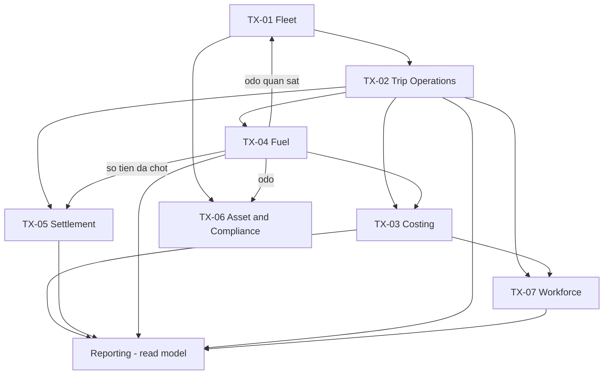

# HỢP ĐỒNG TRANSPORT DOMAIN v0 (T1)

- **Ngày lập:** 28/08/2026
- **Mốc:** `TRANSPORT DOMAIN CONTRACT v0`
- **Đo trên:** `origin/main` = `2ad6a15`
- **Nguồn nghiệp vụ:** [`../khach-hang/van-tai-viet/nghiep-vu/nguon-su-that-van-tai.md`](../khach-hang/van-tai-viet/nghiep-vu/nguon-su-that-van-tai.md) (T0). Mọi mã `VT-*`, `C-*`, `OPEN-*` dưới đây trỏ về tài liệu đó.
- **Ràng buộc kiến trúc:** [`nen-tang-da-khach.md`](nen-tang-da-khach.md) — file này **không được mâu thuẫn** với nó.

> **File này là tài liệu NỀN TẢNG, không phải tài liệu của một khách.** Theo quy ước
> [`../README.md`](../README.md), `kien-truc/` "không nhắc tên khách". Khách vận tải đầu tiên xuất
> hiện ở đây **chỉ** dưới vai *reference tenant*, và mọi tham số riêng của họ nằm ở T0 hoặc ở gói
> `tenants/<slug>/`, không nằm trong file này.

> **Trạng thái triển khai (cập nhật 30/08/2026): T2 · T2.1 · T3 đã có code trên `main`/nhánh T3.**
> Dòng cũ ở đây ghi "chưa có dòng code nào" — đúng lúc lập T1 (28/08), sai kể từ T2. Mọi thứ trong
> file này là *thiết kế đề xuất* **trừ** ba mục as-built [§18.1](#181-t2-as-built--transport-core-v0--code-only--partial)
> (T2), [§18.2](#182-t21-as-built--siết-bất-biến-tầng-lưu-trữ-issue-79-review-khép-ở-83) (T2.1) và
> [§18.3](#183-t3-as-built--costing--driver-fund-issue-85) (T3) — ba mục đó ghi **cái đã chạy**, và
> là chỗ duy nhất trong file được sửa sau khi T1 khép. T4–T7 vẫn chưa có dòng code nào.

> **🟡 GIAI ĐOẠN DEMO.** Nghiệp vụ còn 23 điểm chưa có câu trả lời từ khách. Thay vì chặn, mỗi điểm
> chặn được cấp **một giả định mặc định** ở [§21](#21-giả-định-giai-đoạn-demo-gd-xx) mang mã
> `GD-xx`. Giả định là **quyết định của chúng ta**, không phải lời khách — chúng nằm ở một mục
> riêng, có lý do và **chi phí đảo ngược**, để lúc khách trả lời thì biết ngay phải sửa gì. Trước
> khi chạy thật với dữ liệu khách, mọi `GD-xx` phải được xác nhận.

---

## 1. Định nghĩa sản phẩm / vertical

**Transport Domain** là một **vertical dùng lại được** của nền tảng Nexagnet: tập năng lực nghiệp
vụ đủ để vận hành một **doanh nghiệp vận tải đường bộ quy mô nhỏ** — đội xe, chuyến hàng, chi phí
chuyến, quỹ tạm ứng lái xe, nhiên liệu ký nợ, công nợ nhiều đối tượng, bảo dưỡng, giấy tờ tuân thủ
và lương lái xe.

Xếp tầng:

```text
NEXAGNET PLATFORM            (foundation: tenant, auth, workflow, observability, release, integrations)
        ↓
TRANSPORT DOMAIN             (vertical dùng lại: Fleet, Trip, Costing, Fuel, Settlement, Asset, Workforce)
        ↓
TRANSPORT REFERENCE TENANT   (khách vận tải #1 — gói cấu hình + dữ liệu, KHÔNG phải fork code)
        ↓
TRANSPORT TENANT #2 / #3 ... (khách vận tải sau — gần như giống hệt, khác ở policy/config/data/adapter)
```

**Điều làm nên "dùng lại được"** — và cũng là tiêu chí nghiệm thu của cả vertical: khách vận tải
thứ hai lên được hệ thống mà **không sinh thêm một dòng code nào trong `apps/` hay `packages/`**,
chỉ thêm `tenants/<slug>/`. Nếu một yêu cầu của khách #2 buộc phải sửa base, thì hoặc yêu cầu đó là
một năng lực miền còn thiếu (thêm vào base cho **mọi** khách), hoặc thiết kế đã sai chỗ nào đó — nó
**không bao giờ** là lý do để thêm một nhánh theo tên khách.

---

## 2. Phạm vi v0 / v1

### 2.1. v0 — chính là T0 + T1 này

| Có trong v0 | Không có trong v0 |
|---|---|
| Truy vết nguồn nghiệp vụ (T0) | Bất kỳ schema Prisma nào |
| Hợp đồng miền (file này) | Bất kỳ capability id mới nào |
| Ranh giới Platform / Domain / Tenant | Bất kỳ endpoint nào |
| Danh sách platform gap + giả định demo | Bất kỳ UI nào |

### 2.2. v1 (demo) — phạm vi nghiệp vụ, chạy trên giả định `GD-xx`

| Nhóm | Trong v1 demo | Giả định áp dụng |
|---|---|---|
| Fleet (xe, lái xe, gán xe) | ✅ | — |
| Trip 3 loại + vòng đời | ✅ | `GD-01`, `GD-02`, `GD-05`, `GD-06` |
| Chi phí chuyến + Sổ quỹ lái xe | ✅ | `GD-10` |
| Nhiên liệu + đối soát bảng kê | ✅ | `GD-07`, `GD-08`, `GD-09`, `GD-11` |
| Công nợ khách / cây xăng / đối tác + hoa hồng | ✅ | `GD-15`, `GD-16` |
| Bảo dưỡng + giấy tờ tuân thủ | ✅ | `GD-18` |
| Lương lái xe | ⚠️ một phần | `GD-12` (**khấu trừ TẮT**), `GD-14` |
| Báo cáo lãi/lỗ + công nợ tổng hợp | ✅ biên trực tiếp | `GD-13` (**phân bổ chi phí cố định TẮT**) |
| Vận đơn / container / seal | ❌ | Nguồn tự đánh dấu *"tuỳ chọn mở rộng"* (VT-066) |
| GPS thời gian thực | ❌ | `GD-17` |
| Vision/OCR đọc phiếu dầu | ❌ | §12 — base không phụ thuộc |
| Kế toán pháp định, hóa đơn điện tử, ERP | ❌ | `GD-16` |

> **Hai chỗ cố ý TẮT trong demo là quyết định có chủ ý, không phải thiếu sót.** `GD-12` (trừ lương)
> tắt vì rủi ro pháp lý; `GD-13` (phân bổ chi phí cố định) tắt vì không có công thức. Cả hai đều
> **hiện diện trên màn hình dưới dạng nhãn rõ ràng** ("biên trực tiếp", "chưa gồm chi phí cố định")
> — demo không được để khách hiểu nhầm là con số đã đầy đủ.

---

## 3. Ranh giới Platform / Transport / Tenant

### 3.1. Nền tảng Nexagnet — as-built, đo trên `main`

| Nền tảng đã có | Bằng chứng |
|---|---|
| Nạp gói tenant + zod schema + fail-fast lúc boot | `packages/tenant/src/tenant.schema.ts` |
| Composition theo capability với owner typed | `apps/api/src/app-composition.ts` — `CapabilityId \| 'foundation'` |
| Auth phiên + guard + `AuditLog` | `apps/api/src/auth/*`, `prisma/schema.prisma:638` |
| Workflow bền vững (Hatchet) — `foundation`, khách không khai vẫn boot | `apps/api/src/workflow/`, `app-composition.ts` |
| Observability: traceId W3C, `telemetry.decision()` mã lý do có kiểu | `apps/api/src/observability/`, `.claude/rules/ecc/common/code-review.md` |
| Port/adapter cho mọi tích hợp ngoài | `nen-tang-da-khach.md` §2.4 |
| Silo deployment mỗi khách một stack + DB riêng, **chưa có `tenantId`** | `nen-tang-da-khach.md` §1, §7 |
| Nguồn gốc dữ liệu chung (`SourceProvenance`) | `prisma/schema.prisma:392` |
| Rule/price có version + activation | `RuleConfigVersion`, `PricePeriod` |

**Bất biến của nền tảng mà Transport phải tôn trọng — không thương lượng:**

```text
MỘT REPO · MỘT CODEBASE · MỘT APPLICATION IMAGE · NHIỀU TENANT · TRẠNG THÁI TENANT CÁCH LY
```

Postgres = **sự thật nghiệp vụ**. Hatchet = **sự thật thực thi bền vững**. OTel/ClickHouse =
**sự thật quan sát**. Git/release = **trạng thái phần mềm mong muốn**. Không cái nào thay vai cái
nào.

### 3.2. Bảng phân định

| Thuộc về | Nguyên tắc | Ví dụ |
|---|---|---|
| **A — Platform primitive** | Mọi vertical đều cần, không biết gì về vận tải | Tenant loader · auth/permission · audit · workflow bền vững · observability · lưu file + bằng chứng · **tiền & làm tròn** · **ngày nghiệp vụ theo múi giờ tenant** · **sổ cái append-only + reversal** · **kỳ và khoá kỳ** |
| **B — Transport domain capability** | Mọi khách **vận tải** đều cần, không khách nào không cần | Vehicle · Driver · Trip 3 loại · TripExpense · DriverFund · FuelEntry · đối soát bảng kê · công nợ khách/cây xăng/đối tác · hoa hồng 2 chiều · bảo dưỡng · giấy tờ hết hạn · lương lái xe |
| **C — Tenant policy/config** | Cùng hình dạng, khác tham số | Ngưỡng cảnh báo 15/30 ngày · định mức lít/100km từng xe · công thức hoa hồng · danh mục khoản chi · tham số lương · dung sai đối soát · **có bật duyệt tạm ứng hay không** |
| **D — Tenant data/content** | Dữ liệu vận hành, không bao giờ vào image | Danh sách xe · lái xe · cây xăng · khách hàng · đối tác · giá tuyến |
| **E — Tenant integration** | Adapter ra hệ thống ngoài, qua port | GPS provider · phần mềm kế toán · hóa đơn điện tử · **định dạng bảng kê cây xăng** |

### 3.3. Phép thử khi phân vân

Một yêu cầu thuộc **B** chỉ khi **cả ba** đúng:

1. Một khách vận tải khác **cũng sẽ cần nó** — không phải "có thể sẽ".
2. Tắt nó đi thì hệ thống **không còn là phần mềm vận tải** nữa.
3. Nó **không** biểu diễn được bằng policy/config/data/adapter.

Trượt điều kiện 3 → nó là `C`/`D`/`E`. Trượt điều kiện 1 → nó là **optional capability**, không
phải base.

> **Sai lầm cần tránh, nêu tên tường minh.** VT-085 nói khách này *không cần* duyệt tạm ứng. Cám dỗ
> là "cứ làm luồng duyệt cho chắc". Làm vậy là biến **chính sách của một khách** thành **bất biến
> của vertical**, và mọi khách sau phải chịu một bước duyệt họ không muốn. Đúng: base hỗ trợ *cả
> hai*, mặc định **tắt**, khách bật bằng policy.

---

## 4. Bounded context

Baseline ở chỉ thị workstream đã được đối chiếu với T0 và với 19 BC của `sonic_van_tai`. Kết quả:
**7 context**, gộp lại từ 19 vì phần lớn 19 BC kia là *platform concern* (Identity, Control Plane,
Configuration, Document, Plugin Runtime, Reporting) mà Nexagnet **đã có hoặc phải có ở foundation**,
không phải context riêng của vận tải.

| Mã | Context | Loại | Nguồn sự thật | Fact T0 |
|---|---|---|---|---|
| `TX-01` | **Fleet** | Core | Xe, lái xe, gán xe, odo quan sát được | VT-010…VT-014 |
| `TX-02` | **Trip Operations** | Core | Chuyến, loại chuyến, phân công, vòng đời | VT-020…VT-023 |
| `TX-03` | **Costing** | Core | Chi phí chuyến, sổ quỹ lái xe, kỳ quyết toán quỹ | VT-030…VT-038 |
| `TX-04` | **Fuel** | Core | Phiếu dầu, bảng kê cây xăng, đối soát, tiêu hao | VT-040…VT-049 |
| `TX-05` | **Settlement** | Core-supporting | Phải thu khách, phải trả cây xăng, đối tác 2 chiều, hoa hồng, kỳ công nợ | VT-050…VT-055, VT-064, VT-090 |
| `TX-06` | **Asset & Compliance** | Supporting | Bảo dưỡng, sửa chữa, giấy tờ và hạn | VT-063, VT-065, VT-011, VT-015 |
| `TX-07` | **Workforce** | Core-supporting | Kỳ lương, phiếu lương, thưởng/phạt | VT-060…VT-062 |
| — | **Reporting** | **Read model** | *Không sở hữu gì* — projection từ 7 context trên | VT-070…VT-073 |

### 4.1. Quan hệ và chiều phụ thuộc



**Luật chiều phụ thuộc (must):**

1. `Reporting` **chỉ đọc**. Không context nào đọc ngược từ `Reporting`.
2. `TX-04 Fuel` **không được gọi trực tiếp** `TX-05 Settlement` để tạo công nợ. Đóng đối soát →
   phát sự kiện → `Settlement` tạo phải trả (idempotent theo `statementId`) → gọi ngược command
   công khai của `Fuel` để ghi `payableDocumentId`. *Lý do:* gọi thẳng tạo vòng phụ thuộc, và ghi
   hai context trong một transaction làm cả hai cùng chết khi một bên hỏng.
3. `TX-04 Fuel → TX-01 Fleet` chỉ mang **quan sát odo**, không mang quyền ghi. Fleet tự quyết
   nhận hay từ chối (odo lùi mà không có lý do sửa → từ chối).
4. Không context nào ghi thẳng vào bảng của context khác (`NO_CROSS_CONTEXT_REPOSITORY_WRITE`).

---

## 5. Aggregate root

| Context | Aggregate root | Entity/VO trong aggregate | Bất biến do nó giữ |
|---|---|---|---|
| `TX-01` | `Vehicle` | `VehicleDocument`, `OdometerReading` | Odo không lùi trừ khi có lý do sửa; trạng thái xe ∈ 3 giá trị |
| `TX-01` | `Driver` | `DriverLicense` | Một lái xe có tối đa một hồ sơ đang hoạt động |
| `TX-01` | `VehicleDriverAssignment` | — | Không chồng lấp thời gian cho cùng một xe |
| `TX-02` | `Trip` | `TripAssignment` (lịch sử), `TripParty` | Loại chuyến quyết định trường bắt buộc; chuyển trạng thái theo §7 |
| `TX-03` | `TripExpense` | `ExpenseEvidence` | Gắn `tripId` **bắt buộc**; nguồn tiền là thuộc tính, không phải bảng khác |
| `TX-03` | `DriverFundAccount` | — | Số dư **không** sửa trực tiếp |
| `TX-03` | `DriverFundEntry` | — | Bút toán **bất biến**; `tripId` **nullable** |
| `TX-03` | `DriverFundPeriod` | `FundPeriodSnapshot` | Đóng kỳ **không** tạo bút toán |
| `TX-04` | `FuelEntry` | `FuelReceiptEvidence` | Hai trục trạng thái độc lập (§7.4) |
| `TX-04` | `FuelSupplierStatement` | `StatementLine` | Một số bảng kê duy nhất theo `(supplier, period)` |
| `TX-04` | `FuelReconciliation` | `FuelMatch`, `FuelDiscrepancy` | Không đóng khi còn chênh lệch chưa quyết |
| `TX-05` | `ReceivableDocument` | `ReceivableAllocation` | Đã ghi nhận thì không sửa, chỉ điều chỉnh |
| `TX-05` | `PayableDocument` | `PayableAllocation` | Idempotent theo `(sourceContext, sourceId)` |
| `TX-05` | `Partner` | `PartnerRole` | Một partner mang **nhiều vai**; mỗi vai một chiều công nợ riêng |
| `TX-05` | `CommissionRule` | `CommissionRuleVersion` | Bản đã publish **bất biến**; đổi mức = version mới có ngày hiệu lực |
| `TX-05` | `SettlementPeriod` | `SettlementLine` | Đóng kỳ khoá phạm vi kỳ đó |
| `TX-06` | `MaintenancePlan` | `MaintenanceDue` | Hạn tính theo km **hoặc** thời gian, cái nào tới trước |
| `TX-06` | `MaintenanceWorkOrder` | — | Tách khỏi `TripExpense` sửa chữa dọc đường (VT-063) |
| `TX-06` | `ComplianceDocument` | — | Một loại giấy tờ + một chủ thể + một kỳ hiệu lực |
| `TX-07` | `PayrollPeriod` | `PayrollRun` | Một kỳ không chồng lấp |
| `TX-07` | `Payslip` | `PayslipComponent` | Component **chỉ trình bày**, không phải nguồn sự thật của số dư nào |

> **`DriverFundEntry` là aggregate riêng, không phải entity con của `DriverFundAccount`.** Nếu nó
> là entity con thì mỗi lần ghi một khoản chi phải khoá cả tài khoản, và số dư bị cám dỗ trở thành
> một cột cập nhật tại chỗ. Số dư là **kết quả cộng dồn bút toán** (VT-035), không phải một ô nhớ.

---

## 6. Bất biến

### 6.1. Bất biến có nguồn trực tiếp từ khách

| ID | Bất biến | Nguồn |
|---|---|---|
| `INV-01` | `DriverFundAccount.balance = Σ DriverFundEntry.signedAmount` — luôn đúng, có test | VT-035 |
| `INV-02` | `DriverFundEntry.tripId` **nullable**; `TripExpense.tripId` **NOT NULL** | VT-033, VT-034 |
| `INV-03` | Một khoản chi từ quỹ sinh **hai bản ghi ở hai lớp** (`DriverFundEntry` + `TripExpense`), liên kết bằng `correlationId`, và **không** là một dòng duy nhất | VT-037 |
| `INV-04` | Chuyến loại *thuê xe ngoài* **không được** có `FuelEntry` hay `DriverFundEntry` nào | VT-023b, VT-051 |
| `INV-05` | Đổi `CommissionRule` **không** làm đổi số tiền của chuyến đã tính — tính lại phải ra đúng con số cũ | VT-053 |
| `INV-06` | Tiêu hao = `lít ÷ (odo hiện tại − odo trước) × 100`; mẫu số ≤ 0 → **không** tính, không chia cho 0, đánh dấu cần kiểm tra | VT-046 |
| `INV-07` | Dòng bảng kê không khớp phiếu **không** tự vào công nợ phải trả | VT-048 |
| `INV-08` | Hai chiều công nợ đối tác là **hai sổ**; số dư ròng chỉ là **cột trên báo cáo** | VT-054, C-04 |
| `INV-09` | Bề mặt lái xe **không bao giờ** trả trường doanh thu/giá cước | VT-083 |
| `INV-10` | Duyệt tạm ứng **mặc định tắt**; bật là tenant policy | VT-085 |

### 6.2. Bất biến tài chính — của chúng ta (`DERIVED_DESIGN`), lý do ghi rõ

| ID | Bất biến | Vì sao |
|---|---|---|
| `INV-20` | Bút toán sổ cái **append-only**. Sửa = **reversal + bút toán mới**, không update tại chỗ | Lịch sử tài chính bị ghi đè thì không còn đối soát được với bất cứ gì |
| `INV-21` | Mọi tính toán tiền đã ghi nhận phải lưu **snapshot**: input, id + version quy tắc, kết quả thô, kết quả đã làm tròn | `INV-05` không thực thi được nếu không giữ được quy tắc đã dùng |
| `INV-22` | Kỳ đã đóng **không nhận** bút toán mới có ngày trong kỳ; hoặc chặn, hoặc chuyển sang kỳ hiện tại theo policy — **không ghi lặng lẽ** | Ghi lặng lẽ vào kỳ đã chốt làm mọi báo cáo đã in ra sai mà không ai biết |
| `INV-23` | **Cùng một khoản tiền không được xuất hiện ở hai sổ cùng lúc.** Số lái xe đang nợ nằm ở *một* nơi: hoặc số dư âm của quỹ, hoặc một nghĩa vụ thu hồi — không phải cả hai | Rủi ro ghi trùng lớn nhất của hệ thống; `sonic_van_tai` §21.8 đã chỉ đúng chỗ này |
| `INV-24` | Phân bổ một tổng đã làm tròn cho nhiều dòng: `Σ dòng = tổng`, không ngoại lệ. Dùng largest-remainder, tie-break tất định | Hoa hồng %, phân bổ chi phí cố định đều rơi vào đây |
| `INV-25` | **Ngày nghiệp vụ** (ngày chi, ngày đổ dầu, kỳ lương, kỳ công nợ) là giá trị `date` ghi tường minh theo múi giờ tenant — **không suy từ timestamp UTC lúc truy vấn** | VN ở UTC+7: phiếu dầu 06:30 ngày 01/08 là `2026-07-31T23:30Z`, suy từ UTC sẽ rơi nhầm sang kỳ tháng 7 |
| `INV-26` | Đối soát **không được tự khớp với chính mình**: dòng bảng kê không được match với phiếu vốn được import ra *từ chính bảng kê đó* | Nếu không chặn, hệ thống luôn báo khớp 100% và toàn bộ giá trị chống thất thoát biến mất |
| `INV-27` | Chênh lệch đối soát **không** tự sinh nghĩa vụ tiền của lái xe | `INV-07` + C-02; biến kết quả so khớp máy thành khoản trừ lương, không giải trình, là rủi ro pháp lý |

> `INV-26` và `INV-27` **không** suy ra được từ tài liệu khách. Chúng đến từ lập luận miền của
> `sonic_van_tai` (BC-10, D-032) và được giữ lại vì lý lẽ đứng vững. Nhãn: `DERIVED_DESIGN`.

---

## 7. Máy trạng thái

### 7.1. `Trip` — 4 trạng thái nguồn (VT-022) + 1 nhánh thoát

```text
PLANNED ──▶ IN_TRANSIT ──▶ DELIVERED ──▶ RECONCILED
   │             │              │
   └─────────────┴──────────────┴──▶ CANCELLED
```

- `PLANNED → IN_TRANSIT`: cần xe + lái xe (chuyến tự chạy / nhận chạy hộ) **hoặc** đối tác nhà xe (chuyến thuê ngoài).
- `DELIVERED → RECONCILED`: **chuyển tay có kiểm soát** theo `GD-01`, khoá chuyến khỏi ghi chi phí mới.
- `CANCELLED` thay cho xoá — `GD-02`.

### 7.2. `Vehicle` (VT-013)

```text
IDLE ⇄ ON_TRIP
  ⇅
UNDER_MAINTENANCE
```

Ba giá trị đúng như nguồn. `ON_TRIP` là **dẫn xuất** từ Trip đang chạy, không phải cờ chỉnh tay —
nếu chỉnh tay được thì nó sẽ lệch với thực tế và bảng điều khiển (VT-070) nói dối.

### 7.3. `DriverFundPeriod`

```text
OPEN ──▶ CLOSING ──▶ CLOSED ──▶ (REOPENED → CLOSING)
```

Đóng kỳ **không tạo bút toán** — nó chụp một `FundPeriodSnapshot`. Số dư âm khi đóng kỳ là
**kết quả hợp lệ**, không phải lỗi (VT-038 chỉ yêu cầu *cảnh báo*).

### 7.4. `FuelEntry` — **hai trục độc lập** (`DERIVED_DESIGN`, xem C-08)

```text
verificationStatus:     DECLARED ──▶ VERIFIED
                            ▲   └──▶ REJECTED
                            └── (sửa số liệu thì quay lại DECLARED)

reconciliationStatus:   UNMATCHED ──▶ MATCHED ──▶ SETTLED
                            └──────▶ MISMATCHED
                            └──────▶ IGNORED (có lý do)
```

Nguồn (VT-045) cho **một** trục 3 giá trị: *Chưa đối chiếu / Đã khớp / Lệch*. Tách thành hai trục
vì chúng trả lời **hai câu hỏi khác nhau**, đóng ở **hai thời điểm khác nhau**:

- *Kế toán đã tin số liệu trên phiếu này chưa?* → có thể trả lời **ngay** khi ảnh về (VT-042).
- *Phiếu này có trên bảng kê cây xăng chưa?* → chỉ trả lời được **cuối kỳ** (VT-043).

Gộp chúng buộc phải chờ tới cuối tháng mới duyệt được phiếu — mất đúng cái giá trị "đối chiếu nội
bộ theo thời gian thực" mà VT-042 yêu cầu. Trục 3 giá trị của nguồn ánh xạ nguyên vẹn vào
`reconciliationStatus`.

### 7.5. `FuelReconciliation` / `SettlementPeriod`

```text
DRAFT ──▶ MATCHING ──▶ RESOLVED ──▶ CLOSED
```

`CLOSED` chỉ khi **mọi** chênh lệch đã có quyết định (không còn `PENDING`). Sau `CLOSED`, phát sự
kiện để `Settlement` tạo công nợ — xem §4.1 luật 2.

---

## 8. Domain event / command

### 8.1. Command (rút gọn — tên là hợp đồng, tham số để T2 chốt)

| Context | Command |
|---|---|
| `TX-01` | `RegisterVehicle` · `UpdateVehicleDocument` · `RegisterDriver` · `AssignDriverToVehicle` · `RecordOdometerObservation` |
| `TX-02` | `PlanTrip` · `AssignTripResources` · `StartTrip` · `MarkTripDelivered` · `MarkTripReconciled` · `CancelTrip` |
| `TX-03` | `RecordTripExpense` · `ReverseTripExpense` · `PostDriverAdvance` · `PostDriverReturn` · `AdjustDriverFund` · `CloseDriverFundPeriod` · `ReopenDriverFundPeriod` |
| `TX-04` | `SubmitFuelEntry` · `AttachFuelReceipt` · `VerifyFuelEntry` · `RejectFuelEntry` · `ImportSupplierStatement` · `RunFuelMatching` · `ResolveFuelDiscrepancy` · `CloseFuelReconciliation` |
| `TX-05` | `IssueReceivable` · `RecordCustomerPayment` · `CreatePayableFromSource` · `RecordSupplierPayment` · `PublishCommissionRuleVersion` · `CloseSettlementPeriod` |
| `TX-06` | `SchedulePlannedMaintenance` · `OpenWorkOrder` · `CompleteWorkOrder` · `RegisterComplianceDocument` |
| `TX-07` | `OpenPayrollPeriod` · `RunPayroll` · `ApprovePayslip` · `ReversePayslip` |

### 8.2. Event vắt qua context — chỉ những cái **thật sự** có người tiêu thụ

| Event | Phát bởi | Ai nghe | Vì sao cần |
|---|---|---|---|
| `TripDelivered` | `TX-02` | `TX-05`, `TX-07` | Mở đường ghi nhận doanh thu và tổng hợp lương |
| `TripCancelled` | `TX-02` | `TX-03`, `TX-05` | Đảo các khoản đã ghi |
| `TripExpenseRecorded` | `TX-03` | Reporting | Cập nhật giá thành chuyến |
| `DriverFundBalanceThresholdExceeded` | `TX-03` | Notifications | VT-038 cảnh báo số dư bất thường |
| `FuelEntryVerified` | `TX-04` | `TX-03` | Chi phí dầu vào giá thành chuyến |
| `VehicleOdometerObserved` | `TX-04` | `TX-01`, `TX-06` | VT-012 → VT-063 cảnh báo bảo dưỡng |
| `FuelConsumptionThresholdExceeded` | `TX-04` | Notifications | VT-046 |
| `FuelReconciliationClosed` | `TX-04` | `TX-05` | **Bắt buộc qua event** — §4.1 luật 2 |
| `ComplianceDocumentExpiringSoon` | `TX-06` | Notifications, Workflow | VT-015, VT-065 |
| `MaintenanceDue` | `TX-06` | Notifications | VT-063 |

> **Cảnh báo hết hạn phải là lịch bền vững, không phải cron trong tiến trình.** Giấy tờ hết hạn
> trong lúc máy chủ restart vẫn phải được cảnh báo. Đây đúng là việc của `WorkflowModule` (Hatchet)
> đã có ở `foundation`.

---

## 9. Quy tắc sổ cái tài chính

### 9.1. Năm luồng — năm sổ, **không gộp** (VT-090)

| Luồng | Hai bên | Sổ | Chốt bằng |
|---|---|---|---|
| Nhiên liệu | Công ty ↔ Cây xăng | `PayableDocument` (nguồn = FUEL) | Đóng đối soát bảng kê |
| Chi phí vận hành khác | Công ty ↔ Lái xe | `DriverFundEntry` | Đóng kỳ quỹ |
| Cước vận chuyển | Công ty ↔ Khách hàng | `ReceivableDocument` | Hạn thanh toán hợp đồng |
| Thuê xe ngoài | Công ty ↔ Đối tác *(vai nhà xe)* | `PayableDocument` (nguồn = PARTNER_CARRIER) | Đóng kỳ đối tác |
| Nhận chạy hộ | Công ty ↔ Đối tác *(vai nguồn đơn)* | `PayableDocument` (nguồn = PARTNER_COMMISSION) | Đóng kỳ đối tác |

Một `Partner` có thể xuất hiện ở **hai** hàng cuối cùng lúc (VT-054). Khoá phân biệt là **vai**,
không phải partner. Gộp theo partner là chính cái lỗi mà nguồn dặn tránh.

### 9.2. Hai lớp của tiền lái xe — luật đọc

```text
Ứng 10.000.000đ, không gắn chuyến
  → DriverFundEntry(ADVANCE, +10.000.000, tripId = NULL)
  → KHÔNG có TripExpense nào

Chi BOT 150.000đ cho chuyến A, tiền lấy từ quỹ
  → DriverFundEntry(TRIP_EXPENSE, −150.000, tripId = A)    ← dòng tiền thực
  → TripExpense(chuyến A, 150.000, fundedBy = DRIVER_FUND)  ← giá thành chuyến
  → hai bản ghi, cùng correlationId                         ← INV-03

Chi 150.000đ cho chuyến A, công ty trả thẳng nhà cung cấp
  → KHÔNG có DriverFundEntry
  → TripExpense(chuyến A, 150.000, fundedBy = COMPANY_DIRECT)
```

**Phép thử đọc hiểu:** số dư quỹ và giá thành chuyến phải **đối soát được với nhau**, nhưng
**không** được cộng vào cùng một tổng. Ai cộng chúng lại là đang đếm một khoản tiền hai lần.

### 9.3. Sửa lịch sử

| Đối tượng | Cách sửa đúng | Cấm |
|---|---|---|
| Bút toán sổ quỹ | Bút toán `REVERSAL` trỏ bút toán gốc | `UPDATE`/`DELETE` |
| Công nợ đã ghi nhận | Chứng từ điều chỉnh tăng/giảm | Sửa số trên chứng từ gốc |
| Phiếu lương đã trả | Phiếu bổ sung / hoàn | Tính lại đè lên |
| Đối soát đã đóng | Mở lại có quyền + audit, hoặc kỳ sau điều chỉnh | Sửa ngầm |

### 9.4. Khoản tiền chưa quyết toán nằm ở **đúng một** nơi (`INV-23`)

**Chiều đọc của dấu — `DEMO_ASSUMPTION` `DA-T3-01`, chốt 30/08/2026 (T3R):**

```text
số dư = tạm ứng + điều chỉnh − hoàn trả − khoản chi lấy từ quỹ

> 0   lái xe ĐANG GIỮ tiền công ty, chưa quyết toán hết
= 0   cân
< 0   lái xe đã chi VƯỢT số được ứng — đang bỏ tiền túi, chờ công ty hoàn lại sau khi đối soát
```

Số dư quỹ **được phép âm**, và số âm **KHÔNG** có nghĩa là "lái xe đang nợ công ty". Bản trước của
mục này viết ngược chiều với chính ví dụ tính ra số ở §9.2 (ứng 10.000.000, chi 150.000, còn
9.850.000); T3R chốt theo §9.2 vì đó là chỗ duy nhất trong T1 có phép tính và có hạt giống nghiệm
thu (`FUND-001`/`FUND-003`). Đọc ngược chiều này không làm sai một phép tính nào — nó làm sai
**người**: một lái xe đã ứng tiền túi cho chuyến hàng sẽ hiện ra trong báo cáo như một người đang nợ.

Chiều đọc đó được khoá bằng **kiểu dữ liệu**, không bằng câu chữ: `describeFundBalance()` trong
`driver-fund-ledger.ts` trả về `DRIVER_HOLDS_COMPANY_CASH` / `SETTLED` / `COMPANY_OWES_DRIVER`, và
`DriverFundStatement.balanceStance` mang sẵn nhãn đó ra tầng đọc để T6/T7 không phải tự suy từ dấu.
Không nhãn nào nói "lái xe nợ công ty".

Số dư âm **không** tự trở thành khoản trừ lương (`GD-12`). Nếu sau này có nghĩa vụ thu hồi qua
lương, thứ tự **bắt buộc** là: tạo nghĩa vụ **trước**, chuyển khoản ra khỏi quỹ **sau**. Đảo thứ tự
thì một lần lỗi giữa chừng để lại đúng trạng thái bị cấm: exposure đã rời sổ quỹ mà chưa nơi nào
nhận — tức khoản phải thu **biến mất**. Làm đúng thứ tự thì trạng thái xấu nhất là đếm hai lần: bảo
thủ, phát hiện được, sửa được.

Phần **cốt lõi** của `INV-23` không đổi trong cả hai cách đọc: khoản tiền đó nằm ở **đúng một** nơi.

---

## 10. Mô hình capability

### 10.1. Đề xuất

| Capability | Sở hữu | Phụ thuộc | Policy cần |
|---|---|---|---|
| `transport-core` | `TX-01` Fleet + `TX-02` Trip Operations | — | `transportCore` (loại chuyến bật, quy tắc phân công) |
| `transport-costing` | `TX-03` Costing + Driver Fund | `transport-core` | `transportCosting` (danh mục chi phí, kỳ quỹ, **có duyệt tạm ứng hay không**) |
| `transport-fuel` | `TX-04` Fuel | `transport-core`, `transport-costing` | `transportFuel` (định mức, dung sai, khóa so khớp) |
| `transport-settlement` | `TX-05` Settlement | `transport-core` | `transportSettlement` (kỳ, hoa hồng, hạn mức công nợ) |
| `transport-asset-compliance` | `TX-06` | `transport-core` | `transportCompliance` (ngưỡng cảnh báo hết hạn) |
| `transport-workforce` | `TX-07` | `transport-core`, `transport-costing` | `transportPayroll` (tham số lương) |

**`transport-fuel` phụ thuộc `transport-costing`** vì chi phí dầu phải vào giá thành chuyến
(VT-034, VT-040). Một khách bật `transport-fuel` mà tắt `transport-costing` sẽ có phiếu dầu không
đi đâu cả — đúng loại cấu hình tự mâu thuẫn mà `tenant.schema.ts` đang chặn ở boot cho các capability
khác.

**Không** tạo capability cho: `Reporting` (là read model của các capability đã bật),
`ComplianceDocument` riêng lẻ, hay bất cứ thứ gì chỉ là một bảng.

### 10.2. Đối chiếu với capability hiện có — **đây là chỗ khác biệt lớn nhất**

7 capability as-built (`knowledge`, `messaging`, `turn-processing`, `sales-order`, `campaign`,
`operations`, `notifications`) đều xoay quanh **hội thoại và AI**. `turn-processing` còn **bắt
buộc** có `knowledge` + `messaging` + integration `parser`.

Transport là **miền bản ghi và sổ sách**, không phải miền hội thoại. Một khách vận tải:

- **không** cần `messaging` (không có Zalo trong nghiệp vụ nguồn),
- **không** cần `turn-processing` (không có tin nhắn để phân loại ý định),
- **không** cần `persona` (không có prompt LLM nào),
- **có** cần `operations` (settings, master data, readiness).

Tiền lệ đã tồn tại: tenant `wata` chạy với đúng `['knowledge','operations']`. Nên hình dạng "tenant
không hội thoại" **đã được chứng minh boot được**, đây không phải vùng đất chưa ai đặt chân.

---

## 11. Mô hình phân quyền

### 11.1. Action — theo miền, **không** theo chức danh

```text
trip.read · trip.manage · trip.assign · trip.cancel
expense.create · expense.verify · expense.reverse
driver-fund.read · driver-fund.advance · driver-fund.adjust · driver-fund.settle
fuel.create · fuel.verify · fuel.statement.import · fuel.reconcile · fuel.reconciliation.close
settlement.read · settlement.manage · settlement.period.close
commission-rule.read · commission-rule.publish
financial-report.read
fleet.read · fleet.manage
maintenance.read · maintenance.manage
compliance.read · compliance.manage
payroll.read · payroll.manage · payroll.approve

driver.self.trip.read · driver.self.trip.update
driver.self.expense.create · driver.self.fuel.create · driver.self.fund.read
```

### 11.2. Role template của tenant — dữ liệu, không phải enum trong code

| Role template | Action |
|---|---|
| Giám đốc | Toàn bộ (superset của Kế toán — VT-084) |
| Kế toán | Mọi thứ **trừ** `*.cancel`, `commission-rule.publish`, và các action cấu hình giá gốc (VT-082) |
| Lái xe | **Chỉ** `driver.self.*` (VT-083) |

Khách sau có "Điều hành viên" thì thêm một role template — **không sửa base**.

### 11.3. `driver.self.*` phải chặn bằng **cấu trúc**, không bằng lọc

VT-083 nói lái xe *"không xem giá cước"*. Cách hiện thực đúng là một bề mặt riêng
(`/me/trips/...`) trả một kiểu khung nhìn **không có trường doanh thu**, chứ không phải cùng
endpoint rồi lọc trường theo vai trò.

*Lý do:* một endpoint không tồn tại thì không refactor nào mở nó ra được; một trường bị lọc thì
**lần thêm trường sau là lần nó rò ra** — và không ai nhớ ra để thêm vào danh sách lọc.

### 11.4. Khoảng cách với nền tảng hiện tại — **phải đọc trước khi code**

As-built: `USER_ROLES = ['SALE','MANAGER','ACCOUNTING','ADMIN']` — enum **toàn cục, phẳng**;
`RolesGuard` so `user.role` với danh sách trên handler. **Không có** khái niệm action/permission,
**không có** `DRIVER`, **không có** giới hạn theo dòng ("chỉ chuyến của mình").

Nghĩa là §11.1–11.3 **chưa thực thi được** hôm nay → `PG-02`. Chỉ thị workstream §10 nói rõ *"không
tự xây IAM mới trong task này"*, nên T1 dừng ở mức hợp đồng. Đường đi cho giai đoạn demo: `GD-22`.

---

## 12. Hợp đồng experience

| Experience | Người dùng | Trách nhiệm màn hình | Capability phụ thuộc |
|---|---|---|---|
| `transport-operations` | Giám đốc, Kế toán, (Điều hành viên nếu tenant có) | Dashboard · danh sách/chi tiết chuyến · sổ quỹ + quyết toán · phiếu dầu + đối soát bảng kê · đối tác 2 chiều · bảo dưỡng · giấy tờ · báo cáo | `transport-core` (+ các capability đã bật) |
| `transport-driver` | Lái xe (điện thoại) | Trang chủ (chuyến hiện tại, số dư quỹ, thao tác nhanh) · chi tiết chuyến (đổi trạng thái 1 chạm) · nhập chi phí · nhập phiếu dầu | `transport-core`, `transport-costing`, `transport-fuel` |

Ràng buộc dữ liệu của `transport-driver` (VT-083, VT-101):

- **Không** trường doanh thu/giá cước — ở mọi payload, không riêng màn hình.
- **Chỉ** chuyến được phân công cho chính người đó.
- Đường nhập luôn là **người gõ số + ảnh làm bằng chứng**.

> **Khoảng cách nền tảng — `PG-01`.** `tenant.json.experience` hôm nay là **một giá trị**, và
> `resolveExperience()` render **một** component. Một tenant vận tải cần **hai** bề mặt. Đây là
> platform gap thật, **không** được vá bằng cách nhồi cả hai vào một experience rồi rẽ nhánh theo
> vai trò — làm thế là đưa `if (role === 'DRIVER')` vào tầng định tuyến, đúng thứ kiến trúc này
> cấm. Đường đi cho demo: `GD-23`.

---

## 13. Integration port

| Port | Trách nhiệm | Trạng thái | Adapter |
|---|---|---|---|
| `FuelStatementSourcePort` | Đọc bảng kê cây xăng thành dòng đã chuẩn hoá | Demo: CSV/Excel (`GD-07`) | Excel / CSV / API cây xăng |
| `VehicleTelematicsPort` | Vị trí/hành trình xe | **Chưa mở** — `GD-17` | GPS provider |
| `AccountingExportPort` | Đẩy công nợ/bút toán sang phần mềm kế toán | Ngoài v1 | MISA / ERP |
| `EInvoicePort` | Hóa đơn điện tử | Ngoài v1 — `GD-16` | — |
| `MediaStore` *(đã có)* | Lưu ảnh phiếu/chứng từ | **as-built** | none / local / S3-compatible |
| `NotificationPort` *(đã có, có nợ kỹ thuật)* | Gửi cảnh báo | **as-built** | Zalo / email |

**Luật:** code miền **không** import SDK nhà cung cấp. Mọi adapter được tenant allowlist rồi env
chọn mode trong allowlist — đúng khuôn `ChannelAdapter`/`ErpPort` đang chạy.

> `MediaStore` hôm nay phục vụ **ảnh khách gửi qua kênh chat**. Ảnh phiếu dầu có yêu cầu khác:
> vòng đời bằng chứng, trạng thái quét, liên kết tới chứng từ nghiệp vụ, retention. Dùng lại được
> hay không là câu hỏi của T2, **không** giả định sẵn → `PG-05`, `GD-20`.

---

## 14. Quyết định còn mở

23 mục ở [T0 §13](../khach-hang/van-tai-viet/nghiep-vu/nguon-su-that-van-tai.md). **Không lặp lại ở
đây** để tránh hai bản lệch nhau.

**Chúng vẫn là quyết định của khách, và vẫn phải hỏi.** Điều thay đổi ở giai đoạn demo là chúng
**không còn chặn công việc**: mỗi mục có một giả định mặc định ở §21. Khi khách trả lời, đối chiếu
`OPEN-xx` ↔ `GD-xx` để biết cần sửa gì và sửa đắt tới đâu.

---

## 15. Non-goal

Transport Domain **không** làm, và không được lặng lẽ trở thành:

1. Phần mềm **kế toán pháp định** (sổ cái kép, báo cáo tài chính theo chuẩn) — `GD-16`.
2. Hệ thống **theo dõi GPS** — `GD-17`.
3. **TMS** đa phương thức (đường biển, hàng không, kho bãi).
4. Hệ thống **định tuyến/tối ưu tuyến đường**.
5. Nơi **LLM quyết định tiền**.
6. **Chợ vận tải** / sàn ghép chuyến.
7. Một fork riêng cho từng khách vận tải.

---

## 16. Guardrail kiến trúc

12 guardrail dưới đây là **hợp đồng**. Cột cuối nói thật về khả năng cưỡng chế **hôm nay** — không
tô hồng.

| Guardrail | Nghĩa | Cưỡng chế được chưa |
|---|---|---|
| `NO_TRANSPORT_TENANT_SLUG_IN_DOMAIN_CODE` | Không slug khách trong code miền | ✅ Có tiền lệ: job `images` đã chặn dữ liệu khách lọt vào image |
| `NO_CUSTOMER_SPECIFIC_SERVICE_IN_TRANSPORT_BASE` | Không service/class đặt theo tên khách | ✅ Test tĩnh, mẫu như `turn-processing.composition.spec.ts` |
| `NO_CROSS_CONTEXT_REPOSITORY_WRITE` | Context không ghi bảng của context khác | ⚠️ Cần quy ước thư mục ở T2 mới kiểm được |
| `NO_MUTABLE_SETTLED_FINANCIAL_HISTORY` | Không `UPDATE`/`DELETE` bản ghi tài chính đã chốt | ⚠️ Sau khi có schema (T3) |
| `NO_CURRENT_RULE_RECOMPUTES_SETTLED_HISTORY` | Quy tắc hôm nay không đổi kết quả đã chốt | ⚠️ Test tính hai lần ra cùng số — sau T5. **Có nguồn khách**: VT-053 |
| `NO_LLM_FINANCIAL_DECISION` | LLM không quyết tiền/công nợ/hoa hồng/lương/quyền | ✅ Ngay được: Transport không khai `parser` integration nào |
| `NO_REPORTING_AS_BUSINESS_TRUTH` | Báo cáo không phải nguồn ghi | ⚠️ Quy ước + review |
| `NO_HATCHET_AS_BUSINESS_DB` | Hatchet giữ tiến trình, **không** giữ dữ liệu nghiệp vụ | ✅ Đã là bất biến đang chạy (worker không có DB, gọi ngược qua `internal/*`) |
| `NO_CLICKHOUSE_AS_BUSINESS_DB` | ClickHouse chỉ quan sát | ✅ Đã tách sẵn |
| `NO_DIRECT_VENDOR_GPS_SDK_IN_DOMAIN` | GPS qua port | ✅ Ngay được — chưa có adapter nào |
| `NO_UNVERSIONED_DURABLE_WORKFLOW` | Workflow bền vững phải có version | ✅ Đã có bài học: đổi tên workflow làm run đang chờ mồ côi **trong im lặng** |
| `NO_TRIP_ID_REQUIRED_ON_FUND_LEDGER` *(thêm mới)* | `DriverFundEntry.tripId` phải nullable | ⚠️ Sau T3. Đây là cách C-01 bị hiểu sai thành schema sai |

> **T1 chỉ *ghi* guardrail, không dựng cổng CI.** Chỉ thị §18 nói rõ: không mở scope CI lớn gây
> chồng lấn với Platform Track. Guardrail nào cưỡng chế được thì cưỡng chế **cùng lúc với code nó
> bảo vệ**, không phải trước.

---

## 17. Hạt giống nghiệm thu nghiệp vụ

Mỗi case dẫn về một fact T0 hoặc một giả định `GD-xx`. **Không case nào chứa quy tắc chưa có nguồn
hoặc chưa có giả định được ghi tên.**

**`TRIP-001` — lãi/lỗ chuyến tự chạy** *(VT-023a, VT-020)*
Cho: chuyến tự chạy, xe công ty, lái xe công ty, có giá cước thu khách.
Khi: chuyến hoàn tất và các chi phí đã ghi.
Thì: tổng hợp được **biên trực tiếp** = doanh thu − Σ `TripExpense` của chuyến, **truy ngược được** ra từng khoản, và hiển thị kèm nhãn *"chưa gồm chi phí cố định"* (`GD-13`).

**`TRIP-002` — chuyến thuê ngoài không sinh chi phí vận hành nội bộ** *(VT-023b, VT-051, `INV-04`)*
Cho: chuyến thuê xe ngoài.
Khi: cố ghi một `FuelEntry` hoặc `DriverFundEntry` cho chuyến đó.
Thì: **bị từ chối**. Chuyến này chỉ có doanh thu khách và tiền trả nhà xe.

**`TRIP-003` — huỷ thay vì xoá** *(C-05, `GD-02`)*
Cho: chuyến đã có ít nhất một bút toán.
Khi: yêu cầu xoá.
Thì: **bị từ chối**; đường hợp lệ là `CancelTrip` + đảo các khoản đã ghi.

**`TRIP-004` — đổi lái xe giữa chuyến giữ được lịch sử** *(`GD-06`)*
Cho: chuyến đang chạy, lái xe A đã ghi một khoản chi.
Khi: đổi sang lái xe B.
Thì: khoản chi cũ vẫn thuộc **quỹ của A**; bản ghi phân công cũ **không bị ghi đè**.

**`FUND-001` — hai lớp, một khoản chi** *(VT-037, `INV-03`, `INV-01`)*
Cho: lái xe được ứng 10.000.000đ **không gắn chuyến**.
Khi: chi 150.000đ phí BOT cho chuyến A từ quỹ.
Thì: số dư quỹ = 9.850.000đ **và** chi phí chuyến A tăng 150.000đ; hai bản ghi ở hai lớp mang cùng `correlationId`; **tổng công ty bỏ ra không bị đếm hai lần**.

**`FUND-002` — ứng tiền không cần chuyến** *(VT-033, `INV-02`)*
Cho: một lái xe.
Khi: ứng tiền mà **không** chỉ định chuyến.
Thì: **thành công**, `tripId = NULL`.

**`FUND-003` — số dư âm là hợp lệ** *(VT-038, `GD-12`)*
Cho: lái xe đã chi nhiều hơn đã ứng.
Khi: đóng kỳ quỹ.
Thì: đóng kỳ **thành công**, snapshot ghi đúng số âm, có cảnh báo — **không** tự sinh khoản trừ lương.

**`FUND-004` — không duyệt hai bước** *(VT-085, `INV-10`)*
Cho: tenant **không** bật policy duyệt tạm ứng.
Khi: người có quyền `driver-fund.advance` ứng tiền.
Thì: bút toán được ghi **ngay**, không có trạng thái chờ duyệt.

**`FUEL-001` — tiêu hao** *(VT-046)*
Cho: odo lần trước 100.000, odo hiện tại 100.500, đổ 200 lít.
Thì: tiêu hao = **40 L/100km**.

**`FUEL-002` — không chia cho 0** *(`INV-06`)*
Cho: odo hiện tại ≤ odo lần trước.
Thì: **không** tính tiêu hao; đánh dấu cần kiểm tra; không ném lỗi làm hỏng việc nhập phiếu.

**`FUEL-RECON-001` — khớp** *(VT-047, `GD-08`)*
Cho: phiếu lái xe 4.200.000đ và một dòng bảng kê 4.200.000đ, cùng xe, ngày lệch ≤ 1, chênh tiền ≤ 1.000đ.
Thì: `MATCHED`.

**`FUEL-RECON-002` — lệch không tự trả tiền** *(VT-048, `INV-07`)*
Cho: một dòng bảng kê **không** có phiếu lái xe tương ứng.
Thì: `MISMATCHED`, phải có người quyết định; **không** tự vào công nợ phải trả.

**`FUEL-RECON-003` — không tự khớp với chính mình** *(`INV-26`)*
Cho: một phiếu được import ra từ chính bảng kê đang đối soát.
Khi: chạy so khớp.
Thì: cặp đó **bị loại**, không được tính là khớp.

**`FUEL-RECON-004` — không đóng khi còn treo** *(§7.5)*
Cho: còn ít nhất một chênh lệch chưa có quyết định.
Khi: đóng đối soát.
Thì: **bị từ chối**.

**`FUEL-RECON-005` — lệch không thành khoản trừ lương** *(C-02, `INV-27`, `GD-12`)*
Cho: một dòng lệch loại "thiếu phiếu lái xe".
Thì: **không** bút toán nào phát sinh với lái xe.

**`FUEL-RECON-006` — nhập nhằng thì không tự chọn** *(`GD-09`)*
Cho: một dòng bảng kê khớp được với **hai** phiếu lái xe khác nhau.
Thì: **không** cặp nào được tự khớp; cả hai đưa ra cho người quyết.

**`PARTNER-001` — thuê xe ngoài** *(VT-050)*
Cho: công ty thu khách X, trả nhà xe ngoài Y (Y < X).
Thì: biên lợi nhuận = X − Y; **không** có chi phí dầu/quỹ nội bộ nào cho xe ngoài.

**`PARTNER-002` — nhận chạy hộ** *(VT-052)*
Cho: đối tác mang đơn, xe công ty chạy.
Thì: chi phí vận hành đầy đủ như chuyến tự chạy **cộng thêm** hoa hồng phải trả đối tác.

**`PARTNER-003` — hai vai, hai sổ** *(VT-054, `INV-08`, `GD-15`)*
Cho: một đối tác **vừa** cho thuê xe **vừa** mang đơn về, trong cùng một kỳ.
Thì: phải thu và phải trả nằm ở **hai sổ tách biệt**; số dư ròng chỉ xuất hiện **trên báo cáo đối chiếu**, không có bút toán bù trừ nào.

**`COMMISSION-001` — đổi quy tắc không viết lại lịch sử** *(VT-053, `INV-05`)*
Cho: chuyến B đã tính hoa hồng theo quy tắc phiên bản 1.
Khi: publish phiên bản 2 với mức khác.
Thì: tính lại chuyến B vẫn ra **đúng con số cũ**; chỉ chuyến mới dùng phiên bản 2.

**`COMPLIANCE-001` — cảnh báo hết hạn** *(VT-015, VT-065, `GD-18`)*
Cho: một giấy tờ còn 30 ngày là hết hạn.
Thì: có thông báo/lịch bền vững — **sống sót qua restart máy chủ**.

**`DRIVER-VIEW-001` — lái xe không thấy giá cước** *(VT-083, `INV-09`)*
Cho: một lái xe đã đăng nhập.
Khi: gọi mọi endpoint của bề mặt lái xe cho chuyến của chính mình.
Thì: **không payload nào** chứa trường doanh thu/giá cước.

**`DRIVER-VIEW-002` — không thấy chuyến người khác** *(VT-083)*
Cho: chuyến C phân công cho lái xe khác.
Khi: lái xe yêu cầu chuyến C.
Thì: `404`/`403` — **không** trả bản rút gọn.

**`PERIOD-001` — kỳ đã đóng không nhận bút toán ngầm** *(`INV-22`, `GD-11`)*
Cho: kỳ tháng trước đã đóng.
Khi: ghi một khoản có ngày nghiệp vụ thuộc kỳ đó.
Thì: **chặn**, hoặc chuyển sang kỳ hiện tại theo policy — không bao giờ ghi lặng lẽ vào kỳ đã chốt.

**`BUSINESS-DATE-001` — ngày nghiệp vụ theo múi giờ tenant** *(`INV-25`, `GD-04`)*
Cho: tenant ở `Asia/Ho_Chi_Minh`, phiếu dầu lúc 06:30 ngày 01/08 giờ địa phương (`2026-07-31T23:30Z`).
Thì: ngày nghiệp vụ = **01/08**, và phiếu thuộc kỳ tháng 8.

---

## 18. Trình tự triển khai

| Mốc | Nội dung | Điều kiện vào |
|---|---|---|
| **T0** | Transport Source Truth | ✅ **XONG** |
| **T1** | Transport Domain Contract | ✅ **XONG (file này)** |
| **T2** | **Transport Core** — Vehicle, Driver, Trip, Customer/Partner; capability `transport-core`; primitive tiền + ngày nghiệp vụ | ✅ **CODE-ONLY / PARTIAL** — xem §18.1; bất biến tầng lưu trữ siết ở T2.1, xem §18.2 |
| **T3** | Costing + Driver Fund — hai lớp, sổ append-only, kỳ quỹ | ✅ **CODE/INTEGRATION CLOSED** — xem §18.3 |
| **T4** | Fuel + đối soát bảng kê | ✅ **CODE/INTEGRATION CLOSED** — xem §18.4 |
| **T5** | Settlement — AR/AP/hoa hồng/kỳ | T3 |
| **T6** | Asset & Compliance + Workforce | T2, T5 |
| **T7** | Experience vận hành + experience lái xe + UAT | T2–T6, `PG-01` đã xử lý |

**Sáu quyết định đổi hình dạng bảng phải chốt ngay ở T2**, vì sửa sau là migration dữ liệu chứ
không phải sửa code: `GD-01` (nghĩa của `RECONCILED`) · `GD-02` (huỷ vs xoá) · `GD-03` (tiền) ·
`GD-04` (ngày nghiệp vụ) · `GD-05` (một hay nhiều điểm dừng) · `GD-06` (phân công là một dòng hay
một lịch sử). Chúng đã có giả định ở §21 — T2 **xác nhận hoặc đổi**, không bỏ qua.

### 18.1. T2 as-built — `TRANSPORT CORE v0 = CODE-ONLY / PARTIAL`

> Mục này ghi **cái đã chạy**, không phải thiết kế. Nó là chỗ duy nhất trong file được sửa sau khi
> T1 đóng; mọi mục khác vẫn là hợp đồng nguyên bản.

**Sáu quyết định đổi hình dạng bảng đã được XÁC NHẬN, không mục nào đổi:**

| Mã | Xác nhận ở T2 bằng |
|---|---|
| `GD-01` | `RECONCILED` chỉ đến từ `DELIVERED` qua một lần chuyển tay có quyền; lái xe **không** đặt được trạng thái này |
| `GD-02` | Không tầng nào có đường xoá cứng — `TripRepository` không có `delete()`, không có route `DELETE`; huỷ giữ lại bản ghi + lý do |
| `GD-03` | Cột tiền là `Int` (số nguyên đồng) kèm cột `currencyCode` cố định `VND`; số thực bị chặn ở cả biên HTTP lẫn hàm dựng `money()` |
| `GD-04` | `businessDate` là cột riêng `VarChar(10)` dạng `YYYY-MM-DD`, tính một lần lúc ghi theo múi giờ tenant — **không** có timestamp nào để suy ngược |
| `GD-05` | Một `originLabel` + một `destinationLabel` trên `Trip`; chưa có bảng điểm dừng |
| `GD-06` | Phân công là bảng `TransportTripAssignment` có `effectiveFrom`/`effectiveTo`; đổi người **đóng** bản cũ trong cùng một giao dịch, không ghi đè |

**Có trong T2:** `TX-01 Fleet` (xe, lái xe, gán lái xe phụ trách xe) · `TX-02 Trip Operations`
(chuyến 3 loại, vòng đời 5 trạng thái, phân công có lịch sử) · khách hàng vận tải · đối tác nhiều
vai · capability `transport-core` · experience `transport-operations` · hằng số hành động có kiểu
(§11.1) + cầu bridge `GD-22` · bề mặt lái xe qua kiểu khung nhìn riêng (`GD-23`, `INV-09`).

**Chưa có trong T2, và không giả vờ là có:** T3–T7 · gói khách `tenants/van-tai-viet/` · dữ liệu
mẫu · màn hình vận hành thật · bằng chứng runtime trên môi trường triển khai.

**Hai khoảng cách nền tảng phát hiện thêm khi code** — cả hai đã được ghi ở §19:

- `PG-13` — hạt giống của `knowledge` chạy ngay lúc **nạp module**, nên một khách không bật
  `knowledge` không boot được. Đã vá tại chỗ nhỏ nhất (`knowledge/seed.ts` xét capability trước
  khi nạp gói); hành vi của khách **có** `knowledge` không đổi.
- `PG-14` — `AuthModule` (owner `foundation`) import `OperationalSettingsModule` (owner
  `operations`), mà module đó `@Global`, nên đồ thị module của hai capability nạp cho **mọi**
  khách. Chưa vá: sửa nó là đổi quyền sở hữu composition, ảnh hưởng mọi khách.

### 18.2. T2.1 as-built — siết bất biến tầng lưu trữ (Issue #79, review khép ở #83)

> Vẫn `TRANSPORT CORE v0 = CODE/INTEGRATION CLOSED`, **không** phải `RUNTIME-PROVEN`. Chưa có
> runtime khách vận tải nào chạy; bằng chứng dưới đây là bằng chứng **CI + đo tay trên PostgreSQL
> 16 thật**, không phải bằng chứng vận hành.

Ba lệch tầng lưu trữ được vá trước khi T3 đưa lịch sử tài chính vào. Cả ba đều thuộc loại
"sửa bây giờ gần như miễn phí, sửa sau là migration đọc dữ liệu".

| Mã | Vấn đề | Quyết định |
|---|---|---|
| **F1** | `money()` và zod nhận tới `2^53-1`, cột là `INTEGER` (`2^31-1`) → tồn tại khoảng giá trị **hợp lệ với miền, chết ở `INSERT`** | Cột tiền đổi sang **`BIGINT`**, kèm `CHECK` bó về `±(2^53-1)`. Bốn tầng HTTP → miền → kho → Postgres dùng **một** khoảng, đọc chung hai hằng số `MONEY_MIN_AMOUNT`/`MONEY_MAX_AMOUNT` |
| **F2** | "Đóng bản cũ rồi mở bản mới" trong một giao dịch **chỉ đúng với một người ghi**; DB không cấm hai bản cùng hiệu lực | **Unique MỘT PHẦN** `WHERE "effectiveTo" IS NULL` cho cả `TransportTripAssignment` (theo chuyến) lẫn `TransportVehicleAssignment` (theo xe) |
| **F3** | `businessDate`/`licenceExpiry` là `VARCHAR(10)` chỉ được ứng dụng kiểm | **GIỮ chuỗi** `YYYY-MM-DD`, thêm `CHECK` ở DB (dạng + ngày có thật) |

**Khoảng tiền được chấp nhận, chính xác:**

```text
-9.007.199.254.740.991  ..  9.007.199.254.740.991  đồng
```

Biên là `2^53-1` **chứ không phải** biên của `BIGINT`: tiền đi ra ngoài bằng JSON và `number` của
JavaScript chỉ đếm chính xác tới đó. Để DB rộng hơn miền thì chính cái lệch vừa vá quay lại theo
**chiều ngược** — một hàng đọc lên không biểu diễn được, và lần này hỏng lúc **đọc**, chỗ không ai
đang nhìn. Biểu diễn API **không đổi**: `freightAmount` vẫn là một số JSON, không phải chuỗi,
không phải BigInt.

#### F2 — hai index này cưỡng chế đúng **một** điều

Chúng cưỡng chế **"tối đa MỘT bản đang hiệu lực"**, và chỉ thế. Vì mệnh đề `WHERE "effectiveTo" IS
NULL` không chạm tới hàng đã đóng, **nhiều bản ĐÃ ĐÓNG** (`effectiveTo IS NOT NULL`) của cùng một
chuyến/một xe vẫn ghi được — đó chính là điều `GD-06` đòi hỏi: đổi lái xe phải để lại vết, không
ghi đè.

> **"Nhiều bản đã đóng được phép" ≠ "khoảng thời gian lịch sử được phép chồng lấp".** Bất biến §5
> `TX-01` — *Không chồng lấp thời gian cho cùng một xe* — **giữ nguyên**, T2.1 không nới nó và
> không được đọc thành đã nới.

Đường ghi được hỗ trợ giữ bất biến đó bằng cách đóng bản cũ **đúng tại mốc mở bản mới**:

```text
previous.effectiveTo === current.effectiveFrom      ← không hở, không chồng lấp
active count        === 1                           ← unique một phần lo
history count        tăng, không ghi đè             ← GD-06
```

`PrismaTripRepository.assign()` và `PrismaFleetRepository.assignDriverToVehicle()` đều đặt cùng một
mốc `at` cho `effectiveTo` của bản cũ và `effectiveFrom` của bản mới, trong **một giao dịch**. Hai
bài integration đọc lại **hàng đã lưu** (không đọc giá trị trả về của `assign()`, vì
`change.previous` là ảnh chụp *trước* khi đóng) và kiểm chuỗi ba bản liên tiếp cho cả chuyến lẫn xe.

Chặn chồng lấp lịch sử **tuỳ ý** — ví dụ một `UPDATE` tay lùi `effectiveTo` về quá khứ — cần một
**EXCLUSION CONSTRAINT** trên `tstzrange` kèm extension `btree_gist`. Ghi lại đây như một **lựa chọn
siết thêm về sau**, không làm ở T2.1: nó đòi một extension và một quyết định về nửa-mở/nửa-đóng của
khoảng, trong khi chưa đường ghi nào phá được bất biến hiện tại.

#### F3 — vì sao giữ chuỗi, và DB **thực sự** từ chối ngày sai bằng cách nào

Prisma không có kiểu chỉ-ngày — `@db.Date` vẫn trả về một `Date` của JavaScript, tức một **khoảnh
khắc**. Đưa khoảnh khắc trở lại tầng ứng dụng làm phép "định dạng lại ra ngày" **khả thi trở lại**,
mà đó đúng là phép tính `INV-25` sinh ra để xoá bỏ. Cái thật sự thiếu không phải kiểu cột mà là
ràng buộc ở DB.

**Cơ chế từ chối — đo được, không suy ra.** Bản báo cáo đầu của T2.1 viết rằng `to_date` *"cuộn
`2026-02-30` thành `2026-03-02` nên chuỗi quay về không còn bằng chuỗi ban đầu → `CHECK` trả FALSE,
một lần từ chối sạch không ném lỗi"*. **Runtime bác bỏ câu đó.** Từ PostgreSQL 10, `to_date` không
còn cuộn ngày tràn; nó **ném lỗi**. Đo lại 30/08/2026 trên PostgreSQL 16.15, qua đúng đường ghi của
ứng dụng:

| Đầu vào | SQLSTATE | Thông điệp | Chặn bởi |
|---|---|---|---|
| `2026-08-01T00:00:00Z` | `22001` | `value too long for type character varying(10)` | **kiểu cột** — chưa tới lượt `CHECK` |
| `hom qua` · `2026-8-1` · `01/08/2026` · chuỗi rỗng | `23514` | `violates check constraint "TransportTrip_businessDate_iso"` | **regex** trong `CHECK` |
| `2026-02-30` · `2026-13-01` · `2025-02-29` | `22008` | `date/time field value out of range` | **`to_date` ném lỗi** từ trong `CHECK` |
| `2028-02-29` (năm nhuận thật) | — | ghi được | không chặn — đúng |

Nói đúng phạm vi: **ngày sai dạng hoặc không có thật đều bị PostgreSQL từ chối**, nhưng tuỳ đầu vào
mà chỗ từ chối là độ dài `varchar`, regex, hay phép phân tích ngày. Thứ tự đánh giá hai vế của `AND`
**không được SQL bảo đảm**, nên một đầu vào sai dạng về lý thuyết có thể ra lỗi của `to_date` thay vì
vi phạm `CHECK` — cả hai đều là từ chối, không đường nào cho hàng xấu đi qua. Đó là tất cả những gì
ràng buộc này hứa. Ba mã SQLSTATE trên **được một bài integration khoá lại**: nếu mã đổi, bài đó đỏ,
và việc phải làm là **đo lại rồi sửa tài liệu**, không phải nới lỏng khẳng định.

**Không có timezone regression** vì không có phép đổi timezone nào: chuỗi vào, chuỗi ra; so sánh
khoảng và sắp xếp vẫn đúng do ISO-8601 sắp theo từ điển.

#### Năm đối tượng DB không biểu diễn được bằng `schema.prisma`

Prisma không có cú pháp cho `WHERE` trên index lẫn cho `CHECK`, nên **5** đối tượng dưới đây sống
trong SQL thô của migration `20260830090000_transport_storage_invariants`:

| # | Tên | Loại |
|---|---|---|
| 1 | `TransportTripAssignment_activeTrip_key` | UNIQUE một phần |
| 2 | `TransportVehicleAssignment_activeVehicle_key` | UNIQUE một phần |
| 3 | `TransportTrip_freightAmount_money_range` | CHECK |
| 4 | `TransportTrip_businessDate_iso` | CHECK |
| 5 | `TransportDriver_licenceExpiry_iso` | CHECK |

= **2 partial unique index + 3 CHECK constraint = 5 đối tượng.** (Bản báo cáo đầu đếm nhầm thành
"bốn" vì gộp hai `CHECK` ngày làm một dòng; con số này nay được một bài test đếm thẳng từ tệp SQL.)

`prisma migrate deploy` — đường của CI và của deploy — giữ cả năm nguyên vẹn. Nhưng
**`prisma migrate dev` sẽ sinh lệnh XOÁ cả năm**, vì với Prisma thì `schema.prisma` mới là nguồn sự
thật; đây đúng sự cố cột `direction` đã ghi ở
[kế hoạch/tổng quan §Pha 0](../phat-trien/ke-hoach/tong-quan.md). Ai chạy `migrate dev` phải đọc lại
migration sinh ra và bỏ các dòng `DROP INDEX`/`DROP CONSTRAINT` đó trước khi commit.

#### Đường lùi — precheck phải kiểm **cả hai** phía

`README-rollback.sql` chạy tay. Bước duy nhất đáng cảnh báo là `BIGINT → INTEGER`, và precheck của
nó phải bó **khoảng `INTEGER` có dấu**, vì khoảng tiền của miền có **phía âm**:

```sql
SELECT count(*) FROM "TransportTrip"
 WHERE "freightAmount" IS NOT NULL
   AND "freightAmount" NOT BETWEEN -2147483648 AND 2147483647;
```

Precheck cũ chỉ hỏi `> 2147483647` nên **bỏ sót đúng nửa** số hàng chặn đường lùi. Đo trên PostgreSQL
16.15 với một bảng có cả hàng `+3.000.000.000` lẫn `-3.000.000.000`: precheck cũ đếm được **1**,
precheck mới đếm được **2**.

Nói cho đúng về hậu quả: PostgreSQL **không** im lặng cắt bớt ở đây — `ALTER … TYPE INTEGER` trên dữ
liệu ngoài khoảng dừng lại với `ERROR: integer out of range` và bảng giữ nguyên. Precheck tồn tại để
**nhìn thấy rủi ro trước** khi gõ `ALTER` — báo một con số đếm được, thay vì một lệnh đỏ giữa lúc sự
cố — chứ không phải để chặn một phép cắt bớt lặng lẽ.

#### Trạng thái xe — làm rõ, **không** hiện thực ở đây

§7.2 đã nói rõ: `Vehicle` có ba giá trị `IDLE ⇄ ON_TRIP ⇅ UNDER_MAINTENANCE`, và **`ON_TRIP` là dẫn
xuất từ Trip đang chạy, không phải cờ chỉnh tay**. Quyền sở hữu `ON_TRIP` **không** phải điều chưa
biết, và bản T2.1 đầu tiên mô tả nó như vậy là mô tả sai.

Cái còn thiếu hẹp hơn nhiều: **chưa có phép hợp thành** nào tính trạng thái hiệu lực của xe, nên
hôm nay `TransportVehicle.status` vẫn sửa được độc lập với vòng đời chuyến — tồn tại được "xe `IDLE`
trong khi chuyến đã phân công cho nó đang `IN_TRANSIT`".

`DEMO_ASSUMPTION` cho lần hiện thực sau — an toàn, đảo được, **chưa** viết ở T2.1:

```text
bảo dưỡng đang mở                                    => UNDER_MAINTENANCE
ngược lại, có chuyến IN_TRANSIT đang được phân công  => ON_TRIP
ngược lại                                            => IDLE
```

Bảo dưỡng đứng **trước** chuyến trong thứ tự trên có lý do: một xe đang sửa mà bị chuyến kéo về
`ON_TRIP` sai nặng hơn hẳn cái trôi đang có.

Không hiện thực trong PR review-followup này: phép hợp thành cần dữ liệu bảo dưỡng, tức thuộc
**T6 Asset/Compliance + T7 Operations** (Issue #79 §9 để chúng ngoài phạm vi). Ghi lại đây để lần
sau không phải suy lại từ đầu.

### 18.3. T3 as-built — Costing + Driver Fund (Issue #85)

> `TRANSPORT COSTING v0 = CODE/INTEGRATION CLOSED`, **không** phải `RUNTIME-PROVEN`. Chưa có runtime
> khách vận tải nào chạy; bằng chứng dưới đây là bằng chứng **CI + đo tay trên PostgreSQL 16.15
> thật**, không phải bằng chứng vận hành.

Capability mới `transport-costing`, phụ thuộc `transport-core`, **không** có chiều ngược lại. Năm
bảng mới, không sửa bảng nào đang có.

**Hai lớp của một khoản chi (`INV-03`) là bất biến trung tâm.** Tiền lấy từ quỹ sinh **một**
`DriverFundEntry` âm **và một** `TripExpense` dương mang **cùng** `correlationKey`, ghi trong **một**
giao dịch. Công ty trả thẳng thì chỉ có `TripExpense`. Hai con số đối soát được với nhau và **không
bao giờ** vào cùng một tổng — cộng chúng lại là đếm một khoản tiền hai lần (`INV-23`).

| Quyết định | Nội dung |
|---|---|
| Số dư | **Không có cột `balance`**. `DriverFundAccount.balance = SUM(entry.signedAmount)`, tính lúc đọc (`INV-01`) |
| Sửa lịch sử | Kho **không có** `update`/`delete` cho bút toán và khoản chi. Sửa = **đảo + ghi mới** (`INV-20`) |
| Đảo | Đảo theo **khoá sự kiện**, không theo dòng: một lệnh đảo cả hai chân, trong một giao dịch |
| Kỳ quỹ | `OPEN → CLOSING → CLOSED → REOPENED → CLOSING`. `CLOSING` **đóng băng** kỳ và **commit ngay**, trước khi chụp ảnh |
| Đóng kỳ | **Không tạo bút toán** (§7.3) — chỉ ghi một `FundPeriodSnapshot` append-only |
| Mở lại | Hành động riêng `transport.costing.period.reopen`, **Giám đốc**; Kế toán không có |
| Bằng chứng | Hai cột tham chiếu trên `TripExpense`, **không** dựng hệ tài liệu song song (`PG-05` vẫn hở) |
| **Ai ký** | `transportActorOf(request)` — **ba nguồn, cả ba do máy chủ dựng lên**. Header `x-actor` **không** là một trong ba, ở **mọi** `AUTH_MODE` |

##### Danh tính trên một dòng lịch sử tài chính (`INV-20` áp cho cả cột `actor`)

```text
yeu cau da qua InternalServiceGuard   -> 'internal-service'   (dau la mot Symbol cuc bo)
AUTH_MODE=session + request.authUser  -> username da xac thuc (SessionAuthGuard dat)
AUTH_MODE=session, khong co phien     -> 401, THAT BAI DONG
AUTH_MODE=api-key | none              -> 'operator' (co dinh)
```

`recordedBy` / `closedBy` / `reopenedBy` / `takenBy` / `AuditLog.actor` nằm trong các bảng **không
có `UPDATE` và không có `DELETE`**. Ghi sai tên người là **vĩnh viễn**: một dòng đảo sửa được con
số, nhưng không xoá được cái tên đã ghi.

Vì thế **lọc chuỗi không đủ**. Lọc chỉ chứng minh chuỗi vô hại **về hình thức**; `giam-doc` qua được
mọi bộ lọc — đúng charset, đúng độ dài. Nó không chứng minh người gửi **là** người đó. Một cái tên
hợp lệ mà không ai kiểm chứng được là **bằng chứng giả**, và đó là thứ duy nhất tệ hơn không có
bằng chứng.

Ở chế độ không-phiên, câu trả lời vì thế là một cái tên **cố định**. Bản demo mất khả năng phân biệt
hai thao tác viên — đúng, và đó là điều phải chấp nhận: một bản chạy không bật xác thực thì **không
có dữ liệu** để phân biệt họ. Muốn phân biệt thì bật `AUTH_MODE=session`.

`username` chứ không phải `authUser.id`: `AuditLog.actor` là cột chuỗi **dùng chung cho cả nền
tảng**, và mọi bề mặt khác đã ghi tên đăng nhập vào đó. Ghi UUID riêng cho vận tải sẽ tạo **hai từ
vựng actor** trong cùng một bảng, khiến bộ lọc `@@index([actor])` trả về một nửa sự thật. Danh tính
bền vững trước việc đổi tên đăng nhập đòi `AuditLog.actorUserId` ở **tầng nền tảng** — việc riêng,
chưa làm.

#### Bốn **nhóm bất biến** mà Prisma không khai được

Bốn mục dưới đây là **nhóm khái niệm**, không phải số lượng đối tượng `CONSTRAINT` trong migration —
tệp SQL thô có nhiều `CHECK` riêng lẻ hơn bốn (mỗi nhóm dấu và mỗi nhóm ngày trải trên hai bảng, và
còn các `CHECK` khoảng tiền). Đếm nhóm chứ không đếm đối tượng là chủ ý; **danh sách tên đối tượng
chính xác** nằm ở `costing-storage-conflict.ts` và được `transport-costing-storage.spec.ts` đối chiếu
với chính tệp SQL — bài đó đỏ nếu một tên biến mất.

Chúng sống trong SQL thô của `20260830140000_transport_costing`. **Sinh lại migration từ schema sẽ
làm cả bốn nhóm biến mất — và hệ thống vẫn chạy bình thường, chỉ không còn chặn gì.**

1. `TransportDriverFundEntry_sign_by_kind` / `TransportTripExpense_sign_by_kind` — bản sao ở DB của
   luật dấu. Hàm TypeScript chỉ đúng với các hàng đi **qua** ứng dụng; một `INSERT` tay hay một bản
   khôi phục cũ không gọi nó.
2. `TransportTripExpense_fund_leg` — `DRIVER_FUND` **bắt buộc** có chân quỹ; `COMPANY_DIRECT` **bắt
   buộc** không có. Thiếu vế đầu: lái xe "vẫn còn" tiền họ đã tiêu.
3. `TransportDriverFundPeriodSnapshot_balance_sum` — `closing = opening + net`, nên không tồn tại
   một ảnh chụp "gần đúng".
4. `TransportDriverFundPeriod_no_overlap` — **EXCLUSION CONSTRAINT** (`btree_gist`) chặn hai kỳ chồng
   lấp cho cùng một sổ quỹ. Đây đúng là thứ §18.2/F2 đã **ghi tên như một lựa chọn siết thêm về
   sau**; T3 dùng nó ở chỗ nó cần đến.

#### `btree_gist` — một phụ thuộc vận hành mới, đo chứ không suy

`EXCLUDE ... USING gist` đòi extension này. Từ PostgreSQL 13 nó là **trusted**, nên không cần
superuser. Đo trên **đúng hình dạng của stack deploy** — role `zalo` LOGIN, `rolsuper = f`, chủ
database `zalo` (PostgreSQL 16.15, 30/08/2026):

```text
zalo@zalo=> CREATE EXTENSION IF NOT EXISTS btree_gist;
CREATE EXTENSION
```

Nếu một mục tiêu tương lai từ chối lệnh này thì migration **dừng ở dòng đầu tiên và deploy đỏ to** —
chứ không lặng lẽ bỏ qua ràng buộc rồi chạy tiếp.

**Một giả định đã sai và đã được sửa bằng phép đo:** bản đầu dùng
`to_date("startDate", 'YYYY-MM-DD')` trong biểu thức EXCLUDE. Postgres từ chối cả migration —
`ERROR: functions in index expression must be marked IMMUTABLE` (42P17) — vì `to_date` là **STABLE**
(`pg_proc.provolatile = 's'`), không phải IMMUTABLE. Thay bằng `make_date` + `substr` (đều
IMMUTABLE). Có một bài test khoá lại để không ai "dọn dẹp" nó về `to_date`.

Khoảng ngày dùng `'[]'` — **đóng cả hai đầu**. Với `'[)'`, kỳ 01/08..31/08 và kỳ 31/08..30/09 sẽ
**không** bị coi là chồng lấp, trong khi một bút toán ngày 31/08 rơi vào cả hai.

#### Bốn giả định demo, ghi tên thay vì để ngầm

| Mã | Giả định | Vì sao | Chi phí đảo ngược |
|---|---|---|---|
| `DA-T3-01` | **Số dư quỹ = tiền công ty lái xe đang giữ.** Ứng `+`, chi/hoàn `−`, nên **số dư âm = lái xe đã chi vượt số được ứng, đang chờ công ty hoàn lại** — **không** phải "lái xe đang nợ", và **không** tự sinh khấu trừ lương (`GD-12`) | §9.2 và hạt giống `FUND-001`/`FUND-003` là chỗ **duy nhất** trong T1 có ví dụ tính ra số. Câu chữ cũ ở §9.4 đọc **ngược** với chính quy ước đó; T3R đã sửa §9.4 theo §9.2 và khoá chiều đọc bằng `describeFundBalance()` + `DriverFundStatement.balanceStance` | **Thấp** — đổi dấu là đổi hai hằng số + migration đọc dữ liệu nếu đã có số thật |
| `DA-T3-02` | **Bút toán đảo mang ngày nghiệp vụ của bản gốc.** Kỳ đó đã đóng thì lệnh đảo **bị từ chối**, không bị đẩy sang kỳ hiện tại | `INV-22` cấm "ghi lặng lẽ vào kỳ đã chốt". Đường hợp lệ là mở lại kỳ (quyền riêng + dấu vết) | **Thấp** — là quy tắc guard |
| `DA-T3-03` | Chuyến **thuê xe ngoài** vẫn nhận được khoản `COMPANY_DIRECT`; chỉ khoản từ **quỹ lái xe** bị chặn | Bất biến Issue #85 khai đúng về Driver Fund (`INV-04`); tiền trả nhà xe đi đường `PayableDocument` của T5 | **Thấp** — thêm một điều kiện ở `guardTripAcceptsExpense`, không đổi cấu trúc |
| `DA-T3-04` | **Khoản chi `DRIVER_FUND` chỉ gán được cho lái xe ĐÃ TỪNG được phân công vào chuyến đó.** "Từng", không phải "đang": một lái xe bị thay ca vẫn ghi được khoản chi của đoạn họ đã chạy. `COMPANY_DIRECT` không cần lái xe nào | Không có cổng này thì một lần gõ nhầm `driverId` trừ tiền quỹ của một lái xe **không liên quan gì** đến chuyến — và vì sổ cái là append-only, đường sửa duy nhất là một bút toán đảo. `GD-06` giữ sẵn lịch sử phân công để truy trách nhiệm; đây là chỗ nó được dùng đến. Khoản chi hiện chỉ có **ngày**, nên **không** đối chiếu tới từng phút — không bịa ra độ chính xác không tồn tại | **Thấp** — một điều kiện ở `recordTripExpense`, đọc qua `TransportCoreFacts` (cổng chỉ-đọc), không đổi cấu trúc |

> ✅ **Lệch trong chính T1 đã đóng (T3R, 30/08/2026).** §9.2 (có ví dụ tính ra số: ứng 10.000.000,
> chi 150.000, còn 9.850.000) và §9.4 (câu chữ cũ "số dư âm = lái xe đang nợ") từng mô tả **hai
> chiều đọc ngược nhau** của cùng một cột. §9.4 đã được viết lại theo §9.2, và chiều đọc được khoá
> bằng `describeFundBalance()` + `DriverFundStatement.balanceStance` để T6/T7 không hiển thị ngược
> được. Đây vẫn là **`DEMO_ASSUMPTION`**, **không** phải một điều khách đã xác nhận.

#### Còn hở sau T3

- **`PG-04`/`PG-07` vẫn hở.** Bất biến append-only và khoá kỳ được hiện thực **bên trong**
  `transport-costing` theo đúng chỉ dẫn của Issue #85, **không** dựng khung sổ cái chung. Đường tách
  ra Platform sau này: `driver-fund-ledger.ts` (luật dấu + phép cộng dồn) và `fund-period.ts` (máy
  trạng thái kỳ + phép phủ/chồng lấp) đều là **hàm thuần, không biết Nest, không biết Prisma** —
  chúng là ứng viên trích xuất, phần còn lại thì không.
- **`PG-05` vẫn hở**: bằng chứng chi phí là hai cột tham chiếu, không có vòng đời chứng từ.
- **`PG-12` vẫn hở**: chưa in được phiếu quyết toán quỹ để ký (VT-038).
- **Duyệt tạm ứng hai bước (`INV-10`) chưa hiện thực.** Hình dạng cấu hình đã có; một gói khách bật
  nó lên sẽ làm hệ thống **chết lúc boot** thay vì lặng lẽ bỏ qua cái khoá vừa được yêu cầu.
- **Pha một của việc đóng kỳ (`-> CLOSING`) cố ý commit riêng**, và đó vẫn là lựa chọn đúng: nó phải
  có hiệu lực với người ghi khác **trước khi** một con số nào được cộng. **Pha hai (chụp ảnh +
  `CLOSING -> CLOSED`) là NGUYÊN TỬ từ T3R** — trước đó nó là hai lần commit, và một lần chết giữa
  chừng để lại một ảnh chụp đã commit trên một kỳ vẫn `CLOSING`, nên gọi lại sẽ chụp **ảnh thứ hai**
  cho cùng một lần đóng (Issue #94 §2). Nay một lần chết giữa pha hai cuộn lại sạch: kỳ về đúng
  `CLOSING`, không ảnh chụp nào, gọi lại `closePeriod` chụp đúng một ảnh. Đo trên PostgreSQL 16 thật
  — `transport-costing.int.spec.ts` R3.
- **Cổng `INV-22` nằm TRONG giao dịch ghi từ T3R.** Bản đầu kiểm kỳ ở service **trước** khi gọi
  `post()`, nên một bút toán vẫn commit được **sau** khi kỳ đã đóng băng (Issue #94 §1). Nay mọi
  đường ghi chạm sổ quỹ lấy `SELECT ... FOR UPDATE` trên hàng `TransportDriverFundAccount` rồi mới
  đọc lại kỳ, **trong cùng giao dịch**; việc chuyển `-> CLOSING` lấy cùng khoá đó. Hai kết cục, và
  chỉ hai — đo ở R1/R2.


---

### 18.4. T4 as-built — Fuel + đối soát bảng kê (Issue #86)

Capability **`transport-fuel`**, phụ thuộc `transport-core` **và** `transport-costing` — đúng chiều
T1 §10.1. Một gói khách bật fuel mà quên costing bị `tenant.schema.ts` chặn **từ lúc đọc gói**, chứ
không phải ở lần duyệt phiếu đầu tiên.

Đường đi đầy đủ, không mảnh nào giả lập ở tầng lưu trữ:

```text
lái xe nộp phiếu → ảnh chứng từ → kế toán duyệt → chi phí vào giá thành chuyến (TX-03)
  → nhập bảng kê cây xăng (CSV/XLSX) → so khớp tất định → quyết chênh lệch → đóng kỳ
  → bàn giao công nợ cho T5
```

#### Hai trục trạng thái, đúng như §7.4 dự kiến

`verificationStatus` (kế toán đã tin số liệu chưa) và `reconciliationStatus` (phiếu có trên bảng kê
chưa) là **hai cột độc lập**. `VERIFIED` không có cạnh đi ra — `GD-10` viết thành kiểu dữ liệu.

#### `INV-26` là bất biến duy nhất của T4 **không** biểu diễn được bằng `CHECK`

Nó so hai cột ở **hai bảng khác nhau** (`TransportFuelEntry.sourceStatementId` và
`TransportFuelStatementLine.statementId`), còn `CHECK` của PostgreSQL chỉ đọc được hàng của chính
nó. Đường "khóa ngoại ghép" cũng không dùng được: `sourceStatementId` NULL được — phiếu do lái xe
khai là trường hợp **thường gặp** — và một khóa ngoại ghép có cột NULL thì `MATCH SIMPLE` bỏ qua
không kiểm, tức đúng ở chỗ nó cần chặn nhất.

Nên nó là một **trigger** `transport_fuel_match_no_self_source()`. Tầng miền cũng chặn
(`fuel-matching.ts` không bao giờ đề nghị một cặp tự-nguồn); hai lớp là có ý, và thứ tự quan trọng:
tầng miền trả về một **chênh lệch có tên** cho người đối soát, trigger là lưới cuối cho mọi đường
ghi **không** đi qua tầng đó. Cả hai đều được đo ở `P9`.

#### Mười bảy `CHECK` + trigger + năm unique mà `schema.prisma` không khai được

Chúng sống trong SQL thô của `20260831120000_transport_fuel`.
`transport-fuel-storage.spec.ts` đọc chính tệp migration và đỏ nếu một tên biến mất — cùng cơ chế
`transport-costing-storage.spec.ts` đã dựng ở T3.

**Khác T3 ở một điểm vận hành:** T4 **không** thêm phụ thuộc nào. Không `CREATE EXTENSION`, chỉ
`CHECK` và một trigger PL/pgSQL — đều là năng lực lõi. Một mục tiêu triển khai đã chạy được T3 thì
chạy được T4 mà không phải cấp thêm quyền gì.

#### Bốn giả định demo, ghi tên thay vì để ngầm

| Mã | Giả định | Vì sao | Chi phí đảo ngược |
|---|---|---|---|
| `DA-T4-01` | **Cây xăng là một bảng riêng (`TransportFuelSupplier`), không phải một vai của `TransportPartner`.** | Phản xạ đầu là dùng lại partner theo VT-054. Nhưng §9.1 xếp `FUEL` là một **nguồn riêng**, tách khỏi `PARTNER_CARRIER`/`PARTNER_COMMISSION` — tức chính T1 không coi cây xăng là một vai của đối tác vận tải. Và nó đúng: cây xăng không cho thuê xe, không mang đơn về, và chiều công nợ của nó đóng bằng **một bảng kê** thay vì một kỳ đối tác | **Trung bình** — gộp lại là một migration dữ liệu, nhưng không mất dòng nào |
| `DA-T4-02` | **`INV-04` mạnh hơn ở T4 so với T3:** chuyến thuê xe ngoài không nhận **một phiếu dầu nào**, kể cả `DECLARED` | T3 (`DA-T3-03`) vẫn cho khoản `COMPANY_DIRECT` vì tiền trả nhà xe đi đường `PayableDocument` của T5. Dầu thì khác: T1 `INV-04` viết rõ *"không được có `FuelEntry` hay `DriverFundEntry` nào"*, và dầu của xe nhà xe đã nằm trong giá thuê | **Thấp** — một điều kiện ở `guardTripAcceptsFuel` |
| `DA-T4-03` | **Duyệt phiếu TRƯỚC, đẩy chi phí sang `TX-03` SAU** — và lệnh duyệt chạy lại được | Hai bước ở hai capability nên không nằm chung một giao dịch được. Phải chọn xem một lần chết ở giữa để lại trạng thái nào: *phiếu `VERIFIED` chưa có chi phí* đọc ra được bằng một câu truy vấn và **sửa được bằng cách gọi lại lệnh**; *khoản chi của phiếu chưa ai duyệt* thì tiền đã vào giá thành cho một chứng từ kế toán chưa tin, và đường sửa duy nhất là một bút toán đảo | **Thấp** — đổi thứ tự hai lời gọi |
| `DA-T4-04` | **Số lít: một dấu phân cách, và nó LUÔN là thập phân.** `1.500` bị từ chối chứ không đoán | `1.500` có thể là 1.500 lít hay 1,5 lít, và không cách nào biết chắc từ chính chuỗi đó. Đoán một trong hai là sai **1000 lần** ở một nửa số lần đoán, và con số sai đó đi vào phép tính tiêu hao rồi ra một định mức vô lý không ai truy ngược được. (Số **tiền** thì ngược lại: VND không có đơn vị phụ (`GD-03`), nên `4.200.000` không thể là thập phân — đọc dấu chấm là phân cách hàng nghìn ở đó là **tất định**, không phải đoán) | **Thấp** — thêm một lựa chọn vào gói khách khi biết quy ước của cây xăng |

#### Một lỗi thật, tìm được bằng Postgres chứ không bằng suy luận

Chạy lại so khớp **xóa** các cặp tự động cũ rồi ghi bộ mới. Bản đầu loại `MATCHED` khỏi vòng so
khớp — nghe hợp lý — nên lần chạy thứ hai xóa các cặp cũ mà **không tạo lại được**: hai đầu của
chúng đều đang mang `MATCHED`. Kết quả: kỳ đối soát mất hết cặp khớp sau lần bấm "chạy lại" thứ
hai, và con số bàn giao cho T5 tụt về 0 — **không lỗi, không cảnh báo**.

Kho in-memory xanh cả hai lần; `P10` trên Postgres thật đỏ. Nay `MATCHED` vào lại vòng so khớp, còn
các cặp do **người** xác nhận (`origin = MANUAL`) được loại ra ở tầng service. Ranh giới: *máy được
làm lại cái máy đã làm; cái người đã quyết thì không ai động tới*.

#### Còn hở sau T4

- **`PG-05` vẫn hở, nhưng hẹp hơn.** Ảnh chứng từ nay là một **bảng con** có vòng đời tối thiểu
  (`TransportFuelReceiptEvidence`) thay vì một cột tham chiếu như `TripExpense`. Vẫn chưa có trạng
  thái quét, chưa có retention (`GD-20` chọn giữ vô thời hạn), và `locator` vẫn là một chuỗi chứ
  chưa phải khóa ngoại tới chứng từ thật.
- **Bàn giao sang T5 là một BẢNG, chưa phải một sự kiện.** `TransportFuelSettlementHandoff`
  là một **chuỗi bản sửa đổi chỉ thêm** theo kỳ (`@@unique([reconciliationId, revision])` — xem §18.5)
  và T4 **không** ghi bảng nào của T5. Khi T5 có mặt, nó đọc bản `revision` lớn nhất; nếu sau đó
  muốn đổi sang `WorkflowOutbox`, chỗ đổi là một tệp.
- **`FuelConsumptionThresholdExceeded` chưa phát ra ngoài.** Vượt định mức hiện là một
  `reviewReason` trên phiếu (`CONSUMPTION_ABOVE_NORM`), không phải một sự kiện gửi sang
  `Notifications` — capability đó không nằm trong phụ thuộc của `transport-fuel`, và kéo nó vào chỉ
  để phát một cảnh báo là mở rộng ranh giới không ai yêu cầu.
- **`VehicleOdometerObserved` chưa cập nhật `Vehicle.currentOdoKm`.** T2 ghi cột đó là "T2 chỉ GIỮ
  số; cập nhật tự động mỗi lần đổ dầu là việc của T4". T4 **chưa** làm: nó cần một đường ghi ngược
  vào `transport-core`, mà `TransportFuelCoreFacts` cố ý không có hàm ghi nào (§4.1 luật 4). Đường
  đúng là một sự kiện hoặc một cổng ứng dụng của `transport-core` — cả hai đều là việc phải thiết
  kế, không phải một dòng thêm vào.
- **Chưa có bề mặt giao diện.** Hợp đồng API đã đủ cho T7 (danh sách/chi tiết phiếu, duyệt, nhập
  bảng kê preview/commit, bàn làm việc đối soát, quyết chênh lệch, đóng/mở lại), nhưng chưa màn hình
  nào tiêu thụ chúng.

---

### 18.5. T4R as-built — nối tiếp hoá, nguyên tử, và bàn giao có bản sửa đổi (Issue #103)

PR #101 merge **trước khi** năm phát hiện của bản rà soát được xử lý. Không phát hiện nào là lỗi
logic — mọi dòng đều đúng khi đọc một mình — cả năm đều là lỗi **thứ tự** hoặc lỗi **phạm vi so
sánh**, tức loại chỉ hiện ra khi có hai lệnh, hoặc khi một trường bị bỏ ra khỏi phép so.

#### §1 — Một giao thức nối tiếp hoá, bốn lệnh

Trước T4R, `runMatching()` đọc trạng thái kỳ **ngoài** giao dịch, tính toán, rồi `applyMatchingRun()`
ghi mà **không** khoá và **không** kiểm lại. Bước chuyển trạng thái là một lần ghi **thứ hai** sau
đó. Khe giữa hai lần ghi là chỗ một lệnh đóng kỳ chen vào được:

```text
A so khớp đọc kỳ đang RESOLVED
B đóng kỳ  -> CLOSED, phát bàn giao công nợ cho T5
A ghi đè bộ cặp khớp  => bàn giao vừa phát mô tả một kết quả không còn tồn tại
A đổi trạng thái -> thất bại, nhưng dữ liệu đã đổi rồi
```

Nay **bốn** lệnh chạm kết quả một kỳ — chạy so khớp, quyết chênh lệch, đóng, mở lại — đều mở một
giao dịch, lấy `SELECT ... FOR UPDATE` trên hàng `TransportFuelReconciliation`, **đọc lại trạng thái
từ hàng đã khoá**, rồi mới ghi *mọi thứ, kể cả bước chuyển trạng thái*. Hàng đối soát được chọn làm
điểm nối tiếp hoá vì nó là thứ **duy nhất** cả bốn đều thuộc về; các bảng chúng ghi vào thì khác
nhau, nên khoá ở bất kỳ bảng nào trong số đó cũng để hai lệnh đi qua nhau.

Hai phép đếm/cộng của lệnh đóng — *còn chênh lệch treo không* và *tổng được chấp nhận là bao nhiêu*
— chuyển **vào trong** giao dịch đó. Luật `INV-07` vẫn sống một bản duy nhất ở tầng miền
(`fuel-settlement.ts`, hàm thuần); cái chuyển vào trong là **phép đọc**.

Tầng kho **không** được tự nghĩ ra bước chuyển: nó gọi `planFuelReconciliationPath()`
(`fuel-lifecycle.ts`) với trạng thái đọc từ hàng đã khoá. Hàm đó giới hạn **hai bước** và cấm đi qua
`CLOSED`/`REOPENED` — một phép tìm đường tổng quát sẽ tìm ra `RESOLVED → CLOSED → REOPENED` và lặng
lẽ **đóng một kỳ** để tới đích khác, tức phát một bàn giao công nợ mà không ai bấm nút nào.

`setReconciliationState()` bị **xoá khỏi hợp đồng kho**. Nó là một lỗ thủng của chính giao thức trên:
một đường đổi trạng thái không lấy khoá. Không có hàm thì không ai gọi.

#### §2 — Bàn giao sang T5 là một chuỗi bản sửa đổi, chỉ thêm

`reconciliationId` không còn UNIQUE. Ràng buộc mới là `@@unique([reconciliationId, revision])`, cộng
một khoá ngoại tự tham chiếu `supersedesId` (UNIQUE — một bản chỉ bị thay thế một lần).

| Đóng lại khi | Hành vi |
|---|---|
| Kết quả kinh tế **không** đổi | Phát lại bản gần nhất, **không** thêm hàng nào |
| Kết quả kinh tế **đổi** | Thêm bản `N+1`, `supersedesId` trỏ ngược về bản `N` |

"Kết quả kinh tế" bám vào **cả ba**: tổng tiền, số dòng, **và bộ dòng** (`acceptedLineIds`). Chỉ so
tổng thì một lần sửa đổi dòng này lấy dòng kia — đúng bằng tiền — sẽ được coi là "không đổi gì", và
T5 trả tiền theo một bộ dòng không còn đúng.

Bài test cũ đòi "phát **đúng một lần**, kể cả khi mở lại rồi đóng lại" và đo bằng `count === 1`. Câu
đó đúng cho *trường hợp nó đo* (không sửa số liệu) nhưng đọc lên như một lời hứa rằng một kỳ **không
bao giờ** có bản giao thứ hai — và lời hứa đó khoá đúng cái hành vi phải sửa. Nay bài đó khẳng định
đúng cái nó đo được, còn trường hợp **có** sửa nằm ở `transport-fuel-recovery.int.spec.ts` R5.

#### §3 — Bảng kê + các dòng + kỳ đối soát là **một** lần ghi

`commitImport()` từng gọi `createStatement()` rồi `createReconciliation()` — hai commit. Một lần
hỏng ở giữa để lại bảng kê + các dòng **không có kỳ đối soát**: không so khớp được, không đóng được,
không hiện ở đâu, và lần nhập lại bị unique `(cây xăng, kỳ)` chặn. Người dùng kẹt ở một chỗ không có
đường ra bằng giao diện.

Nay là `createStatementWithReconciliation()`, một giao dịch. `createReconciliation()` bị **xoá khỏi
hợp đồng kho** — cách rẻ nhất để tuân thủ là kỷ luật, và kỷ luật không sống sót qua sáu lần sửa của
sáu người.

#### §4 — Điều kiện nằm trong lệnh ghi, không ở một lần đọc trước đó

`amendFuelEntry()` kiểm `DECLARED` ở tầng miền rồi ghi bằng `UPDATE ... WHERE id`. Giữa hai việc đó,
một lệnh duyệt chen vào được — và phiếu `VERIFIED` (bất biến theo `GD-10`, đã đẩy chi phí thật vào
`TX-03`) bị ghi đè số tiền.

Nay điều kiện đi **theo** lệnh ghi: `WHERE id AND verificationStatus = 'DECLARED' AND
reconciliationStatus NOT IN ('MATCHED','SETTLED')`. Không hàng nào khớp = có người đã đổi trạng thái
trước — một **va chạm**, trả về mã riêng `FUEL_ENTRY_AMEND_STATE_RACE` (khác hẳn hai mã cũ, vốn nói
"phiếu đã ở trạng thái khoá lúc bạn bấm").

Gắn bằng chứng theo cùng nguyên tắc: `create` của một bảng con không có chỗ đặt điều kiện, nên nó
lấy `SELECT ... FOR UPDATE` trên hàng phiếu rồi kiểm trong chính giao dịch ghi.

#### §5 — Danh tính chống ghi trùng gồm cả năm trường từng bị bỏ

Phép so cũ đọc bảy trường và bỏ qua `supplierId`, `paymentMethod`, `occurredAt`, `invoiceNo`, `note`.
Hai trường đầu không phải chi tiết trang trí: đổi cây xăng là đổi đối tượng đối soát, còn
`paymentMethod` đổi **chính đường tiền** ở `TX-03` (`DRIVER_CASH → DRIVER_FUND`, `SUPPLIER_ACCOUNT →
COMPANY_DIRECT`). Cùng một số tiền, hai sổ sách khác nhau — trả về phiếu cũ là lặng lẽ nuốt mất một
phiếu thật.

Chuẩn hoá đúng **hai** phép trước khi so (`fuel-entry-identity.ts`): `occurredAt` đọc về mốc thời
gian, và `invoiceNo`/`note` cắt khoảng trắng hai đầu với chuỗi rỗng đọc về `null`. Mọi phép chuẩn hoá
là một phép **làm mờ**, và làm mờ quá tay đưa ta về đúng chỗ cũ.

#### Bằng chứng — 13 bài mới, 6 trong số đó cần hai phiên Postgres

| Bài | Ở đâu | Chứng minh |
|---|---|---|
| `C1` | `transport-fuel-concurrency.int.spec.ts` | So khớp giữ khoá trước ⇒ lệnh đóng **đợi**, rồi tính trên kết quả cuối cùng |
| `C2` | 〃 | Đóng kỳ trước ⇒ lần so khớp đổi **đúng không hàng nào**, báo `RECONCILIATION_FROZEN` |
| `C3` | 〃 | Chênh lệch treo sinh ra giữa chừng ⇒ lệnh đóng **từ chối**, không phát bàn giao |
| `C4` | 〃 | Duyệt thắng ⇒ sửa bị từ chối; phiếu `VERIFIED` khớp khoản chi đã vào `TX-03` |
| `C5` | 〃 | Sửa thắng ⇒ lệnh duyệt đẩy **đúng con số đã sửa** vào `TX-03` |
| `C6` | 〃 | Gắn ảnh trong lúc kỳ đang đóng ⇒ từ chối, không hàng nào được ghi |
| `R1` | `transport-fuel-recovery.int.spec.ts` | Hỏng sau khi ghi các dòng ⇒ **quay lui tất cả**; lần nhập lại thành công |
| `R2` | 〃 | Hợp đồng kho **không còn** đường tạo kỳ đối soát riêng lẻ |
| `R3`–`R6` | 〃 | Bản 1 → phát lại bản 1 (không sửa) → bản 2 `supersedes` bản 1 (có sửa) → vẫn hai bản |
| `R7` | 〃 | Câu điền dữ liệu **trong tệp migration** dựng lại đúng bộ dòng mà mã nguồn tính |

Bốn bài `C2`–`C6` dừng một lệnh giữa chừng bằng `GatedFuelRepository` — một **lớp con** của kho thật
gọi `super` cho mọi thứ, chỉ cho một phép đọc được chọn trước đi qua một cổng. Không phải mock: giao
dịch, khoá và thứ tự ghi đều là thật; cổng chỉ quyết định *khi nào* lệnh đi tiếp. `C1` thì ngược lại
— bên giữ khoá là SQL thô lặp đúng hai câu đầu mà `applyMatchingRun()` chạy, vì một lời gọi service
không dừng yên giữa chừng được.

`R1` làm giao dịch hỏng đúng chỗ cần bằng `$extends` của Prisma: một bản sao client giống hệt, khác
đúng một điều. **Không** mở cửa sau trong mã sản xuất — một điểm ngắt chỉ tồn tại để test sẽ sống
mãi, và lần sau sẽ có người dùng nó cho việc khác.

#### Di trú `20260831180000_transport_fuel_handoff_revisions`

Một chiều, không xoá hàng nào: bỏ một unique index và đặt lại bằng một unique hẹp hơn, thêm ba cột
đều có mặc định hợp lệ cho mọi hàng đang có, rồi **điền** `acceptedLineIds` cho các bàn giao đã phát
từ chính dữ liệu đối soát của chúng. Bản ứng dụng **cũ** vẫn chạy được trên lược đồ mới. Đường lui ở
`README-rollback.sql` cùng thư mục, và nó **cố ý đỏ** nếu một kỳ đã có bản sửa đổi thứ hai — gộp hai
bàn giao lại làm một là vứt đi một con số T5 có thể đã trả tiền theo.

Phần điền dữ liệu là chỗ một lần `migrate deploy` chạy không lỗi **không** nói được gì: DDL áp được
không có nghĩa dữ liệu điền vào là đúng. `R7` chạy chính câu `UPDATE` đó — đọc từ đĩa, không gõ lại —
và đỏ nếu ai sửa nó lệch khỏi `sumAcceptedSettlement()`.

---

## 19. Platform gap — việc của Platform Track, **không** vá trong Transport PR

| ID | Khoảng cách | Bằng chứng đo được | Ảnh hưởng |
|---|---|---|---|
| `PG-01` | Một tenant chỉ khai được **một** experience | `tenant.schema.ts` `experience: experienceIdSchema`; `resolveExperience()` render một component | **Chặn T7** — vận tải cần 2 bề mặt (VT-100). Demo: `GD-23` |
| `PG-02` | Không có mô hình action/permission; role là enum toàn cục phẳng, không có `DRIVER`, không có giới hạn theo dòng | `auth.types.ts:1`, `roles.guard.ts` | **Chặn T2**. Demo: `GD-22` |
| `PG-03` | Không có primitive tiền/làm tròn/phân bổ | Tiền as-built là `Int` (`schema.prisma:372`), không có `Money`, không có `currency` | Chặn `INV-24`; demo: `GD-03` |
| `PG-04` | Không có primitive sổ cái append-only + reversal | Không model nào trong `schema.prisma` có hình dạng ledger | Chặn `INV-20`; ảnh hưởng T3 |
| `PG-05` | Không có primitive chứng từ/bằng chứng có vòng đời (quét, trạng thái, liên kết đa hình, retention) | `MediaStore` phục vụ ảnh chat, không phải chứng từ nghiệp vụ | Chặn T4; demo: `GD-20` |
| `PG-06` | Không có snapshot quy tắc gắn vào giao dịch đã ghi | `RuleConfigVersion`/`PricePeriod` có version + activation nhưng **không** gắn snapshot vào bút toán | Chặn `INV-05`, `INV-21`; ảnh hưởng T5 |
| `PG-07` | Không có primitive kỳ + khoá kỳ | Không có model period nào | Chặn `INV-22`; ảnh hưởng T3–T5 |
| `PG-08` | Không có múi giờ tenant / ngày nghiệp vụ | Múi giờ chỉ tồn tại trong cấu hình lặp lịch campaign | Chặn `INV-25`; demo: `GD-04` |
| `PG-09` | `tenantBootstrap` có **khoá cố định** (`knowledge`, `salesOrder`, `content`, `demoMessages`) | `tenant.schema.ts` `tenantBootstrapSchema` | Seed dữ liệu vận tải cần khoá mới → sửa schema ở T2 |
| `PG-10` | Một `schema.prisma` dùng chung, mang model bán hàng cho **mọi** khách | Tenant `wata` (knowledge-only) vẫn có bảng `Dealer`/`Price` | Nợ kỹ thuật; chưa chặn |
| `PG-11` | Không có vỏ ứng dụng mobile/offline | `apps/web` là Next.js, không có bản mobile | Chặn T7; demo: `GD-19` |
| `PG-12` | Không có năng lực xuất bản/in chứng từ (PDF phiếu quyết toán để ký) | Không có generator nào | VT-038; ảnh hưởng T3 |
| `PG-13` | Hạt giống của một capability chạy ngay lúc **nạp module**, không phải lúc composition | `knowledge/seed.ts` gọi `loadTenantKnowledge()` ở tầng khởi tạo module; `app-composition.ts` import tĩnh `KnowledgeService`/`ContentModule` nên đồ thị đó nạp cho mọi khách | **Đã chặn T2** — khách đầu tiên không bật `knowledge` chết ngay lúc boot. Đã vá tại chỗ nhỏ nhất ở T2 |
| `PG-14` | Module của một capability nạp cho **mọi** khách qua một module `foundation` | `AuthModule` (foundation) → `OperationalSettingsModule` (owner `operations`, `@Global`) → `KnowledgeModule` (`@Global`). Đo bằng `app.module.transport-core.boot.spec.ts` | Chưa chặn ai, nhưng làm quyền sở hữu capability **không còn nói thật**. Sửa là đổi composition, ảnh hưởng mọi khách → Platform Track |

> `PG-03`, `PG-04`, `PG-06`, `PG-07`, `PG-08` là **năng lực chung cho mọi vertical tài chính**, không
> riêng vận tải. Đặt chúng trong `transport-*` là chôn primitive nền tảng vào một vertical — lần
> sau có khách kế toán/logistics khác lại phải bới ra. Chúng thuộc **Platform Track**.

---

## 20. Điều kiện đóng T1

| Tiêu chí | Trạng thái |
|---|---|
| Ranh giới Platform / Domain / Tenant rõ | ✅ §3, bảng A–E + phép thử |
| Quyền sở hữu bounded context rõ | ✅ §4, 7 context + luật chiều phụ thuộc |
| Aggregate / chủ bất biến rõ | ✅ §5, §6 |
| Quy tắc lịch sử tài chính rõ | ✅ §9, `INV-20`…`INV-27` |
| Phân rã capability rõ | ✅ §10 + đối chiếu với 7 capability as-built |
| Mô hình phân quyền rõ | ✅ §11 — kèm khoảng cách `PG-02` **không giấu** |
| Integration port rõ | ✅ §13 |
| Hạt giống nghiệm thu tồn tại | ✅ §17, 25 case, mỗi case dẫn nguồn hoặc giả định |
| Trình tự triển khai rõ | ✅ §18 |
| Giả định riêng khách **không** bị đóng cứng vào base | ✅ Ngưỡng, định mức, công thức, quy trình duyệt đều là `C` |
| Giả định của **chúng ta** tách khỏi sự kiện của **khách** | ✅ §21 — mục riêng, có chi phí đảo ngược |

> **`TRANSPORT DOMAIN CONTRACT v0 = CLOSED`.** Đây **không** phải `TRANSPORT DOMAIN v1
> BUSINESS-PROVEN` — chưa có dòng code nào chạy, chưa có khách nào nghiệm thu, và 23 giả định ở §21
> chưa được khách xác nhận.

---

## 21. Giả định giai đoạn demo (`GD-xx`)

> **Đây là quyết định của CHÚNG TA, không phải lời khách.** Mỗi dòng lấp một `OPEN-xx` ở
> [T0 §13](../khach-hang/van-tai-viet/nghiep-vu/nguon-su-that-van-tai.md) để demo chạy được. Cột
> **chi phí đảo ngược** cho biết nếu khách trả lời khác thì sửa đắt tới đâu — đọc cột đó trước khi
> quyết cái nào cần hỏi sớm.
>
> **Không giả định nào được biến thành sự kiện của khách trong bất kỳ tài liệu nào.** T0 giữ sự
> kiện; §21 này giữ giả định. Hai bên không trộn.

| ID | Lấp | Giả định | Vì sao hợp lý | Chi phí đảo ngược |
|---|---|---|---|---|
| `GD-01` | `OPEN-14` | `RECONCILED` là **chuyển tay** bởi Kế toán/Giám đốc từ `DELIVERED`; nó khoá chuyến khỏi ghi chi phí mới, **không** đòi ba kỳ đối soát cùng đóng | Ba kỳ (dầu/khách/đối tác) đóng ở ba thời điểm khác nhau; suy tự động sẽ khiến chuyến kẹt vô hạn | **Thấp** — là quy tắc guard, không phải cột |
| `GD-02` | `OPEN-16` | **Không xoá cứng.** "Xoá" trên giao diện ánh xạ sang `CancelTrip`. Chuyến chưa có bút toán: huỷ và ẩn. Chuyến đã có: huỷ + reversal | Thoả ý định của VT-081 (làm nó biến khỏi danh sách) mà không phá `INV-20` | **Thấp** |
| `GD-03` | `OPEN-17` | **VND**, tiền lưu **số nguyên đồng**. Vẫn có cột `currencyCode` cố định `'VND'`, không hiện trên giao diện | VND không có đơn vị phụ. Cột `currencyCode` gần như miễn phí bây giờ, rất đắt khi thêm sau | **Cao nếu bỏ cột** — nên giữ. Có cột thì đảo ngược **trung bình** |
| `GD-04` | `OPEN-18` | Múi giờ tenant `Asia/Ho_Chi_Minh`. **Ngày nghiệp vụ là cột `date` riêng**, tính lúc ghi, không suy từ UTC | `INV-25` — sai chỗ này làm lệch kỳ công nợ và kỳ lương, và lỗi chỉ lộ ra ở các phiếu quanh nửa đêm | **Rất cao nếu làm sau** — phải tính lại ngày cho toàn bộ dữ liệu lịch sử. Làm ngay thì gần như miễn phí |
| `GD-05` | `OPEN-20` | v1: **một điểm đi, một điểm đến** trên Trip | Nguồn chỉ mô tả một cặp. Đa điểm là suy đoán | **Trung bình** — hai trường tách thành bảng `TripStop`, migration được |
| `GD-06` | `OPEN-21` | **Cho phép đổi xe/lái xe giữa chuyến**, và phân công lưu thành **lịch sử** (`TripAssignment`), không ghi đè | VT-014 nói gán cố định chỉ là *"nếu"*. Ghi đè làm mất dấu ai lái lúc khoản chi phát sinh → hỏng quy kết quỹ theo lái xe | **Rất cao nếu làm sau** — dữ liệu đã mất thì không dựng lại được. Làm ngay: rẻ |
| `GD-07` | `OPEN-03` | Bảng kê vào bằng **CSV/Excel** qua `FuelStatementSourcePort`, mapping cột khai trong tenant config. Demo dùng file tổng hợp | Không cây xăng quy mô này có API. Excel là dạng nguồn nói tới ở §1 ("thủ công qua Excel") | **Thấp** — adapter sau port |
| `GD-08` | `OPEN-04` | Dung sai mặc định: **số tiền ±1.000đ · ngày ±1 · xe khớp tuyệt đối**. Cả ba là tenant config | Bảng kê viết tay thường lệch làm tròn nhỏ và lệch ngày do ca đêm | **Thấp** — là config |
| `GD-09` | `OPEN-05` | Khi một dòng bảng kê khớp được **nhiều hơn một** phiếu (hoặc ngược lại): **không tự khớp cặp nào**, đẩy toàn bộ cho người quyết | Tự chọn một trong hai là đoán, và đoán sai thì tiền vào nhầm kỳ mà không ai thấy | **Thấp** |
| `GD-10` | `OPEN-07` | Chứng từ sửa được khi còn `DECLARED`/`UNMATCHED`. Sau `VERIFIED` hoặc `MATCHED`: **chỉ reversal** | Trước khi được tin thì sửa là bình thường; sau khi được tin thì sửa là viết lại lịch sử | **Thấp** |
| `GD-11` | `OPEN-08` | Đóng đối soát → phiếu trong kỳ chuyển `SETTLED` và **khoá**. Mở lại cần quyền riêng + audit | `INV-22` | **Thấp** |
| `GD-12` | `OPEN-10` | **Trừ lương do thiếu chứng từ/nợ ứng: TẮT.** Phiếu lương *hiển thị* số dư quỹ như thông tin, **không** sinh khoản khấu trừ nào | C-02 chưa giải quyết; trừ tiền theo kết quả so khớp máy, không giải trình, là rủi ro pháp lý lao động thật. Tắt là phía an toàn — và **bật lên sau dễ hơn gỡ ra sau** | **Thấp để bật sau** |
| `GD-13` | `OPEN-11` | **Phân bổ chi phí cố định: TẮT.** Báo cáo hiển thị **biên trực tiếp**, có nhãn *"chưa gồm chi phí cố định"* | Không có công thức thì mọi con số phân bổ đều là bịa, và một con số bịa trên báo cáo lãi/lỗ nguy hiểm hơn là không có số | **Thấp** — thêm một lớp tính, không đổi bảng |
| `GD-14` | `OPEN-12` | `Trip.distanceKm` **nhập tay, nullable**. Nếu chuyến có odo đầu/cuối thì gợi ý bằng hiệu odo, người xác nhận | Không có nguồn km tự động nào trong nghiệp vụ nguồn | **Thấp** |
| `GD-15` | `OPEN-15` | **Không bù trừ thật.** Hai chiều công nợ đối tác là hai sổ; "số dư ròng" chỉ là cột trên báo cáo | VT-054 nói rõ *"không gộp chung"*. Bù trừ thật là hành vi kế toán có hệ quả pháp lý | **Trung bình** |
| `GD-16` | `OPEN-09`, `OPEN-13` | **Không** kế toán pháp định, **không** xuất hóa đơn điện tử. Chỉ lưu **trường tham chiếu** hóa đơn (số, ngày, tiền thuế) trên bảng kê | Nguồn chỉ nhắc "hóa đơn" như ảnh phiếu. Xây sổ kế toán pháp định là một sản phẩm khác | **Cao** nếu sau này cần — nhưng đó là mở rộng phạm vi sản phẩm, không phải sửa lỗi |
| `GD-17` | `OPEN-01` | **Không GPS trong demo.** "Vị trí xe" thể hiện bằng **trạng thái xe + trạng thái chuyến** | Nguồn nêu vấn đề vị trí ở §1 nhưng không có một yêu cầu chức năng nào (C-03) | **Thấp** — thêm adapter sau `VehicleTelematicsPort` |
| `GD-18` | `OPEN-02` | Ngưỡng cảnh báo hết hạn mặc định **30 ngày**, tenant config, đặt riêng được theo loại giấy tờ | Nguồn cho khoảng 15–30; lấy đầu rộng hơn để không bỏ sót | **Thấp** — config |
| `GD-19` | `OPEN-06` | Demo **online-only**. Ảnh upload thất bại thì báo lỗi và cho thử lại; **chưa** có hàng đợi offline | Hàng đợi offline là công việc của vỏ mobile (`PG-11`), không phải của miền | **Trung bình** — ảnh hưởng T7, không ảnh hưởng schema |
| `GD-20` | `OPEN-19` | Demo **giữ ảnh vô thời hạn**, không có job dọn. Kích thước dự kiến nhỏ (~10 xe) | Chưa có chính sách; xoá nhầm bằng chứng đắt hơn giữ thừa | **Thấp** |
| `GD-21` | `OPEN-22`, `OPEN-23` | Demo **không có cam kết SLA**, không phân biệt yêu cầu bắt buộc theo hợp đồng | Chưa có hợp đồng trong tay | **Thấp** |
| `GD-22` | `PG-02` | Demo ánh xạ role template → 4 role as-built: **Giám đốc → `ADMIN`**, **Kế toán → `ACCOUNTING`**, **Lái xe → `SALE`** *(chỗ giữ tạm)*. Action ở §11.1 được khai thành hằng số có kiểu **ngay từ T2** và guard đọc bảng ánh xạ, để lúc auth foundation có permission thật thì chỉ đổi tầng cưỡng chế | Cho phép demo chạy mà **không** rải `if (role === ...)` khắp code miền — cái sẽ phải bới lại | **Trung bình** — nhưng chỉ nếu action được khai từ đầu. Nếu không, **rất cao** |
| `GD-23` | `PG-01` | Demo: **`transport-operations` là experience đăng ký**. Bề mặt lái xe chạy như **route riêng có guard trong cùng experience**, và mọi payload của nó đi qua kiểu khung nhìn riêng không có trường doanh thu | Giữ được `INV-09` bằng cấu trúc kiểu dữ liệu ngay cả khi tầng experience chưa tách được | **Thấp** — khi `PG-01` xong thì tách route thành experience thứ hai |

> **Ba giả định phải hỏi khách SỚM NHẤT**, vì chi phí đảo ngược cao nhất và tất cả đều là quyết
> định *cấu trúc dữ liệu*, không phải giao diện: **`GD-04`** (ngày nghiệp vụ), **`GD-06`** (lịch sử
> phân công), **`GD-03`** (tiền tệ). Hai cái đầu nếu làm sai thì dữ liệu lịch sử **không dựng lại
> được** — không phải "sửa tốn công", mà là mất hẳn.
