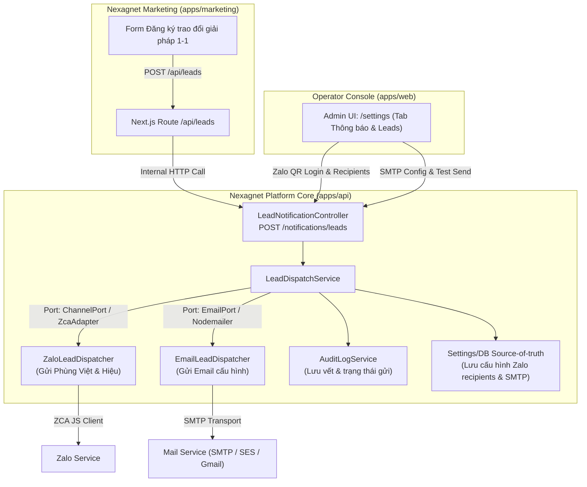

# KẾ HOẠCH TRIỂN KHAI: TÍNH NĂNG GỬI TIN NHẮN ZALO & EMAIL (LEAD "ĐĂNG KÝ TRAO ĐỔI GIẢI PHÁP 1-1")

> **Ngày lập:** 19/08/2026  
> **Trạng thái:** Chờ phê duyệt (Draft / Planning)  
> **Tài liệu liên quan:**  
> - [docs/kien-truc/nen-tang-da-khach.md](../../kien-truc/nen-tang-da-khach.md) — Nguyên tắc nền tảng trung tính, silo đa khách  
> - [docs/phat-trien/van-hanh/ci-cd.md](../van-hanh/ci-cd.md) — Quy trình CI/CD và bất biến hạ tầng VM  
> - [docs/trien-khai/marketing-nexagnet247.md](../../trien-khai/marketing-nexagnet247.md) — Hướng dẫn triển khai marketing site  

---

## 1. Mục tiêu & Phạm vi Nghiệp vụ

1. **Lead Dispatch Automation**:
   - Khi có khách hàng gửi form "Đăng ký trao đổi giải pháp 1-1" từ website marketing (`apps/marketing`, `nexagnet247.com`), hệ thống tự động trích xuất payload và gửi thông báo theo thời gian thực (real-time notification).
2. **Kênh nhận Zalo**:
   - Gửi tin nhắn định dạng chuẩn đến thành viên **Phùng Việt** và **Hiệu** trong các nhóm test đã đồng bộ thành viên trên server Ultty (sử dụng core `ZaloUserClient` / `ZcaAdapter` của `nexagnet-platform`).
3. **Kênh nhận Email**:
   - Gửi email thông báo đầy đủ nội dung khách đăng ký đến danh sách email chuyên viên/quản trị.
4. **Giao diện Quản trị (Admin Console)**:
   - Dựng giao diện quản trị trong `apps/web` (Operator Console) cho phép:
     - Đăng nhập tài khoản gửi Zalo bằng mã QR, kiểm tra trạng thái session Zalo.
     - Cấu hình chỉ định thành viên Zalo nhận lead (Phùng Việt, Hiệu...).
     - Cấu hình SMTP Email (Host, Port, User, Password, Sender, Recipient list).
     - Gửi test kiểm tra 2 kênh (Test Zalo / Test Email).
     - Xem log/audit trạng thái các lần phát tin.
5. **Định vị Dự án & Kiến trúc**:
   - Coi `nexagnet-marketing` là dự án con (sub-project/sub-app) trong monorepo `nexagnet-platform`.
   - Tuân thủ chặt chẽ nguyên tắc **`nen-tang-da-khach.md`** (Base core trung tính, không hardcode danh tính khách hàng trong core, tích hợp qua Port & Adapter).
6. **Hạ tầng & Vận hành**:
   - Triển khai toàn bộ các thành phần trên **1 server GCloud VM duy nhất** (`netviet`), định tuyến qua Caddy Edge Reverse Proxy.
   - Thiết lập quy trình CI/CD GitHub Actions chuẩn hóa, hỗ trợ `gh cli`.
   - Chiến lược commit atomic/granular từng bước để đảm bảo an toàn và dễ dàng rollback.

---

## 2. Thiết kế Kiến trúc (Port & Adapter)



---

## 3. Quy chuẩn Định dạng Tin nhắn (Message Formats)

### 3.1 Định dạng Tin nhắn Zalo

```text
🔔 [NEXAGNET] YÊU CẦU ĐĂNG KÝ TRAO ĐỔI GIẢI PHÁP 1-1
━━━━━━━━━━━━━━━━━━━━━
👤 Khách hàng: {fullName}
🏢 Doanh nghiệp: {company}
📞 SĐT / Zalo: {phone}
✉️ Email: {email}
🎯 Lĩnh vực / Quy trình: {workflow}
📝 Ghi chú: {note}
⏰ Thời gian: {createdAt}
━━━━━━━━━━━━━━━━━━━━━
👉 Vui lòng liên hệ phản hồi khách hàng trong vòng 15-30 phút!
```

### 3.2 Định dạng Email Thông báo

- **Tiêu đề**: `[Nexagnet Lead] Đăng ký trao đổi giải pháp 1-1: {company} - {fullName}`
- **Nội dung HTML**: Template doanh nghiệp chuẩn, bố cục rõ ràng với bảng thông tin chi tiết, liên kết bấm gọi trực tiếp SĐT và nút "Phản hồi qua Email".
- **Plain text fallback**: Đồng bộ nội dung với bản Zalo.

---

## 4. Kế hoạch Thực hiện Chi tiết theo 5 Pha

### Pha 1: Xây dựng Module Thông báo Core & Port/Adapter (`apps/api`)
1. **Module & Service**:
   - Tạo `NotificationModule`, `LeadDispatchService`.
   - Định nghĩa Zod Schema cho `LeadPayload` và `NotificationSettings`.
2. **Adapters**:
   - `ZaloLeadDispatcher`: Sử dụng `ZaloUserClient` sẵn có trong platform, truy vấn `GroupParticipantsRepository` để tìm thông tin thành viên (Phùng Việt, Hiệu) theo tên/ID trong nhóm đã sync, và gửi tin nhắn thông báo.
   - `EmailLeadDispatcher`: Sử dụng thư viện gửi mail chuẩn (hỗ trợ SMTP với timeout & connection pooling an toàn).
3. **Endpoints API**:
   - `POST /notifications/leads`: Nhận lead từ marketing web (bảo vệ bằng token/secret).
   - `GET /settings/notifications`: Lấy thông tin cấu hình Zalo & Email.
   - `PUT /settings/notifications/email`: Cập nhật cấu hình SMTP.
   - `PUT /settings/notifications/zalo`: Cập nhật danh sách người nhận Zalo.
   - `POST /settings/notifications/test-email`: Gửi email kiểm tra kết nối.
   - `POST /settings/notifications/test-zalo`: Gửi tin nhắn Zalo kiểm tra.

### Pha 2: Tích hợp Webhook Dispatch từ `apps/marketing`
1. Cập nhật `apps/marketing/app/api/leads/route.ts`:
   - Sau khi ghi nhận lead thành công, kích hoạt background dispatch sang `POST /notifications/leads` của platform API.
   - Xử lý timeout/lỗi mềm (graceful degradation): Không làm gián đoạn trải nghiệm của người dùng trên web marketing nếu API backend tạm thời bận.

### Pha 3: Xây dựng Giao diện Quản trị trên Operator Console (`apps/web`)
1. Thêm tab **"Thông báo & Leads"** tại `/settings`:
   - **Khu vực Zalo**:
     - Hiển thị component quét mã QR Zalo đăng nhập (kết nối trực tiếp `/zalo/qr` & `/zalo/status`).
     - Bảng chọn thành viên nhận tin: Tự động tải danh sách thành viên từ các nhóm Zalo test đã sync trên server Ultty, cho phép tích chọn "Phùng Việt" và "Hiệu".
     - Nút bấm "Gửi test Zalo".
   - **Khu vực Email**:
     - Form cấu hình SMTP: Host, Port, Secure (SSL/TLS), Username, Password, Sender Name/Email, Danh sách Email nhận thông báo.
     - Nút bấm "Gửi test Email".
   - **Bảng Nhật ký Lead**:
     - Xem danh sách lead gửi gần đây, trạng thái gửi qua từng kênh (Zalo: Thành công/Lỗi, Email: Thành công/Lỗi), nút Retry khi cần.

### Pha 4: Cấu hình Hạ tầng Single-VM & Edge Routing
1. **Docker Compose**:
   - Tích hợp container `marketing` vào `deploy/netviet/compose.yaml` (hoặc stack song song cùng mạng edge).
2. **Caddy Reverse Proxy**:
   - Cấu hình domain `nexagnet247.com` trỏ vào container marketing.
   - Cập nhật route contract test `deploy/netviet/caddy-route-contract.test.mjs` bảo đảm mọi route API mới (`/notifications/*`, `/settings/notifications*`) đều được forward đúng vào NestJS backend.
3. **Quản lý Secrets**:
   - Bổ sung các secret SMTP và internal API key vào `deploy.ps1` và `render-secrets.sh`.

### Pha 5: CI/CD GitHub Actions & Chiến lược Atomic Commit
1. **GitHub Actions**:
   - Cập nhật `ci.yml` và `deploy-tenant.yml` để tự động kiểm thử toàn diện cả 3 ứng dụng (`api`, `web`, `marketing`) trước khi deploy.
   - Hỗ trợ kích hoạt deploy từ `gh cli`:
     ```bash
     gh workflow run deploy-tenant.yml -f tenant=ultty -f environment=dev
     ```
2. **Atomic Commits**:
   - Commit 1: `feat(api): add notification module and lead dispatch port/adapters`
   - Commit 2: `feat(marketing): dispatch lead submissions to platform notification core`
   - Commit 3: `feat(web): add lead notification management panel with zalo qr and smtp config`
   - Commit 4: `feat(deploy): configure single-vm edge caddy for nexagnet marketing and api routes`
   - Commit 5: `test(ci): add automated test suites and caddy route contract tests`

---

## 5. Quy trình Kiểm thử & Nghiệm thu (Verification)

1. **Kiểm tra tự động**:
   - Chạy 4 lệnh cổng: `pnpm lint`, `pnpm typecheck`, `pnpm test`, `node --test deploy/netviet/caddy-route-contract.test.mjs`.
   - Build artifact của cả 3 apps không có lỗi.
2. **Kiểm tra nghiệp vụ thực tế**:
   - Đăng nhập tài khoản Zalo qua mã QR trên màn hình quản trị.
   - Cấu hình SMTP và chọn thành viên Zalo (Phùng Việt, Hiệu).
   - Test gửi thành công tin nhắn mẫu qua Zalo và Email từ màn hình quản trị.
   - Điền form "Đăng ký trao đổi giải pháp 1-1" trên `nexagnet247.com` -> Xác nhận Zalo và Email nhận đúng dữ liệu và format ngay lập tức.
