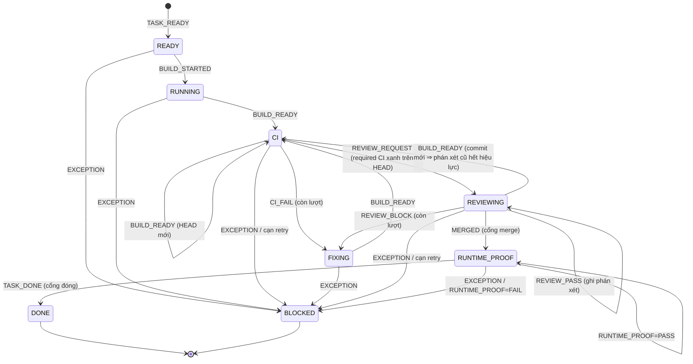

# Giao thức Autopilot V0 — ChatGPT ↔ GitHub ↔ Claude

> **Vai trò tài liệu:** canonical, **có phiên bản** (`V0`). Đây là **bản người đọc** của giao thức;
> **bản máy đọc** (JSON Schema, máy trạng thái, validator, test) nằm ở
> [`tools/autopilot-protocol/`](../../../tools/autopilot-protocol/README.md). Hai bản phải nói cùng
> một điều — khi khác nhau, **bản máy đọc thắng** và tài liệu này phải sửa theo.
>
> **Trạng thái: FOUNDATION ONLY** (03/09/2026, hợp đồng #153). Đã có: hợp đồng task, 9 loại thông
> điệp, máy trạng thái, cổng nghiệp vụ, khoá idempotency, validator CLI, test hồi quy. **Chưa có:**
> Conversation Bridge nối ChatGPT Web Conversation, tạo Issue tự động, dispatcher Claude trên
> Actions, auto-merge, thay đổi CD, deploy. Không workflow nào trong `.github/workflows/` được thêm
> hay sửa bởi task này.
>
> **Architect/Reviewer là tab hội thoại ChatGPT thường** (ChatGPT Web Conversation), **không phải
> ChatGPT Work** (chốt 04/09/2026). Đường đánh thức phiên hội thoại đó ở giai đoạn sau là
> **Conversation Bridge**, chưa có trong V0.
>
> PoC #151 chứng minh mint token GitHub App, bot push tin cậy, CI tự chạy, loop guard, autofix —
> **không** tái dùng workflow PoC làm hiện thực production mà không thiết kế lại.
>
> Đọc cùng: [`github-governance.md`](github-governance.md) (7 status check bắt buộc, ruleset
> `main-protection`) · [`ci-cd.md`](ci-cd.md) · [`../../kien-truc/agentic-ops.md`](../../kien-truc/agentic-ops.md).

---

## 1. Vì sao cần một giao thức

Ba tác nhân (ChatGPT, Claude, GitHub Actions) **không chia sẻ bộ nhớ**. Thứ duy nhất cả ba cùng
nhìn thấy là GitHub. Nếu "đã review xong", "CI xanh", "đã deploy" chỉ là câu trong chat thì không
ai kiểm được, và một agent có thể merge dựa trên lời khai của agent khác.

Giao thức này biến mỗi bước thành **một thông điệp máy đọc, gắn với một SHA chính xác, có khoá
chống lặp, đi qua một máy trạng thái đóng**. Nguyên tắc xuyên suốt:

- **Claim ≠ Proof.** Một thông điệp là _lời khai_; bằng chứng là thứ orchestrator tự lấy từ GitHub
  (check-run, HEAD hiện tại, người đã duyệt) và đưa vào validator.
- **CI GREEN ≠ BUSINESS CORRECT.** DONE cần bằng chứng runtime khi hợp đồng đòi.
- **Fail closed.** Không có trong bảng = không hợp lệ. Thiếu bằng chứng = cổng đóng. Cạn retry =
  BLOCKED, không lặp vô hạn.

## 2. Tác nhân và trách nhiệm

Architect và Reviewer chạy trong **tab hội thoại ChatGPT thường** (ChatGPT Web Conversation) —
**không phải ChatGPT Work**. V0 không có đường đánh thức phiên hội thoại đó; **Conversation Bridge**
là việc của giai đoạn sau (§17).

| Tác nhân          | Mã (`ACTORS`)       | Làm gì                                                                        | Được phát thông điệp nào                 |
| ----------------- | ------------------- | ----------------------------------------------------------------------------- | ---------------------------------------- |
| ChatGPT Architect | `CHATGPT_ARCHITECT` | BA + kiến trúc + chọn task, soạn Task Contract                                | `TASK_READY`                             |
| Claude Builder    | `CLAUDE_BUILDER`    | Hiện thực trên nhánh riêng, mở PR                                             | `BUILD_STARTED`, `BUILD_READY`           |
| Claude Fixer      | `CLAUDE_FIXER`      | Sửa theo CI đỏ / REVIEW_BLOCK, push HEAD mới                                  | `BUILD_READY`                            |
| GitHub Actions    | `GITHUB_ACTIONS`    | **Chỉ điều phối**: quan sát sự kiện, lấy bằng chứng, chạy validator, đổi nhãn | `CI_FAIL`, `REVIEW_REQUEST`, `TASK_DONE` |
| ChatGPT Reviewer  | `CHATGPT_REVIEWER`  | Review độc lập, phán xét cho **đúng một HEAD**                                | `REVIEW_PASS`, `REVIEW_BLOCK`            |
| Runtime Verifier  | `RUNTIME_VERIFIER`  | Bằng chứng trên môi trường thật cho **đúng một release**                      | `RUNTIME_PROOF`                          |
| Human             | `HUMAN`             | Chỉ quyết định rủi ro cao / ngoại lệ; duyệt merge HIGH; gỡ BLOCKED            | _(sự kiện ngoài giao thức V0)_           |

### 2.1 Principal (GitHub xác thực) ⟂ vai giao thức

**Bảng `ACTORS` ở trên là VAI LOGIC, không phải danh tính GitHub.** GitHub chỉ xác thực được
`comment.user.login` và `performed_via_github_app.slug` — những giá trị như `nexagent-autopilot` hay
tên đăng nhập của một người. Chúng **không bao giờ** bằng `CLAUDE_BUILDER` hay `CHATGPT_REVIEWER`.
Coi hai thứ là một chỉ còn hai đường, cả hai đều hỏng:

1. đưa principal thật vào chỗ vai ⇒ **mọi thông điệp hợp lệ bị từ chối**;
2. suy vai từ **loại** thông điệp ⇒ `BUILD_READY` do Builder phát _vì nó là_ `BUILD_READY` — vòng
   tròn, và cổng phân quyền thành một cái gạt luôn luôn mở.

Nên phân quyền đi qua **ba tầng**, và tầng giữa là thứ duy nhất mang quyền:

```text
principal (GitHub xác thực)  --[sơ đồ cài đặt]-->  vai được phép  --[MESSAGE_PRODUCERS]-->  loại
```

**Dẫn xuất principal** (`principalFromGithubEvent`, hàm thuần, không gọi mạng) — ba đường, theo độ
tin cậy giảm dần: `performed_via_github_app.slug` ⇒ `{kind: APP, id: slug}` · login kết thúc bằng
`[bot]` ⇒ **cắt hậu tố** rồi cũng ra `{kind: APP, ...}` (nếu không thì `nexagent-autopilot[bot]` và
`nexagent-autopilot` thành hai principal khác nhau và một sơ đồ đúng vẫn trượt) · còn lại là
`{kind: USER, id: login}`. Không dẫn xuất được ⇒ `null` ⇒ cổng đóng. Login/slug **không phân biệt
hoa thường**, đúng như GitHub.

**Sơ đồ cài đặt** (`PrincipalRegistry`) là **cấu hình của từng bản triển khai**, orchestrator đưa
vào qua `context` giống mọi bằng chứng khác (§13) — V0 **không** ghi cứng principal nào. Quan hệ là
**nhiều-nhiều**: một principal giữ nhiều vai (App: builder + fixer + orchestrator + runtime
verifier), một vai do nhiều principal giữ. Vai hiệu lực = **giao** của (vai của principal) và
(người phát hợp lệ của loại) — một phép giao thật, không phải suy từ loại thông điệp. `assertedRole`
chỉ để **thu hẹp** khi một principal giữ nhiều vai; nó không bao giờ mở rộng quyền.

**Bất biến V0 cưỡng chế, không để cài đặt tự chọn:** một principal **không được vừa làm vừa duyệt**
— `CHATGPT_REVIEWER` xung khắc với `{CLAUDE_BUILDER, CLAUDE_FIXER, GITHUB_ACTIONS}`. Sơ đồ vi phạm
bị từ chối **lúc định nghĩa**, không đợi đến khi có thông điệp thật. Các tổ hợp dự kiến vẫn hợp lệ:
App giữ builder + fixer + orchestrator + runtime verifier; tài khoản chủ repo giữ architect +
reviewer + human.

**Fail closed ở cả ba tầng**, mỗi đường một mã riêng:

| Đường từ chối                                            | Mã                                  |
| -------------------------------------------------------- | ----------------------------------- |
| không có / hỏng hình dạng danh tính đã xác thực          | `PRINCIPAL_UNKNOWN`                 |
| chỉ có tên vai trần, không có provenance sau nó          | `ACTOR_WITHOUT_PRINCIPAL`           |
| không có sơ đồ cài đặt                                   | `PRINCIPAL_REGISTRY_MISSING`        |
| sơ đồ hỏng hình dạng                                     | `PRINCIPAL_REGISTRY_INVALID`        |
| sơ đồ vi phạm phân lập nhiệm vụ                          | `PRINCIPAL_ROLE_CONFLICT`           |
| biết **ai**, nhưng principal không giữ vai nào           | `PRODUCER_UNKNOWN`                  |
| vai được khẳng định không tồn tại                        | `UNKNOWN_ROLE`                      |
| vai có thật nhưng principal không được giữ               | `ROLE_NOT_AUTHORIZED_FOR_PRINCIPAL` |
| principal có vai, nhưng không vai nào phát được loại này | `WRONG_PRODUCER`                    |

Thiếu sơ đồ **không** được hiểu là "ai cũng được", đúng cùng lý do "không biết ai phát" không được
hiểu là "ai phát cũng được": như thế cả tầng phân quyền biến mất mà không cổng nào kêu.

**Provenance được ghi lại.** Mỗi bước được chấp nhận mang `by = { principal, role }` trong lịch sử
task — `role` là `null` khi principal giữ nhiều vai đều phát được loại đó (hợp lệ, chỉ là không quy
được về một vai; bịa ra một vai ở đây là bịa ra provenance). Nhờ vậy một task `DONE` trả lời được
"**principal nào** đã đóng nó", không chỉ "nó đã đóng".

## 3. GitHub là bus điều phối

| Đối tượng GitHub                | Nghĩa trong giao thức                                                                             |
| ------------------------------- | ------------------------------------------------------------------------------------------------- |
| Issue                           | **Task Contract** — một Issue = một hợp đồng (§14)                                                |
| Pull Request                    | Bàn giao hiện thực; một task = một nhánh = một PR                                                 |
| Comment                         | **Thông điệp giao thức** (§5) — chỉ khi có marker; văn xuôi không bao giờ kích hoạt               |
| Label                           | Trạng thái thô (§4): `autopilot:ready` … `autopilot:blocked`, đúng **một** nhãn tại một thời điểm |
| Commit SHA                      | Danh tính phiên bản **chính xác** — 40 hex, không rút gọn                                         |
| GitHub Actions                  | Orchestrator / switchboard — không viết code, không quyết định nghiệp vụ                          |
| GitHub App `nexagent-autopilot` | Danh tính tự động hoá (đã chứng minh ở PoC #151)                                                  |

## 4. Vòng đời và máy trạng thái

### 4.1 Tám trạng thái thô

| Trạng thái      | Nhãn                      | Nghĩa                                           |
| --------------- | ------------------------- | ----------------------------------------------- |
| `READY`         | `autopilot:ready`         | Hợp đồng hợp lệ, Architect đã phát `TASK_READY` |
| `RUNNING`       | `autopilot:running`       | Builder đang làm trên nhánh riêng               |
| `CI`            | `autopilot:ci`            | Có PR + HEAD, chờ required checks               |
| `FIXING`        | `autopilot:fixing`        | Fixer đang sửa (sau CI đỏ hoặc REVIEW_BLOCK)    |
| `REVIEWING`     | `autopilot:reviewing`     | CI xanh trên HEAD hiện tại, chờ phán xét        |
| `RUNTIME_PROOF` | `autopilot:runtime_proof` | Đã merge, chờ bằng chứng runtime                |
| `DONE`          | `autopilot:done`          | Kết thúc — **cuối**                             |
| `BLOCKED`       | `autopilot:blocked`       | Ngoại lệ, cần người — **cuối với tự động hoá**  |

`MERGED` là **sự kiện** (GitHub báo PR đã merge), không phải trạng thái.

### 4.2 Sơ đồ



### 4.3 Bảng chuyển hợp lệ — toàn bộ, không có mặc định

| Từ                                        | Sự kiện          | Đến                                         | Cổng phải mở                                                                                   |
| ----------------------------------------- | ---------------- | ------------------------------------------- | ---------------------------------------------------------------------------------------------- |
| _(chưa có)_                               | `TASK_READY`     | `READY`                                     | risk khớp hợp đồng                                                                             |
| `READY`                                   | `BUILD_STARTED`  | `RUNNING`                                   | —                                                                                              |
| `RUNNING` · `CI` · `FIXING` · `REVIEWING` | `BUILD_READY`    | `CI`                                        | cùng PR nếu đã gắn                                                                             |
| `CI`                                      | `CI_FAIL`        | `FIXING` _(hoặc `BLOCKED`)_                 | đúng HEAD; còn lượt sửa CI                                                                     |
| `CI`                                      | `REVIEW_REQUEST` | `REVIEWING`                                 | đúng HEAD; **mọi** required check `success` trên HEAD đó                                       |
| `REVIEWING`                               | `REVIEW_PASS`    | `REVIEWING`                                 | đúng HEAD hiện tại                                                                             |
| `REVIEWING`                               | `REVIEW_BLOCK`   | `FIXING` _(hoặc `BLOCKED`)_                 | đúng HEAD; còn lượt sửa review                                                                 |
| `REVIEWING`                               | `MERGED`         | `RUNTIME_PROOF`                             | HEAD merge = HEAD hiện tại; `REVIEW_PASS` hiện hành; không HIGH/human_gate hoặc người đã duyệt |
| `RUNTIME_PROOF`                           | `RUNTIME_PROOF`  | `RUNTIME_PROOF` _(hoặc `BLOCKED` nếu FAIL)_ | release = merge SHA                                                                            |
| `RUNTIME_PROOF`                           | `TASK_DONE`      | `DONE`                                      | merge SHA khớp; proof PASS đúng release + env nếu hợp đồng đòi                                 |
| mọi trạng thái sống                       | `EXCEPTION`      | `BLOCKED`                                   | phải có lý do có mã                                                                            |

Mọi cặp _(trạng thái, sự kiện)_ không có trong bảng ⇒ `ILLEGAL_TRANSITION`. Từ `DONE`/`BLOCKED`
mọi sự kiện ⇒ `TERMINAL_STATE`. Trạng thái/sự kiện lạ ⇒ `UNKNOWN_STATE`/`UNKNOWN_EVENT`, không bao
giờ rơi về "cho qua".

**Thứ tự kiểm** cho mỗi thông điệp, cố ý: schema → đúng issue → đúng người phát → idempotency →
máy trạng thái → cổng nghiệp vụ. Chỉ khi qua cả sáu, khoá mới được ghi và trạng thái mới đổi.

## 5. Thông điệp

### 5.1 Dạng mang (carrier) trong GitHub comment

```text
<!-- AUTOPILOT_REVIEW_REQUEST_V0 -->      ← dòng 1: marker, đúng dạng <!-- TÊN_V0 -->
REVIEW_REQUEST                            ← dòng 2: loại thông điệp
ISSUE=200                                 ← KEY=VALUE, mỗi dòng một trường
PR=201
HEAD_SHA=0123456789abcdef0123456789abcdef01234567
CI_RUN=888
RISK=MEDIUM
                                          ← dòng trống: hết payload
Ghi chú tự do cho người đọc — bị bỏ qua.
```

Quy tắc tách (fail closed, có test trong `tests/messages.test.mjs`):

- Không marker ⇒ **không phải thông điệp** (`NO_MARKER`). Marker trong trích dẫn (`> <!-- … -->`)
  hay giữa dòng không khớp. Hai marker trong một comment ⇒ `MULTIPLE_MARKERS`.
- **Marker phải là dòng có nội dung đầu tiên** của comment (dòng trống dẫn đầu thì bỏ qua). Marker
  nằm sau văn xuôi — kể cả trong một khối ` ``` ` minh hoạ — ⇒ `MARKER_NOT_FIRST_LINE`.
  Đo được 03/09/2026: nếu chỉ đòi "có một marker ở đâu đó", một comment người viết dán ví dụ sẽ
  được đọc thành `REVIEW_PASS` **thật**. Văn bản tự do không bao giờ được kích hoạt agent.
- Marker phải khớp loại: `REVIEW_PASS`/`REVIEW_BLOCK` dưới `CHATGPT_REVIEW_V0`; loại khác dưới
  `AUTOPILOT_<LOẠI>_V0`. Sai ⇒ `MARKER_TYPE_MISMATCH`.
- Trong khối payload: `KEY=VALUE`, hoặc `KEY:` mở một danh sách với các dòng `- mục`. Dòng khác
  ⇒ `MALFORMED_LINE`. Khoá lặp ⇒ `DUPLICATE_KEY`. Khoá lạ ⇒ `UNKNOWN_FIELD`. Danh sách rỗng ⇒ `EMPTY_LIST`.
- **Kiểu theo bảng, không đoán từ giá trị:** `ISSUE`/`PR`/`CI_RUN`/`DEPLOY_RUN` là số nguyên ≥ 1;
  `HUMAN_GATE`/`RUNTIME_VERIFIED` là `true`/`false`; `*_SHA` là chuỗi (một SHA toàn chữ số vẫn là chuỗi).
- Dạng JSON canonical: khoá `snake_case` chữ thường, thêm `protocol: "V0"`, `marker`, `type`.

### 5.2 Chín loại thông điệp

| Loại             | Marker                        | Người phát       | Trường bắt buộc                                              | Tuỳ chọn                | Khoá idempotency                              |
| ---------------- | ----------------------------- | ---------------- | ------------------------------------------------------------ | ----------------------- | --------------------------------------------- |
| `TASK_READY`     | `AUTOPILOT_TASK_READY_V0`     | Architect        | `ISSUE`, `RISK`                                              | `TASK_ID`, `HUMAN_GATE` | `task-ready:<issue>`                          |
| `BUILD_STARTED`  | `AUTOPILOT_BUILD_STARTED_V0`  | Builder          | `ISSUE`, `BRANCH`, `BASE_SHA`                                | —                       | `build:<issue>`                               |
| `BUILD_READY`    | `AUTOPILOT_BUILD_READY_V0`    | Builder/Fixer    | `ISSUE`, `PR`, `HEAD_SHA`                                    | `BASE_SHA`              | `build-ready:<pr>:<head_sha>`                 |
| `CI_FAIL`        | `AUTOPILOT_CI_FAIL_V0`        | Actions          | `ISSUE`, `PR`, `HEAD_SHA`, `CI_RUN`                          | `FAILED_CHECKS:`        | `ci-fail:<pr>:<head_sha>:<ci_run>`            |
| `REVIEW_REQUEST` | `AUTOPILOT_REVIEW_REQUEST_V0` | Actions          | `ISSUE`, `PR`, `HEAD_SHA`, `CI_RUN`, `RISK`                  | —                       | `review-request:<pr>:<head_sha>`              |
| `REVIEW_PASS`    | `CHATGPT_REVIEW_V0`           | Reviewer         | `ISSUE`, `PR`, `HEAD_SHA`                                    | —                       | `review-verdict:<pr>:<head_sha>:REVIEW_PASS`  |
| `REVIEW_BLOCK`   | `CHATGPT_REVIEW_V0`           | Reviewer         | `ISSUE`, `PR`, `HEAD_SHA`, `BLOCKERS:`                       | —                       | `review-verdict:<pr>:<head_sha>:REVIEW_BLOCK` |
| `RUNTIME_PROOF`  | `AUTOPILOT_RUNTIME_PROOF_V0`  | Runtime Verifier | `ISSUE`, `PR`, `RELEASE_SHA`, `ENV`, `DEPLOY_RUN`, `VERDICT` | —                       | `runtime:<release_sha>:<env>`                 |
| `TASK_DONE`      | `AUTOPILOT_TASK_DONE_V0`      | Actions          | `ISSUE`, `MERGE_SHA`, `RUNTIME_VERIFIED`                     | `PR`                    | `done:<issue>:<merge_sha>`                    |

Schema từng loại: `tools/autopilot-protocol/schemas/messages/<loại>.schema.json` (draft 2020-12,
`additionalProperties: false`, `$ref` vào `common.schema.json`). `RISK ∈ {LOW, MEDIUM, HIGH}`,
`VERDICT ∈ {PASS, FAIL}`, `ENV` kebab-case chữ thường, mọi `*_SHA` khớp `^[0-9a-f]{40}$`.

### 5.3 Ví dụ

```text
<!-- CHATGPT_REVIEW_V0 -->
REVIEW_BLOCK
ISSUE=200
PR=201
HEAD_SHA=0123456789abcdef0123456789abcdef01234567
BLOCKERS:
- thiếu test cho cổng CI
- tên trường sai quy ước
```

```text
<!-- AUTOPILOT_RUNTIME_PROOF_V0 -->
RUNTIME_PROOF
ISSUE=200
PR=201
RELEASE_SHA=89abcdef0123456789abcdef0123456789abcdef
ENV=gd1-test
DEPLOY_RUN=9999
VERDICT=PASS
```

## 6. Bảng trigger / consumer

| Sự kiện GitHub                                           | Ai phát thông điệp | Ai tiêu thụ | Hành động sau khi validator chấp nhận                   |
| -------------------------------------------------------- | ------------------ | ----------- | ------------------------------------------------------- |
| Issue mở với `<!-- AUTOPILOT_TASK_V0 -->` + `TASK_READY` | Architect          | Actions     | nhãn `autopilot:ready`                                  |
| Comment `BUILD_STARTED`                                  | Builder            | Actions     | nhãn `running`, ghi `BASE_SHA`                          |
| PR mở / push + `BUILD_READY`                             | Builder/Fixer      | Actions     | nhãn `ci`; mọi phán xét cũ hết hiệu lực                 |
| Check-run kết thúc, có check bắt buộc đỏ                 | Actions            | Fixer       | `CI_FAIL` → nhãn `fixing` (hoặc `blocked` khi cạn lượt) |
| Check-run kết thúc, **cả 7** check xanh trên HEAD        | Actions            | Reviewer    | `REVIEW_REQUEST` → nhãn `reviewing`                     |
| Comment `REVIEW_PASS`                                    | Reviewer           | Actions     | ghi phán xét; mở cổng merge nếu không HIGH              |
| Comment `REVIEW_BLOCK`                                   | Reviewer           | Fixer       | nhãn `fixing` (hoặc `blocked`)                          |
| PR merged (`MERGED`)                                     | GitHub             | Actions     | nhãn `runtime_proof`, ghi `MERGE_SHA`                   |
| Deploy xong + smoke                                      | Runtime Verifier   | Actions     | `RUNTIME_PROOF`; FAIL ⇒ `blocked`                       |
| Comment `TASK_DONE`                                      | Actions            | Architect   | nhãn `done`; Architect chọn task kế                     |

Bảng này mô tả **hợp đồng** cho orchestrator của task sau; V0 chưa hiện thực dòng nào ở cột
"hành động".

## 7. Quy tắc SHA chính xác

- Mọi SHA trong giao thức là **40 hex chữ thường**. SHA rút gọn bị schema từ chối: "chính xác"
  nghĩa là không có hai commit nào cùng khớp. (Ví dụ `abc123` trong #153 là minh hoạ, không phải dạng hợp lệ.)
- Một phán xét review **chỉ có giá trị cho đúng HEAD nó nêu tên**. Commit mới ⇒ `REVIEW_PASS`/
  `REVIEW_BLOCK` trước đó **không còn hiện hành** — validator từ chối phán xét nêu HEAD khác HEAD
  hiện tại (`STALE_VERDICT`) và không mở merge bằng phán xét của HEAD cũ (`NO_CURRENT_REVIEW_PASS`).
- `BUILD_READY` trong lúc `REVIEWING` đưa task về `CI`: CI phải chạy lại và `REVIEW_REQUEST` phải
  phát lại cho HEAD mới.
- `MERGED` chỉ hợp lệ khi HEAD được merge = HEAD hiện tại (`HEAD_MISMATCH` nếu PR bị push thêm
  ngay trước khi merge).
- `RUNTIME_PROOF.RELEASE_SHA` phải bằng `MERGE_SHA` của task; `TASK_DONE.MERGE_SHA` cũng vậy.

## 8. Quy tắc CI

`REVIEW_REQUEST` chỉ hợp lệ khi **mọi** required check có check-run `conclusion = success` **trên
đúng HEAD**. Danh sách required check **không hard-code** — đọc từ ruleset
`.github/rulesets/main-protection.json` (hiện là 7: `verify`, `integration`, `workflow-integration`,
`tenant-packs`, `e2e`, `audit`, `images`; xem `github-governance.md` §2.1). Đổi tên job là phải đổi
ruleset, và validator sẽ theo.

Mã từ chối: `NO_REQUIRED_CHECKS` (không có danh sách ⇒ cổng không bao giờ mở), `CI_EVIDENCE_MISSING`
(không đưa check-run), `CI_EVIDENCE_UNBOUND` (check-run **không nói nó thuộc HEAD nào**),
`CI_CHECK_MISSING` (thiếu check trên HEAD), `CI_CHECK_NOT_GREEN` (đỏ hoặc đang chạy). Check xanh của
HEAD khác **không tính**. Một check chạy hai lần mà lần sau đỏ ⇒ không xanh.

**Bằng chứng phải tự nói nó thuộc HEAD nào.** Mỗi check-run bắt buộc có `head_sha`; thiếu, rỗng hay
không phải chuỗi ⇒ **từ chối cả lô** (`CI_EVIDENCE_UNBOUND`), không phải bỏ qua riêng cái đó. Buộc
bằng chứng vào HEAD là việc của orchestrator lúc lấy từ API — không buộc được thì phải báo, không
được đoán. Đo được 04/09/2026: bản trước coi `head_sha` thiếu là "thuộc HEAD đang xét", nên một mảng
check không có `head_sha` mở được `REVIEW_REQUEST` cho **mọi** HEAD, kể cả HEAD chưa chạy CI lần nào.

## 9. Quy tắc rủi ro

| Lớp      | Auto-merge        | Ghi chú                                                                    |
| -------- | ----------------- | -------------------------------------------------------------------------- |
| `LOW`    | có                | `human_gate` vẫn có thể bật                                                |
| `MEDIUM` | có                | mặc định của task kỹ thuật thuần                                           |
| `HIGH`   | **không bao giờ** | cần `humanApproval` ở cổng merge; hợp đồng **bắt buộc** `human_gate: true` |

`HIGH` tối thiểu gồm các vùng (`HIGH_RISK_AREAS`): `PRICE_MONEY_FINANCE`, `AUTH_AUTHORIZATION`,
`SECURITY`, `TENANT_ISOLATION`, `DESTRUCTIVE_MIGRATION`, `SECRETS_PRODUCTION_INFRA`,
`CUSTOMER_SOURCE_AUTHORITY`. Hợp đồng khai `risk_areas` chạm vùng nào mà `risk` không phải `HIGH`
⇒ `RISK_UNDERSTATED_FOR_AREAS`. `HIGH` mà `human_gate: false` ⇒ `HIGH_RISK_REQUIRES_HUMAN_GATE`.

Cổng merge kiểm **rủi ro trước phán xét**: một `REVIEW_PASS` của ChatGPT không bao giờ thay thế
người ở task HIGH — và ngược lại, người duyệt **không** thay thế review (`NO_CURRENT_REVIEW_PASS` vẫn chặn).

**Cú duyệt của người cũng bị buộc vào SHA.** `humanApproval` là `{ head_sha }`, không phải một
boolean: duyệt ở HEAD A rồi merge HEAD B ⇒ `STALE_HUMAN_APPROVAL`. Quy tắc exact-SHA đã áp cho
phán xét của máy (§7) thì càng phải áp cho cổng mạnh nhất của giao thức — đo được 03/09/2026: với
một boolean, một cú duyệt cũ mở được merge của HEAD mới.

`RISK` trong `TASK_READY` và `REVIEW_REQUEST` phải khớp hợp đồng (`RISK_MISMATCH`).

## 10. Vòng sửa và trần retry

```text
CI        -> FIXING -> CI          (MAX_CI_FIX_ATTEMPTS     = 3)
REVIEWING -> FIXING -> CI          (MAX_REVIEW_FIX_ATTEMPTS = 3)
mọi BUILD_READY                    (MAX_HEAD_REVISIONS      = 10)
```

Bộ đếm nằm trong task (`ciFixAttempts`, `reviewFixAttempts`), tăng mỗi lần vào `FIXING`. `CI_FAIL`
hoặc `REVIEW_BLOCK` thứ **4** vẫn là sự kiện hợp lệ — kết quả của nó là `BLOCKED` với
`RETRY_CEILING_EXHAUSTED` và chi tiết `{ loop, attemptsUsed, ceiling }`. Từ `BLOCKED` không có
sự kiện tự động nào đi tiếp ⇒ không thể lặp vô hạn.

**`MAX_HEAD_REVISIONS` không có trong #153, nhưng thiếu nó thì câu "never infinite loop" của #153
không đúng.** Hai trần trên chỉ đếm đường `CI_FAIL` và `REVIEW_BLOCK`, trong khi các cạnh
`CI -> BUILD_READY -> CI` và `REVIEWING -> BUILD_READY -> CI` (§16) đi vòng **không** qua `FIXING`,
và mỗi HEAD mới lại sinh một khoá idempotency mới. Đo được 03/09/2026: 40 vòng
`BUILD_READY -> REVIEW_REQUEST` đều được nhận, cả hai bộ đếm vẫn bằng 0. Vì **mọi chu trình của máy
trạng thái đều đi qua `BUILD_READY`**, chặn ở đó là chặn được cả họ chu trình; trần đặt 10 vì đường
hợp lệ dài nhất chỉ cần 1 + 3 + 3 = 7 HEAD.

## 11. Khoá idempotency

Khoá là hàm của **ý định**, không của thời điểm. Cùng khoá ⇒ `DUPLICATE_MESSAGE`, không hành động
lặp, không đổi trạng thái, không đổi bộ đếm. Khác phán xét trên cùng HEAD ⇒ khác khoá.

Năm khoá bắt buộc của #153 (giữ nguyên từng ký tự) và ba khoá mở rộng V0 để **mọi** loại đều có khoá:
xem cột cuối §5.2. Khoá chỉ được ghi khi thông điệp **được chấp nhận** — một thông điệp bị từ chối
(ví dụ `REVIEW_REQUEST` lúc CI chưa xanh) có thể được phát lại hợp lệ sau đó.

**Ngoại lệ: trùng khoá ≠ phát lại, khi bằng chứng mâu thuẫn.** Khoá runtime của #153
(`runtime:<release_sha>:<env>`) **không mang phán xét**, nên một `RUNTIME_PROOF` `FAIL` đến sau một
`PASS` của cùng release+env rơi đúng vào khoá cũ. Coi nó là bản sao là **vứt bằng chứng âm**: đo
được 03/09/2026 — `FAIL` bị từ chối `DUPLICATE_MESSAGE` rồi task vẫn đóng `DONE` trên bằng chứng cũ.
Từ bản này, trùng khoá mà **khác phán xét** ⇒ `BLOCKED` với `CONFLICTING_RUNTIME_EVIDENCE`; trùng
khoá và **cùng phán xét** vẫn là `DUPLICATE_MESSAGE` (phát lại thật). Các loại khác đã có phán xét
ngay trong khoá nên không có trường hợp này.

## 12. Điều kiện ngoại lệ cần người (`BLOCKED`)

Vào `BLOCKED` (luôn kèm `blockedBy.reason` có mã) khi:

- cạn trần retry CI, review, hoặc số lần đổi HEAD (§10);
- `RUNTIME_PROOF` với `VERDICT=FAIL` (`RUNTIME_PROOF_FAILED`);
- hai `RUNTIME_PROOF` **mâu thuẫn** trên cùng release+env (`CONFLICTING_RUNTIME_EVIDENCE`, §11);
- orchestrator phát `EXCEPTION` với lý do: hợp đồng đổi giữa chừng, PR bị đóng, nhánh bị xoá,
  xung đột nguồn sự thật khách hàng, v.v.

Task `HIGH` hoặc `human_gate: true` **không** vào `BLOCKED` khi chờ người — nó đứng ở `REVIEWING`
cho tới khi có `humanApproval` gắn đúng HEAD hiện tại. Gỡ `BLOCKED` là hành động của người,
**ngoài phạm vi V0**: orchestrator không có đường tự động nào ra khỏi đó.

## 13. Thẩm quyền — nguồn sự thật

Với trạng thái repo, thứ tự thẩm quyền:

```text
live GitHub  >  bằng chứng giao thức gắn SHA chính xác  >  lời khai/báo cáo của agent  >  bộ nhớ chat
```

Với runtime sản phẩm: **Postgres** = sự thật nghiệp vụ · **Hatchet** = sự thật thực thi bền ·
**OTel/ClickStack** = sự thật quan sát · **Git/release** = trạng thái phần mềm mong muốn.

Hệ quả trong validator: mọi cổng nhận **bằng chứng** qua `context` (check-run, HEAD hiện tại, người
duyệt) chứ không tin trường trong thông điệp; `RUNTIME_VERIFIED=true` mà không có `RUNTIME_PROOF`
PASS tương ứng ⇒ `RUNTIME_VERIFIED_CLAIM_WITHOUT_PROOF`.

## 14. Task Contract

Một Issue = một hợp đồng. Bản người đọc là phần văn xuôi; **bản máy đọc** là một khối ` ```json `
buộc vào marker `<!-- AUTOPILOT_TASK_V0 -->`. Schema: `schemas/task-contract.schema.json`.

**Kích hoạt hợp đồng phải có chủ đích** — đúng ràng buộc đã áp cho thông điệp (§5.1), vì đúng một lý
do:

- marker phải là **dòng có nội dung đầu tiên** của thân Issue (`CONTRACT_MARKER_NOT_FIRST_LINE`);
- khối ` ```json ` phải là **khối nội dung ngay sau** marker, chỉ được cách bằng dòng trống
  (`CONTRACT_BLOCK_NOT_ADJACENT`); khối `yaml` hay khối không nhãn không được tính.

Đo được 04/09/2026: bản trước tìm marker ở **bất kỳ đâu** rồi lấy khối `json` đầu tiên sau nó, nên
một Issue văn xuôi — "hợp đồng sẽ trông như thế này:" rồi dán một ví dụ — cho ra một hợp đồng
**thật**, kích hoạt thật. Văn bản tự do không được phép kích hoạt gì.

| Trường                          | Kiểu                                                                        | Bắt buộc | Ràng buộc                                       |
| ------------------------------- | --------------------------------------------------------------------------- | -------- | ----------------------------------------------- |
| `protocol`                      | `"V0"`                                                                      | ✔        |                                                 |
| `task_id`                       | chuỗi `^[A-Z0-9][A-Z0-9_-]{0,63}$`                                          | ✔        | ổn định suốt vòng đời                           |
| `issue`                         | số ≥ 1                                                                      |          | điền khi Issue đã tồn tại                       |
| `title`                         | chuỗi                                                                       |          |                                                 |
| `goal` · `context`              | chuỗi không rỗng                                                            | ✔        |                                                 |
| `scope` · `acceptance`          | mảng chuỗi, ≥ 1                                                             | ✔        |                                                 |
| `out_of_scope` · `dependencies` | mảng (được rỗng)                                                            | ✔        | phải **có mặt** — không nói gì ≠ nói "không có" |
| `dependencies[]`                | `{kind:"issue", number}` · `{kind:"pr", number}` · `{kind:"external", ref}` |          | `note` tuỳ chọn                                 |
| `risk`                          | `LOW`/`MEDIUM`/`HIGH`                                                       | ✔        | `HIGH` ⇒ `human_gate` phải `true`               |
| `risk_areas`                    | mảng `HIGH_RISK_AREAS`, không lặp                                           |          | không rỗng ⇒ `risk` phải `HIGH`                 |
| `human_gate`                    | boolean                                                                     | ✔        |                                                 |
| `runtime_proof`                 | `{ required, env?, checks? }`                                               | ✔        | `required: true` ⇒ `env` bắt buộc               |

```json
{
  "protocol": "V0",
  "task_id": "BOOTSTRAP",
  "issue": 153,
  "title": "Protocol V0 foundation",
  "goal": "Biến giao thức đã duyệt thành hợp đồng repo có phiên bản, máy kiểm được.",
  "context": "PoC #151 đã chứng minh transport; task này chỉ làm nền tảng giao thức.",
  "scope": [
    "tài liệu giao thức",
    "schema 9 thông điệp",
    "schema hợp đồng",
    "máy trạng thái",
    "validator",
    "test"
  ],
  "out_of_scope": ["Conversation Bridge", "dispatcher Claude", "auto-merge", "CD", "deploy"],
  "acceptance": ["đủ 9 loại thông điệp có validation", "chuyển trạng thái bất hợp pháp bị từ chối"],
  "risk": "MEDIUM",
  "human_gate": false,
  "dependencies": [{ "kind": "pr", "number": 151, "note": "PoC — không merge, không tái dùng" }],
  "runtime_proof": { "required": false }
}
```

> Issue #153 được viết **trước** khi có schema này nên chỉ có bản văn xuôi; `extractTaskContract`
> trả `CONTRACT_MARKER_MISSING`/`CONTRACT_BLOCK_MISSING` cho nó. Từ task kế tiếp, Architect đặt khối
> JSON vào Issue.

## 15. Validator

Gói `@netviet/autopilot-protocol` (`tools/autopilot-protocol/`), ESM thuần, một phụ thuộc (`ajv`),
**không gọi mạng**. Chạy trong `pnpm -r test` của CI hiện có.

```bash
node tools/autopilot-protocol/validator/cli.mjs message   <file|->        # tách + kiểm comment, in payload + khoá
node tools/autopilot-protocol/validator/cli.mjs contract  <file|->        # JSON hoặc thân Issue Markdown
node tools/autopilot-protocol/validator/cli.mjs transition <from|-> <event>
node tools/autopilot-protocol/validator/cli.mjs key       <file|->
node tools/autopilot-protocol/validator/cli.mjs required-checks [ruleset.json]
```

Mã thoát: `0` hợp lệ · `1` không hợp lệ (JSON có `reason`) · `2` dùng sai. Thư viện (`validator/index.mjs`):
`readMessage`/`parseMessage`/`formatMessage` · `validateTaskContract`/`extractTaskContract` ·
`nextState`/`TRANSITIONS` · `idempotencyKeyFor`/`createLedger`/`claimKey` · các `evaluate*` (§7–§10) ·
`principalFromGithubEvent`/`definePrincipalRegistry`/`rolesOf`/`authorizeProducer` (§2.1) ·
bộ giảm `createTask`/`applyMessage`/`applyMerge`/`applyException` (bất biến — trả task mới, không sửa task cũ).

Mọi lời từ chối mang **mã lý do** trong `REASONS` (`validator/reasons.mjs`) — không câu văn tự do.

## 16. Quyết định thiết kế của V0 (giả định đã chốt trong task này)

| Quyết định                                                                                                  | Vì sao                                                                                       |
| ----------------------------------------------------------------------------------------------------------- | -------------------------------------------------------------------------------------------- |
| SHA bắt buộc 40 hex                                                                                         | "chính xác" phải là duy nhất; ví dụ rút gọn trong #153 là minh hoạ                           |
| Marker cho 3 loại #153 không nêu (`BUILD_STARTED`, `BUILD_READY`, `CI_FAIL`) theo mẫu `AUTOPILOT_<LOẠI>_V0` | nhất quán với 6 marker đã cho                                                                |
| Hợp đồng máy đọc = khối ` ```json ` sau marker                                                              | JSON không cần thêm phụ thuộc; YAML/khối không nhãn không nhận                               |
| `BUILD_READY` từ `REVIEWING` về `CI`                                                                        | commit mới phải qua CI lại; đây là cách hiện thực "phán xét cũ hết hiệu lực"                 |
| `REVIEW_PASS` giữ ở `REVIEWING`, `MERGED` là sự kiện GitHub                                                 | đúng #153: MERGED không phải nhãn thô                                                        |
| `MERGED` luôn tới `RUNTIME_PROOF` kể cả khi không đòi proof                                                 | một trạng thái "sau merge, chưa đóng"; `TASK_DONE` với `RUNTIME_VERIFIED=false` đóng ngay    |
| `RUNTIME_VERIFIED=true` mà không có proof ⇒ từ chối                                                         | Claim ≠ Proof                                                                                |
| `BLOCKED` là cuối với tự động hoá                                                                           | V0 không định nghĩa đường gỡ; người xử lý ngoài giao thức                                    |
| Người duyệt không thay thế review                                                                           | hai cổng độc lập ở task HIGH                                                                 |
| Required checks đọc từ ruleset, không hard-code                                                             | đổi tên job là đổi ruleset; validator theo nguồn                                             |
| Khoá chỉ ghi khi thông điệp được chấp nhận                                                                  | thông điệp bị từ chối sớm (CI chưa xanh) phát lại được                                       |
| Marker phải là dòng có nội dung đầu tiên                                                                    | văn xuôi đứng trước marker từng cho ra một `REVIEW_PASS` thật (§5.1)                         |
| `humanApproval` là `{ head_sha }`, không phải boolean                                                       | duyệt ở HEAD A từng mở được merge của HEAD B (§9)                                            |
| Trùng khoá runtime mà khác phán xét ⇒ `BLOCKED`, không phải `DUPLICATE`                                     | khoá của #153 không mang phán xét; bỏ qua là vứt bằng chứng âm (§11)                         |
| Thêm trần `MAX_HEAD_REVISIONS`                                                                              | hai trần của #153 không chặn được vòng đẩy `BUILD_READY` (§10)                               |
| Check-run không có `head_sha` ⇒ từ chối, không "coi như đúng HEAD"                                          | bằng chứng không buộc HEAD từng mở `REVIEW_REQUEST` cho mọi HEAD (§8)                        |
| Danh tính người phát là bắt buộc; không biết ai phát ⇒ từ chối                                              | actor tuỳ chọn: quên đưa là mất cả tầng phân quyền, im lặng (§2.1)                           |
| Principal đã xác thực ⟂ vai giao thức, nối bằng sơ đồ cài đặt                                               | login/app slug không bao giờ bằng `ACTORS.*`; suy vai từ loại thông điệp là vòng tròn (§2.1) |
| Sơ đồ không được để một principal vừa làm vừa duyệt                                                         | hai cổng độc lập chỉ có nghĩa khi người duyệt không phải người xây (§2.1)                    |
| Marker hợp đồng phải là dòng đầu, khối `json` phải ngay dưới nó                                             | Issue dán ví dụ từng cho ra hợp đồng thật (§14) — cùng lý do với §5.1                        |

## 17. Ngoài phạm vi V0 và việc kế tiếp

**Không làm trong task này:** Conversation Bridge (đường đánh thức tab hội thoại ChatGPT thường) ·
tạo Issue tự động từ ChatGPT · dispatcher Claude trên Actions · auto-merge · thay đổi CD/deploy ·
đổi quyền GitHub App · merge PoC #151 · thay đổi nghiệp vụ hay dữ liệu khách.

**Việc kế tiếp đề xuất (một task, một nhánh, một PR riêng):** _Orchestrator V0 — read-only_: một
workflow Actions lắng `issue_comment`/`pull_request`/`check_suite`, gọi validator này với bằng chứng
lấy từ API, và **chỉ đổi nhãn + đăng comment kết quả** (`CI_FAIL`, `REVIEW_REQUEST`) — chưa gọi
Claude, chưa merge. Nó chứng minh giao thức chạy trên GitHub thật trước khi bất kỳ agent nào được
dispatch.

> **Đang làm** — hợp đồng task ở Issue #165, mã ở
> [`tools/autopilot-orchestrator/`](../../../tools/autopilot-orchestrator/README.md).
> Nó lắng **cả ba** trigger hợp đồng khai và đi một đường: `BUILD_READY` → cổng CI →
> `CI_FAIL` | `REVIEW_REQUEST`. Sáu điều người đọc tài liệu này cần biết:
>
> 1. **`/rules/branches/main` trả về mảng phẳng**, còn `requiredChecksFromRuleset` đợi
>    `{ rules: [...] }`. Đưa thẳng dữ liệu API vào nó thì nó trả **mảng rỗng** — không ném, không
>    báo — tức "không có check bắt buộc nào". Phải đi qua adapter `requiredChecksFromBranchRules`.
> 2. **Ba trigger không phải ba nhánh xử lý** — chúng là ba cách một bộ điều kiện trở nên đầy đủ
>    (thông điệp đến sau cùng / CI xong sau cùng / HEAD đứng yên sau cùng), và cả ba đi chung một
>    lối quyết định. Khác biệt duy nhất: `issue_comment` mang thông điệp **trong** payload, hai cái
>    kia phải **tra cứu** trong luồng comment. Thông điệp *vừa đến* thì được **phán xét**; thông
>    điệp *tra cứu được* thì chỉ được **dùng** nếu buộc vào đúng HEAD hiện tại — nếu không, mỗi lần
>    push sẽ sinh một `HEAD_MISMATCH` cho thông điệp mà không ai vừa phát. Vì ba đường có thể cùng
>    đủ điều kiện trên một HEAD, mọi lần đăng đều so **khoá idempotency** với luồng comment: V0
>    read-only không có sổ ledger bên ngoài, nên luồng comment **chính là** sổ ledger.
> 3. **`permissions:` là danh sách ĐÓNG** — khai tường minh thì mọi quyền không kể ra đều là `none`.
>    Thêm một lời gọi API mà quên thêm quyền thì job đỏ ở **sản xuất**, không đỏ trong PR (xem điều
>    4). Bảng "lời gọi ↔ quyền" nằm ở `src/permissions.mjs` và có hai cái chặn: một bài kiểm hợp
>    đồng đối chiếu nó với YAML, và job `preflight` **gọi thật** từng đường **đọc** bằng chính
>    `GITHUB_TOKEN`. Quyền **ghi** thì chỉ còn hợp đồng tĩnh canh — xem điều 6. Nó **dẫn xuất từ
>    loại tài nguyên** mà lời gọi nhắm vào, không viết tay: cả ba lời gọi ghi đều nhắm vào một **PR**
>    (đường dẫn `/issues/{n}/...` chỉ là di sản của việc GitHub dùng chung một không gian số), nên
>    bộ hiện tại là đúng một dòng `pull-requests: write`. Đó vẫn là **giả thuyết chưa chứng minh**:
>    xem NOT PROVEN §4 của README package và Issue #188.
> 4. **`issue_comment` và `check_suite` chạy bản workflow trên nhánh mặc định**, nên hai đường này
>    không chứng minh được từ chính PR thêm chúng; bằng chứng chạy thật chỉ có sau khi merge.
>    `pull_request` là **ngoại lệ** — nó chạy bản của chính PR, và đó là chỗ duy nhất đo được một
>    thay đổi quyền **đọc** trước khi nó lên `main`. Riêng `check_suite` còn một giới hạn cứng: GitHub
>    **không** kích hoạt nó cho check-suite do chính GitHub Actions tạo, nên trong repo này đường đó
>    nằm im (xem NOT PROVEN của README package).
> 5. Orchestrator **mặc định dry-run**; bật bằng biến repo `AUTOPILOT_DRY_RUN=false`. Sơ đồ
>    principal là **cấu hình bắt buộc**, không có mặc định: thiếu `AUTOPILOT_REVIEWER_APP_SLUG` thì
>    job đỏ. Một giá trị dự phòng ở đó sẽ lặng lẽ trao vai `CHATGPT_REVIEWER` — vai quyết định
>    `REVIEW_PASS` **của ai** được tính — cho một app ghi cứng trong mã nguồn.
> 6. **Mã nguồn của PR không được cầm quyền ghi.** Trên `pull_request`, một PR chưa duyệt quyết
>    định cả mã nguồn lẫn **chính tệp workflow** — nên một job chạy ở đó mà cầm **bất kỳ quyền ghi
>    nào** là một job cho phép mã chưa duyệt ghi vào đúng mặt phẳng trạng thái nó đang xin duyệt.
>    Từ #188, quyền ghi ấy là `pull-requests: write`, tức quyền đổi base, đổi title và đóng chính PR
>    đang xin duyệt — bài kiểm hợp đồng gọi tên nó riêng một dòng vì lẽ đó. Workflow
>    vì thế tách hai: `pull_request` chạy **toàn đọc** (`preflight`, `orchestrate-readonly`), còn
>    `issue_comment`/`check_suite` — hai trigger GitHub bắt buộc chạy bản trên nhánh mặc định — là
>    nơi **duy nhất** có quyền ghi, và checkout của nó **ghim vào nhánh mặc định**. Hệ quả phải
>    chấp nhận: đường `pull_request` không còn đăng comment kết quả; điều kiện đủ ở đó chờ
>    `issue_comment`/`check_suite` kế tiếp mới phát.

## 18. Kiểm chứng — ma trận acceptance ↔ test

| Acceptance #153                              | Test                                                                      |
| -------------------------------------------- | ------------------------------------------------------------------------- |
| 1. Một tài liệu canonical                    | tài liệu này                                                              |
| 2. 9 loại thông điệp có validation           | `tests/schemas.test.mjs`, `tests/messages.test.mjs`                       |
| 3. Task Contract có validation               | `tests/task-contract.test.mjs`                                            |
| 4. Chuyển trạng thái bất hợp pháp bị từ chối | `tests/state-machine.test.mjs`                                            |
| 5. Exact-SHA review binding                  | `tests/gates-ci-review.test.mjs`, `tests/protocol-review-gates.test.mjs`  |
| 6. CI gate                                   | `tests/gates-ci-review.test.mjs`, `tests/protocol-review-gates.test.mjs`  |
| 7. HIGH-risk merge gate                      | `tests/gates-merge-done.test.mjs`, `tests/protocol-review-gates.test.mjs` |
| 8. Idempotency                               | `tests/idempotency.test.mjs`, `tests/protocol-lifecycle.test.mjs`         |
| 9. Retry ceilings                            | `tests/gates-ci-review.test.mjs`, `tests/protocol-done-retry.test.mjs`    |
| Bảy đường fail-open đã đo và đã đóng         | `tests/fail-closed.test.mjs`                                              |
| Principal ⟂ vai; phân quyền fail-closed      | `tests/principal-authorization.test.mjs`                                  |
| DONE trước runtime proof bị từ chối          | `tests/gates-merge-done.test.mjs`, `tests/protocol-done-retry.test.mjs`   |
| CLI tất định                                 | `tests/cli.test.mjs`                                                      |
| 10. Không workflow/dispatcher mới            | `git diff --stat main -- .github/` rỗng (bằng chứng trong PR)             |
| 11. CI bắt buộc vẫn xanh                     | check-run trên HEAD của PR                                                |
