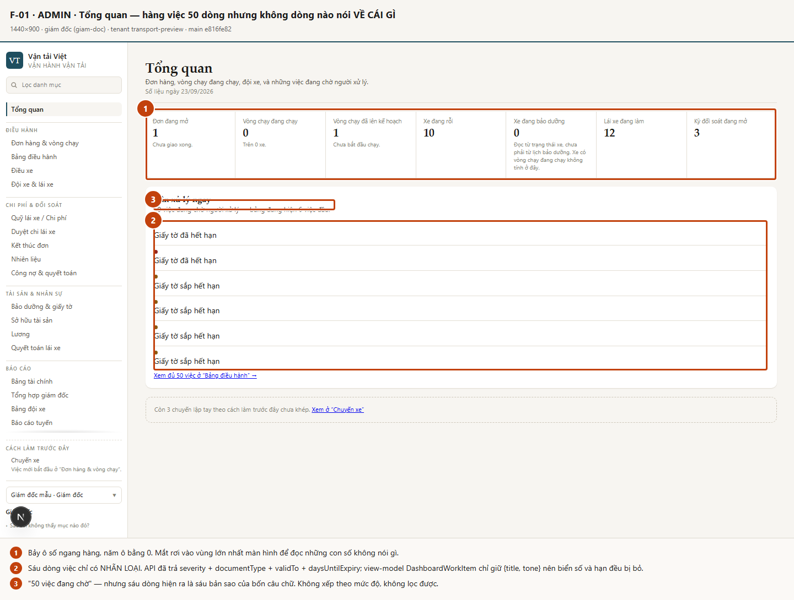
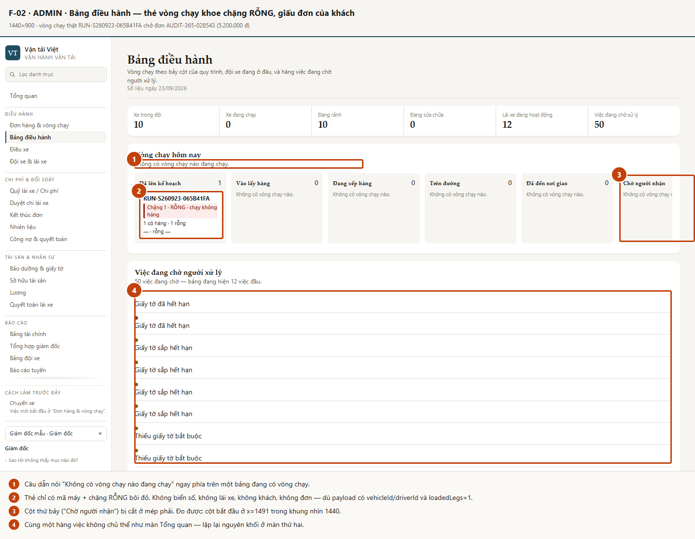
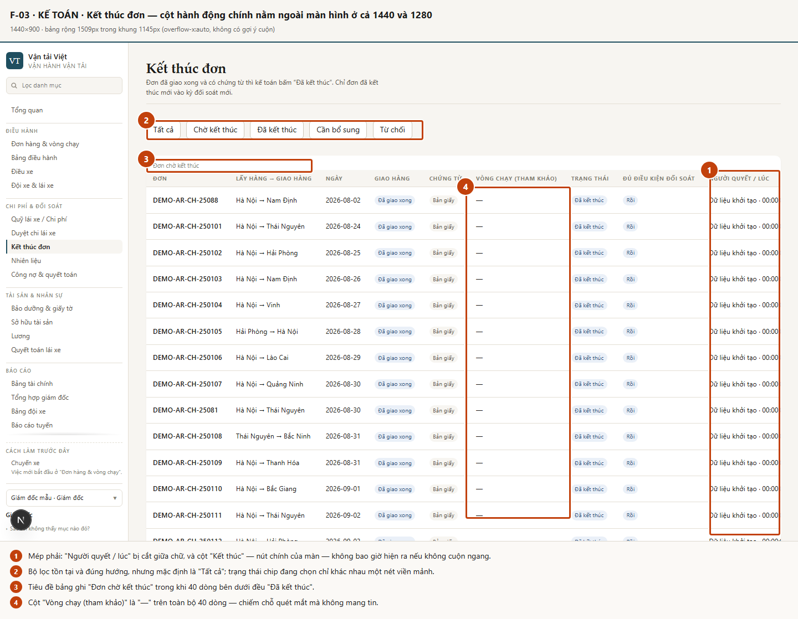
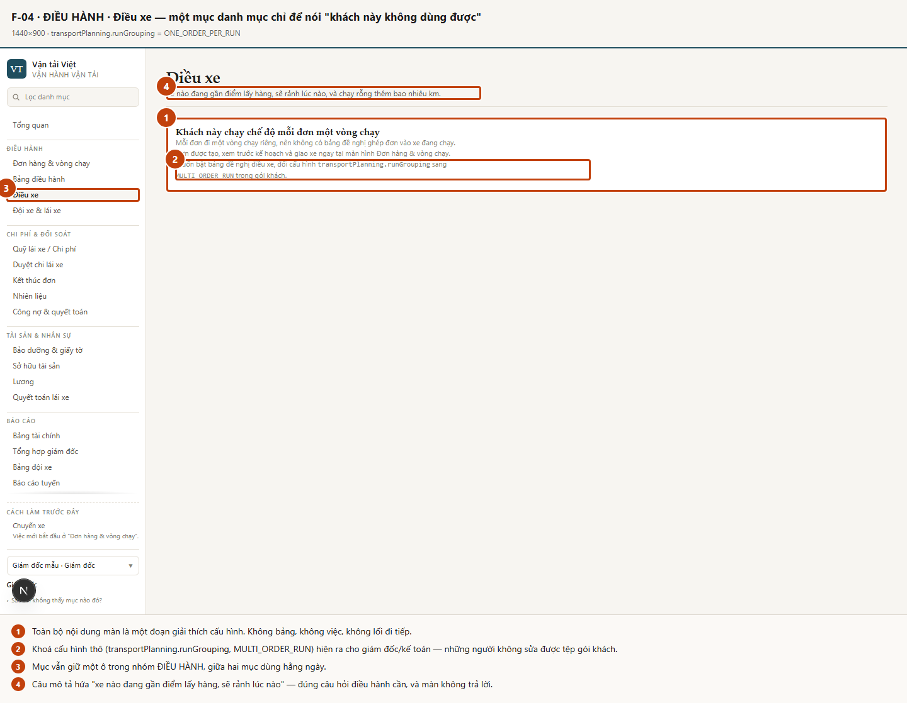
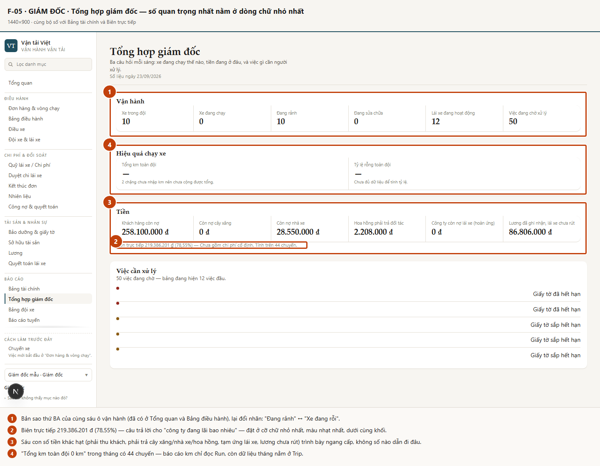
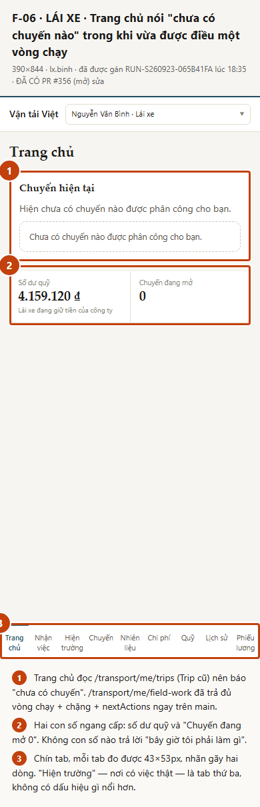
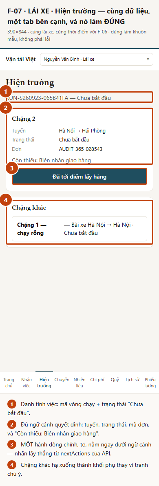
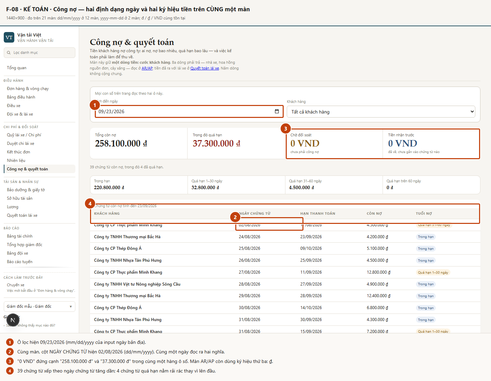
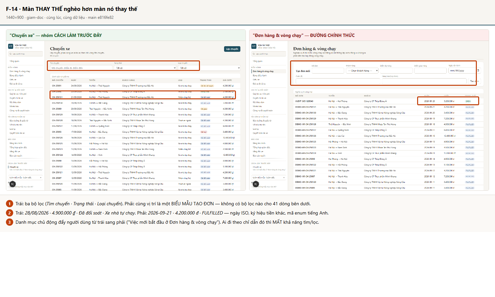

# Khảo sát giao diện Vận hành vận tải — độ phủ chi tiết FE↔BE và tải nhận thức

> **Đây là một bản KHẢO SÁT, không phải một task sửa giao diện.** Không một dòng mã sản phẩm nào
> được sửa trong nhánh này. Mọi phát hiện đều kèm ảnh chụp màn hình thật đang chạy, và mỗi ảnh
> đều được chính Claude mở ra nhìn bằng thị giác trước khi quay lại mã nguồn tìm nguyên nhân.
>
> Issue: [#365](https://github.com/phungtienviet14-sketch/nexagnet-platform/issues/365) ·
> Ngày khảo sát: **23/09/2026** · Nền: `main` = `e816fe82`

---

## ⚠️ Ghi chú về trình tự — đọc trước khi dùng bản này

Issue #365 đã bị **đóng** với nhãn `SUPERSEDED_BY_#370` ("Do not execute #365 separately … No UI
audit should start from the current moving backend baseline"). Một phiên trước đó đã dừng và hỏi
chủ repo.

Bản khảo sát này chạy vì **chủ repo ra lệnh tường minh chạy #365 ngay trên `main` hiện tại**, tức là
đúng đường "ghi đè" mà phiên trước đã nêu. Hệ quả phải nói rõ:

| Cổng của #370                                 | Trạng thái lúc khảo sát (23/09/2026) |
| --------------------------------------------- | ------------------------------------ |
| #367 / #364 — Fuel Run-first                  | ✅ MERGED                            |
| #369 — backend Run-first Fuel closeout        | ⬜ OPEN                              |
| #363 — waiting ↔ `DELIVERY_ACCEPTED`          | ⬜ OPEN                              |
| #356 — Driver Home Run-first (PR, chỉ sửa FE) | ⬜ OPEN                              |
| #357 — Finance IA (PR, chỉ sửa FE)            | ⬜ OPEN                              |

Do đó mọi phát hiện đều mang thêm **một trong ba nhãn trình tự**:

- `PENDING-PR` — đã có PR/issue đang mở sửa đúng chỗ này. **Không mở issue mới.**
- `WILL-SHIFT` — #369 sẽ đổi cấu trúc vùng này; không được vá theo hướng Trip-first.
- `STABLE` — không nằm trong vùng backend đang chuyển; sửa được ngay sau khi review.

Phần §10 chỉ đề nghị mở issue mới cho nhóm `STABLE` và cho những `WILL-SHIFT` cần ghi nhận sớm.

---

## 1. Tóm tắt cho người quyết định

**FE đang chậm BE ở ba chỗ, và cả ba đều là "dữ liệu đã có trong tay nhưng không được đưa ra
màn hình".**

1. **Hàng việc không có chủ thể.** `/transport/control-tower` trả về 50 việc, mỗi việc kèm
   `severity`, `subject.id`, `detail.documentType`, `detail.validTo`, `detail.daysUntilExpiry`.
   View-model của FE (`DashboardWorkItem`, `ControlTowerQueueRow`) chỉ giữ lại `{title, tone}`.
   Kết quả: ba màn quan trọng nhất của lãnh đạo (Tổng quan, Bảng điều hành, Tổng hợp giám đốc)
   hiện 50 việc mà chỉ có **bốn câu chữ khác nhau**, lặp đi lặp lại. Không ai biết xe nào, giấy gì,
   hạn nào. Màn `Bảo dưỡng & giấy tờ` — cùng dữ liệu, cùng thư viện — thì hiện đủ biển số, loại
   giấy tờ, số ngày quá hạn. Nên đây **không phải giới hạn dữ liệu, mà là một bước ánh xạ bị bỏ**.
2. **Lái xe được điều việc nhưng trang chủ nói "chưa có việc".** `/transport/me/field-work` đã trả
   đủ vòng chạy, chặng, đơn, giấy tờ còn thiếu, **và cả `nextActions` kèm nhãn tiếng Việt sẵn**.
   Màn `Hiện trường` dùng nó và làm rất tốt. Màn `Trang chủ` — cửa vào mặc định — vẫn đọc
   `/transport/me/trips` (Trip cũ) và báo "Hiện chưa có chuyến nào được phân công cho bạn".
   `PENDING-PR #356/#340`.
3. **Báo cáo chỉ đọc Run, dữ liệu vận hành nằm ở Trip.** `Tổng hợp giám đốc` ghi "Tổng km toàn đội
   **0 km**" trong một tháng có 44 chuyến; `Báo cáo tuyến` chỉ liệt kê đúng vòng chạy vừa tạo trong
   lúc khảo sát. `WILL-SHIFT` theo #369 B4.

**Vấn đề focus lớn nhất: hành động không có thứ bậc.** Đếm trên bản đang chạy (vùng `main`,
1440×900):

- **13/24 màn văn phòng không có một nút nào** — chúng là màn chỉ để đọc;
- chỉ **6/24 màn** có ít nhất một nút được nhấn mạnh về thị giác (nền đậm);
- `Công nợ & quyết toán` có **ba** nút cùng mức nhấn mạnh tranh nhau
  (`Xác nhận đối soát`, `Ghi nhận thanh toán`, `Phân bổ`);
- `Kết thúc đơn` — bề mặt hành động lớn nhất sản phẩm, **125 nút** (40 dòng × 3 nút hàng +
  5 chip lọc) — **không một nút nào được nhấn mạnh**, và cột chứa nút chính thì đo được nằm
  ngoài khung nhìn (bảng rộng 1509px trong khung 1145px).

**Và: ADMIN với ACCOUNTING nhận về hai bề mặt GIỐNG HỆT NHAU** — 23 mục danh mục như nhau, mọi
tiêu đề như nhau, mọi nút như nhau; khác đúng một chuỗi tên người đăng nhập. Không ai có một màn
hình được cắt theo việc của mình.

### Năm thay đổi có đòn bẩy cao nhất

| #   | Thay đổi                                                                                                   | Vì sao đòn bẩy cao                                                                                                               |
| --- | ---------------------------------------------------------------------------------------------------------- | -------------------------------------------------------------------------------------------------------------------------------- |
| 1   | Cho hàng việc một **chủ thể + mức độ + hạn** (tái dùng `subjectLabelOf` đã có trong `workspace/assets.ts`) | Sửa một view-model, ba màn tốt lên cùng lúc; không cần đụng backend                                                              |
| 2   | **Trang chủ lái xe đọc `field-work`** và hiện `nextActions`                                                | Biến màn mặc định của lái xe từ "không có việc" thành "bấm nút này" — PR #356 đã làm, chỉ cần merge                              |
| 3   | **Đưa cột hành động về trước** ở `Kết thúc đơn` + cho bảng biết ưu tiên cột nào khi hẹp                    | Hành động chính của kế toán đang vô hình ở cả 1440 lẫn 1280                                                                      |
| 4   | **Một định dạng ngày, một ký hiệu tiền** toàn hệ thống                                                     | Đo được: `dd/mm/yyyy` ở 12 màn, `yyyy-mm-dd` ở 2 màn, và `đ`/`₫`/`VND` cùng tồn tại — rủi ro đọc sai số tiền và sai ngày công nợ |
| 5   | **Cắt danh mục theo vai** (ADMIN ≠ ACCOUNTING) và bỏ mục chết (`Điều xe`)                                  | 23 mục cho mọi người là nguyên nhân gốc của cảm giác "không biết nhìn đâu trước"                                                 |

---

## 2. Phương pháp

| Mục              | Giá trị                                                                                                                                                                                                            |
| ---------------- | ------------------------------------------------------------------------------------------------------------------------------------------------------------------------------------------------------------------ |
| SHA nền          | `e816fe82` (`main`), nhánh khảo sát `claude/issue-365-visual-audit-2b9151`                                                                                                                                         |
| Chạy ở đâu       | **Cục bộ, toàn bộ**. Không đụng Railway, không seed/reset môi trường nào đang chạy                                                                                                                                 |
| Postgres         | `embedded-postgres` 16.14, cụm riêng, cổng `15437` (không dùng chung 5432/15432)                                                                                                                                   |
| API              | `apps/api/dist/main.js`, cổng `4601`, `PERSISTENCE=prisma`, `AUTH_MODE=session`, `MEDIA_STORE=local`                                                                                                               |
| Web              | `apps/web/dev-transport.mjs`, cổng `3002`, `TENANT_DIR=tenants/transport-preview`                                                                                                                                  |
| Dữ liệu          | **Đường gieo chính thức** `deploy/netviet/seed-transport-demo.mjs` (không SQL thô). Gieo được: 10 xe · 12 lái xe · 5 khách · 44 chuyến · 40 đơn · 35 phiếu dầu · 3 kỳ đối soát · 20 hồ sơ giấy tờ · 12 phiếu lương |
| Vai đã đăng nhập | `giam-doc` (ADMIN) · `ke-toan` (ACCOUNTING) · `lx.binh` (lái xe, nền tảng ánh xạ vào `SALE`)                                                                                                                       |
| Khung nhìn       | **1440×900** (văn phòng) · **1280×800** (kiểm tra hẹp) · **390×844** (lái xe, `isMobile`+`hasTouch`)                                                                                                               |
| Số màn đã mở     | **24 màn văn phòng × 2 vai × 2 khung nhìn** + **9 màn lái xe** + 17 trạng thái cần chú ý + 6 bước của luồng tạo đơn                                                                                                |
| Số ảnh           | **205** ảnh thật (`.fold` = khung nhìn đầu, `.full` = cả trang), chưa commit; **11** ảnh đã chú thích được commit (9 phát hiện + 2 bảng liên hệ)                                                                   |
| Công cụ          | Playwright 1.62.1 (Chromium), harness nhỏ ở `tmp/transport-fe-audit/` (không commit, `tmp/` đã gitignore)                                                                                                          |

### Trạng thái vận hành được tạo ra để khảo sát

Gói mẫu gieo một **tháng đã kết thúc** — mọi chuyến `RECONCILED`/`DELIVERED`, không vòng chạy nào
đang chạy. Chụp như vậy thì mọi màn điều hành đều là ảnh rỗng và không kết luận được gì.

Nên đã tạo **một đơn thật qua chính giao diện** (không gọi thẳng DB):

```
Đơn  AUDIT-365-028543 · Hà Nội → Hải Phòng · Công ty CP Thép Đông Á · 5.200.000 đ
Vòng chạy  RUN-S260923-065B41FA · xe 29H-152.44 · PLANNED
Lái xe  Nguyễn Văn Bình (lx.binh) — hệ thống TỰ gán khi chốt kế hoạch
Chặng  1 = RỖNG (Bãi xe Hà Nội → Hà Nội) · 2 = CÓ HÀNG (Hà Nội → Hải Phòng)
```

Toàn bộ phát hiện về màn điều hành và màn lái xe được đo **trên trạng thái này**, không phải
trên màn rỗng.

### Điều đã KHÔNG làm

Không sửa BE · không sửa business UI · không merge #356/#357/#363/#364 vào nhánh này ·
không deploy · không reset dữ liệu của bất kỳ môi trường chung nào · không tạo design system.

### Một cảnh báo về chính phương pháp

Vòng chụp đầu tiên có một **chấm tròn đen đè lên góc trái dưới ở mọi ảnh**. Nhìn bằng mắt thì rất
giống một lỗi chồng lớp của sản phẩm. Kiểm bằng `elementFromPoint` thì đó là `NEXTJS-PORTAL` —
chỉ báo chế độ dev của Next.js, **không phải phần tử của sản phẩm**. Đã gỡ phần tử đó trước khi
chụp lại toàn bộ. Ghi ở đây vì đó chính là lý do issue bắt buộc "nhìn ảnh" _và_ "quay lại mã
nguồn": chỉ nhìn ảnh thì đã có một phát hiện sai.

---

## 3. Mô hình tâm trí của người dùng

### 3.1. Giám đốc — "sáng nay có gì cần tôi?"

1. Hôm nay có gì hỏng/chậm mà chỉ tôi quyết được?
2. Đội xe đang được dùng đến đâu, xe nào nằm không?
3. Tiền đang ở đâu — ai nợ mình, mình nợ ai, tháng này lãi bao nhiêu?
4. Có giấy tờ/bảo dưỡng nào sắp làm một xe phải nằm bãi không?
5. Việc nào đang chờ đúng chữ ký của tôi?

### 3.2. Điều hành — "xe nào, ai chạy, đang ở đâu"

1. Có đơn mới nào chưa xếp xe?
2. Xe nào rảnh, đang ở gần điểm lấy hàng?
3. Vòng chạy đang chạy dừng ở bước nào?
4. Cái gì đang chặn một vòng chạy (thiếu giấy, chờ người nhận, chờ xác nhận)?
5. Lái xe nào đang ở đâu, đã báo mốc nào?

### 3.3. Kế toán — "đủ điều kiện chưa, lệch ở đâu"

1. Đơn nào đã giao xong và đủ chứng từ để kết thúc?
2. Khách nào nợ, quá hạn bao lâu, hôm nay phải đòi ai?
3. Mình nợ ai — cây xăng, nhà xe, hoa hồng?
4. Phiếu dầu nào chưa xác thực, dòng bảng kê nào lệch?
5. Lái xe nào đang giữ tiền của công ty, ai phải hoàn ứng?
6. Kỳ lương đã chốt được chưa?

### 3.4. Lái xe — "bây giờ tôi làm gì"

1. Việc của tôi bây giờ là gì, đi đâu?
2. Bước kế tiếp phải bấm gì, phải chụp gì?
3. Tôi có đang phải chờ không, chờ ai?
4. Đổ dầu / chi tiền dọc đường thì ghi ở đâu?
5. Tôi đang giữ bao nhiêu tiền của công ty?
6. Tháng này tôi được bao nhiêu?

---

## 4. Bản đồ màn hình đã mở

Ảnh tổng: **[contact-sheet-office.png](transport-fe-visual-audit/assets/contact-sheet-office.png)**
(24 màn văn phòng) · **[contact-sheet-driver.png](transport-fe-visual-audit/assets/contact-sheet-driver.png)**
(9 màn lái xe).

Mỗi dòng dưới đây đều có ảnh thật trong `tmp/transport-fe-audit/`. Cột **Câu hỏi chính** là câu hỏi
màn hình _nên_ trả lời; cột **Trả lời được?** là kết luận sau khi nhìn ảnh.

### 4.1. Văn phòng — 24 màn (ADMIN và ACCOUNTING giống hệt nhau)

| #   | Màn                       | Địa chỉ                      | Câu hỏi chính                   | Trả lời được?                                             |
| --- | ------------------------- | ---------------------------- | ------------------------------- | --------------------------------------------------------- |
| 1   | Tổng quan                 | `/`                          | Hôm nay có gì cần tôi chú ý?    | ⚠️ Có danh sách, không có chủ thể                         |
| 2   | Đơn hàng & vòng chạy      | `?section=movement`          | Đơn nào chưa xếp xe?            | ❌ 41 dòng, **không một bộ lọc nào**                      |
| 3   | Chuyến xe _(cách làm cũ)_ | `?section=trips`             | —                               | ⚠️ 44 dòng; **có 3 bộ lọc mà màn thay thế không có**      |
| 4   | Bảng điều hành            | `?section=control-tower`     | Vận hành mắc ở đâu?             | ⚠️ Bảng 7 cột bị cắt, thẻ thiếu xe/lái xe/khách           |
| 5   | Điều xe                   | `?section=dispatch`          | Xe nào rảnh, gần điểm lấy hàng? | ❌ Ngõ cụt cấu hình                                       |
| 6   | Đội xe & lái xe           | `?section=fleet`             | Đội xe gồm những gì?            | ✅                                                        |
| 7   | Quỹ lái xe / Chi phí      | `?section=driver-fund`       | Ai đang giữ tiền công ty?       | ⚠️ Chỉ xem được từng người một                            |
| 8   | Duyệt chi lái xe          | `?section=expense-claims`    | Đề nghị nào chờ duyệt?          | ⚠️ Rỗng, không có empty-state                             |
| 9   | Kết thúc đơn              | `?section=order-completion`  | Đơn nào đủ điều kiện kết thúc?  | ❌ Nút chính ngoài màn hình                               |
| 10  | Nhiên liệu                | `?section=fuel`              | Phiếu nào chưa xác thực?        | ⚠️ Có lọc, thiếu dòng tổng                                |
| 11  | Phí đường bộ (ETC)        | `?section=toll`              | —                               | ❌ **Rơi âm thầm về Tổng quan**, không một câu giải thích |
| 12  | Công nợ & quyết toán      | `?section=settlement`        | Khách nào nợ, quá hạn bao lâu?  | ✅ Tốt nhất nhóm; lệch ngày/tiền                          |
| 13  | Bảo dưỡng & giấy tờ       | `?section=maintenance`       | Xe nào sắp phải nằm bãi?        | ⚠️ 5.572px, 6 khối, 5 bảng                                |
| 14  | Sở hữu tài sản            | `?section=asset-ownership`   | Xe của ai?                      | ✅                                                        |
| 15  | Lương                     | `?section=payroll`           | Kỳ lương đến đâu?               | ✅                                                        |
| 16  | Quyết toán lái xe         | `?section=driver-settlement` | Ai phải hoàn ứng?               | ✅ 12 dòng, đúng việc                                     |
| 17  | Bảng tài chính            | `?section=finance`           | Tiền đang ở đâu?                | ⚠️ Trùng `executive`, không chọn được kỳ                  |
| 18  | Tổng hợp giám đốc         | `?section=executive`         | Ba câu hỏi mỗi sáng             | ⚠️ Thứ bậc ngược, `0 km`                                  |
| 19  | Bảng đội xe               | `?section=fleet-dashboard`   | Xe nào chạy rỗng nhiều?         | ✅ Bảng 9 cột, đúng việc                                  |
| 20  | Báo cáo tuyến             | `?section=routes`            | Tuyến nào kéo theo km rỗng?     | ⚠️ Chỉ thấy Run, không đổi được kỳ                        |
| 21  | Bản đồ vòng chạy          | `?section=journey`           | Vòng chạy này đi thế nào?       | ⚠️ Bắt chọn trước, màn trống                              |
| 22  | Biên trực tiếp            | `?section=margin`            | Chuyến nào lỗ?                  | ❌ Chỉ xem được từng chuyến một                           |
| 23  | AR/AP                     | `?section=ar-ap`             | Mình nợ ai?                     | ⚠️ Dùng ký hiệu `₫` riêng                                 |
| 24  | Xuất dữ liệu              | `?section=exports`           | Kết xuất sổ sách                | ✅                                                        |

### 4.2. Lái xe — 9 màn (390×844)

| #   | Màn             | Địa chỉ                | Câu hỏi chính             | Trả lời được?                                              |
| --- | --------------- | ---------------------- | ------------------------- | ---------------------------------------------------------- |
| 1   | Trang chủ       | `?surface=driver`      | Bây giờ tôi làm gì?       | ❌ Nói "chưa có chuyến" dù đã được điều                    |
| 2   | Nhận việc       | `…&screen=site-intake` | Nhận việc tại cổng        | ❌ Chỉ sang màn "Chuyến" — màn đó nói không có việc        |
| 3   | **Hiện trường** | `…&screen=field`       | Bước kế tiếp là gì?       | ✅✅ **Khuôn mẫu của cả sản phẩm**                         |
| 4   | Chuyến _(cũ)_   | `…&screen=trip`        | —                         | ❌ "Bạn không có chuyến nào đang mở"                       |
| 5   | Nhiên liệu      | `…&screen=fuel`        | Ghi phiếu đổ dầu          | ⚠️ 9 ô nhập, ngày giờ kiểu Mỹ, nút bị khoá không nói lý do |
| 6   | Chi phí         | `…&screen=expense`     | Ghi chi dọc đường         | ❌ **Không ghi được** khi việc là Run                      |
| 7   | Quỹ             | `…&screen=fund`        | Tôi giữ bao nhiêu tiền?   | ✅                                                         |
| 8   | Lịch sử         | `…&screen=history`     | Tôi đã chạy gì?           | ✅                                                         |
| 9   | Phiếu lương     | `…&screen=payslip`     | Tháng này được bao nhiêu? | ⚠️ Diễn giải dồn một dòng ngăn bằng `                      | `   |

---

## 5. Ma trận độ phủ FE ↔ BE

`COMPLETE` · `PARTIAL` · `MISSING` · `LEGACY-ONLY` · `PENDING-PR`.
**Không màn nào được chấm `COMPLETE` chỉ vì endpoint đã được gọi.**

| #     | Sự thật nghiệp vụ                                     | Nguồn backend                                                                                              | Vai cần           | Bề mặt FE                                      | Phủ                                  | Thiếu gì                                                                                                                              | Hệ quả cho người dùng                                                                                    |
| ----- | ----------------------------------------------------- | ---------------------------------------------------------------------------------------------------------- | ----------------- | ---------------------------------------------- | ------------------------------------ | ------------------------------------------------------------------------------------------------------------------------------------- | -------------------------------------------------------------------------------------------------------- |
| C-01  | Việc đang chờ: loại, **mức độ**, **chủ thể**, **hạn** | `GET /transport/control-tower` → `queue[].{severity, subject.id, detail.*}`                                | ADMIN, ACCT       | Tổng quan · Bảng điều hành · Tổng hợp giám đốc | **PARTIAL**                          | `severity`, `documentType`, `validTo`, `daysUntilExpiry`, nhãn chủ thể — bị `DashboardWorkItem`/`ControlTowerQueueRow` cắt bỏ         | 50 việc rút còn 4 câu chữ. Không biết xe nào để xử lý, không xếp được ưu tiên                            |
| C-02  | Nhãn người đọc được của chủ thể cảnh báo              | `subject.reference` = **`null`** cho `VEHICLE`; biển số có trong `GET /transport/vehicles`                 | ADMIN, ACCT       | như trên                                       | **PARTIAL (FE)** + **MISSING (BE)**  | BE không chiếu `reference`; FE đã có `subjectLabelOf()` nhưng không dùng ở hai màn này                                                | Link sâu từ hàng việc cũng `null` → bấm vào không tới đúng dòng                                          |
| C-03  | Việc hiện tại của lái xe (Run-first)                  | `GET /transport/me/field-work` → `runs[].legs[].{orderCode, phase, missingDocumentTypes, **nextActions**}` | Lái xe            | Trang chủ                                      | **PENDING-PR** (#356/#340)           | Trang chủ đọc `/me/trips` (Trip cũ)                                                                                                   | Lái xe vừa được điều vẫn thấy "chưa có chuyến nào"                                                       |
| C-04  | như trên                                              | như trên                                                                                                   | Lái xe            | **Hiện trường**                                | **COMPLETE**                         | —                                                                                                                                     | Màn duy nhất trả lời đúng "bây giờ làm gì"                                                               |
| C-05  | Ghi chi phí dọc đường                                 | `POST /transport/me/expenses` → `recordSelfTripExpense()` — **bắt buộc `tripId`**                          | Lái xe            | Chi phí                                        | **MISSING** (`WILL-SHIFT` #369 B3)   | Không có đường ghi chi theo Run/Leg                                                                                                   | Lái xe đang chạy **không ghi được** phí cầu đường/bốc xếp                                                |
| C-06  | Thẻ vòng chạy trên bảng điều hành                     | `control-tower.board[].cards[].{vehicleId, driverId, loadedLegs, emptyLegs, currentLeg}`                   | Điều hành         | Bảng điều hành                                 | **PARTIAL**                          | FE không đổi `vehicleId`/`driverId` thành biển số/tên; BE không mang `orderCode` cấp vòng chạy, `totalKm`/`emptyKm` = `null`          | Thẻ chỉ có mã máy + chữ "RỖNG"; không biết xe nào, ai chạy, chở đơn nào                                  |
| C-07  | Đơn ↔ vòng chạy phục vụ nó                            | `tripOrderLinks` (40 bản ghi đã gieo)                                                                      | ACCT              | Kết thúc đơn, cột `Vòng chạy (tham khảo)`      | **PARTIAL**                          | Cột hiện `—` trên cả 40 dòng                                                                                                          | Một cột chiếm chỗ quét mắt mà không mang tin                                                             |
| C-08  | Hỗ trợ quyết định chọn xe                             | `GET /transport/vehicles` (biển số, hạng, đồng hồ); vị trí/lịch rảnh: **chưa có**                          | Điều hành         | `Lập kế hoạch từ đơn` → `<select>` 10 biển số  | **PARTIAL**                          | Không tình trạng rảnh/bận, không vị trí, không tải trọng, không km rỗng dự kiến                                                       | Quyết định vận hành quan trọng nhất được ra từ một danh sách biển số trần                                |
| C-09b | Mục bị chặn theo gói khách                            | `readiness.blockedCapabilities` (khai `transport-toll` + **lý do bằng chữ**)                               | mọi vai           | `?section=toll`                                | **MISSING**                          | Lý do đã có trong `tenant.json` nhưng không bao giờ ra màn hình                                                                       | Ai mở link/đánh dấu cũ tới ETC rơi về `Tổng quan` mà không biết vì sao — địa chỉ đúng, màn hình khác     |
| C-09  | Bảng đề nghị ghép xe                                  | — (khoá theo `transportPlanning.runGrouping`)                                                              | Điều hành         | Điều xe                                        | **MISSING (đúng thiết kế)**          | Gói khách chạy `ONE_ORDER_PER_RUN`                                                                                                    | Màn tồn tại chỉ để nói "không dùng được", kèm khoá cấu hình thô                                          |
| C-10  | Lái xe được gán cho vòng chạy                         | `POST /transport/runs/:id/assignment` (hệ thống tự gán khi chốt)                                           | Điều hành         | `Xác nhận kế hoạch và giao xe`                 | **PARTIAL**                          | Không hiện lái xe nào **trước** khi chốt, cũng không hiện **sau** khi chốt                                                            | Thông báo chỉ ghi "đã giao cho xe 29H-152.44"; người chốt không biết mình vừa gán ai                     |
| C-11  | Km có hàng / km rỗng của đội                          | `GET /transport/runs/:id/movement`; chuyến cũ nằm ở `TransportTrip.distanceKm`                             | Giám đốc          | Tổng hợp giám đốc · Báo cáo tuyến              | **PARTIAL** (`WILL-SHIFT` #369 B4)   | Báo cáo chỉ cộng Run                                                                                                                  | "Tổng km toàn đội **0 km**" trong tháng có 44 chuyến                                                     |
| C-12  | Biên trực tiếp theo từng chuyến                       | `transport.analytics.read`                                                                                 | Giám đốc          | Biên trực tiếp                                 | **PARTIAL**                          | Không có bảng xếp hạng; phải chọn từng chuyến trong `<select>` 44 mục                                                                 | Không trả lời được "chuyến nào lỗ" — câu hỏi duy nhất của màn                                            |
| C-13  | Tuổi nợ khách hàng                                    | `transport.settlement.report.read`                                                                         | ACCT              | Công nợ & quyết toán                           | **COMPLETE**                         | (xếp theo ngày chứng từ thay vì mức quá hạn)                                                                                          | Tốt; 4 chứng từ quá hạn nằm rải trong 39 dòng                                                            |
| C-14  | Ghi nhận thu tiền / xác nhận đối soát                 | `customer_payment.record`, `customer_reconciliation.confirm`                                               | ACCT              | Công nợ — khối `Việc đối soát & thu tiền`      | **PARTIAL**                          | Khối hành động nằm ở **y=2079px** trên trang cao 2477px, gồm **25 ô nhập** trong 4 biểu mẫu, **không ô nào điền sẵn** từ dòng vừa xem | Thấy dòng quá hạn rồi phải cuộn qua cả bảng 39 dòng và **gõ tay lại** khách hàng, số tiền, tiền tệ, ngày |
| C-15  | Phiếu dầu + xác thực + đối soát                       | `transport/fuel/*`                                                                                         | ACCT              | Nhiên liệu                                     | **PARTIAL** (`WILL-SHIFT` #364/#369) | Không dòng tổng (không `<tfoot>`) cho 35 dòng đã lọc; cột `Đối soát` bị cắt ở 1440                                                    | Không cộng được lít/tiền của tập đã lọc khi soát bảng kê                                                 |
| C-16  | Cảnh báo tuân thủ đầy đủ                              | `GET /transport/alerts`                                                                                    | ADMIN             | Bảo dưỡng & giấy tờ                            | **COMPLETE**                         | —                                                                                                                                     | Chuẩn mực để so: cùng dữ liệu, hiện đủ biển số + loại giấy + số ngày                                     |
| C-17  | Quỹ của từng lái xe                                   | `costing.driver_fund.read`                                                                                 | ACCT              | Quỹ lái xe / Chi phí                           | **PARTIAL**                          | Không có bảng toàn đội ở đây (bảng đó nằm ở `Quyết toán lái xe`)                                                                      | Phải chọn lần lượt 12 lái xe mới biết ai giữ nhiều tiền                                                  |
| C-18  | Chuỗi chứng từ / ai sửa số này                        | `transport.settlement.document.read`                                                                       | ACCT              | —                                              | **MISSING**                          | Không màn nào mở chuỗi chứng từ gốc                                                                                                   | Không trả lời được "ai sửa con số này, lúc nào, vì sao"                                                  |
| C-19  | Trạng thái chờ ↔ `DELIVERY_ACCEPTED`                  | `transport/checkpoint`, `waiting`                                                                          | Lái xe, Điều hành | Hiện trường                                    | **PENDING (#363)**                   | —                                                                                                                                     | **Không kết luận** trong bản này theo yêu cầu §10 của #365                                               |
| C-20  | Phân quyền theo vai                                   | `transport-actions.ts` — ACCOUNTING bị từ chối đúng 3 hành động                                            | ADMIN vs ACCT     | Danh mục + mọi màn                             | **PARTIAL**                          | Bề mặt hai vai **giống hệt** (23 mục, cùng nút)                                                                                       | Kế toán phải đi qua mọi màn điều hành; giám đốc qua mọi màn kế toán                                      |

---

## 6. Phát hiện về FOCUS / tải nhận thức

### F-01 · Hàng việc 50 dòng, bốn câu chữ



- **Vai:** ADMIN, ACCOUNTING — **Màn:** Tổng quan (lặp lại ở Bảng điều hành, Tổng hợp giám đốc)
- **Câu hỏi của người dùng:** "Hôm nay có gì cần tôi?"
- **Nhìn 5 giây đầu thấy gì:** một hàng bảy ô số lớn, **năm ô bằng 0**; rồi sáu dòng chữ giống nhau.
- **Vấn đề:** mắt bị kéo về vùng lớn nhất màn hình để đọc những con số rỗng, còn thứ duy nhất
  đáng làm — 50 việc đang chờ — thì không nói được việc gì, của xe nào, hạn bao giờ.
- **Vì sao quan trọng:** đây là màn mặc định. Người dùng mở phần mềm ra và nhận về một danh sách
  không hành động được, rồi phải tự đoán nên đi đâu tiếp.
- **Phân lại tầng:** `Primary` = hàng việc có chủ thể + mức độ, xếp nghiêm trọng trước ·
  `Secondary` = 2–3 ô số thật sự biến động · `Exception-only` = các ô đang bằng 0 ·
  `Detail-on-demand` = danh sách đầy đủ ở Bảng điều hành.
- **Hướng đề xuất:** dùng lại `subjectLabelOf()` trong `dashboard.ts` / `control-tower.ts`; mỗi dòng
  đọc thành một câu: _"29C-334.71 · Bảo hiểm xe · quá hạn 14 ngày"_ + chip mức độ như màn
  `Bảo dưỡng & giấy tờ` đã làm.
- **Mức:** **P0** · `STABLE`

### F-02 · Thẻ vòng chạy khoe chặng rỗng, giấu đơn của khách



- **Vai:** Điều hành (ADMIN) — **Màn:** Bảng điều hành
- **Câu hỏi:** "Vận hành đang mắc ở đâu?"
- **Nhìn 5 giây đầu:** câu "Không có vòng chạy nào đang chạy." — rồi ngay dưới là một vòng chạy.
  Thẻ duy nhất trên bảng bôi đỏ dòng **"Chặng 1 · RỖNG · chạy không hàng"**.
- **Vấn đề:** vòng chạy này đang phục vụ đơn `AUDIT-365-028543` trị giá 5.200.000 đ. Thẻ không
  hiện biển số, không hiện lái xe, không hiện khách, không hiện đơn — chỉ mã máy và chữ "RỖNG".
  Payload có `vehicleId` và `driverId`; `currentLeg` trỏ vào chặng rỗng nên `orderCode` là `null`.
- **Vì sao quan trọng:** điều hành nhìn bảng để biết "xe nào đang ở đâu, chở gì". Bảng trả lời
  được "có một vòng chạy" và không gì hơn.
- **Phân lại tầng:** `Primary` = biển số + lái xe + khách/đơn + bước kế tiếp ·
  `Secondary` = số chặng có hàng/rỗng · `Detail-on-demand` = danh sách chặng.
- **Hướng đề xuất:** FE đổi id thành nhãn bằng `vehicleLabelOf`/`driverLabelOf`; BE bổ sung
  tóm tắt đơn ở cấp vòng chạy thay vì chỉ `currentLeg.orderCode`.
- **Mức:** **P1** · `WILL-SHIFT` (đọc Run sẽ đổi theo #369)

### F-03 · Nút chính của kế toán nằm ngoài màn hình



- **Vai:** ACCOUNTING — **Màn:** Kết thúc đơn
- **Đo được:** bảng rộng **1509px** trong khung **1145px** (1440) và **988px** (1280);
  `overflow-x: auto`, không có gợi ý cuộn.
- **Vấn đề:** cột cuối là `Kết thúc` — hành động chính của màn — và nó **không bao giờ hiện ra**
  ở cả hai khung nhìn đã khảo sát. Ở 1280 thì mất luôn cả cột `Người quyết / lúc`.
- **Cộng thêm — mật độ hành động:** đếm được **125 nút** trong vùng `main`: 40 dòng × 3 nút
  (`Đã kết thúc` / `Cần bổ sung` / `Từ chối`) + 5 chip lọc. `Từ chối` — hành động phủ định —
  xuất hiện **40 lần**, cùng trọng số với hành động thường. **Không nút nào được nhấn mạnh**
  về thị giác, nên không có gì chỉ ra đâu là việc chính.
- **Cộng thêm:** lọc "Chờ kết thúc" trả 0 dòng thì màn hiện **10 tiêu đề cột trên khoảng trống**,
  không có câu empty-state nào (trong khi các màn khác đều có `EmptyState`).
- **Phân lại tầng:** `Primary` = đơn _chờ_ kết thúc + nút kết thúc · `Secondary` = chứng từ, ngày ·
  `Detail-on-demand` = người quyết/lúc, vòng chạy tham khảo · `Noise` = cột `Vòng chạy (tham khảo)`
  đang `—` toàn bộ.
- **Mức:** **P0** · `STABLE`

### F-04 · Một mục danh mục chỉ để nói "khách này không dùng được"



- **Vai:** Điều hành — **Màn:** Điều xe
- **Vấn đề:** toàn bộ nội dung là một đoạn giải thích cấu hình, có in ra **khoá kỹ thuật thô**
  (`transportPlanning.runGrouping`, `MULTI_ORDER_RUN`) cho người không sửa được tệp gói khách.
  Câu mô tả màn hứa đúng thứ điều hành cần ("xe nào đang gần điểm lấy hàng, sẽ rảnh lúc nào")
  rồi không đưa ra gì.
- **Vì sao quan trọng:** đây là **ô thứ ba trong nhóm ĐIỀU HÀNH**, nằm giữa hai mục dùng hằng ngày.
  Mỗi lần người dùng quét danh mục là một lần trả giá chú ý cho một ô không bao giờ có việc.
- **Hướng đề xuất:** rút khỏi danh mục chính khi gói khách chạy `ONE_ORDER_PER_RUN` (dùng đúng
  cơ chế `supersededBy` đã có cho `Chuyến xe`), giữ địa chỉ cũ mở được, và nói bằng ngôn ngữ
  công việc + một link sang `Đơn hàng & vòng chạy`.
- **Mức:** **P1** · `STABLE`

### F-05 · Số quan trọng nhất nằm ở dòng chữ nhỏ nhất



- **Vai:** ADMIN — **Màn:** Tổng hợp giám đốc
- **Vấn đề 1 — thứ bậc ngược:** "Biên trực tiếp 219.386.201 đ (78,55%)" là câu trả lời cho
  "công ty đang lãi bao nhiêu", và nó được đặt ở **cỡ chữ nhỏ nhất, màu nhạt nhất**, dưới cùng khối,
  trong khi sáu con số phải thu/phải trả khác hạt thì to bằng nhau.
- **Vấn đề 2 — bản sao thứ ba:** khối "Vận hành" lặp lại đúng sáu ô đã có ở Tổng quan và Bảng
  điều hành, lại **đổi nhãn cho cùng một sự thật** (`Đang rảnh` ↔ `Xe đang rỗi`,
  `Đang sửa chữa` ↔ `Xe đang bảo dưỡng`).
- **Vấn đề 3:** "Tổng km toàn đội **0 km**" trong tháng 44 chuyến → xem C-11.
- **Vấn đề 4:** hàng việc ở màn này **căn phải**, trong khi cùng danh sách đó ở hai màn kia căn trái.
- **Mức:** **P1** · `STABLE` (riêng `0 km` là `WILL-SHIFT`)

### F-06 + F-07 · Lái xe: cùng dữ liệu, hai màn, một màn nói dối

| Trang chủ — cửa vào mặc định                                                    | Hiện trường — một tab bên cạnh                                                   |
| ------------------------------------------------------------------------------- | -------------------------------------------------------------------------------- |
|  |  |

- **Vai:** Lái xe — **Màn:** Trang chủ vs Hiện trường, **cùng một lái xe, cùng một thời điểm**
- **Trang chủ** báo "Hiện chưa có chuyến nào được phân công cho bạn" (đọc `/me/trips`).
- **Hiện trường** hiện đủ: mã vòng chạy, trạng thái, tuyến, **mã đơn**, "Còn thiếu: Biên nhận giao
  hàng", và **một** nút lớn "Đã tới điểm lấy hàng" — nhãn lấy thẳng từ `nextActions` của API.
- **Thêm một vòng lặp chết:** màn **Nhận việc** _biết_ vòng chạy (hiện đúng `RUN-S260923-065B41FA`)
  nhưng lại chỉ dẫn "mở màn **Chuyến**" — và màn Chuyến nói "Bạn không có chuyến nào đang mở".
  Lái xe bị đẩy giữa ba màn, trong đó màn làm được việc là màn không ai chỉ tới.
- **Hướng đề xuất:** F-07 là **khuôn mẫu** — Trang chủ nên là chính nó, cộng số dư quỹ ở tầng phụ.
- **Mức:** **P0** · `PENDING-PR #356/#340` cho Trang chủ; chỉ dẫn sai ở **Nhận việc** là
  `STABLE` và **chưa** có PR nào chạm tới (PR #356 chỉ sửa `HomeScreen.tsx`, `DriverSurface.tsx`,
  `driver.ts`, `useTransportWorkspace.ts`).

### F-08 · Chín tab 43px và một thanh điều hướng gãy chữ

- **Vai:** Lái xe — **Màn:** mọi màn (390×844)
- **Đo được:** 9 tab, **mỗi tab 43 × 53 px**, nhãn gãy hai dòng ở cỡ ~10px.
  Khuyến nghị thực hành cho đích chạm một ngón là ~44–48px bề ngang; ở đây đã chạm đáy và
  nhãn thì phải đọc kỹ mới phân biệt được.
- **Vấn đề kèm theo:** tab **"Chuyến"** (cách làm cũ) vẫn là một tab ngang hàng và **không** được
  đánh dấu "cách làm trước đây" — trong khi bề mặt văn phòng đã hạ `Chuyến xe` xuống nhóm
  `CÁCH LÀM TRƯỚC ĐÂY`. Bề mặt chật nhất lại giữ mục thừa mà bề mặt rộng đã dọn.
- **Phân lại tầng:** `Primary` = Hiện trường, Trang chủ · `Secondary` = Nhiên liệu, Chi phí, Quỹ ·
  `Detail-on-demand` = Lịch sử, Phiếu lương (đưa vào menu tài khoản) · `Noise` = Chuyến (bỏ).
- **Mức:** **P1** · `STABLE`

### F-09 · Màn nhiên liệu của lái xe: chín ô nhập, nút khoá không nói lý do

- **Vai:** Lái xe — **Màn:** Nhiên liệu
- **Đo được:** 9 ô nhập xếp dọc; nút "Gửi phiếu" `disabled = true`, **không `title`, không
  `aria-describedby`, không câu giải thích nào trên màn**.
- **Lỗi bản địa hoá:** ô thời điểm hiện `09/23/2026 01:41 AM` — định dạng ngày kiểu Mỹ + giờ 12h
  trên máy của một lái xe Việt Nam; ô đính ảnh hiện nút mặc định tiếng Anh `Choose File` /
  `No file chosen`.
- **Điều đúng cần ghi nhận:** màn này **đã** Run-first (hiện "Vòng xe RUN-… · xe 29H-152.44") —
  thành quả của #364/#367.
- **Hướng đề xuất:** ảnh phiếu lên đầu (sản phẩm đã có `fuel-evidence-extraction`), chặng mặc định
  theo vòng chạy đang chạy, và nút bị khoá phải nói thiếu gì.
- **Mức:** **P1** · `WILL-SHIFT` (#369 chạm vào đường phiếu dầu)

### F-10 · Hai định dạng ngày, ba ký hiệu tiền



- **Đo trên 21 màn:**
  - ngày: `dd/mm/yyyy` ở **12 màn**; `yyyy-mm-dd` ở **2 màn** (`Đơn hàng & vòng chạy`, `Kết thúc đơn`);
  - tiền: `đ` ở hầu hết màn, **`VND`** ở `Công nợ & quyết toán`, **`₫`** ở `AR/AP`;
  - mã enum tiếng Anh lọt ra màn khách: `OPEN`, `FULFILLED`, `PLANNED` ở `Đơn hàng & vòng chạy`.
- **Nặng nhất:** trên **cùng một màn** `Công nợ & quyết toán`, ô lọc hiện `09/23/2026` còn cột
  `NGÀY CHỨNG TỪ` hiện `02/08/2026`. Cùng một ngày công nợ đọc ra hai nghĩa khác nhau, cách nhau
  300px trên màn hình của kế toán.
- **Mức:** **P1** (rủi ro đọc sai số/ngày, không chỉ là polish) · `STABLE`

### F-11 · Màn bắt chọn trước rồi mới có nội dung

- **Màn:** Biên trực tiếp · Bản đồ vòng chạy · Quỹ lái xe / Chi phí
- **Vấn đề:** cả ba mở ra là một `<select>` chưa chọn gì và một câu "Chọn … để xem …". Với `Biên trực tiếp`
  điều này giết đúng câu hỏi của màn: **"chuyến nào lỗ?"** không trả lời được bằng cách chọn lần
  lượt 44 chuyến. Với `Quỹ lái xe`, bảng toàn đội thì lại nằm ở một mục khác (`Quyết toán lái xe`).
- **Hướng đề xuất:** mở ra là một **danh sách đã xếp hạng** (lỗ nhất trước / giữ tiền nhiều nhất
  trước), chọn một dòng mới đi vào chi tiết.
- **Mức:** **P1** · `STABLE`

### F-12 · Màn gộp quá nhiều việc

- **Bảo dưỡng & giấy tờ:** **5.572px**, 4 ô số, 6 khối `h2`, **5 bảng**, 218 con số trên một trang.
  Nó gộp: cảnh báo vận hành + bảo dưỡng đến hạn + lệnh sửa chữa + giấy tờ sắp hết hạn + hồ sơ
  giấy tờ + trạng thái hiệu lực. Đó là ít nhất ba công việc của hai người khác nhau.
- **Nhiên liệu:** 2.123px, bảng 11 cột × 35 dòng, cột `Đối soát` bị cắt ở 1440, **không có dòng
  tổng** (`<tfoot>` không tồn tại) cho tập đã lọc.
- **Mức:** **P2** cho Bảo dưỡng (tách khối) · **P1** cho dòng tổng của Nhiên liệu · `STABLE`

### F-13 · Luồng tạo đơn: xác nhận mù và không có xác nhận

- **Đo trên luồng thật** (6 ảnh trong `tmp/transport-fe-audit/flow/`):
  1. Sau khi bấm **Tạo đơn**, form **không được xoá**, không có thông báo thành công nào —
     bằng chứng duy nhất là một dòng mới ở đầu bảng. Bấm lại là tạo đơn thứ hai.
  2. Bảng kế hoạch trước khi chốt chỉ ghi `Chặng chạy rỗng · … · chưa nhập` và
     `Chặng có hàng · … · chưa nhập`: **không km, không chi phí dự kiến, không tên lái xe**.
  3. Nút **"Xác nhận kế hoạch và giao xe"** gán luôn một lái xe (đo được: `driverId` =
     Nguyễn Văn Bình, `assignedBy: giam-doc`) nhưng **không nơi nào trên màn nói tên người đó**,
     trước hay sau khi bấm. Thông báo chỉ ghi "Đã giao đơn … cho xe 29H-152.44".
  4. Chọn một dòng đơn **không đổi URL** (`/?section=movement` giữ nguyên) — trong khi
     `navigation.ts` có `SELECTION_QUERY_PARAM`. Tải lại trang là mất lựa chọn, và link sâu
     từ hàng việc không mở được đúng dòng.
  5. Khối `Vòng chạy của xe` tự mô tả là "Quy trình thường ngày không cần mở tới đây" nhưng vẫn
     render với `h2` lớn hơn khối `Lập kế hoạch từ đơn`.
- **Mức:** **P0** cho mục 3 (gán người mà không nói) · **P1** cho 1, 4 · **P2** cho 5 · `STABLE`

---

### F-14 · Màn thay thế NGHÈO HƠN màn nó thay thế



Đây là phát hiện đáng lo nhất về nhất quán, vì nó đi ngược chiều dự định.

|                 | `Chuyến xe` — nhóm **CÁCH LÀM TRƯỚC ĐÂY**              | `Đơn hàng & vòng chạy` — **đường chính thức** |
| --------------- | ------------------------------------------------------ | --------------------------------------------- |
| Lọc/tìm         | **Có 3 bộ**: `Tìm chuyến`, `Trạng thái`, `Loại chuyến` | **Không có bộ nào** — 41 dòng, chỉ cuộn       |
| Định dạng ngày  | `28/08/2026` (đúng)                                    | `2026-08-02` (ISO)                            |
| Ký hiệu tiền    | `₫`                                                    | `đ`                                           |
| Nhãn trạng thái | `Đã đối soát` (tiếng Việt)                             | `FULFILLED` / `OPEN` / `PLANNED` (mã enum)    |
| Nhãn loại       | `Xe nhà tự chạy`, `Thuê xe ngoài`                      | —                                             |

- **Vai:** Điều hành, Kế toán
- **Vì sao quan trọng:** sản phẩm đang chủ động đẩy người dùng từ `Chuyến xe` sang
  `Đơn hàng & vòng chạy` (có hẳn một dòng chỉ dẫn dưới danh mục). Người đi theo chỉ dẫn đó
  **mất khả năng tìm và lọc**, và nhận về ngày ISO cùng mã enum tiếng Anh.
- **Hướng đề xuất:** chuyển đúng ba bộ lọc đã có ở `trips` sang `movement` (mã lọc đã tồn tại —
  `trip-filter-url.spec.ts`, `SEARCH_QUERY_PARAM`/`STATUS_QUERY_PARAM`/`KIND_QUERY_PARAM` trong
  `navigation.ts`), và dùng đúng bộ định dạng/nhãn mà `trips` đang dùng.
- **Mức:** **P0** (đường chính thức không dùng được với 41 dòng, và sẽ tệ hơn theo thời gian) ·
  `STABLE`

### F-15 · Mục bị chặn rơi âm thầm về màn khác

- **Vai:** mọi vai — **Màn:** `?section=toll` (Phí đường bộ / ETC)
- **Quan sát:** địa chỉ là `?section=toll`, nhưng trang hiện ra là **Tổng quan**, và danh mục
  tô sáng **Tổng quan**. Không một câu nào nói mục ETC bị chặn hay vì sao.
- **Trong khi đó** `tenants/transport-preview/tenant.json` đã khai sẵn lý do bằng chữ người đọc
  được: _"Ngoài phạm vi UAT đầu tiên theo quyết định của chủ sở hữu."_ Câu đó không bao giờ ra
  tới màn hình.
- **Vì sao quan trọng:** người mở một link cũ hoặc một dấu trang tới ETC sẽ nghĩ mình bấm nhầm,
  hoặc nghĩ phần mềm hỏng. So sánh: `Điều xe` (F-04) tuy là ngõ cụt nhưng ít nhất **có nói**.
- **Hướng đề xuất:** dùng đúng chuỗi `reason` đã khai trong gói khách, hiện một câu ở màn đích
  ("Mục này chưa bật cho …, vì …"), rồi mới đưa về Tổng quan.
- **Mức:** **P2** · `STABLE`

## 7. Phát hiện về ĐỘ PHỦ CHI TIẾT

### D-01 · Lái xe đang chạy không ghi được chi phí dọc đường

- **Sự thật backend:** `POST /transport/me/expenses` → `recordSelfTripExpense()` — **bắt buộc
  `tripId`**. Không có đường ghi theo Run/Leg.
- **FE thiếu gì:** `DriverSurface.tsx:945` chặn bằng `openTrips.length === 0` → hiện
  "Bạn chưa có chuyến nào đang mở để ghi khoản chi."
- **Quyết định nào bị yếu:** lái xe vừa được điều một vòng chạy thật **không có đường nào** ghi phí
  cầu đường, bốc xếp, bến bãi. Tiền đó rơi ra ngoài sổ hoặc phải nhờ kế toán nhập hộ — đúng thứ
  quy trình này sinh ra để bỏ.
- **Mức:** **P0** · `WILL-SHIFT` — phụ thuộc #369 **B3** ("keep it reusable for future Run-first
  expenses"). **Không vá bằng cách nới `tripId`.**

### D-02 · Hàng việc mất mức độ, chủ thể và hạn

Xem C-01/C-02 và F-01. Điểm cần nhấn cho backlog: `MaintenanceView` đã chứng minh **toàn bộ
thông tin cần thiết đều đã ở FE** — nó dựng `AssetDirectory` từ danh sách xe/lái xe đã tải và gọi
`subjectLabelOf()`. Hai màn hub chỉ cần dùng lại đúng hàm đó. **Không cần đổi backend** để đạt
80% giá trị; `subject.reference = null` chỉ chặn phần link sâu.

- **Mức:** **P0** · `STABLE`

### D-03 · Danh tính đối tượng quá mỏng ở khắp nơi

| Nơi                            | Đang hiện                     | Người dùng cần thêm                                                         |
| ------------------------------ | ----------------------------- | --------------------------------------------------------------------------- |
| Thẻ vòng chạy (Bảng điều hành) | mã máy `RUN-S260923-065B41FA` | biển số, lái xe, khách, đơn, bước kế tiếp                                   |
| Dòng đơn đã chọn (Đơn hàng)    | mã, tuyến, khách, ngày, cước  | hàng hoá (**đã nhập nhưng không hiện lại**), điều khoản thanh toán, ghi chú |
| Hàng việc (3 màn)              | nhãn loại                     | chủ thể, mức độ, hạn                                                        |
| Phiếu dầu (Nhiên liệu)         | `CH-250126` (mã **chuyến**)   | vòng chạy/chặng theo mô hình mới (`WILL-SHIFT` #364/#369)                   |

- **Mức:** **P1** · hỗn hợp `STABLE` / `WILL-SHIFT`

### D-04 · Không có kỳ báo cáo chọn được

`Bảng tài chính`, `Tổng hợp giám đốc`, `Biên trực tiếp`, `Báo cáo tuyến` đều gắn cứng một cửa sổ
thời gian (ghi "Tính trên 44 chuyến" / "Khoảng 25/08/2026 – 23/09/2026") và **không có điều khiển
nào để đổi**. `Công nợ & quyết toán` thì có — và nó là màn tốt nhất trong nhóm, không phải ngẫu nhiên.

- **Quyết định bị yếu:** không so được tháng này với tháng trước; không đóng được sổ theo kỳ.
- **Mức:** **P1** · `STABLE`

### D-05 · Không có đường vào chuỗi chứng từ

`transport.settlement.document.read` tồn tại như một quyền riêng, tách hẳn khỏi `report.read`, với
lý lẽ được ghi ngay trong mã: _"Báo cáo nói còn nợ bao nhiêu; chuỗi chứng từ nói ai đã sửa con số
này, lúc nào, vì sao."_ **Không màn nào mở nó ra.**

- **Mức:** **P1** · `STABLE`

### D-06 · Hỗ trợ quyết định bằng 0 tại đúng điểm quyết định

Chọn xe cho một đơn là quyết định vận hành đắt nhất trong ngày. Giao diện đưa ra: một `<select>`
gồm 10 biển số. Không tình trạng rảnh/bận, không vị trí hiện tại, không tải trọng, không km rỗng
dự kiến — dù `Bảng đội xe` có đủ cột `Trạng thái`, `Tỷ lệ sử dụng`, `Km rỗng` và `Đội xe & lái xe`
có `Tải cho phép`.

- **Mức:** **P1** · `STABLE`

---

## 8. Thứ bậc mục tiêu cho từng màn (bản thiết kế, chưa phải mã)

### Tổng quan (ADMIN/ACCOUNTING)

```
Câu hỏi        : Hôm nay có gì cần tôi, và tôi bắt đầu từ đâu?
Khối chính     : Hàng việc xếp theo mức độ — mỗi dòng: chủ thể · chuyện gì · hạn · nút đi tới
Hành động chính: Mở việc nghiêm trọng nhất
Khối phụ       : 2–3 ô số ĐANG biến động (đơn chờ xếp xe, vòng chạy đang chạy, quá hạn)
Mở khi cần     : Danh sách việc đầy đủ → Bảng điều hành
Chỉ hiện khi bất thường: ô số bằng 0, câu "chuyến lập tay chưa khép"
Nên rời khỏi màn: 5 ô số tĩnh (Xe trong đội, Lái xe đang làm…) → Đội xe & lái xe
```

### Bảng điều hành

```
Câu hỏi        : Xe nào đang ở đâu, và cái gì đang chặn?
Khối chính     : Bảy cột quy trình, thẻ mang biển số · lái xe · khách/đơn · bước kế tiếp
Hành động chính: Mở một vòng chạy đang bị chặn
Khối phụ       : Đếm theo cột; đội xe rảnh/bận
Mở khi cần     : Chi tiết chặng, dòng thời gian, bản đồ
Chỉ hiện khi bất thường: cột không có vòng chạy nào nên co lại, không lặp 7 lần một câu
Nên rời khỏi màn: hàng việc tuân thủ (đã có ở Tổng quan + Bảo dưỡng)
```

### Kết thúc đơn (ACCOUNTING)

```
Câu hỏi        : Đơn nào đủ điều kiện kết thúc hôm nay?
Khối chính     : Hàng đợi "Chờ kết thúc" (mặc định, KHÔNG phải "Tất cả") + nút Kết thúc THẤY ĐƯỢC
Hành động chính: Kết thúc một đơn
Khối phụ       : Chứng từ, ngày giao, điều kiện chưa đạt
Mở khi cần     : Người quyết/lúc, vòng chạy phục vụ, lịch sử quyết định
Chỉ hiện khi bất thường: "Cần bổ sung" / "Từ chối" — không phải nút trên mọi dòng
Nên rời khỏi màn: đơn đã kết thúc → một tab/bộ lọc riêng
```

### Tổng hợp giám đốc

```
Câu hỏi        : Công ty đang chạy thế nào, và tiền đang ở đâu?
Khối chính     : Doanh thu · biên trực tiếp · tỷ suất — LỚN, kèm so sánh kỳ trước
Hành động chính: Không có nút; hành động là ĐI SÂU (mỗi số bấm được)
Khối phụ       : Phải thu quá hạn; việc cần người quyết
Mở khi cần     : Sáu dòng tiền tách theo đối tượng
Nên rời khỏi màn: sáu ô vận hành (đã có nguyên vẹn ở hai màn khác)
```

### Trang chủ lái xe

```
Câu hỏi        : Bây giờ tôi làm gì?
Khối chính     : Việc hiện tại = chặng đang làm + nơi đến + đơn + thứ còn thiếu
Hành động chính: MỘT nút, nhãn lấy từ nextActions
Khối phụ       : Số dư quỹ
Mở khi cần     : Chặng khác, lịch sử
Chỉ hiện khi bất thường: đang chờ (ai/bao lâu), giấy tờ còn thiếu
Nên rời khỏi màn: tab "Chuyến" (cách làm cũ)
```

### Công nợ & quyết toán (đã gần đúng)

```
Câu hỏi        : Khách nào nợ, quá hạn bao lâu, hôm nay đòi ai?
Khối chính     : Chứng từ QUÁ HẠN trước, rồi đến hạn, kèm nút ghi nhận thu tiền TRÊN DÒNG
Hành động chính: Ghi nhận tiền về / xác nhận đối soát
Khối phụ       : Bốn rổ tuổi nợ; bộ lọc đến ngày + khách
Mở khi cần     : Chuỗi chứng từ gốc và các bản điều chỉnh
Nên rời khỏi màn: hai đoạn văn mở đầu → chuyển thành trợ giúp thu gọn
```

---

## 9. Nhất quán xuyên màn

| Hạng mục                | Đo được                                                                                                                                       | Kết luận                                 |
| ----------------------- | --------------------------------------------------------------------------------------------------------------------------------------------- | ---------------------------------------- |
| Định dạng ngày          | `dd/mm/yyyy` ×12 màn · `yyyy-mm-dd` ×2 màn · ô nhập ngày bản địa ra `mm/dd/yyyy`                                                              | ❌ **Ba kiểu**, có khi trên cùng một màn |
| Ký hiệu tiền            | `đ` (hầu hết) · `VND` (Công nợ) · `₫` (AR/AP, Chuyến xe)                                                                                      | ❌ Ba ký hiệu cho một đồng tiền          |
| Trạng thái              | Tiếng Việt ở hầu hết màn; `OPEN`/`FULFILLED`/`PLANNED` lọt ra ở Đơn hàng                                                                      | ❌ Mã enum ra màn khách                  |
| Từ vựng Run/Leg/Order   | `vòng chạy` (chuẩn) nhưng Nhiên liệu dùng `vòng xe`; Bảng điều hành gọi cột `Chuyến / vòng xe`                                                | ⚠️ Hai tên cho một khái niệm             |
| Cùng sự thật, khác nhãn | `Xe đang rỗi` ↔ `Đang rảnh`; `Xe đang bảo dưỡng` ↔ `Đang sửa chữa`                                                                            | ❌ Người dùng phải tự đối chiếu          |
| Trạng thái rỗng         | Có `EmptyState` ở Bảo dưỡng, Chuyến, Chi phí… nhưng **Kết thúc đơn** và **Chặng của đơn** hiện tiêu đề cột trên khoảng trắng                  | ❌ Không đồng bộ                         |
| Hàng việc               | Cùng danh sách, căn trái ở 2 màn và **căn phải** ở Tổng hợp giám đốc                                                                          | ❌                                       |
| Nút chính               | 13/24 màn không có nút nào; 6/24 có nút được nhấn mạnh; Công nợ có **3** nút cùng mức nhấn mạnh; Kết thúc đơn có **125 nút, 0 nút nhấn mạnh** | ❌                                       |
| Hành động phủ định      | `Đảo` ×5 dòng (Quỹ), `Từ chối` ×40 dòng (Kết thúc đơn) — cùng trọng số với hành động thường                                                   | ❌                                       |
| Đi sâu                  | Ô số ở Tổng quan/Tài chính/Giám đốc **không bấm được**                                                                                        | ❌                                       |
| Ngữ cảnh quay lại       | Chọn dòng **không vào URL** dù `SELECTION_QUERY_PARAM` đã có                                                                                  | ❌ Tải lại là mất                        |
| Danh mục                | 23 mục cho **cả hai** vai văn phòng; ~97px bị cắt ở 1440×900, ~197px ở 1280×800 (đo `scrollHeight` 701 vs `clientHeight` 604/504)             | ❌ 4 mục báo cáo phải cuộn mới thấy      |
| Bản địa hoá             | `Choose File` / `No file chosen`, giờ `01:41 AM` trên bề mặt lái xe                                                                           | ❌                                       |

---

## 10. Backlog đề xuất

> Mỗi mục là **ứng viên issue**, chưa phải issue. Mục `PENDING-PR` **không** được mở mới.

### P0 — không làm được việc, hoặc màn hình nói sai sự thật

| ID       | Tên                                                          | Vai/việc                                                   | Chấp nhận (UX)                                                                                                                                                             | Phụ thuộc BE                                                         | Bề mặt đụng tới                                                                                             | Bằng chứng                                    |
| -------- | ------------------------------------------------------------ | ---------------------------------------------------------- | -------------------------------------------------------------------------------------------------------------------------------------------------------------------------- | -------------------------------------------------------------------- | ----------------------------------------------------------------------------------------------------------- | --------------------------------------------- |
| **P0-1** | Hàng việc phải nói rõ **việc gì, của ai, hạn nào**           | Giám đốc/Kế toán — "hôm nay có gì cần tôi"                 | Mỗi dòng đọc thành một câu có chủ thể + mức độ + hạn; xếp nghiêm trọng trước; bấm vào mở đúng đối tượng                                                                    | **Không** (đủ dữ liệu FE). Link sâu cần BE chiếu `subject.reference` | `workspace/dashboard.ts`, `workspace/control-tower.ts`, `OverviewView`, `ControlTowerView`, `ExecutiveView` | F-01, F-02, C-01/C-02                         |
| **P0-2** | Nút **Kết thúc** phải thấy được, và 125 nút phải có thứ bậc  | Kế toán — "đơn nào kết thúc được"                          | Cột hành động luôn trong khung nhìn ở 1280 và 1440; mặc định lọc "Chờ kết thúc"; một hành động chính mỗi dòng, `Từ chối` tách khỏi luồng thường; có empty-state khi 0 dòng | Không                                                                | `OrderCompletionView`                                                                                       | F-03                                          |
| **P0-3** | Lái xe **ghi được chi phí** khi việc là vòng chạy            | Lái xe — "ghi phí cầu đường"                               | Ghi được chi theo Run/Leg, không cần Trip; một sự kiện → một bút toán quỹ                                                                                                  | **CÓ** — #369 **B3**                                                 | `DriverSurface` + đường ghi mới ở API                                                                       | D-01                                          |
| **P0-5** | Đưa **3 bộ lọc** của `Chuyến xe` sang `Đơn hàng & vòng chạy` | Điều hành/Kế toán — "tìm đơn của khách X, đơn chưa xếp xe" | Tìm theo mã/khách, lọc theo trạng thái và loại; ngày `dd/mm/yyyy`; nhãn trạng thái tiếng Việt                                                                              | Không (mã lọc đã có ở `navigation.ts`)                               | `MovementView`, `navigation.ts`                                                                             | F-14                                          |
| **P0-4** | Chốt kế hoạch phải **nói gán ai**                            | Điều hành — "giao xe"                                      | Trước khi chốt: hiện xe + lái xe sẽ được gán; sau khi chốt: thông báo nêu cả hai; nút không bấm lại được                                                                   | Không (dữ liệu đã có)                                                | `MovementView`                                                                                              | F-13.3                                        |
| —        | _Trang chủ lái xe Run-first_                                 | Lái xe                                                     | —                                                                                                                                                                          | —                                                                    | —                                                                                                           | **PENDING-PR #356/#340 — không mở issue mới** |

### P1 — thiếu dữ kiện / sai thứ bậc, ảnh hưởng quyết định hằng ngày

| ID        | Tên                                                                         | Vai/việc                       | Chấp nhận (UX)                                                                                                                       | Phụ thuộc BE                   | Bề mặt                                                       | Bằng chứng                                    |
| --------- | --------------------------------------------------------------------------- | ------------------------------ | ------------------------------------------------------------------------------------------------------------------------------------ | ------------------------------ | ------------------------------------------------------------ | --------------------------------------------- |
| **P1-1**  | Một định dạng ngày, một ký hiệu tiền, không enum tiếng Anh                  | Mọi vai                        | Toàn hệ thống `dd/mm/yyyy` + `đ`; ô nhập ngày cũng đọc ra `dd/mm/yyyy`; mọi trạng thái có nhãn tiếng Việt                            | Không                          | tiện ích định dạng dùng chung + `MovementView`               | F-10                                          |
| **P1-2**  | Thẻ vòng chạy mang **biển số · lái xe · khách**                             | Điều hành                      | Thẻ trả lời "xe nào, ai chạy, chở đơn nào, bước kế tiếp"; chặng rỗng không được làm tiêu đề                                          | Một phần (tóm tắt đơn cấp Run) | `ControlTowerView` + read model                              | F-02                                          |
| **P1-3**  | **Nhận việc** phải trỏ sang **Hiện trường**                                 | Lái xe                         | Không câu nào chỉ sang màn báo "không có việc"                                                                                       | Không                          | `SiteIntakeScreen`                                           | F-06/F-07                                     |
| **P1-4**  | Danh mục lái xe còn tối đa **5–6 tab**, bỏ tab "Chuyến"                     | Lái xe                         | Hiện trường nổi bật nhất; Lịch sử/Phiếu lương vào menu phụ                                                                           | Không                          | `TransportShell` (khối lái xe), `navigation.ts`              | F-08                                          |
| **P1-5**  | Màn mở ra là **danh sách đã xếp hạng**, không phải ô chọn rỗng              | Giám đốc/Kế toán               | Biên trực tiếp mở ra là bảng chuyến xếp theo biên tăng dần; Quỹ lái xe mở ra là bảng toàn đội                                        | Không                          | `MarginView`, `DriverFundView`, `JourneyView`                | F-11                                          |
| **P1-6**  | **Chọn kỳ** cho mọi báo cáo                                                 | Giám đốc/Kế toán               | Bốn màn báo cáo có bộ chọn kỳ như Công nợ đã có                                                                                      | Có thể cần tham số kỳ ở API    | `FinanceView`, `ExecutiveView`, `MarginView`, `CorridorView` | D-04                                          |
| **P1-7**  | **Chọn xe có hỗ trợ quyết định**                                            | Điều hành                      | Danh sách xe kèm tình trạng, tải trọng, lần cuối dùng; cảnh báo xe hết hạn giấy tờ                                                   | Không (đã có `fleet-status`)   | `MovementView`                                               | D-06                                          |
| **P1-8**  | **Điều xe**: rút khỏi danh mục chính, bỏ khoá cấu hình thô                  | Điều hành                      | Gói `ONE_ORDER_PER_RUN` không thấy mục này trong ĐIỀU HÀNH; địa chỉ cũ vẫn mở được, nói bằng ngôn ngữ công việc + link sang Đơn hàng | Không                          | `navigation.ts`, `DispatchView`                              | F-04                                          |
| **P1-9**  | **Tổng hợp giám đốc**: biên trực tiếp lên headline, bỏ khối vận hành trùng  | Giám đốc                       | Biên trực tiếp là số to nhất; mọi số đi sâu được; hàng việc căn trái như hai màn kia                                                 | Không                          | `ExecutiveView`                                              | F-05                                          |
| **P1-10** | **Dòng tổng** cho bảng nhiên liệu đã lọc                                    | Kế toán                        | Có `tfoot` cộng lít + tiền của tập đang lọc; cột `Đối soát` không bị cắt                                                             | Không                          | `FuelView`                                                   | F-12, C-15                                    |
| **P1-11** | Lựa chọn dòng vào **URL**                                                   | Mọi vai                        | Chọn một đơn/vòng chạy đổi `?selected=`; tải lại giữ nguyên; link sâu từ hàng việc mở đúng dòng                                      | Không                          | `useTransportWorkspace`, `MovementView`                      | F-13.4                                        |
| **P1-12** | **Đường vào chuỗi chứng từ**                                                | Kế toán                        | Từ một dòng công nợ mở được lịch sử sửa/đảo kèm người và lý do                                                                       | Không (quyền + API đã có)      | `SettlementViews`                                            | D-05                                          |
| **P1-15** | Hành động công nợ **bám vào dòng** đang xem                                 | Kế toán — "thu tiền khách này" | Bấm trên dòng nợ mở biểu mẫu đã điền sẵn khách/số tiền/chứng từ; không phải cuộn 2.000px rồi gõ lại 25 ô                             | Không                          | `SettlementViews`                                            | C-14                                          |
| **P1-13** | Màn nhiên liệu lái xe: ảnh trước, ngày giờ đúng bản địa, nút khoá nói lý do | Lái xe                         | Chụp ảnh là bước đầu; `dd/mm/yyyy HH:mm`; nút khoá nêu thiếu gì                                                                      | Không                          | `DriverSurface`                                              | F-09                                          |
| **P1-14** | **Tách bề mặt theo vai** cho ADMIN vs ACCOUNTING                            | Giám đốc/Kế toán               | Kế toán không phải cuộn qua màn điều hành; danh mục vừa một khung nhìn 900px                                                         | Không                          | `navigation.ts`                                              | C-20, §9                                      |
| —         | _Gộp/tách IA nhóm tài chính_                                                | Kế toán                        | —                                                                                                                                    | —                              | —                                                            | **PENDING-PR #357/#341 — không mở issue mới** |
| —         | _Chờ ↔ `DELIVERY_ACCEPTED`_                                                 | Lái xe/Điều hành               | —                                                                                                                                    | —                              | —                                                            | **PENDING #363 — không kết luận**             |

### P2 — nhất quán và hoàn thiện

| ID       | Tên                                                               | Chấp nhận                                                                             | Bề mặt                                                | Bằng chứng |
| -------- | ----------------------------------------------------------------- | ------------------------------------------------------------------------------------- | ----------------------------------------------------- | ---------- |
| **P2-1** | Một bộ `EmptyState` dùng chung                                    | Mọi bảng 0 dòng đều có câu giải thích, không bao giờ là tiêu đề cột trên khoảng trắng | `SectionState`, `OrderCompletionView`, `MovementView` | F-03       |
| **P2-2** | Tách hành động phủ định khỏi luồng thường                         | `Đảo`, `Từ chối` không cùng trọng số với hành động chính; có bước xác nhận            | `DriverFundView`, `OrderCompletionView`               | §9         |
| **P2-3** | Tách **Bảo dưỡng & giấy tờ** (5.572px) thành các khối theo việc   | Mỗi màn/tab trả lời một câu hỏi                                                       | `MaintenanceView`                                     | F-12       |
| **P2-4** | Bỏ cột luôn rỗng, thống nhất `vòng chạy` ≠ `vòng xe`              | Không cột nào hiện `—` trên 100% dòng; một tên cho một khái niệm                      | `OrderCompletionView`, `FuelView`                     | C-07, §9   |
| **P2-5** | Danh mục vừa khung nhìn 900px, có dấu hiệu còn mục bên dưới       | Không mục nào bị cắt im lặng                                                          | `TransportShell`                                      | §9         |
| **P2-6** | Dọn bản sao và đoạn văn dài                                       | Không lặp nguyên câu số dư ngay dưới ô số; mô tả dài thu gọn được                     | `DriverFundView`, `SettlementViews`                   | F-12       |
| **P2-7** | `Vòng chạy của xe` tự nhận "không cần mở tới đây" thì hạ trọng số | Khối nâng cao mặc định thu gọn                                                        | `MovementView`                                        | F-13.5     |
| **P2-8** | Mục bị chặn phải **nói vì sao** trước khi đưa về nơi khác         | Dùng chuỗi `reason` đã khai ở `readiness.blockedCapabilities`; không rơi âm thầm      | `TransportOperations`, `navigation.ts`                | F-15       |

---

## Phụ lục — tái lập

```bash
# 1. Postgres cục bộ (cụm riêng, không dùng chung cổng)
initdb -D <dir>/data -U netviet --pwfile=<pw> -A md5 -E UTF8 --locale=C
pg_ctl -D <dir>/data -o "-p 15437" -l <dir>/pg.log -w start

# 2. Lược đồ + gói phụ thuộc
export PRISMA_ENGINES_CHECKSUM_IGNORE_MISSING=1
pnpm install --frozen-lockfile
pnpm --filter @netviet/api exec prisma generate
pnpm --filter @netviet/shared build && pnpm --filter @netviet/tenant build
pnpm --filter @netviet/api exec prisma migrate deploy
pnpm --filter @netviet/api build

# 3. Gieo dữ liệu mẫu — ĐƯỜNG CHÍNH THỨC
TENANT_DIR=tenants/transport-preview TRANSPORT_DEMO_DRIVER_PASSWORD=<mk> \
  node deploy/netviet/seed-transport-demo.mjs

# 4. Chạy
node apps/api/dist/main.js                         # 4601
NEXT_PUBLIC_API_URL=http://localhost:4601 node apps/web/dev-transport.mjs   # 3002

# 5. Chụp (harness ở tmp/, không commit)
node tmp/transport-fe-audit/login.mjs   admin|accounting|driver
node tmp/transport-fe-audit/capture.mjs admin [--w=1280 --h=800 --suffix=1280]
node tmp/transport-fe-audit/states.mjs
node tmp/transport-fe-audit/annotate.mjs && node tmp/transport-fe-audit/contact-sheet.mjs
```

Nhân vật mẫu: `giam-doc` (ADMIN) · `ke-toan` (ACCOUNTING) · `lx.binh` … `lx.*` (lái xe).
Mật khẩu lấy từ `TRANSPORT_DEMO_DRIVER_PASSWORD`, **không nằm trong kho mã nguồn**.
`/auth/login` giới hạn **5 lần / 60 giây** — đăng nhập một lần mỗi vai và giữ `storageState`.
