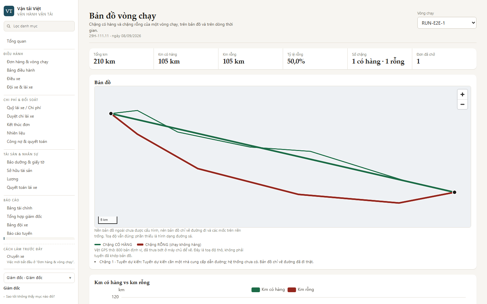
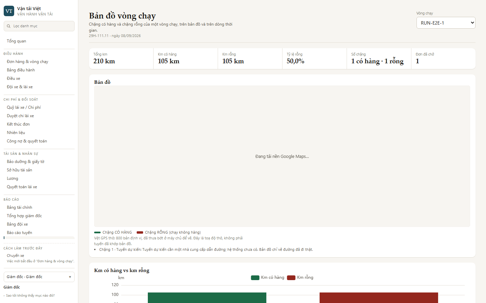
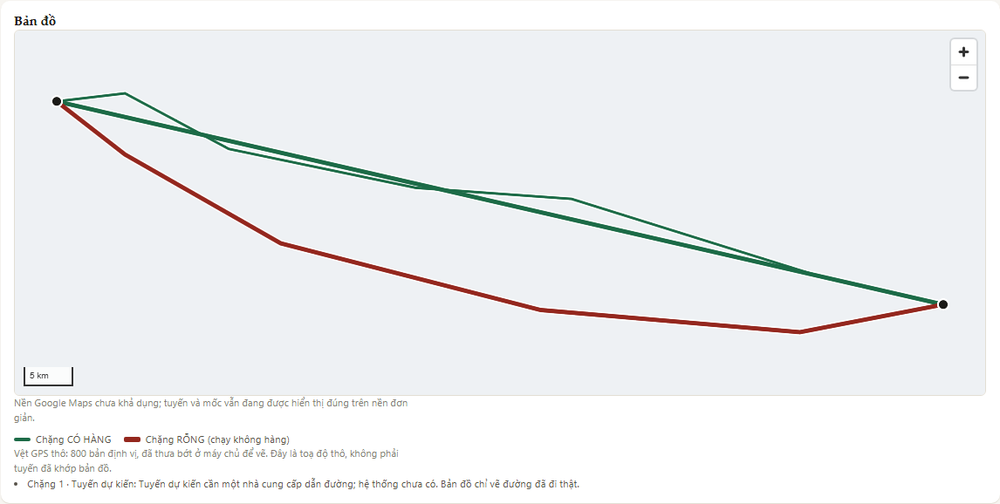
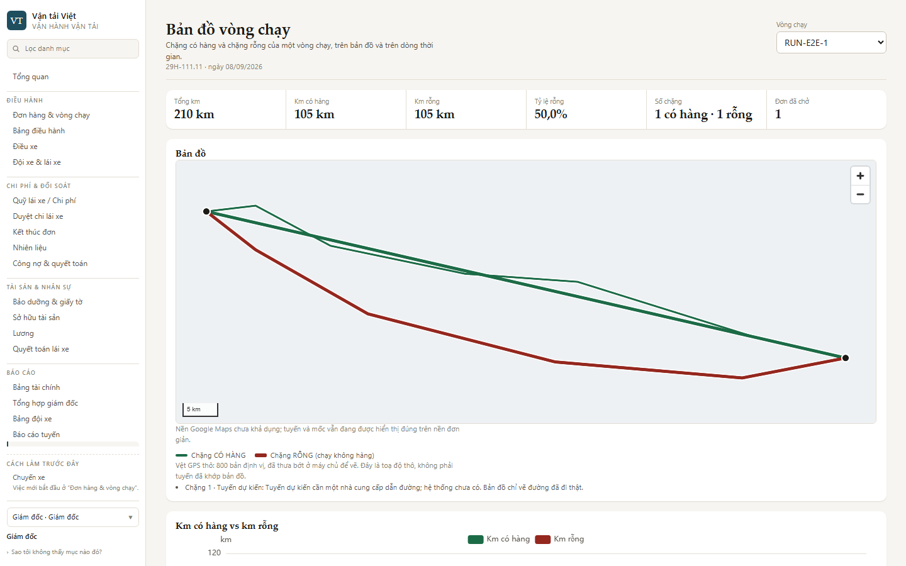

# Bằng chứng chạy thật — nền Google Maps cho Bản đồ vòng chạy (#374)

> Đo 23/09/2026 trên nhánh `claude/google-maps-basemap-4a5536`. Cấu hình và việc phía chủ dự án:
> [`phat-trien/van-hanh/ban-do-nen.md`](../phat-trien/van-hanh/ban-do-nen.md).

## Phương pháp

| Mục        | Giá trị                                                                                                                     |
| ---------- | ----------------------------------------------------------------------------------------------------------------------------- |
| Web        | `next dev` **thật** của nhánh, gói khách `tenants/transport-preview`, Chromium (Playwright 1.62.1), khung **1440×900**        |
| API        | Chặn ở tầng mạng như bộ e2e (`page.route`) — hai chặng Hà Nội ⇄ Hải Phòng, một CÓ HÀNG, một RỖNG, vệt GPS thô gần QL5/5B     |
| Google     | Kịch bản 4 gọi **Google thật** với một khoá **cố ý sai**; kịch bản 3 chặn Google ngay trong trình duyệt; 1–2 không gọi Google |
| Đo tuyến   | Đếm điểm ảnh gần `--tx-go` (CÓ HÀNG) / `--tx-stop` (RỖNG) trên ảnh chụp khung bản đồ — "có canvas" không chứng minh có tuyến  |
| Biến mỗi kịch bản | `NEXT_PUBLIC_*` nướng lúc biên dịch ⇒ mỗi kịch bản một lần khởi động `next dev`                                        |

## Kết quả

| #   | Cấu hình                                        | `data-basemap`   | `data-basemap-fallback` | Tuyến (px CÓ HÀNG / RỖNG) | Yêu cầu tới Google | Ảnh |
| --- | ----------------------------------------------- | ---------------- | ----------------------- | -------------------------- | ------------------ | --- |
| 1   | không khai gì (= CI bắt buộc)                   | `LOCAL_FALLBACK` | `NOT_CONFIGURED`        | 6322 / 4560                | **0**              |  |
| 2   | `provider=google`, không khoá                   | `LOCAL_FALLBACK` | `GOOGLE_KEY_MISSING`    | 6322 / 4560                | **0**              |  |
| 3a  | `google` + khoá, script **đang giữ**            | `GOOGLE_MAPS`, `aria-busy="true"` | —      | —                          | 1 (đang giữ)       |  |
| 3b  | … rồi script bị chặn                            | `LOCAL_FALLBACK` | `GOOGLE_SCRIPT_FAILED`  | 6322 / 4560                | 1 (bị huỷ trong trình duyệt) |  |
| 4   | `google` + khoá **sai**, Google thật            | `LOCAL_FALLBACK` | `GOOGLE_AUTH_FAILED`    | 6322 / 4560                | 12 (`maps.googleapis.com`, `maps.gstatic.com`) |  |

Kịch bản 4: console chỉ có lỗi của chính Google (`InvalidKeyMapError`), không lỗi deck.gl/WebGL nào.

## Lỗi chỉ lộ khi chạy thật — đã sửa trong PR

Lần chạy đầu của kịch bản 4, bản đồ lùi về nền cục bộ **không có tuyến nào**
([ảnh](transport-map-google-basemap/assets/06-loi-truoc-sua-khoa-sai-mat-tuyen.png)), trong khi câu
thông báo nói "tuyến và mốc vẫn đang được hiển thị đúng". Nguyên nhân: Google tải xong, deck.gl của
nền Google đã khởi tạo các lớp, rồi `gm_authFailure` mới đến; cùng **đối tượng** lớp bị đưa sang
`Deck` của MapLibre → `deck.gl: assertion failed` + `WebGL: INVALID_OPERATION … object does not
belong to this context`. Cả 68 bài unit và bài review mã độc lập đều không bắt được.

Sửa: mỗi nền tự dựng lớp trong effect của nó từ `model` (`GoogleBasemap`, `MapLibreBasemap`); e2e
giờ đếm điểm ảnh tuyến ở mọi nhánh, gồm nhánh lùi sau `gm_authFailure`.

Cùng lần chạy đó Google báo *"The map is initialized without a valid map ID, which will prevent use of
WebGLOverlayView"* ⇒ thêm biến tuỳ chọn `NEXT_PUBLIC_TRANSPORT_GOOGLE_MAPS_MAP_ID`: có Map ID thì
vector + deck.gl interleaved, không có thì xin raster ngay từ đầu.

## Chưa chứng minh được

- **Nền Google ROADMAP / TERRAIN với một khoá hợp lệ** — task không có khoá của chủ dự án và không
  được tự bật thanh toán/tạo tài nguyên trả phí. Bài `@google-basemap` "sống" đã sẵn: chạy với khoá
  thử (giới hạn `http://localhost:*`) + Map ID, nó lưu ảnh 1440×900 và đòi tuyến hiện trên nền
  Google (lệnh ở `ban-do-nen.md` §5). Căn khớp tuyến ↔ đường khi kéo/phóng cần mắt người xem trên
  ảnh/video đó.
