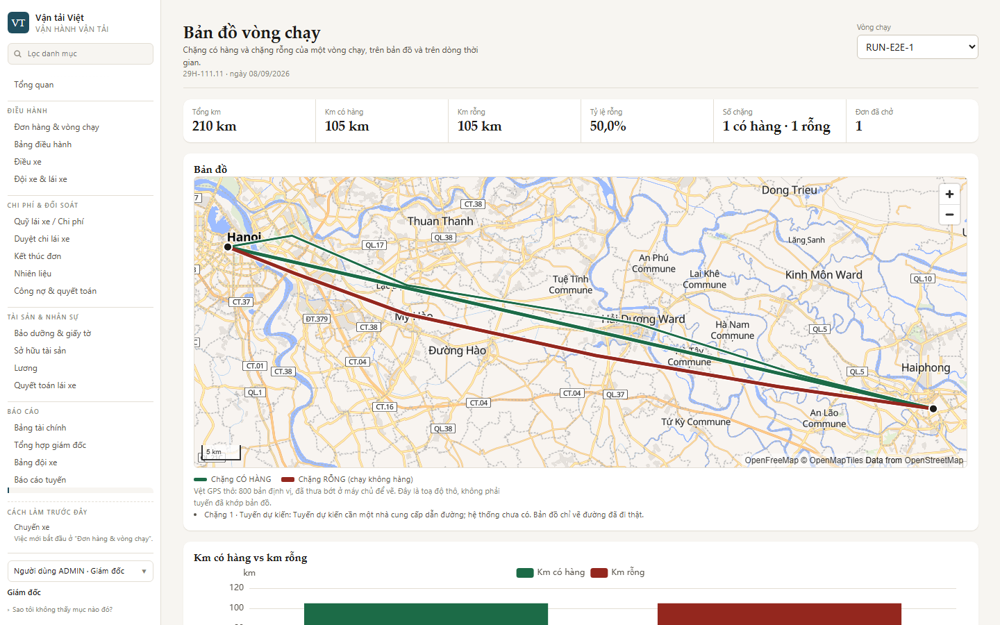
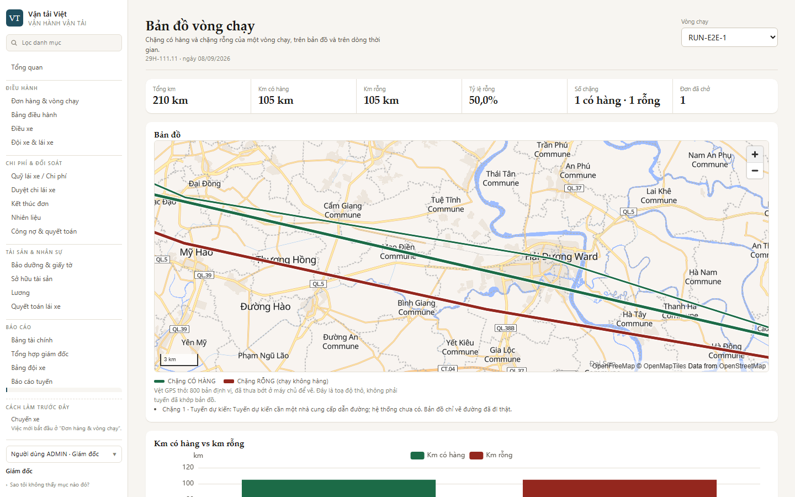
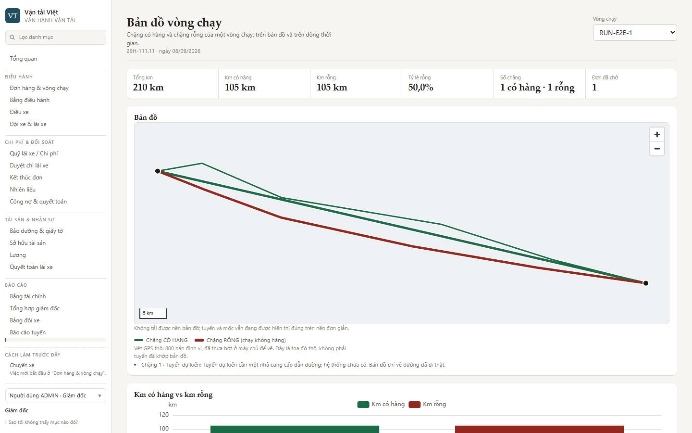
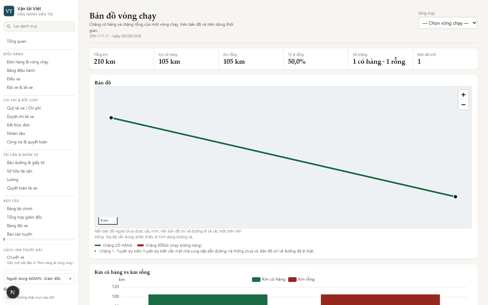

# Bằng chứng chạy thật — nền OpenFreeMap mặc định cho Bản đồ vòng chạy (#374)

> Đo 23/09/2026 trên PR #375 sau `OWNER_DECISION_UPDATE_2026_09_23` (OpenFreeMap + MapLibre mặc định,
> Google tuỳ chọn, cục bộ dự phòng). Cấu hình và vận hành:
> [`phat-trien/van-hanh/ban-do-nen.md`](../phat-trien/van-hanh/ban-do-nen.md). Bằng chứng đường
> Google (vẫn đúng cho `provider=google`): [`transport-map-google-basemap-2026-09-23.md`](transport-map-google-basemap-2026-09-23.md).

## Phương pháp

| Mục      | Giá trị                                                                                                                                                                                                                         |
| -------- | ------------------------------------------------------------------------------------------------------------------------------------------------------------------------------------------------------------------------------- |
| Web      | `next dev` **thật** của nhánh, gói khách `tenants/transport-preview`, Chromium (Playwright 1.62.1), khung **1440×900**                                                                                                          |
| API      | Chặn ở tầng mạng như bộ e2e (`page.route`) — vòng chạy Hà Nội ⇄ Hải Phòng: chặng CÓ HÀNG (mốc neo + vệt GPS thô) và chặng RỖNG (vệt GPS thô). Toạ độ vệt thô là **dữ liệu thử gần đúng** dọc QL5 / cao tốc, không phải GPS thật |
| Nền      | A–B gọi **instance công khai thật** `tiles.openfreemap.org`; C giữ rồi chặn mọi yêu cầu tới máy chủ đó ngay trong trình duyệt; C2 trả một style giả dạng OpenFreeMap rồi chặn mọi ô tile; D là chế độ CI (`provider=local`)     |
| Đo tuyến | Đếm điểm ảnh gần `--tx-go` (CÓ HÀNG) / `--tx-stop` (RỖNG) trên ảnh chụp khung bản đồ                                                                                                                                            |
| Đo khớp  | Kéo bản đồ một quãng biết trước, đo trọng tâm các điểm ảnh tuyến dời bao nhiêu — lớp tuyến dùng chung camera với nền thì dời **đúng** bằng quãng kéo                                                                            |
| Bài kiểm | `apps/web/e2e/transport/transport-operations.spec.ts`: khối `@openfreemap-basemap` (A–C2) và bài Lane N đầu tiên (D)                                                                                                            |

## Kết quả

| #   | Kịch bản                                                                                              | `data-basemap`                                              | `data-basemap-fallback`    | Tuyến (px CÓ HÀNG / RỖNG)                 | Ra ngoài máy chủ web                                                                                                                     | Ảnh                                                                                    |
| --- | ----------------------------------------------------------------------------------------------------- | ----------------------------------------------------------- | -------------------------- | ----------------------------------------- | ---------------------------------------------------------------------------------------------------------------------------------------- | -------------------------------------------------------------------------------------- |
| A   | OpenFreeMap thật, không cấu hình gì                                                                   | `OPENFREEMAP`, `aria-busy="false"`, **không** câu thông báo | —                          | 6384 / 4437                               | chỉ `tiles.openfreemap.org`: style, TileJSON, ô tile, sprite, phông; **0** tham số truy vấn; `Referer` chỉ là origin; **0** chunk Google |             |
| B   | Lùi 1 mức → kéo (−140, +60) px → kéo ngược → phóng 2 mức                                              | `OPENFREEMAP`                                               | —                          | 7473 / 4911 (sau khi phóng)               | như A                                                                                                                                    |              |
| C   | Style bị **giữ** (bản đồ + lớp deck.gl đã khởi tạo trên nền OpenFreeMap, tuyến đã vẽ) rồi bị **chặn** | `LOCAL_FALLBACK`                                            | `OPENFREEMAP_STYLE_FAILED` | 6379 / 4436                               | yêu cầu đầu tiên đúng là `…/styles/liberty`; mọi yêu cầu chỉ tới OpenFreeMap                                                             |  |
| C2  | Style **áp vào**, rồi **mọi** ô tile hỏng (hỏng MUỘN)                                                 | `LOCAL_FALLBACK`                                            | `OPENFREEMAP_TILES_FAILED` | 6379 / 4436                               | —                                                                                                                                        | —                                                                                      |
| D   | Chế độ CI (`provider=local`), vòng chỉ có chặng CÓ HÀNG                                               | `LOCAL_FALLBACK`                                            | `LOCAL_SELECTED`           | CÓ HÀNG > 200 / RỖNG **0** (đúng dữ liệu) | **0** yêu cầu ra ngoài, **0** chunk Google; worker `/maplibre/maplibre-gl-worker.mjs` 200 `application/javascript`                       |           |

Chấm tròn chữ “N” ở góc trái dưới các ảnh là chỉ báo chế độ dev của Next.js (`nextjs-portal`), không
phải một phần của sản phẩm.

Đo khớp ở B: kéo (−140, +60) px → trọng tâm tuyến lệch **0,07 px** so với quãng kéo; kéo ngược
(+140, −60) px → lệch **0,07 px**. Ở A và B nhìn bằng mắt: tuyến nằm trên nền đường sá thật, hai đầu
mốc đúng Hà Nội / Hải Phòng, dòng ghi nguồn “OpenFreeMap © OpenMapTiles Data from OpenStreetMap” hiện
đầy đủ ở góc phải dưới.

Ở C, câu thông báo là “Không tải được nền bản đồ; tuyến và mốc vẫn đang được hiển thị đúng trên nền
đơn giản.” — nói **nền** hỏng, không nói toạ độ sai, không nêu tên hạ tầng. Ở A không có câu nào.

## Lỗi chỉ lộ khi chạy với tile thật — đã sửa trong PR

Lần chạy đầu với OpenFreeMap thật: style Liberty tải về, nền be và dòng ghi nguồn hiện ra, thước tỉ lệ
đúng — nhưng **không một con đường nào** ([ảnh trước sửa](transport-map-openfreemap-basemap/assets/05-loi-truoc-sua-worker-khong-xin-tile.jpeg)).
Trace Playwright: có style, sprite, TileJSON, **0** yêu cầu `.pbf`, console không một lỗi.

Nguyên nhân: MapLibre 6 (ESM-only) tự đoán URL web worker từ `import.meta.url`; dưới webpack đó là
một đường dẫn `file://`, nên nó gọi `new Worker("")` và worker chết im lặng — mà tile vector được xin
**trong** worker. Nền cục bộ của Lane N (style không có nguồn tile) chưa bao giờ cần worker, nên lỗi
nằm im từ #278 và CI vẫn xanh.

Sửa theo [tài liệu cài đặt của MapLibre](https://maplibre.org/maplibre-gl-js/docs/) (mục Next.js):
`apps/web/next.config.mjs` sao `maplibre-gl-worker.mjs` + `maplibre-gl-shared.mjs` vào
`apps/web/public/maplibre/` mỗi lần Next nạp cấu hình (gitignore), `MapLibreBasemap` gọi
`setWorkerUrl`. Khoá lại bằng `maplibre-worker.spec.ts` (bản sao giống từng byte, đủ mọi tệp worker
import) và bài Lane N của CI (worker trả 200 kiểu JavaScript).

Cùng lần đó lộ một điều kiện chạy của **bộ e2e**: ô chọn vòng chạy xin `/transport/runs` mà không có
mock → `next dev` biên dịch trang 404 (~10 s) ngay giữa lúc bản đồ tải worker (worker 19 KB mất 6 s),
đẩy ô tile đầu tiên qua hạn 15 s và ra `OPENFREEMAP_TIMEOUT`. Khối `@openfreemap-basemap` nay mock
danh sách đó; hạn 15 s giữ nguyên cho người dùng thật (tệp worker tĩnh).

**`idle` không đến khi mọi ô tile hỏng** (đo trên trình duyệt thật, kịch bản C2): ô tile bị chặn lúc
15,2 s, tới 25,1 s vẫn chưa có `idle`, nên bản đầu ra `OPENFREEMAP_TIMEOUT` thay vì
`OPENFREEMAP_TILES_FAILED` (và chậm 10 s). Nguyên nhân trong MapLibre 6.8 (`TileManager._loadTile`):
ô tile lỗi khác 404 được đặt `errored` rồi phát `error` nhưng **không** gọi `update()`, nên không gì
lên lịch khung vẽ mới — `idle` chỉ đến nếu tình cờ có khung khác. Sửa: ở mỗi lỗi của nguồn, watch hỏi
`map.areTilesLoaded()` (ô `errored` tính là xong); xong hết mà chưa ô nào nạp được thì kết luận ngay.
Sau sửa, khối `@openfreemap-basemap` chạy `--repeat-each=2`: **6/6 xanh**, C2 kết luận trong ~14–16 s
tổng thời gian bài (gồm cả mở trang), không còn phụ thuộc thời điểm.

## Review mã độc lập trước khi đẩy — hai điểm, đã sửa

1. **(Cao)** Watch dừng đồng hồ ngay khi ô tile đầu tiên về, rồi chỉ chờ `idle`. Một ô tile / bộ
   phông chữ **treo** sau đó (không lỗi, không xong) ⇒ `idle` không bao giờ đến ⇒ `aria-busy="true"`
   mãi, không trạng thái cuối. Sửa: hết hạn **luôn** ra trạng thái cuối — đã có ô tile thì `READY`
   (nền đang hiện, không lùi), chưa có thì `TIMEOUT`. Bài mới trong `maplibre-basemap-watch.spec.ts`
   **đỏ** trên mã trước sửa (1 failed / 14 passed), xanh sau sửa.
2. **(Trung bình)** “`Referer` chỉ là origin” dựa vào mặc định của trình duyệt. Sửa: `next.config.mjs`
   khai tường minh `Referrer-Policy: strict-origin-when-cross-origin` (cùng giá trị edge Caddy đã đặt
   trên VM); bài Lane N của CI kiểm header.

## Chưa chứng minh / tồn đọng

- **Instance công khai không SLA** — khi nó sập, người dùng thấy nền cục bộ + câu thông báo (C), mất
  hình đường sá cho tới khi nó sống lại. Bảo đảm cao hơn = tự dựng / nhà cung cấp thương mại, quyết
  định của chủ dự án (`ban-do-nen.md` §5).
- Nhãn của style Liberty theo tên Latin/tiếng Anh (“Hanoi”, “Haiphong”, “… Commune”) — bản địa hoá
  nhãn sang `name:vi` là việc riêng, chưa làm.
- Lùi nền chỉ xét lần hiện ra **đầu tiên**; mất mạng sau đó chỉ làm thiếu ô tile ở vùng mới kéo tới.
- Khối `@openfreemap-basemap` không nằm trong 7 check bắt buộc (CI không được ra Internet); A–C2 được
  chạy tay ở trên. Luật lùi nền được CI khoá bằng `maplibre-basemap-watch.spec.ts`.
- Ở `next dev` (có `reactStrictMode`, gắn–gỡ–gắn mỗi component) khung bản đồ mang **hai** canvas
  `deckgl-overlay`: một 1112×418 đang vẽ, một 300×150 không kích thước CSS còn lại từ lần gắn thứ
  nhất. Trong hai lần chạy **lạnh** (máy chủ dev đang biên dịch trang 404), ảnh screencast của trace
  có lúc cho thấy lớp tuyến bị phóng to lệch khung; **không tái hiện** ở các lần chạy sau (số điểm ảnh
  tuyến ổn định 6379–6384 ở mọi lần, độ lệch khi kéo 0,07 px). Chưa đo trên bản build production — ở
  đó mỗi component chỉ gắn một lần. Ghi lại để người review biết, không phải đã loại trừ.
- Hạn 15 s tính từ lúc gắn bản đồ, gồm cả tải worker (~500 KB chưa nén) + style + ô tile đầu. Mạng
  rất chậm có thể lùi về nền cục bộ dù OpenFreeMap vẫn sống — tuyến và mốc không mất, chỉ mất nền cho
  lần mở đó.
