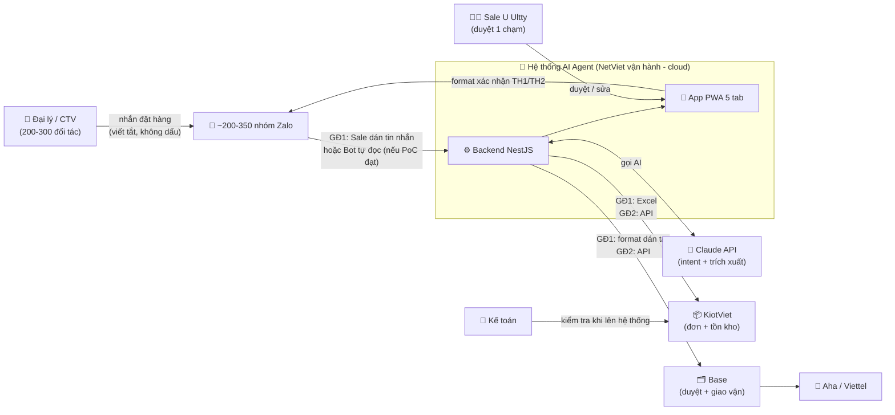
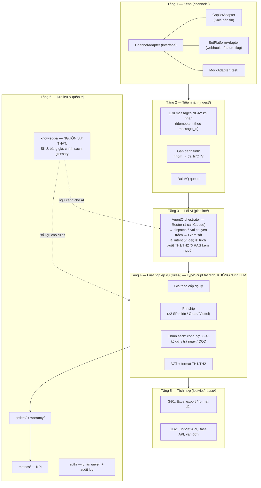
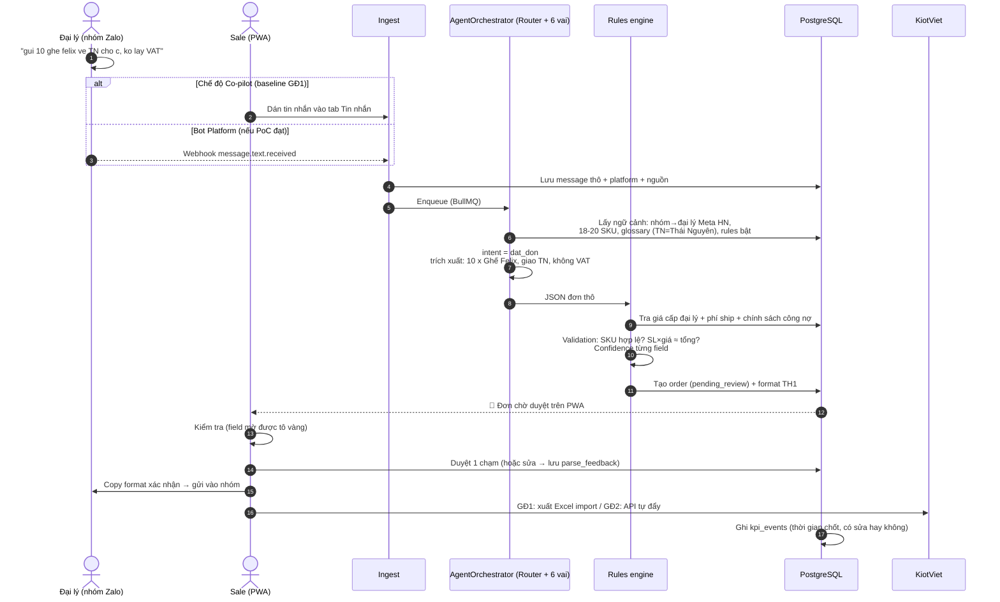
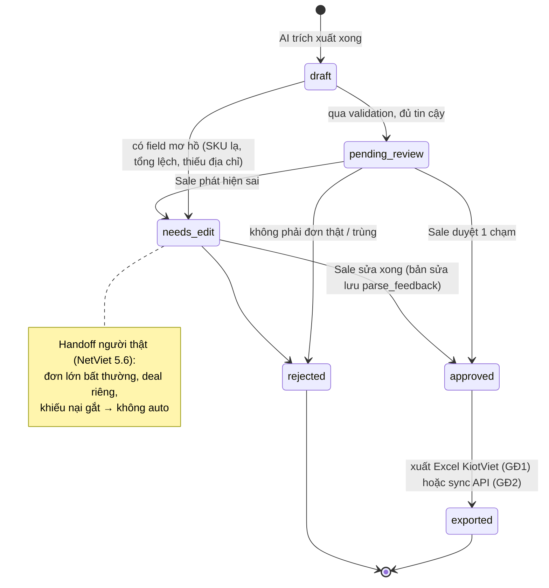
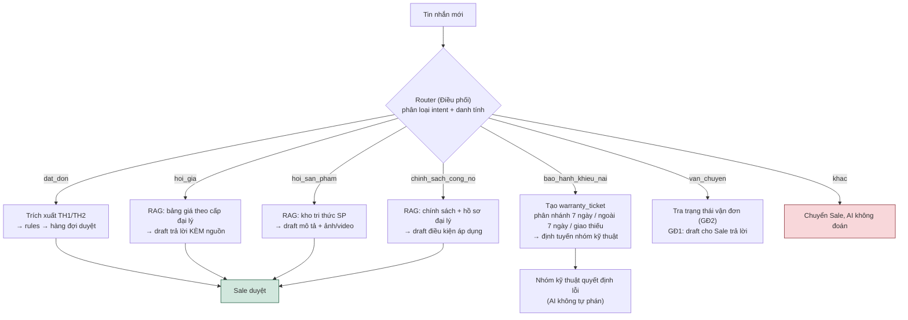
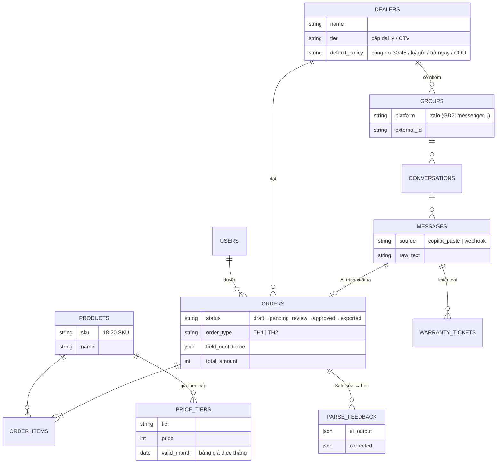
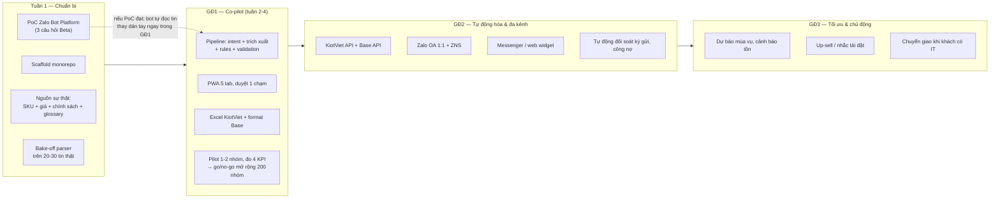
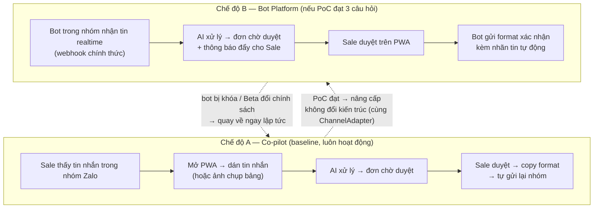

# SƠ ĐỒ HỆ THỐNG — AI AGENT U ULTTY

Bộ sơ đồ minh họa cho [thiet-ke-ky-thuat-hop-nhat.md](thiet-ke-ky-thuat-hop-nhat.md). Xem trực tiếp trên GitHub hoặc VS Code (extension Markdown Preview Mermaid).

---

## 1. Bối cảnh tổng thể (ai dùng, hệ thống nói chuyện với gì)

**Đọc sơ đồ:** đại lý nhắn vào nhóm Zalo như hiện tại — không phải đổi thói quen. Hệ thống đứng giữa, AI soạn sẵn, Sale luôn là người bấm duyệt trước khi bất kỳ thứ gì đi ra ngoài.

---

## 2. Kiến trúc 6 tầng (NetViet) → module code thực tế

**Điểm mấu chốt:** tầng 3 (AI) chỉ *hiểu và soạn*; tầng 4 (rules) mới *tính tiền và áp chính sách* — từ nguồn sự thật ở tầng 6. AI sai thì validation + Sale chặn; số tiền không bao giờ do AI "đoán".

---

## 3. Luồng xử lý 1 đơn hàng (từ tin nhắn đến KiotViet)

---

## 4. Vòng đời một đơn hàng (state machine)

---

## 5. Bảy loại ý định (intent) và đường đi của từng loại

**Nguyên tắc:** không có dữ liệu trong nguồn sự thật → AI trả lời "cần Sale", tuyệt đối không bịa. Mọi draft đều qua tay Sale ở GĐ1.

---

## 6. Dữ liệu chính (ERD rút gọn)

Ngoài ra còn: `glossary_entries` (TN→Thái Nguyên...), `prompt_rules` (tab Prompt AI bật/tắt), `policies`, `kpi_events`, `audit_logs`, `users`.

---

## 7. Lộ trình 3 giai đoạn (theo NetViet, đã ghép PoC)

---

## 8. Hai chế độ tiếp nhận tin nhắn (quyết định bởi PoC)

**Vì sao an toàn:** hai chế độ dùng chung toàn bộ pipeline phía sau; chuyển qua lại chỉ là bật/tắt adapter, dữ liệu đơn hàng không phụ thuộc kênh.

> **Cập nhật sau PoC 07/07/2026 ([poc-zalo-bot.md](poc-zalo-bot.md)):** Chế độ B (Bot Platform) đã xác nhận khả thi NHƯNG trong nhóm bot **chỉ nhận tin @mention nó** (mention-gating gốc của Zalo, không tắt được). ⇒ hai chế độ **chạy SONG SONG (kênh lai)**, không phải thay thế: đơn text-có-tag → Bot tự đọc; đơn không tag / ảnh / thoại → Co-pilot dán tay. Điều kiện bật Bot mode: khách đồng ý để đại lý tag bot (checklist D2).
