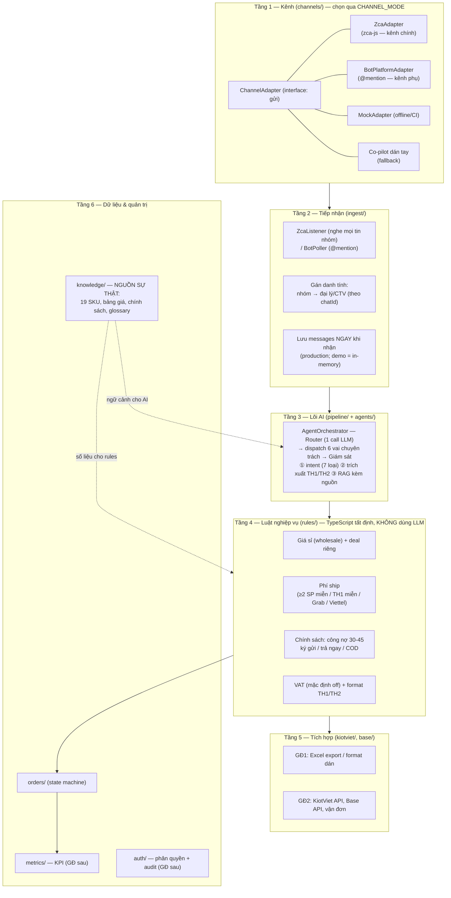
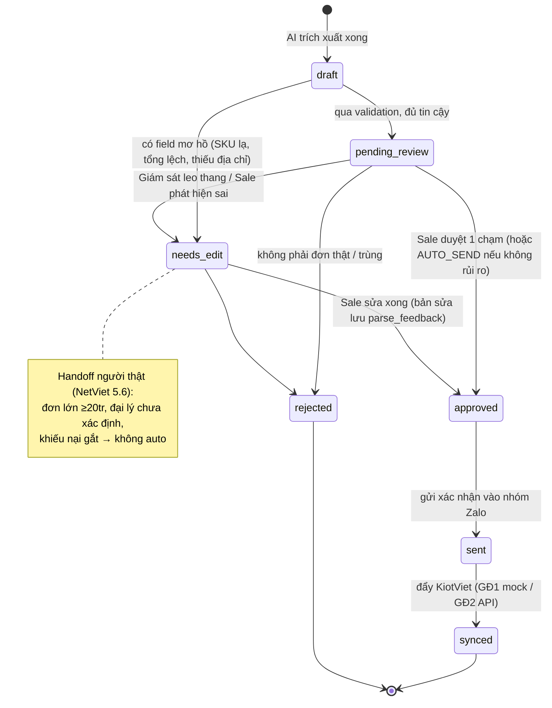
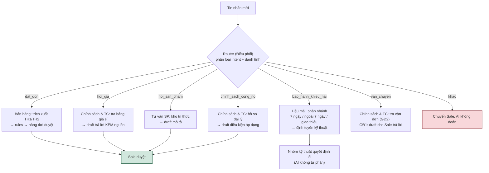
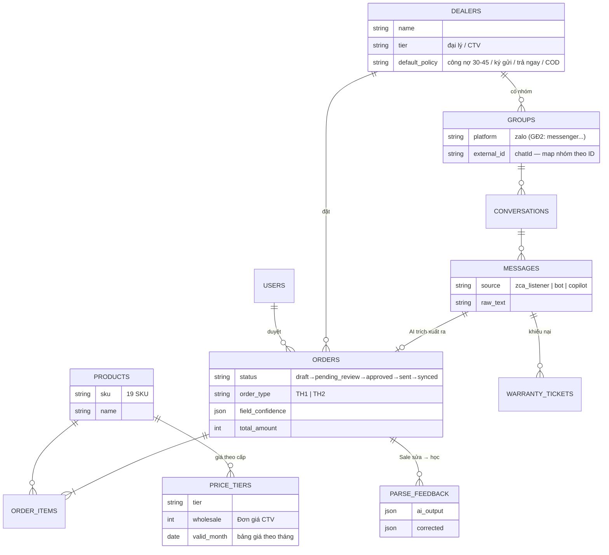
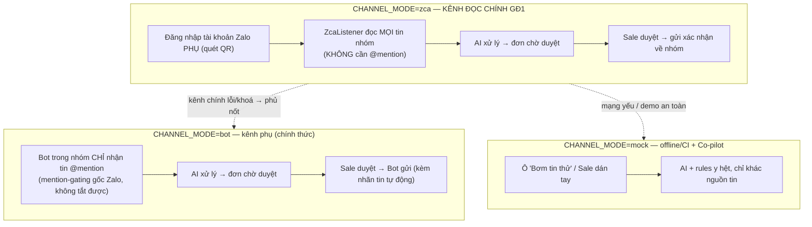

# SƠ ĐỒ HỆ THỐNG — AI AGENT U ULTTY

> Bộ sơ đồ minh hoạ cho [thiet-ke-ky-thuat-hop-nhat.md](thiet-ke-ky-thuat-hop-nhat.md) (kỹ thuật) và [nghiep-vu.md](nghiep-vu.md) (nghiệp vụ). Xem trên GitHub hoặc VS Code (extension Markdown Preview Mermaid).
> **Cập nhật 09/07/2026:** kênh đọc chính GĐ1 là **zca-js** (đọc mọi tin nhóm, không cần @mention); chuyển kênh bằng biến `CHANNEL_MODE=mock|bot|zca`. Lưu trữ demo là **in-memory** (production dùng Postgres).

---

## 1. Bối cảnh tổng thể (ai dùng, hệ thống nói chuyện với gì)


**Đọc sơ đồ:** đại lý nhắn vào nhóm Zalo như hiện tại — không đổi thói quen, không cần tag. Hệ thống đứng giữa, AI soạn sẵn, Sale luôn là người bấm duyệt trước khi bất kỳ thứ gì đi ra ngoài.

---

## 2. Kiến trúc 6 tầng (NetViet) → module code thực tế



**Điểm mấu chốt:** tầng 3 (AI) chỉ *hiểu và soạn*; tầng 4 (rules) mới *tính tiền và áp chính sách* — từ nguồn sự thật ở tầng 6. AI sai thì validation + Sale chặn; số tiền không bao giờ do AI "đoán".

---

## 3. Luồng xử lý 1 đơn hàng (từ tin nhắn đến KiotViet)

```mermaid
sequenceDiagram
    autonumber
    actor DL as Đại lý (nhóm Zalo)
    actor S as Sale (console/PWA)
    participant IN as Ingest
    participant AI as AgentOrchestrator (Router + 6 vai)
    participant RU as Rules engine
    participant ST as Lưu trữ (in-memory / Postgres)
    participant KV as KiotViet

    DL->>DL: "gui 10 ghe felix ve TN cho c, ko lay VAT"

    alt CHANNEL_MODE=zca (kênh chính GĐ1)
        DL-->>IN: zca đọc mọi tin nhóm (KHÔNG cần tag)
    else CHANNEL_MODE=bot / Co-pilot
        DL-->>IN: Bot nhận tin @mention / Sale dán tay
    end

    IN->>ST: Lưu message thô + platform + nguồn
    IN->>AI: Đưa vào pipeline
    AI->>ST: Lấy ngữ cảnh: nhóm→đại lý Meta HN,<br/>19 SKU, glossary (TN=Thái Nguyên)
    AI->>AI: intent = dat_don<br/>trích xuất: 10 x Ghế Felix, giao TN, không VAT
    AI->>RU: JSON đơn thô
    RU->>ST: Tra giá sỉ + phí ship + chính sách công nợ
    RU->>RU: Validation: SKU hợp lệ? SL×giá ≈ tổng?<br/>Confidence từng field
    RU->>ST: Tạo order (pending_review) + format TH1
    ST-->>S: 🔔 Đơn chờ duyệt trên console
    S->>S: Kiểm tra (field mờ được tô vàng)
    S->>ST: Duyệt 1 chạm (hoặc sửa → lưu parse_feedback)
    S->>DL: Gửi format xác nhận vào đúng nhóm Zalo
    S->>KV: GĐ1: xuất Excel / mock; GĐ2: API tự đẩy
    ST->>ST: Ghi kpi_events (thời gian chốt, có sửa hay không)
```

---

## 4. Vòng đời một đơn hàng (state machine)



---

## 5. Bảy loại ý định (intent) và đường đi của từng loại



**Nguyên tắc:** không có dữ liệu trong nguồn sự thật → AI trả lời "cần Sale", tuyệt đối không bịa. Mọi draft đều qua tay Sale ở GĐ1.

---

## 6. Dữ liệu chính (ERD rút gọn — schema Postgres đích)



Ngoài ra còn: `glossary_entries` (TN→Thái Nguyên...), `dealer_price_overrides` (deal riêng), `policies`, `kpi_events`, `audit_logs`, `users`.
> **Lưu ý:** demo hiện chạy **in-memory** ([knowledge/seed.ts](../apps/api/src/knowledge/seed.ts) + `InMemoryOrdersRepository`); schema Postgres trên là đích của Phase 3.

---

## 7. Lộ trình 3 giai đoạn (theo NetViet)

```mermaid
flowchart LR
    subgraph P0["Chuẩn bị"]
        A1["Scaffold monorepo ✅"]
        A2["PoC Bot + zca ✅"]
        A3["Nguồn sự thật:<br/>19 SKU + giá + glossary ✅"]
        A4["Bake-off parser (eval 100%) ✅"]
    end

    subgraph G1["GĐ1 — Đọc tự động + Sale duyệt"]
        B1["Pipeline: intent + trích xuất<br/>+ rules + validation ✅"]
        B2["Console/PWA duyệt 1 chạm ✅ (console)"]
        B3["Excel KiotViet + format Base ⬜"]
        B4["Pilot 1-2 nhóm, đo 4 KPI ⬜<br/>→ go/no-go mở rộng 200 nhóm"]
    end

    subgraph G2["GĐ2 — Tự động hoá & đa kênh"]
        C1["KiotViet API + Base API"]
        C2["Zalo OA 1:1 + ZNS"]
        C3["Messenger / web widget"]
        C4["Tự động đối soát ký gửi, công nợ + AUTO_SEND"]
    end

    subgraph G3["GĐ3 — Tối ưu & chủ động"]
        D1["Dự báo mùa vụ, cảnh báo tồn"]
        D2["Up-sell / nhắc tái đặt"]
        D3["Chuyển giao khi khách có IT"]
    end

    P0 --> G1 --> G2 --> G3
```



> Vị trí hiện tại: **cuối GĐ1** — lõi AI + rules + console demo đã xong trên dữ liệu/kênh thật; còn Excel KiotViet, lưu trữ Postgres, auth, pilot. Chi tiết: [tien-do-va-ke-hoach.md](tien-do-va-ke-hoach.md).

---

## 8. Chọn kênh tiếp nhận bằng `CHANNEL_MODE`



**Vì sao an toàn:** cả 3 chế độ dùng chung toàn bộ pipeline phía sau (`ChannelAdapter`); chuyển kênh chỉ là đổi 1 biến `CHANNEL_MODE`, dữ liệu đơn hàng không phụ thuộc kênh.

> **Điều kiện chặn kênh zca:** dùng **tài khoản Zalo phụ** (không dùng tài khoản Sale chính) + **văn bản chấp nhận rủi ro của khách** (vi phạm ToS Zalo, có thể bị khoá tài khoản; NĐ13/2023 + Luật BVDLCN 2025). Chi tiết PoC Bot: [poc-zalo-bot.md](poc-zalo-bot.md).
