# SƠ ĐỒ & THIẾT KẾ KỸ THUẬT — AI AGENT U ULTTY

> **Vai trò tài liệu:** bản KỸ THUẬT hợp nhất — toàn bộ **sơ đồ hệ thống (12 sơ đồ Mermaid)** + **quyết định thiết kế đã chốt** + **phụ lục bằng chứng PoC**. Xem trên GitHub hoặc VS Code (extension Markdown Preview Mermaid).
> **Hợp nhất 11/07/2026:** nuốt trọn `thiet-ke-ky-thuat-hop-nhat.md` (quyết định kỹ thuật — §2/§3/§15) và 2 tài liệu PoC `poc-zalo-bot.md`, `poc-parser.md` (→ Phụ lục A/B) — 3 file gốc đã xóa, git history còn.
> **Đối chiếu code 11/07/2026:** mọi sơ đồ đã rà lại theo code (code là chuẩn) — sửa state machine §8 (bỏ chuỗi `draft→approved→sent` chưa dùng), sequence §6 (chưa lưu message riêng), ERD §12 (đánh dấu bảng chưa ghi).
> Nghiệp vụ + sai lệch nguồn gốc: [nghiep-vu.md](nghiep-vu.md) · Kế hoạch + trạng thái: [ke-hoach/tong-quan.md](ke-hoach/tong-quan.md).

**Mục lục:** §1 Bối cảnh · §2 Quyết định kỹ thuật · §3 Ma trận kênh Zalo · §4 Kiến trúc 6 tầng · §5 Bản đồ module · §6 Luồng 1 đơn hàng · §7 Pipeline chi tiết · §8 Vòng đời đơn · §9 Bảy intent · §10 Nguồn sự thật động · §11 Realtime SSE · §12 ERD · §13 Runtime & cờ env · §14 Chọn kênh · §15 Tích hợp, KPI, bảo mật, rủi ro · Phụ lục A/B (PoC).

---

## 1. Bối cảnh tổng thể (ai dùng, hệ thống nói chuyện với gì)

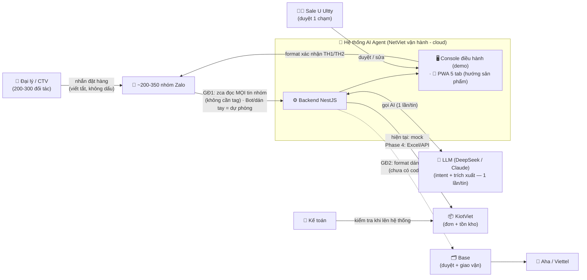

**Đọc sơ đồ:** đại lý nhắn vào nhóm Zalo như hiện tại — không đổi thói quen, không cần tag. Hệ thống đứng giữa, AI soạn sẵn, Sale luôn là người bấm duyệt trước khi bất kỳ thứ gì đi ra ngoài.

---

## 2. Quyết định kỹ thuật đã chốt

*(gốc: `thiet-ke-ky-thuat-hop-nhat.md` v1.0 06/07 — hợp nhất vào đây 11/07/2026; khi nguồn khác nhau, bảng này là quyết định cuối cho phần kỹ thuật)*

| Hạng mục | Quyết định | Ghi chú |
|---|---|---|
| Kiến trúc 6 tầng, intent taxonomy, luồng chính sách/bảo hành, checklist chốt đơn | Theo NetViet (`Thiet_ke_AI_Agent_U_Ultty.md` §3, §5 — giữ nguyên) | Nghiệp vụ không đổi |
| Lộ trình 3 giai đoạn, KPI, managed service | Theo NetViet (§6, §7) | Sơ đồ lộ trình: [ke-hoach/tong-quan.md](ke-hoach/tong-quan.md) |
| Stack | TypeScript (Node 22) · NestJS · Next.js · PostgreSQL + **Prisma 6 (pin, KHÔNG nâng v7** — `@adminjs/prisma` chưa hỗ trợ) · Claude/DeepSeek API · monorepo pnpm | BullMQ/Redis có trong stack nhưng **chưa dùng** (YAGNI — thêm khi pipeline thật sự cần queue) |
| Kênh Zalo GĐ1 | **zca-js = kênh đọc chính** (đảo quyết định 09/07/2026, khách chọn); chuyển kênh bằng 1 biến `CHANNEL_MODE=mock\|bot\|zca` | Điều kiện chặn: **tài khoản phụ** + **văn bản chấp nhận rủi ro** (vi phạm ToS Zalo; NĐ13/2023 + Luật BVDLCN 2025) |
| Multi-agent 6 vai | 6 vai chuyên trách **dưới 1 orchestrator, dùng chung 1 lần gọi LLM/tin** (Router parse) — KHÔNG phải 6 LLM độc lập | Chi phí như 1 orchestrator; rules engine tính tiền |
| LLM vs rules | **LLM không tính tiền, không quyết chính sách** — chỉ phân loại intent + trích xuất + soạn văn bản; giá/ship/VAT/chính sách do rules engine TS tất định tính từ nguồn sự thật | Nguyên tắc bất di bất dịch |
| Kho | KHÔNG xây module kho riêng — KiotViet là source of truth duy nhất | 10-20 đơn/ngày không cần cache |
| Lưu trữ | Mặc định **in-memory** (`PERSISTENCE=memory` — demo/CI không cần DB); bật Postgres bằng `PERSISTENCE=prisma` (cờ riêng, tách khỏi `DATABASE_URL`) | as-built Phase 3 |
| Nguồn sự thật ĐỘNG | Panel **`/admin`** (AdminJS auto-CRUD 6 bảng) + **MCP tool** (8 tool) — cả hai ghi Postgres + nạp lại snapshot ngay | Thay cho tab "Prompt AI" của PWA trong thiết kế cũ |
| App Sale | Demo = **console PC 3 cột** (Feed · 6-agent theater SSE · Nguồn sự thật); PWA mobile 5 tab theo `design/` = hướng sản phẩm, làm sau | Quyết định treo D3 |

---

## 3. Kênh Zalo — ma trận 4 phương án

| Phương án | Chính thức | Đọc tin nhóm | Chi phí | Vị trí trong lộ trình |
|---|---|---|---|---|
| **A. Co-pilot / dán tay** (Sale dán tin vào app) | ✅ Không đụng ToS | Thủ công | 0đ | **Fallback vĩnh viễn** (khi zca lỗi/khóa) |
| **B. Zalo Bot Platform** (bot.zapps.me, Beta) | ✅ | **CHỈ tin @mention** (mention-gating gốc Zalo, không tắt được — Phụ lục A) | 0đ (Premium chưa công bố) | Kênh phụ — bật khi đại lý chịu tag bot (quyết định D2) |
| **C. Zalo OA + GMF** | ✅ | Tự động (API đầy đủ) | ~25-300k/tháng/nhóm × 200-350 nhóm + gói OA | GĐ2-3: OA cho CSKH 1:1 + ZNS; GMF chỉ khi khách chịu chi phí |
| **D. zca-js (userbot)** | ❌ vi phạm ToS | **Tự động — MỌI tin nhóm, không cần tag** | 0đ | **KÊNH ĐỌC CHÍNH GĐ1** (khách chọn 09/07/2026) — `CHANNEL_MODE=zca` |

Mọi kênh đi qua interface `ChannelAdapter` → đổi kênh không đập hệ thống. Bằng chứng PoC Bot Platform: **Phụ lục A**.

---

## 4. Kiến trúc 6 tầng (NetViet) → module code thực tế

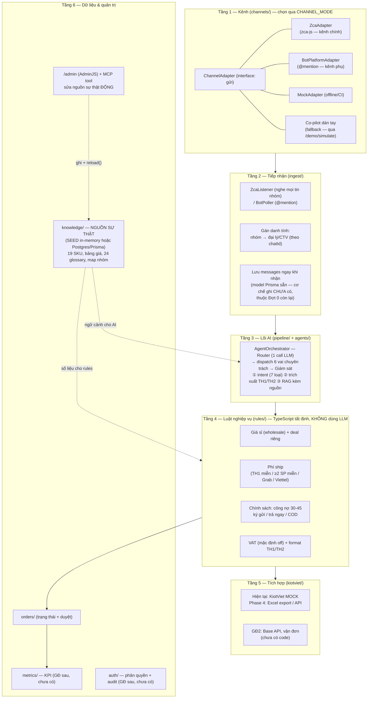

**Điểm mấu chốt:** tầng 3 (AI) chỉ *hiểu và soạn*; tầng 4 (rules) mới *tính tiền và áp chính sách* — từ nguồn sự thật ở tầng 6. AI sai thì validation + Sale chặn; số tiền không bao giờ do AI "đoán".

---

## 5. Bản đồ module & phụ thuộc (as-built)

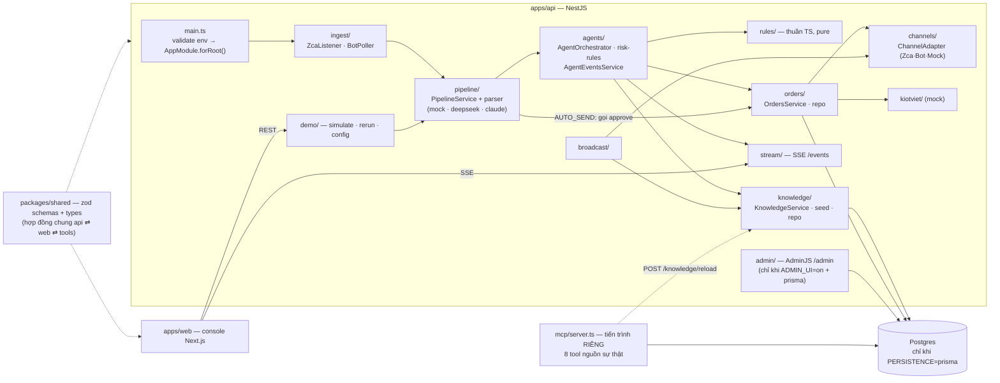

Console web gọi thêm REST: `/orders` · `/messages` · `/knowledge/*` · `/kiotviet/*` · `/broadcast` (không vẽ hết mũi tên cho đỡ rối).

---

## 6. Luồng xử lý 1 đơn hàng (từ tin nhắn đến KiotViet)

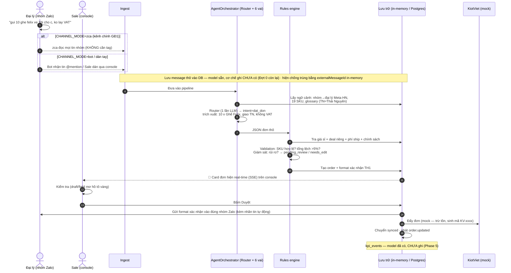

---

## 7. Pipeline chi tiết trong 1 tin (định tuyến theo độ tin cậy + rủi ro)

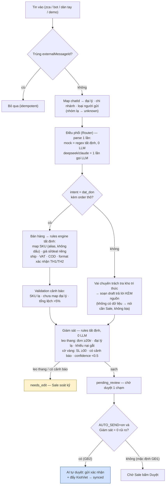

Kèm 2 lưới an toàn ở tầng parser: LLM lỗi/timeout → retry 1 lần → fallback `intent=khac` với confidence 0 (Giám sát gắn cờ); tiền dạng chuỗi ("11tr5", "1.150k") được ép về số trước khi validate (Phụ lục B).

---

## 8. Vòng đời một đơn hàng (state machine — as-built)

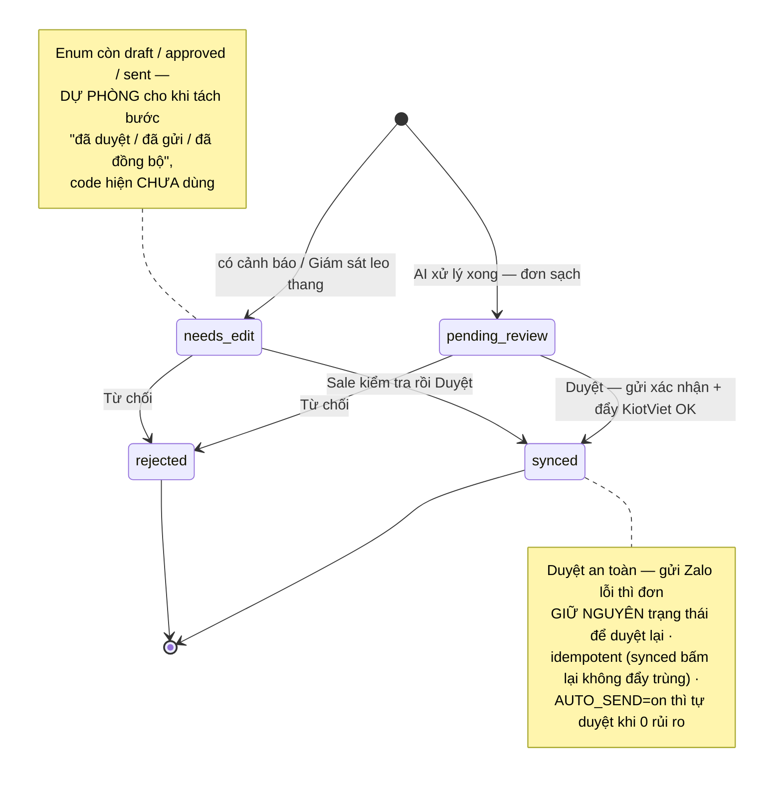

> **Đính chính 11/07/2026:** bản cũ vẽ `draft → pending_review → approved → sent → synced` — đó là chuỗi **đích tương lai**, không phải hành vi code. Code thật: đơn sinh ra ở `pending_review`/`needs_edit`, Duyệt nhảy thẳng `synced`, Từ chối → `rejected`.

---

## 9. Bảy loại ý định (intent) và đường đi của từng loại

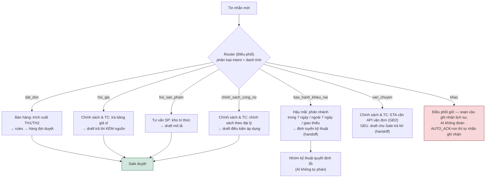

**Nguyên tắc:** không có dữ liệu trong nguồn sự thật → AI trả lời "cần Sale", tuyệt đối không bịa. Mọi draft đều qua tay Sale ở GĐ1. Mọi tin (kể cả không phải đơn) đều thành bản ghi `pending_review` kèm draft để Sale dùng.

---

## 10. Nguồn sự thật ĐỘNG (Phase 3): 2 cửa ghi, 1 lần nạp lại

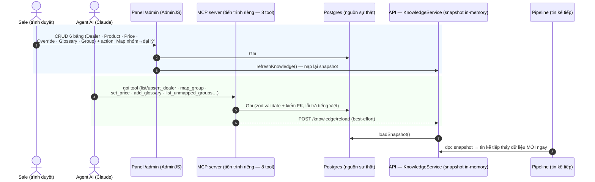

- Panel `/admin` chỉ mount khi `ADMIN_UI=on` **và** `PERSISTENCE=prisma` (dynamic import — chế độ memory không nạp AdminJS). Hộp thư "**nhóm chưa map**": danh sách Group mặc định lọc `status=pending`.
- MCP đọc `DATABASE_URL` trực tiếp; chạy `pnpm --filter @ultty/api mcp`.

---

## 11. Realtime: SSE 6-agent theater trên console

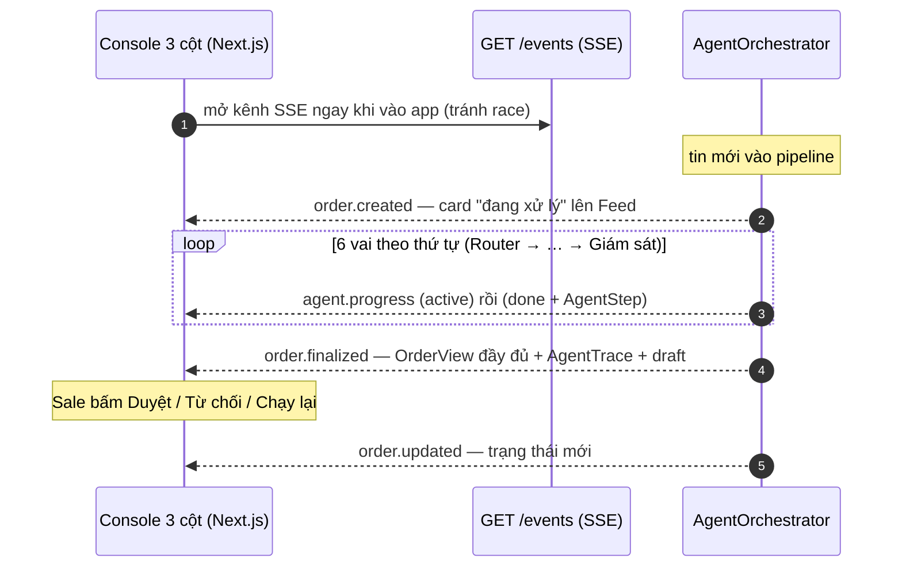

- Độ trễ vai Router là **thật** (LLM); các vai rules tức thì được giãn `STREAM_STEP_DELAY_MS` (mặc định 280ms, chỉ khi có client xem) cho dễ nhìn.
- `STREAM_MODE=off` → frontend quay về polling (lưới an toàn demo). AgentTrace ghi `llmCalls` (0 với mock, 1 với LLM) — minh bạch chi phí.

---

## 12. Dữ liệu chính (ERD as-built — Prisma 12 model, Phase 3)

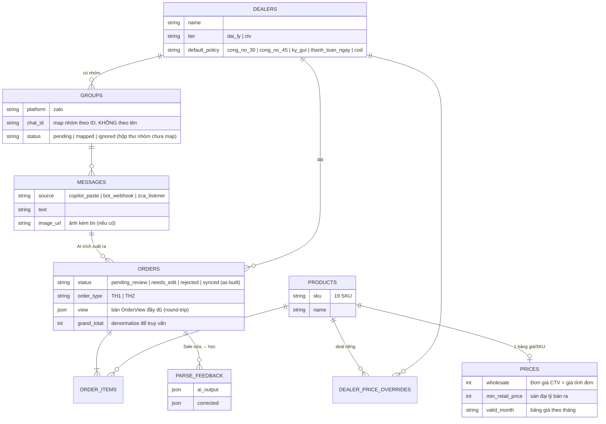

Bảng độc lập (chưa nối quan hệ): `glossary_entries` (24 mục) · `users` (Phase 5 auth) · `kpi_events` (Phase 5).

> **Bảng nào ĐANG được ghi thật (11/07/2026):**
> - **Ghi rồi:** `dealers` · `groups` · `products` · `prices` · `dealer_price_overrides` · `glossary_entries` (qua seed + `/admin` + MCP) và `orders` (khi `PERSISTENCE=prisma`; dòng đơn nằm trong cột JSON `view`, scalar denormalize để lọc).
> - **Model có, CHƯA ghi:** `messages` (lưu-mọi-tin — Đợt 0 còn lại) · `order_items` (dữ liệu dòng đang nằm trong `orders.view`) · `parse_feedback` · `users` · `kpi_events` (Phase 5).
> - Các bảng thuộc **đích GĐ sau, CHƯA có model**: `conversations` · `warranty_tickets` · `policies` (điều khoản dạng bảng — hiện là enum trên dealer + rules-config) · `audit_logs`.
> Schema thật: [apps/api/prisma/schema.prisma](../apps/api/prisma/schema.prisma). Mặc định app chạy in-memory (`PERSISTENCE=memory`).

---

## 13. Runtime & cờ môi trường

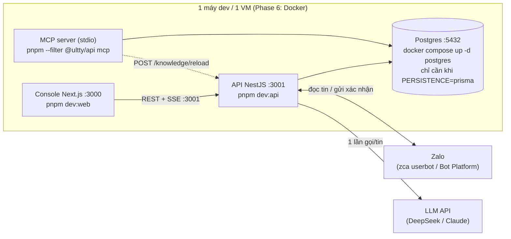

**Cờ env quyết định hành vi** (đủ bộ: [packages/shared/src/env.ts](../packages/shared/src/env.ts) — validate lúc boot, fail fast):

| Cờ | Giá trị (mặc định **đậm**) | Quyết định gì |
|---|---|---|
| `CHANNEL_MODE` | **mock** · bot · zca | Kênh đọc + gửi Zalo (nguồn sự thật duy nhất chọn kênh) |
| `PARSER_MODE` | **mock** · claude · deepseek | Bộ não parse (mock = 0 LLM, tất định) |
| `PERSISTENCE` | **memory** · prisma | Lưu đơn + nguồn sự thật (memory = demo/CI không cần DB) |
| `ADMIN_UI` | **off** · on | Mount panel `/admin` (đòi thêm `PERSISTENCE=prisma`) |
| `AUTO_SEND` | **off** · on | GĐ2 — AI tự duyệt đơn 0-rủi-ro (cần văn bản đồng ý khách) |
| `AUTO_ACK` | **off** · on | Tự nhắn "đã ghi nhận" khi intent=khac |
| `STREAM_MODE` | **on** · off | SSE real-time / polling |
| `ZALO_SELF_LISTEN` | **off** · on | zca có nghe tin do chính tài khoản gửi không (chống vòng lặp) |
| Khác | `BOT_NAME`, `ZALO_CRED_PATH` (phiên zca — bảo mật như secret), `BROADCAST_THROTTLE_MS`=1500, `BROADCAST_MAX_TARGETS`=50, `STREAM_STEP_DELAY_MS`=280, `ADMIN_EMAIL/PASSWORD/COOKIE_SECRET` (đổi ở production), `DATABASE_URL`, `ANTHROPIC_API_KEY`, `DEEPSEEK_API_KEY`, `ZALO_BOT_TOKEN` | |

---

## 14. Chọn kênh tiếp nhận bằng `CHANNEL_MODE`

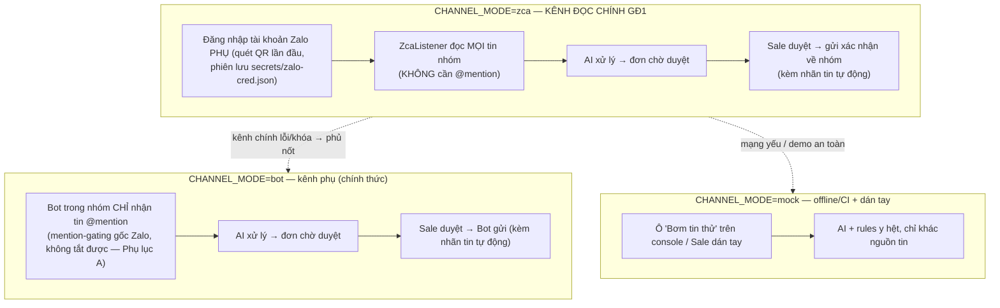

**Vì sao an toàn:** cả 3 chế độ dùng chung toàn bộ pipeline phía sau (`ChannelAdapter`); chuyển kênh chỉ là đổi 1 biến, dữ liệu đơn không phụ thuộc kênh.

Chi tiết hành vi zca as-built: bỏ tin do chính tài khoản gửi (trừ khi `ZALO_SELF_LISTEN=on`) · **bỏ ảnh KHÔNG có caption** (tin không văn bản chưa vào pipeline) · chống trùng 2.000 id gần nhất · in `chatId` mỗi nhóm 1 lần để lấy ID map đại lý · mỗi tài khoản chỉ 1 listener (mở Zalo Web cùng tài khoản → listener dừng).

> **Điều kiện chặn kênh zca:** dùng **tài khoản Zalo phụ** (không dùng tài khoản Sale chính) + **văn bản chấp nhận rủi ro của khách** (vi phạm ToS Zalo, có thể bị khóa tài khoản; NĐ13/2023 + Luật BVDLCN 2025).

---

## 15. Tích hợp vận hành · KPI · Bảo mật · Rủi ro

### 15.1 Tích hợp (nguyên tắc NetViet: API-first nhưng không phụ thuộc API)

| Hệ thống | Hiện tại | Kế tiếp (Phase 4 / GĐ2+) |
|---|---|---|
| KiotViet | **Mock** (danh mục + tồn kho giả lập từ nguồn sự thật, sinh mã KV-xxxx) | Excel export đúng format import **hoặc** API (OAuth2, token 1h, 5.000 GET/giờ) + map SKU ↔ mã hàng số (vd `8716`) |
| Base | Chưa có code | GĐ1: sinh format dán tay · GĐ2: API/webhook nếu có tài liệu |
| Vận chuyển | Cước theo bảng nội bộ (tạm tính) | API vận đơn Aha/Viettel (GĐ2-3) |
| VAT | AI chuẩn bị dữ liệu (có/không VAT theo tin nhắn) — kế toán quyết | Giữ quy trình kế toán (nháp → khách kiểm → xuất) |

### 15.2 KPI (NetViet 7.1 — đo từ `kpi_events`, Phase 5 mới ghi)

| KPI | Cách đo | Mục tiêu tham chiếu |
|---|---|---|
| Tỷ lệ bóc tách đúng | đơn duyệt không sửa field / tổng đơn AI tạo | ≥90% sau GĐ1 ổn định |
| Thời gian chốt đơn TB | t(nhận tin → duyệt) | < mốc 5 phút hiện tại |
| Tỷ lệ trả lời cần sửa | draft bị sửa / tổng draft | giảm dần |
| Tỷ lệ handoff | đơn chuyển người thật / tổng | hợp lý theo độ phức tạp |

### 15.3 Bảo mật & tuân thủ

- Secrets qua env (validate lúc boot, fail fast); không hardcode key; phiên zca (`secrets/zalo-cred.json`) bảo mật như secret, đã gitignore.
- Dữ liệu khách (SĐT, địa chỉ, đơn) là nội bộ — **không gửi bên thứ 3** ngoài API đã thống nhất (KiotViet, Claude). **DeepSeek chưa nằm trong danh sách duyệt** → demo chỉ dùng nhóm/dữ liệu TEST; bản chạy thật phải đổi `PARSER_MODE=claude` hoặc bổ sung DeepSeek vào thỏa thuận xử lý dữ liệu.
- Mọi tin bot/hệ thống gửi ra đều nối nhãn "— Tin tự động từ Bot Ultty" (điều khoản Zalo về nội dung AI).
- Lưu mọi tin về DB ngay khi nhận (Zalo có quyền khóa kênh không báo trước) — **cơ chế ghi thuộc Đợt 0 còn lại**.
- Còn thiếu trước production: **auth theo vai** (mọi endpoint kể cả `/knowledge/reload` hiện chưa có auth) + audit log (Phase 5).

### 15.4 Rủi ro kỹ thuật chính

| Rủi ro | Giảm thiểu |
|---|---|
| zca vi phạm ToS → khóa tài khoản | Tài khoản phụ + văn bản chấp nhận rủi ro; Bot Platform + dán tay là fallback; `CHANNEL_MODE` đổi kênh 1 biến |
| Bot Platform mention-gating (chỉ tin @mention) | Kênh lai: bot bắt đơn có tag; phần còn lại zca/dán tay (Phụ lục A) |
| Tin gửi lúc bot/zca offline không replay | Production: webhook always-on / listener không gián đoạn + lưu mọi tin DB; Sale vẫn thấy tin trong nhóm (dán tay) |
| AI trả lời sai giá/chính sách | Rules engine tất định + RAG bắt buộc kèm nguồn + không dữ liệu thì không đoán |
| LLM lỗi/timeout | Retry 1 lần → fallback intent=khac confidence 0 → Giám sát gắn cờ; `PARSER_MODE=mock` chạy offline |
| DeepSeek khai tử model cũ 24/07/2026 | Đã dùng `deepseek-v4-flash` (cập nhật trước hạn) |
| Beta Bot Platform đổi chính sách | `ChannelAdapter` đổi kênh không đập hệ thống; tin đã lưu DB |

---

## Phụ lục A — Kết quả PoC Zalo Bot Platform (07/07/2026)

*(gốc: `poc-zalo-bot.md` — hợp nhất 11/07/2026; log thô: `tools/poc-zalo-bot/logs/`, chạy lại theo [tools/poc-zalo-bot/README.md](../tools/poc-zalo-bot/README.md))*

**Bot:** `Bot ultty AI orders` · nhóm test `zgr-f8a7101d77709e2ec761`.

| Câu hỏi Beta | Kết quả |
|---|---|
| 1. Bot vào được nhóm cá nhân có sẵn? | ✅ **CÓ** — "Thêm thành viên" tìm tên bot, hoặc link mời của bot (hữu ích onboard 200 nhóm) |
| 2. Nhận mọi tin hay chỉ @mention? | ⚠️ **CHỈ @mention** — 6/6 test nhất quán: text/ảnh/thoại KHÔNG tag đều không về; tin CÓ tag về **trọn nội dung**, **kể cả ẢNH** (event `message.image.received` kèm `photo_url` tải được + `caption`) |
| 3. Giới hạn nhóm / rate limit? | ⬜ chưa test (mới 1 nhóm) |

**Mention-gating là hành vi GỐC của Zalo (Beta), không tắt được** — đã loại trừ khả năng cấu hình sai: docs OpenClaw ghi rõ "Groups require an @mention... not configurable"; docs webhook Zalo không có setting privacy/mention nào; `getMe` không có cờ `can_read_all_group_messages`; phía mình sạch (webhook 404, token ok, poller nhận đúng khi có tag).

**Quan sát vận hành:** bot gửi tin nhóm được (kèm nhãn tự động ✅ điều khoản); long-poll `getUpdates` trả HTTP 408 khi rảnh = BÌNH THƯỜNG; độ trễ vài giây ~20s; ⚠️ **tin gửi lúc bot offline KHÔNG được phát lại** → production phải webhook always-on + lưu mọi tin DB ngay.

**Hệ quả kiến trúc — kênh lai:** đơn text/ảnh **có tag** → bot tự đọc; **không tag** → zca (kênh chính) hoặc dán tay. Điều kiện bật Bot mode = khách đồng ý đại lý tag bot (quyết định **D2**).

**Còn treo (không chặn):** xác nhận mention từ NGƯỜI KHÁC (mọi test là chủ bot) · thoại-có-tag · đa nhóm + rate limit · chế độ webhook.

---

## Phụ lục B — Eval parser DeepSeek trên 35 tin (08/07/2026)

*(gốc: `poc-parser.md` — hợp nhất 11/07/2026; chạy lại: `pnpm --filter @ultty/poc-parser eval`, bộ đề `tools/poc-parser/eval-set.json`)*

Đo **phân loại 7 intent** qua đúng pipeline thật (`/demo/simulate`, `PARSER_MODE=deepseek`) trên 35 tin tiếng Việt không dấu (phủ 7 intent + bẫy TH2/nhiều SP/glossary/adversarial):

**Kết quả: 35/35 = 100%** (từng intent đều 100%; ngưỡng demo đề ra ≥90% → ĐẠT).

**Lịch sử tune (bài học nằm trong code dùng chung [parser-prompt.ts](../apps/api/src/pipeline/parser-prompt.ts)):**

| Mốc | Accuracy | Nguyên nhân / cách sửa |
|---|---|---|
| Ban đầu | 43% | Prompt template luôn có khối `order` rỗng → intent hỏi bị fail schema → fallback `khac` |
| Fix 1 | 91% | Prompt rõ "intent≠dat_don thì KHÔNG có order" + normalizer bỏ `order` thừa trước validate |
| Fix 2 | **100%** | Tiền dạng chuỗi ("11tr5", "1.150k") → ép về số (`coerceVnd`); không đọc được thì bỏ field tùy chọn |

**Lưu ý:** `PARSER_MODE=mock` (tất định) vẫn là lưới an toàn offline. Khi có tin thật của khách (mục B1-B2), thay/bổ sung vào `eval-set.json` + golden output để đo cả **field-accuracy** — đó mới là cổng go-live.
